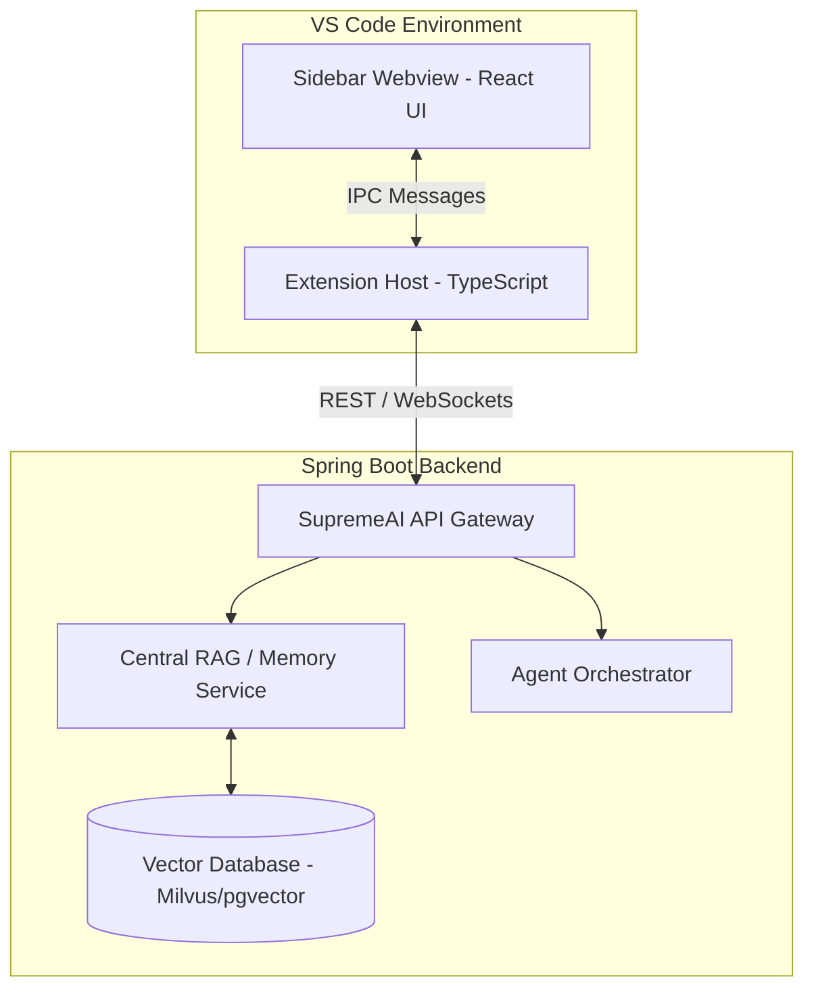

# SupremeAI VS Code Extension Architecture & Future Plan

This document outlines the architecture, data flow, and future roadmap for the **SupremeAI VS Code Extension**. It is designed as an agentic AI assistant capable of workspace indexing, real-time code completion (Ghost Text), and cross-agent memory integration.

## 1. High-Level Architecture

The extension is divided into three primary layers:

1. **Extension Host (Node.js Environment):** The core background process interacting with VS Code APIs.
2. **Webview UI (React JS):** The frontend interface shown in the VS Code Sidebar.
3. **Backend Service (Spring Boot RAG/Memory System):** The central brain where all agent intelligence resides.

### Architecture Diagram

## 2. Core Components

### 2.1 Context Manager (`contextManager.ts`)

Responsible for observing the user's active workspace.

- Retrieves the currently active editor, cursor position, and selected text.
- Uses **Workspace Scanner** to list project files dynamically.
- Filters out non-essential directories (like `node_modules`, `build`, `.git`) to avoid token bloat.

### 2.2 Agent Tools (`agentTools.ts`)

Exposes VS Code native functionalities to the AI Model:

- `read_file`: Allows the AI to read specific local files.
- _(Future)_ `run_terminal_command`: Allow AI to run linting or build scripts upon user approval.

### 2.3 Authentication & UI State (`sidebarProvider.ts` & `App.tsx`)

Handles user identity and dashboard integration:

- Auto-redirects to the web dashboard (`backendUrl/login`) for authentication.
- Accepts the **Secure Token** to link the IDE extension with the user's backend account.
- **Quota Tracking:** Using the token, the backend tracks API limits and usage across all agents.

### 2.4 Inline Completion Provider (`inlineCompletionProvider.ts`)

Provides real-time "Ghost Text" autocomplete suggestions as the user types.

- Debounces fast keystrokes to minimize API calls.
- Fetches contextual predictions from the backend's code-generation endpoint.

---

## 3. Future Plan & Roadmap

### Phase A: Deep Linking Auth

Implement `vscode://` URI handlers to completely automate the login flow. Instead of the user pasting a token, clicking "Login" in the browser will automatically return to VS Code and securely set the API key.

### Phase B: Full Vector Sync (RAG Integration)

Currently, the extension sends a lightweight file tree.
**Future Plan:** The extension will chunk local codebase files and push them to the backend's `/api/memory/ingest` endpoint. The backend will store these chunks in a **Central Vector Database (Milvus/pgvector)**, making the codebase searchable for ALL agents (Marketing, Security, etc.).

### Phase C: Agent Tool Execution (Terminal Control)

Give the SupremeAI agent the ability to execute terminal commands (e.g., `npm install`, `./gradlew build`) directly from the chat interface, with an explicit "Approve/Reject" UI for user safety.

### Phase D: Agent Swarm Collaboration

Allow the VS Code user to "@mention" different agents from the sidebar:

- `@MarketingAgent write a changelog for my last 3 commits.`
- `@PenetrationAgent scan the current file for SQL injection vulnerabilities.`

---

_Generated by SupremeAI Agent on System Initialization_
