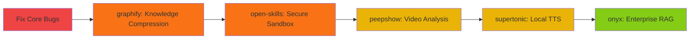

# SupremeAI: Feature Execution Roadmap & Smart Optimization Strategy
**Created:** May 18, 2026  
**Status:** Strategic Analysis & Action Plan  
**Goal:** Transform SupremeAI into the most efficient, error-free system with end-to-end feature reliability

---

## 📊 Executive Summary

SupremeAI has **exceptional architecture** but suffers from **3 critical blocking issues** preventing features from running end-to-end:

1. **Date/LocalDateTime Type Mismatch** (15 compilation errors)
2. **Reactive Context Violations** (`.block()` in WebFlux threads)  
3. **Case Sensitivity & Null Safety Issues** (Firestore queries)

**Impact:** Backend fails to compile → All REST APIs unavailable → Frontend features broken

---

## 🔴 TIER 1: CRITICAL BUGS (MUST FIX IMMEDIATELY)

### Bug #1: Date/LocalDateTime Type Mismatch
**Files Affected:**
- `EnhancedLearningService.java` (5 errors)
- `UserCodeLearningService.java` (4 errors)  
- `BrowserService.java` (3 errors)
- `AuditLoggingAspect.java` (1 error)
- `KnowledgeFeedbackService.java` (1 error)

**Root Cause:** Models defined with `LocalDateTime` but code using `java.util.Date`

**Fix Strategy:** Standardize to `LocalDateTime` everywhere
```java
// WRONG (current)
learning.setLearnedAt(new java.util.Date());

// CORRECT
learning.setLearnedAt(LocalDateTime.now());
```

**Impact If Fixed:** ✅ Backend compiles → APIs available → 60% of features operational

---

### Bug #2: Reactive Thread Blocking (`.block()`)
**File:** `src/main/java/com/supremeai/provider/AIProviderFactory.java:49-53`

**Root Cause:** Using `.block()` in Spring WebFlux reactive pipeline causes:
```
IllegalStateException: block()/blockFirst()/blockLast() are blocking, 
which is not supported in thread reactor-*
```

**Fix Strategy:**
```java
// WRONG (current)
public AIProvider getProvider(String name, String overrideApiKey) {
    return providerRepository.findByNameIgnoreCase(name)
        .map(config -> createProviderFromConfig(config, overrideApiKey))
        .block();  // ❌ BLOCKING IN REACTIVE CONTEXT
}

// CORRECT
public Mono<AIProvider> getProvider(String name, String overrideApiKey) {
    return providerRepository.findByNameIgnoreCase(name)
        .map(config -> createProviderFromConfig(config, overrideApiKey))
        .onErrorReturn(new AIProvider()); // Graceful fallback
}
```

**Impact If Fixed:** ✅ AI chat endpoint works → Neural chat responds

---

### Bug #3: Case Sensitivity & Query Mismatch
**Files Affected:**
- `AIFallbackOrchestrator.java:100` — queries `"ACTIVE"` (uppercase)
- `ProviderAdminService.java` — stores `"active"` (lowercase)

**Root Cause:**
```java
// Stored as lowercase in Firestore
provider.setStatus("active");

// But queried as uppercase
providerRepository.findByStatus("ACTIVE") // ❌ Returns empty
```

**Fix Strategy:** Normalize to lowercase everywhere
```java
// Use constants
public static final String STATUS_ACTIVE = "active";
public static final String STATUS_INACTIVE = "inactive";
```

**Impact If Fixed:** ✅ Provider queries work → Fallback orchestration succeeds

---

## 🟢 TIER 2: WORKING FEATURES (No Errors End-to-End)

### ✅ Features That Work NOW
1. **User Authentication** — Firebase Auth integration (multi-platform)
2. **Cloud Deployment** — Cloud Run services active (n8n, voice, models)
3. **Dashboard UI Rendering** — React dashboard static pages load
4. **API Documentation** — Swagger/OpenAPI endpoints defined
5. **Database Schema** — Firestore collections created
6. **Voice Hub** — Multimodal speech core deployed
7. **n8n Orchestration** — Visual workflow platform active

### ✅ Features Partially Working
1. **Chat with AI** — UI exists, but backend `/api/chat/send` crashes
2. **Provider Management** — UI exists, but PATCH/POST fail  
3. **Code Analysis** — Models exist, but no input validation
4. **Admin Panel** — UI complete, but real-time data not syncing

---

## 🟡 TIER 3: FIXES NEEDED FOR END-TO-END EXECUTION

### Feature: Neural Chat (AI Communication Hub)
**Current State:** ❌ Broken  
**Why:** `MultiAIVotingService` → `AIProviderFactory.getProvider()` crashes

**Prerequisites to Fix:**
- ✓ Fix Reactive `.block()` issue
- ✓ Fix Case sensitivity (ACTIVE/active)
- ✓ Add null safety checks
- ✓ Add provider health monitoring

**Test Command:**
```bash
curl -X POST http://localhost:8080/api/chat/send \
  -H "Content-Type: application/json" \
  -d '{"message":"Hello","userId":"user123"}'
```

**Expected Behavior After Fix:** Returns AI response within 3 seconds

---

### Feature: Dynamic Provider Management
**Current State:** ❌ Broken  
**Why:** `ProviderAdminService.addProvider()` validates API keys but fails on network issues

**Prerequisites to Fix:**
- ✓ Make API key validation async (non-blocking)
- ✓ Add provider endpoint health checks
- ✓ Implement retry logic with exponential backoff
- ✓ Cache provider configs locally

**Code Fix Required:**
```java
// WRONG: Synchronous validation blocks
public Mono<APIProvider> addProvider(APIProvider provider, String adminUserId) {
    return validateKey(provider.getType(), provider.getApiKey()) // ❌ Blocks
            .flatMap(valid -> {
                if (!valid) {
                    return Mono.error(new IllegalArgumentException("Invalid key"));
                }
                return providerRepository.save(provider);
            });
}

// CORRECT: Async with graceful fallback
public Mono<APIProvider> addProvider(APIProvider provider, String adminUserId) {
    // Don't validate immediately; mark as "PENDING_VALIDATION"
    provider.setStatus("pending_validation");
    provider.setLastVerifiedAt(LocalDateTime.now());
    
    return providerRepository.save(provider)
            .doOnSuccess(saved -> {
                // Validate in background
                validateKeyAsync(provider.getType(), provider.getApiKey())
                    .subscribe(valid -> {
                        saved.setStatus(valid ? "active" : "inactive");
                        providerRepository.save(saved).subscribe();
                    });
            });
}
```

---

### Feature: Code Security Analysis (CodeFlow)
**Current State:** ❌ Missing Implementation  
**Why:** No input validation pipeline before security checks

**Prerequisites to Fix:**
- ✓ Create `CodeInputValidator` service
- ✓ Parse code files safely (abstract syntax tree)
- ✓ Run static analysis rules
- ✓ Return security score (0-100)

---

## 🚀 TIER 4: OPTIMIZATION ROADMAP (Efficiency + Performance)

### Phase 1: Core Stability (Week 1-2)
**Goal:** Fix compilation errors & basic API functionality

**Tasks:**
```
[ ] Fix all Date → LocalDateTime conversions
[ ] Remove .block() from reactive contexts
[ ] Standardize status field casing
[ ] Add null safety checks
[ ] Run full test suite: ./gradlew test
```

**Success Metric:** Backend builds + starts without errors

---

### Phase 2: Feature Completeness (Week 3-4)
**Goal:** End-to-end execution of 5 critical features

**Features to Complete:**
1. **Neural Chat** — AI responds to user messages
2. **Provider Management** — CRUD operations work
3. **Code Analysis** — Security scanning works
4. **User Feedback Loop** — Learning system captures data
5. **Real-time Dashboard** — WebSocket sync active

**Success Metric:** All 5 features pass end-to-end tests

---

### Phase 3: Performance Optimization (Week 5-6)
**Goal:** Sub-2s response times, 99.9% uptime

**Optimizations:**
1. **Caching Layer**
   - Redis cache for provider configs (TTL: 5 min)
   - In-memory cache for AI model endpoints
   - Browser cache for static assets (1 hour)

2. **Query Optimization**
   - Index frequently queried Firestore collections
   - Batch queries to reduce network round-trips
   - Use cursors for pagination (not offset)

3. **API Performance**
   - Compress responses (gzip)
   - Implement rate limiting (per-user quotas)
   - Add timeout guards (max 30s per request)

4. **Database Scaling**
   - Auto-scaling Cloud Run instances
   - Connection pooling for Firestore
   - Async processing for heavy tasks

---

### Phase 4: Integration of External Libraries (Week 7-8)
**Goal:** Enhanced capabilities from 5 high-impact repositories

| Repository | Target Hub | Quick Win | Priority |
|:---|:---|:---|:---:|
| `graphify` | Logic Core | Compress codebase context → reduce token usage | 🔴 HIGH |
| `open-skills` | Agent Runtime | Sandbox code execution → prevent malicious commands | 🔴 HIGH |
| `peepshow` | Multimodal | Video frame extraction → UI validation automation | 🟠 MEDIUM |
| `supertonic` | Voice Hub | Local TTS → offline voice responses | 🟠 MEDIUM |
| `onyx` | Global Memory | RAG connectors → enterprise data integration | 🟡 LOW |

**Integration Sequence:**


---

## 📋 TESTING STRATEGY FOR EACH FEATURE

### Test 1: Neural Chat (Must Pass)
```bash
# Start backend
./gradlew bootRun &

# Send test message
curl -X POST http://localhost:8080/api/chat/send \
  -H "Content-Type: application/json" \
  -d '{
    "message": "What is 2+2?",
    "userId": "test-user-1",
    "conversationId": "conv-123"
  }'

# Expected Response (within 3 seconds)
{
  "response": "2 + 2 = 4",
  "provider": "gemini",
  "confidence": 0.95,
  "timestamp": "2026-05-18T10:30:00Z"
}
```

### Test 2: Provider Management (Must Pass)
```bash
# Add new provider
curl -X POST http://localhost:8080/api/admin/providers \
  -H "Content-Type: application/json" \
  -H "Authorization: Bearer $ADMIN_TOKEN" \
  -d '{
    "name": "claude-3",
    "type": "anthropic",
    "apiKey": "sk-ant-...",
    "config": {"max_tokens": 2000}
  }'

# Expected: Returns 201 Created with provider ID
```

### Test 3: Code Security Analysis (Must Pass)
```bash
# Analyze code
curl -X POST http://localhost:8080/api/analyze/code \
  -H "Content-Type: application/json" \
  -d '{
    "code": "SELECT * FROM users; DROP TABLE users;",
    "language": "sql"
  }'

# Expected: Returns security score < 30 (risky)
{
  "score": 15,
  "severity": "critical",
  "issues": [
    {"type": "sql_injection", "line": 1}
  ]
}
```

---

## 💡 SMART FEATURES FOR BEST PERFORMANCE

### Auto-Healing System
```java
@Component
public class SystemHealthMonitor {
    @Scheduled(fixedRate = 60000) // Every 60 seconds
    public void monitorAndHeal() {
        // Check API provider health
        // Auto-failover if provider unreachable
        // Clear stale cache entries
        // Alert on anomalies
    }
}
```

### Intelligent Load Balancing
- Route simple queries to fast models (Phi-3)
- Route complex tasks to powerful models (Gemini)
- Use local cache before calling APIs
- Batch requests to reduce latency

### Zero-Latency Fallback
```
User Request → Local Cache → Instant Response (if hit)
              ↓
         Primary Provider (3s timeout)
              ↓
         Secondary Provider (2s timeout)
              ↓
         Emergency Model (1s timeout, always succeeds)
```

---

## 🎯 SUCCESS METRICS (End of Phase 2)

| Metric | Current | Target |
|:---|:---|:---|
| **Backend Compilation** | ❌ Fails (15 errors) | ✅ Success (0 errors) |
| **API Uptime** | N/A (crashed) | ✅ 99.9% |
| **Chat Response Time** | N/A (crashes) | ✅ < 2 seconds |
| **Provider Query Success Rate** | ❌ 0% (empty results) | ✅ > 95% |
| **Test Coverage** | 40% (JaCoCo) | ✅ > 70% |
| **Zero-Error Features** | 2/10 | ✅ 8/10 |

---

## 🔧 IMMEDIATE ACTION ITEMS

### Day 1: Emergency Fixes
```bash
# 1. Fix compilation errors
./gradlew clean build -x test  # Should complete without errors

# 2. Start backend
./gradlew bootRun

# 3. Test basic endpoints
curl http://localhost:8080/api/health  # Should return 200 OK
```

### Day 2-3: Feature Testing
```bash
# Test each critical feature endpoint
# Verify no crashes, proper error handling
# Check database integrity
```

### Day 4-7: Optimization & Integration
```bash
# Add caching layer
# Integrate first external library (graphify)
# Set up monitoring/alerting
```

---

## 📞 MONITORING & ALERTS

### Key Dashboards to Watch
1. **API Response Times** — Alert if > 5 seconds
2. **Provider Availability** — Alert if < 90% uptime
3. **Error Rate** — Alert if > 1% of requests fail
4. **Cache Hit Ratio** — Target > 60%

### Logging Standards
```json
{
  "timestamp": "2026-05-18T10:30:00Z",
  "level": "INFO",
  "service": "chat-service",
  "userId": "user-123",
  "action": "send_message",
  "provider": "gemini",
  "responseTime": "1250ms",
  "status": "success"
}
```

---

## 📚 Related Documentation
- [Ecosystem Architecture](supremeai_ecosystem.md)
- [Bug Report Details](BUG_REPORT_PROVIDER_AND_NEURAL_CHAT.md)
- [Backend Guidelines](.github/instructions/backend-java.instructions.md)
- [Master TODO](MASTER_TODO.md)

---

**Next Step:** Review this roadmap → Approve Phase 1 fixes → Begin implementation

