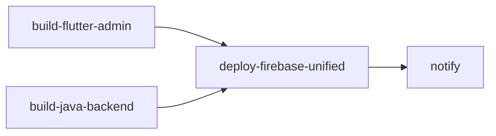

# 🎯 Firebase Unified Hosting Setup Guide (Single Domain)

**Date:** March 31, 2026  
**Status:** ✅ Automated CI/CD Ready  
**Final URLs:**

- Main Dashboard: `https://supremeai-a.web.app/`

- Admin Dashboard: `https://supremeai-a.web.app/admin/`

---


## 📋 Overview

এই গাইড অনুসরণ করে আপনি একটি একীভূত ডোমেইনে আপনার মেইন ড্যাশবোর্ড এবং Flutter অ্যাডমিন অ্যাপ একসাথে চালাতে পারবেন।


### আর্কিটেকচার:

```
https://supremeai-a.web.app/
├── / (main app: React/HTML dashboard)
└── /admin/ (Flutter admin app)

```

---


## 🚀 স্বয়ংক্রিয় CI/CD সেটআপ

আমরা আপনার GitHub Actions workflow কে আপডেট করেছি যা **স্বয়ংক্রিয়ভাবে**:

1. ✅ **Flutter Admin App** বিল্ড করে `--base-href "/admin/"` সহ

2. ✅ **Main Dashboard** বিল্ড করে

3. ✅ **combined_deploy** ফোল্ডারে ফাইলগুলি একত্রিত করে

4. ✅ **Firebase Hosting** এ ডিপ্লয় করে


### Workflow ফাইল:

```
.github/workflows/firebase-hosting-merge.yml

```


### বিল্ড স্টেজ:

```
1. build-flutter-admin     → Flutter app build with /admin/ prefix
2. build-java-backend      → Java backend + main dashboard

3. deploy-firebase-unified → Combine + Deploy to Firebase

4. notify                  → Deploy summary notification

```

---


## 📁 ম্যানুয়াল সেটআপ (চাইলে)

যদি আপনি ম্যানুয়ালি সেটআপ করতে চান অথবা লোকালি টেস্ট করতে চান:


### ধাপ ১: Flutter Admin App বিল্ড করুন


```bash
cd flutter_admin_app
flutter build web --base-href "/admin/" --release

```

**গুরুত্বপূর্ণ:** `--base-href "/admin/"` অবশ্যই দিতে হবে, নাহলে ইমেজ, ফন্ট লোড হবে না।

উউউটপুট ফোল্ডার: `flutter_admin_app/build/web/`


### ধাপ ২: Main Dashboard বিল্ড করুন (ঐচ্ছিক)

আপনার React/HTML প্রজেক্ট বিল্ড করুন:


```bash

# React এর জন্য

npm run build

# Output: dist/ বা build/ folder


# অথবা HTML এর জন্য (যদি থাকে)

# আপনার public/ folder ব্যবহার করুন

```


### ধাপ ৩: combined_deploy ফোল্ডার তৈরি করুন

প্রজেক্ট রুটে:


```bash

# combined_deploy ফোল্ডার তৈরি করুন

mkdir -p combined_deploy


# মেইন ড্যাশবোর্ড ফাইল কপি করুন

cp -r dist/* combined_deploy/

# অথবা

cp -r public/* combined_deploy/


# admin সাব ফোল্ডার তৈরি করুন

mkdir -p combined_deploy/admin


# Flutter বিল্ড কপি করুন

cp -r flutter_admin_app/build/web/* combined_deploy/admin/

```


### ধাপ ৪: স্ট্রাকচার যাচাই করুন


```bash

# এই কমান্ড রান করুন:

tree combined_deploy -L 2

```

**প্রত্যাশিত স্ট্রাকচার:**

```

combined_deploy/
├── index.html          (Main dashboard)
├── assets/
├── js/
├── css/
└── admin/              (Flutter app)
    ├── index.html
    ├── main.dart.js
    ├── assets/
    └── ...

```


### ধাপ ৫: লোকালি টেস্ট করুন


```bash

# Firebase emulator দিয়ে

firebase emulators:start


# অথবা Python simple server দিয়ে

cd combined_deploy
python -m http.server 8080

```

তারপর ভিজিট করুন:

- `http://localhost:8080/` (Main Dashboard)

- `http://localhost:8080/admin/` (Admin Dashboard)


### ধাপ ৬: Git পুশ করুন (Automatic deployment হবে)


```bash
git add .
git commit -m "feat: Unified Firebase Hosting - Single domain with main app + admin


- Updated firebase.json to use combined_deploy folder

- Added /admin/** routing to Flutter admin app

- Updated GitHub Actions to auto-build Flutter with --base-href="/admin/"

- Configured cache control for admin section

- Setup combined folder structure for Firebase Hosting"

git push origin main

```

এরপর **GitHub Actions** স্বয়ংক্রিয়ভাবে:

1. Flutter অ্যাপ বিল্ড করবে
2. মেইন ড্যাশবোর্ড বিল্ড করবে
3. combined_deploy তৈরি করবে
4. Firebase এ ডিপ্লয় করবে

---


## 🔐 firebase.json কনফিগারেশন

আমরা ইতিমধ্যে আপনার `firebase.json` কে সঠিকভাবে কনফিউগার করেছি:


```json
{
  "hosting": {
    "public": "combined_deploy",
    "rewrites": [
      {
        "source": "/admin/**",
        "destination": "/admin/index.html"
      },
      {
        "source": "**",
        "destination": "/index.html"
      }
    ],
    "headers": [
      {
        "source": "/admin/**",
        "headers": [
          {
            "key": "Cache-Control",
            "value": "no-cache, no-store, must-revalidate"
          }
        ]
      }
    ]
  }
}

```

**কী করছে:**

| কনফিগ | উদ্দেশ্য |

|--------|---------|
| `"public": "combined_deploy"` | Firebase combined_deploy ফোল্ডার থেকে ফাইল সার্ভ করবে |
| `/admin/**` rewrite | সব `/admin/*` রিকোয়েস্ট `/admin/index.html` এ পাঠাবে (Flutter routing এর জন্য) |
| `**` rewrite | সব অন্যান্য রিকোয়েস্ট `/index.html` এ পাঠাবে (Main app routing এর জন্য) |
| Admin headers | Admin সেকশনে ক্যাশ ডিজেবল করবে (latest version সবসময় পাবেন) |

---


## 📊 GitHub Actions Workflow

আমাদের নতুন workflow এই প্রক্রিয়া অনুসরণ করে:


### স্টেজ 1: build-flutter-admin

```yaml

- Checkout code

- Setup Flutter 3.27.0

- Install dependencies

- Build web with --base-href "/admin/" --release

- Upload artifact

```


### স্টেজ 2: build-java-backend

```yaml

- Checkout code

- Setup JDK 17

- Build Gradle project

- Run tests

- Upload dashboard (if exists)

```


### স্টেজ 3: deploy-firebase-unified

```yaml

- Download Flutter artifact

- Download Dashboard artifact

- Create combined_deploy folder

- Copy main dashboard files

- Copy Flutter files to admin/

- Deploy via Firebase CLI

```


### স্টেজ 4: notify

```yaml

- Send deployment summary

- Show URLs

- Log results

```

---


## 🔄 ওয়ার্কফ্লো ডিপেন্ডেন্সি




**ব্যাখ্যা:**

- `build-flutter-admin` এবং `build-java-backend` একসাথে চলে (parallelly)

- `deploy-firebase-unified` দুটি বিল্ড সম্পন্ন হওয়ার পর চলে

- `notify` সবকিছু সম্পন্ন হওয়ার পর শেষে চলে

---


## 🚀 ডিপ্লয়মেন্ট ট্রিগার

Workflow নিচের সময় চলে:

| ইভেন্ট | ব্র্যান্চ | ডিপ্লয় হবে? |
|--------|--------|-----------|
| Push to `main` | main | ✅ Yes |
| Push to `develop` | develop | ❌ No (only build) |
| Pull Request | main/develop | ❌ No (only build) |
| Manual trigger | - | ❌ Not configured |

যদি manual trigger চান, আমরা এটি যোগ করতে পারি।

---


## 🧪 টেস্টিং চেকলিস্ট

ডিপ্লয়মেন্টের পরে:


- [ ] **Main Dashboard চেক করুন**
  ```
  https://supremeai-a.web.app/
  ```
  - [ ] Page loads
  - [ ] CSS/JS loads properly
  - [ ] Buttons work
  - [ ] Data displays


- [ ] **Admin Dashboard চেক করুন**
  ```
  https://supremeai-a.web.app/admin/
  ```
  - [ ] Flutter app loads
  - [ ] Icons/images display
  - [ ] Login works
  - [ ] Navigation functions
  - [ ] Data displays


- [ ] **Routing টেস্ট করুন**
  ```
  https://supremeai-a.web.app/invalid-route
  → Should show main app (not admin)
  
  https://supremeai-a.web.app/admin/invalid-route
  → Should show admin home (not error)
  ```


- [ ] **Cache টেস্ট করুন**
  ```bash
  curl -I https://supremeai-a.web.app/
  # Should have Cache-Control: max-age=3600 (or similar)
  
  curl -I https://supremeai-a.web.app/admin/
  # Should have Cache-Control: no-cache, no-store
  ```

---


## ⚠️ সাধারণ সমস্যা এবং সমাধান


### সমস্যা 1: Flutter অ্যাপের ইমেজ/ফন্ট লোড হচ্ছে না

**কারণ:** `--base-href "/admin/"` দেওয়া হয়নি।  
**সমাধান:** 

```bash

cd flutter_admin_app
flutter build web --base-href "/admin/" --release

```


### সমস্যা 2: /admin/ এ 404 পাচ্ছি

**কারণ:** combined_deploy/admin/ ফোল্ডার খালি।  
**সমাধান:**

```bash

cp -r flutter_admin_app/build/web/* combined_deploy/admin/

git add . && git commit -m "Add Flutter build" && git push

```


### সমস্যা 3: Main dashboard /admin/ পৃষ্ঠায় দেখা যাচ্ছে

**কারণ:** firebase.json rewrite রুলস সঠিক নয়।  
**সমাধান:** firebase.json এ এই রিওয়াইট থাকা দরকার:

```json
{
  "source": "/admin/**",
  "destination": "/admin/index.html"
}

```


### সমস্যা 4: CSS/JS ভাঙছে

**কারণ:** পাথ সমস্যা (base-href নেই)।  
**সমাধান:** Flutter এবং React উভয় প্যাজ base-href সাপোর্ট করে কিনা চেক করুন।

---


## 📝 কনফিগারেশন চেকলিস্ট

আপনার সিস্টেম সঠিকভাবে সেটআপ হয়েছে কিনা যাচাই করুন:


- [x] `firebase.json` সঠিকভাবে কনফিউগার করা হয়েছে

- [x] `combined_deploy` দেখানো আছে public folder হিসেবে

- [x] `/admin/**` rewrite আছে

- [x] GitHub Actions workflow আপডেট করা হয়েছে

- [x] Flutter build command `--base-href "/admin/"` সহ

- [ ] আপনার প্রজেক্টে কোন `public/` বা `dist/` folder আছে?

- [ ] Flutter admin app সঠিকভাবে বিল্ড হয়?

- [ ] Main dashboard কোথা থেকে আসে (public/dist/etc)?

---


## 🔗 দরকারি লিঙ্ক


- 📖 [Firebase Hosting Docs](https://firebase.google.com/docs/hosting)

- 🐦 [Flutter Web Deployment](https://flutter.dev/docs/deployment/web)

- 🚀 [GitHub Actions Firebase Deploy](https://github.com/FirebaseExtended/action-hosting-deploy)

---


## 📞 সাহায্য

যদি কোন সমস্যা হয়:

1. **GitHub Actions লগ চেক করুন:**
   ```
   GitHub → Actions → Latest workflow run → Logs
   ```

2. **Firebase Console চেক করুন:**
   ```
   https://console.firebase.google.com/u/0/project/supremeai-a/hosting/sites
   ```

3. **Local টেস্ট করুন:**
   ```bash
   firebase emulators:start
   # Visit http://localhost:5000/
   ```

---

**Status:** ✅ সম্পূর্ণ সেটআপ সম্পন্ন  
**Next:** Push to main branch এবং GitHub Actions স্বয়ংক্রিয়ভাবে ডিপ্লয় করবে
