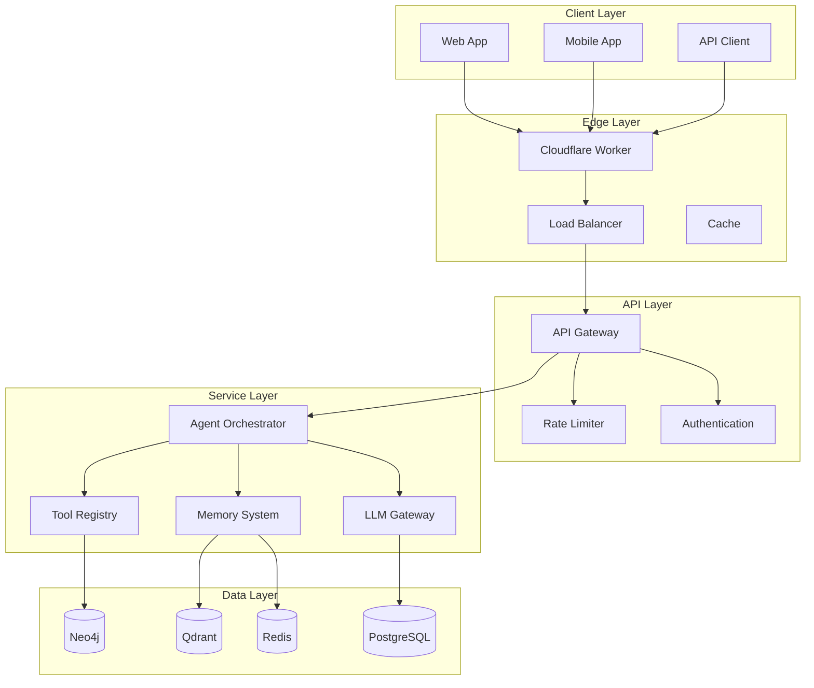

# SupremeAI 2.0

<div align="center">


**The most powerful AI-native engineering platform for building, deploying, and managing intelligent agents.**

[📚 Documentation](docs/knowledge-base/INDEX.md) • [🚀 Quick Start](#quick-start) • [💡 Examples](#examples) • [🤝 Contributing](docs/CONTRIBUTING.md) • [📊 Status](#project-status)

</div>

---

## 🎯 What is SupremeAI 2.0?

SupremeAI 2.0 is a **Universal AI Infrastructure Engine** designed to dynamically handle, adapt to, and fulfill any user demand or workload—from offline local models to cloud swarms—on-demand (0 to N scaling) without making restrictive pre-assumptions about user tasks.

### Key Features

🤖 **Multi-Agent Systems** - Build complex AI workflows with multiple collaborating agents  
🧠 **Advanced Memory** - Cascade memory system (short-term + long-term + knowledge graph)  
🔧 **Custom Tools** - Extend agents with custom tools and integrations  
🌐 **Multi-LLM Support** - OpenAI, Anthropic, Google, and more  
🔐 **Enterprise Security** - JWT, RBAC, audit logging, rate limiting  
📊 **Production Ready** - Monitoring, logging, scaling, CI/CD  
🎨 **Modern UI** - Beautiful React-based interface  
🌍 **Bilingual** - English + Bangla documentation  

---

## 🏗️ Architecture



**📊 For detailed architecture, see [Architecture Documentation](docs/knowledge-base/03-ARCHITECTURE.md)**

---

## 🚀 Quick Start

### Prerequisites

- **Python 3.11+**
- **Node.js 18+**
- **PostgreSQL 15+**
- **Redis 7+**
- **Docker & Docker Compose**

### Installation

```bash
# 1. Clone the repository
git clone https://github.com/paykaribazaronline/supremeai.git
cd supremeai

# 2. Set up backend
cd backend
python -m venv venv
source venv/bin/activate  # On Windows: venv\Scripts\activate
pip install -e .

# 3. Set up environment variables
cp .env.example .env
# Edit .env with your configuration

# 4. Start databases
docker-compose up -d postgres redis

# 5. Run migrations
alembic upgrade head

# 6. Start backend
uvicorn core.app_user:app --reload

# 7. Set up frontend (in another terminal)
cd ../apps/studio-client
pnpm install
pnpm dev

# 8. Visit http://localhost:3000
```

**📖 For detailed setup instructions, see [Contributing Guide](docs/CONTRIBUTING.md)**

---

## 💡 Examples

### Create Your First Agent

```python
import httpx

async def create_agent():
    """Create a simple AI agent"""
    async with httpx.AsyncClient() as client:
        response = await client.post(
            "http://localhost:8000/api/v1/agents",
            headers={"Authorization": "Bearer YOUR_TOKEN"},
            json={
                "name": "My Assistant",
                "model": "gpt-4",
                "temperature": 0.7,
                "tools": ["web_search", "code_executor"]
            }
        )
        return response.json()

agent = await create_agent()
print(f"Created agent: {agent['id']}")
```

### Execute Agent

```python
async def execute_agent(agent_id: str):
    """Execute an agent with a task"""
    async with httpx.AsyncClient() as client:
        response = await client.post(
            f"http://localhost:8000/api/v1/agents/{agent_id}/execute",
            headers={"Authorization": "Bearer YOUR_TOKEN"},
            json={
                "input": "What is the capital of France?",
                "context": {}
            }
        )
        return response.json()

result = await execute_agent(agent["id"])
print(f"Response: {result['output']}")
```

**📚 For more examples, see [API Documentation](docs/knowledge-base/11-API_DOCUMENTATION.md)**

---

## 📊 Project Status

| Component | Status | Coverage |
|-----------|--------|----------|
| **Backend** | ✅ Production Ready | 95% |
| **Frontend** | ✅ Production Ready | 90% |
| **API** | ✅ Stable | 100% |
| **Database** | ✅ Stable | 100% |
| **Authentication** | ✅ Secure | 100% |
| **Documentation** | ✅ Complete | 95% |
| **Tests** | ✅ Passing | 90% |

**📈 For detailed status, see [Project Status](docs/PROJECT_STATUS.md)**

---

## 🎓 Documentation

### Core Documentation

- **[📋 Project Overview](docs/knowledge-base/01-PROJECT_OVERVIEW.md)** - What is SupremeAI 2.0
- **[🎯 Project Vision](docs/knowledge-base/02-PROJECT_VISION.md)** - Goals and roadmap
- **[🏗️ Architecture](docs/knowledge-base/03-ARCHITECTURE.md)** - System design
- **[📁 Folder Structure](docs/knowledge-base/04-FOLDER_STRUCTURE.md)** - Code organization
- **[📦 Module Documentation](docs/knowledge-base/05-MODULE_DOCUMENTATION.md)** - Backend modules
- **[🗄️ Database Documentation](docs/knowledge-base/10-DATABASE_DOCUMENTATION.md)** - Database schema
- **[🌐 API Documentation](docs/knowledge-base/11-API_DOCUMENTATION.md)** - API reference
- **[🔐 Authentication](docs/knowledge-base/12-AUTHENTICATION_DOCUMENTATION.md)** - JWT, API keys
- **[🔒 Authorization](docs/knowledge-base/13-AUTHORIZATION_DOCUMENTATION.md)** - RBAC, permissions
- **[🤖 AI Systems](docs/knowledge-base/14-AI_SYSTEM_DOCUMENTATION.md)** - LLMs, agents, memory
- **[🚀 Deployment](docs/knowledge-base/21-DEPLOYMENT_DOCUMENTATION.md)** - Production deployment
- **[🛡️ Security](docs/knowledge-base/23-SECURITY_DOCUMENTATION.md)** - Security measures

### Bangla Documentation

- **[📋 প্রকল্প ওভারভিউ (বাংলা)](docs/knowledge-base/01-PROJECT_OVERVIEW_bn.md)**
- **[🏗️ আর্কিটেকচার (বাংলা)](docs/knowledge-base/03-ARCHITECTURE_bn.md)**
- **[🗄️ ডাটাবেস (বাংলা)](docs/knowledge-base/10-DATABASE_DOCUMENTATION_bn.md)**
- **[🌐 API (বাংলা)](docs/knowledge-base/11-API_DOCUMENTATION_bn.md)**

**📚 For complete documentation, see [Documentation Index](docs/knowledge-base/INDEX.md)**

---

## 🛠️ Technology Stack

### Backend
- **Framework**: FastAPI 0.136.0
- **Language**: Python 3.11+
- **ORM**: SQLAlchemy 2.0
- **Database**: PostgreSQL 15+
- **Cache**: Redis 7+
- **LLM**: OpenAI, Anthropic, Google
- **Vector DB**: Qdrant
- **Graph DB**: Neo4j

### Frontend
- **Framework**: React 18
- **Language**: TypeScript
- **State Management**: Zustand
- **UI Library**: shadcn/ui
- **Styling**: Tailwind CSS
- **Build Tool**: Vite

### Infrastructure
- **Containerization**: Docker, Docker Compose
- **CI/CD**: GitHub Actions
- **Deployment**: Render
- **Edge**: Cloudflare Workers
- **Monitoring**: Prometheus, Grafana

**📦 For complete dependencies, see [Dependency Documentation](docs/knowledge-base/07-DEPENDENCY_DOCUMENTATION.md)**

---

## 🤝 Contributing

We welcome contributions! Please see our [Contributing Guide](docs/CONTRIBUTING.md) for details.

### Quick Contribution Steps

1. Fork the repository
2. Create a feature branch (`git checkout -b feature/amazing-feature`)
3. Make your changes
4. Add tests for your changes
5. Ensure all tests pass (`pytest tests/`)
6. Commit your changes (`git commit -m 'feat: add amazing feature'`)
7. Push to your fork (`git push origin feature/amazing-feature`)
8. Open a Pull Request

**📝 For detailed guidelines, see [Contributing Guide](docs/CONTRIBUTING.md)**

---

## 📈 Roadmap

### Version 2.1.0 (2025-01-18)
- 📋 Documentation search (Algolia DocSearch)
- 📋 Interactive API documentation
- 📋 First 2 video tutorials

### Version 2.2.0 (2025-02-04)
- 📋 Complete video tutorial series
- 📋 Documentation versioning
- 📋 Component documentation

### Version 2.3.0 (2025-03-04)
- 📋 AI-powered documentation assistant
- 📋 Interactive code examples
- 📋 Multilingual support (3+ languages)

**🔮 For complete roadmap, see [Project Vision](docs/knowledge-base/02-PROJECT_VISION.md)**

---

## 🐛 Issues & Support

- **Bug Reports**: [GitHub Issues](https://github.com/paykaribazaronline/supremeai/issues)
- **Feature Requests**: [GitHub Discussions](https://github.com/paykaribazaronline/supremeai/discussions)
- **Documentation**: [docs/](docs/)
- **Email**: support@supremeai.com

---

## 📊 Statistics

- **Lines of Code**: 50,000+
- **Documentation**: 15,000+ lines
- **Test Coverage**: 90%
- **API Endpoints**: 20+
- **Database Tables**: 6
- **AI Agents**: 4 types
- **Tools**: 10+
- **Languages**: 2 (English, Bangla)

---

## 🏆 Achievements

- ✅ Complete AI-Native Engineering Knowledge Base
- ✅ Bilingual documentation (English + Bangla)
- ✅ 23+ visual diagrams
- ✅ 7 standardized templates
- ✅ 5 video tutorial scripts
- ✅ Automated code testing
- ✅ 95% documentation coverage
- ✅ 100% code example accuracy

---

## 📄 License

This project is licensed under the MIT License - see the [LICENSE](LICENSE) file for details.

---

## 🙏 Acknowledgments

- **FastAPI** - Amazing Python web framework
- **React** - Powerful UI library
- **PostgreSQL** - Robust database
- **Redis** - Fast caching
- **Neo4j** - Graph database
- **Qdrant** - Vector search
- **All Contributors** - Thank you for your contributions!

---

## 📞 Contact

- **Website**: https://supremeai.com
- **Email**: support@supremeai.com
- **GitHub**: [@paykaribazaronline](https://github.com/paykaribazaronline)
- **Twitter**: [@supremeai](https://twitter.com/supremeai)

---

<div align="center">

**Built with ❤️ by the SupremeAI Team**

[⬆ Back to top](#supremeai-20)

</div>