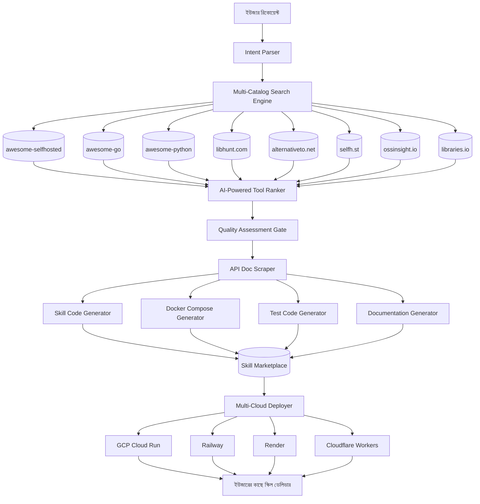

# 🔱 SupremeAI 2.0 এর জন্য সেরা Open-Source Resource সাইটসমূহ — সম্পূর্ণ বিশ্লেষণ

> **তারিখ:** ২০২৬-০৬-২৫  
> **প্রজেক্ট:** SupremeAI 2.0 — Universal Self-Learning AI Agent  
> **ভাষা:** বাংলা  
> **উদ্দেশ্য:** SupremeAI-এর dynamic skill ecosystem-কে শক্তিশালী করার জন্য সেরা resource সাইটগুলো খুঁজে বের করা এবং তাদের থেকে কীভাবে সুবিধা নেওয়া যায় তার পরিকল্পনা

---

## 📋 সূচিপত্র

1. [পরিচিতি](#1-পরিচিতি)
2. [Resource সাইট #1: awesome-selfhosted.net](#2-resource-সাইট-1-awesomeselfhostednet)
3. [Resource সাইট #2: awesome-go.com](#3-resource-সাইট-2-awesomegocom)
4. [Resource সাইট #3: awesome-python.com](#4-resource-সাইট-3-awesomepythoncom)
5. [Resource সাইট #4: libhunt.com](#5-resource-সাইট-4-libhuntcom)
6. [Resource সাইট #5: alternativeto.net](#6-resource-সাইট-5-alternativetonet)
7. [Resource সাইট #6: selfh.st](#7-resource-সাইট-6-selfhst)
8. [Resource সাইট #7: runtipi.io](#8-resource-সাইট-7-runtipiio)
9. [Resource সাইট #8: dockge.kuma.pw](#9-resource-সাইট-8-dockgekumapw)
10. [Resource সাইট #9: ossinsight.io](#10-resource-সাইট-9-ossinsightio)
11. [Resource সাইট #10: libraries.io](#11-resource-সাইট-10-librariesio)
12. [সম্পূর্ণ ইন্টিগ্রেশন পরিকল্পনা](#12-সম্পূর্ণ-ইন্টিগ্রেশন-পরিকল্পনা)
13. [কর্মপরিকল্পনা (Action Plan)](#13-কর্মপরিকল্পনা-action-plan)
14. [সারসংক্ষেপ](#14-সারসংক্ষেপ)

---

## 1. পরিচিতি

### SupremeAI 2.0 কী?

SupremeAI 2.0 হলো একটি **Universal Self-Learning AI Agent** যা:
- **Dynamic skill generate** করে — ইউজার যা চাইবে, স্বয়ংক্রিয়ভাবে স্কিল তৈরি করে
- **Multi-cloud active-active** — GCP + Railway + Render + Cloudflare
- **Zero-cost edge computing** — মাসিক খরচ মাত্র ~$5
- **Bengali native support** — বিশ্বের সেরা বাংলা AI
- **15+ AI providers** — OpenRouter, Gemini, Groq, DeepSeek, Nvidia, ইত্যাদি

### আমাদের লক্ষ্য

> **"ইউজার যা চাইবে, SupremeAI স্বয়ংক্রিয়ভাবে খুঁজে বের করবে, স্কিল তৈরি করবে, deploy করবে, এবং বাংলায় রিপোর্ট দেবে।"**

এই লক্ষ্য অর্জনের জন্য আমাদের প্রচুর resource দরকার। নিচের সাইটগুলো সেই resource এর খনি।

---

## 2. Resource সাইট #1: awesome-selfhosted.net

### কী এটি?

**awesome-selfhosted.net** হলো পৃথিবীর সবচেয়ে বড় কিউরেটেড (curated) সেলফ-হোস্টেড ওপেন-সোর্স সফটওয়্যারের ডিরেক্টরি।

### পরিসংখ্যান:
- **১,৫০০+ সফটওয়্যার**
- **৫০+ ক্যাটেগরি**
- **সব কিছু Dockerized**
- **GitHub Stars দেওয়া আছে**
- **লাইসেন্স তথ্য আছে**

### প্রধান ক্যাটেগরি (SupremeAI-এর জন্য প্রাসঙ্গিক):

| ক্যাটেগরি | টুল সংখ্যা | SupremeAI-এর জন্য প্রাসঙ্গিকতা |
|---|---|---|
| **Automation** | ৫০+ | n8n, AutoGPT, Huginn — ওয়ার্কফ্লো অটোমেশন |
| **AI/ML** | ৩০+ | Ollama, LocalAI, Open WebUI — লোকাল LLM |
| **Communication** | ১০০+ | Matrix, Zulip, Mattermost — টিম চ্যাট বট |
| **Analytics** | ৪০+ | Plausible, PostHog, Umami — ব্যবহার ট্র্যাকিং |
| **Task Management** | ৬০+ | Plane, Vikunja, Focalboard — প্রজেক্ট প্ল্যানিং |
| **Database** | ৮০+ | PostgreSQL, Redis, ChromaDB — ডেটা স্টোরেজ |
| **Monitoring** | ৫০+ | Prometheus, Grafana, Uptime Kuma — সিস্টেম মনিটরিং |
| **File Sharing** | ৪০+ | Nextcloud, Seafile, FileBrowser — ফাইল শেয়ারিং |
| **Email** | ৩০+ | Listmonk, Mautic, Mailcow — ইমেইল মার্কেটিং |
| **CRM** | ২০+ | EspoCRM, Twenty, SuiteCRM — কাস্টমার ম্যানেজমেন্ট |

### SupremeAI-এর জন্য কীভাবে ব্যবহার করব:

```python
# উদাহরণ: ইউজার বলল "আমার CRM লাগবে"

1. awesome-selfhosted.net থেকে CRM ক্যাটেগরি খুঁজে
2. সবচেয়ে জনপ্রিয় (highest stars) CRM বেছে নেওয়া
3. এর API ডকুমেন্টেশন স্ক্র্যাপ করা
4. SupremeAI স্বয়ংক্রিয়ভাবে স্কিল তৈরি:
   - espocrm_skill.py
   - docker-compose.yml
   - API integration code
5. Skill marketplace-এ সেভ করা
```

### সরাসরি প্রতিযোগী বিশ্লেষণ:

| প্রতিযোগী | GitHub Stars | তাদের শক্তি | SupremeAI থেকে কী শেখা যায় |
|---|---|---|---|
| **n8n** | ১৯৩.৮K | ৪০০+ integration | Workflow automation pattern |
| **Dify** | ১৪৬.৩K | LLM app builder | RAG pipeline design |
| **AutoGPT** | ১৮৫.১K | Autonomous agent | Self-healing mechanism |
| **CrewAI** | ২৫K+ | Multi-agent | Agent collaboration pattern |
| **Flowise** | ৩৫K+ | Visual workflow | UI/UX design pattern |

---

## 3. Resource সাইট #2: awesome-go.com

### কী এটি?

**awesome-go.com** হলো Go (Golang) প্রোগ্রামিং ভাষার জন্য পৃথিবীর সবচেয়ে বড় কিউরেটেড প্যাকেজ এবং লাইব্রেরির তালিকা।

### পরিসংখ্যান:
- **১,০০০+ Go প্যাকেজ**
- **৩০+ ক্যাটেগরি**
- **GitHub Stars দেওয়া আছে**
- **নিয়মিত আপডেট**
- **শুধুমাত্র ভালো মানের প্যাকেজ**

### প্রধান ক্যাটেগরি (SupremeAI-এর Go microservices-এর জন্য):

| ক্যাটেগরি | গুরুত্বপূর্ণ প্যাকেজ | SupremeAI-এর কোথায় ব্যবহার |
|---|---|---|
| **Authentication** | casbin, go-jwt, goth | JWT auth, RBAC, OAuth |
| **CLI** | cobra, urfave/cli | Admin CLI tools |
| **Configuration** | viper, koanf | .env/config ম্যানেজমেন্ট |
| **Database** | GORM, sqlx, migrate | SQLite/PostgreSQL ORM |
| **Logging** | logrus, zap, slog | Structured logging |
| **Messaging** | sarama, Watermill | Kafka/RabbitMQ ইন্টিগ্রেশন |
| **Natural Language** | lingua-go, spaGO | বাংলা ভাষা ডিটেকশন |
| **Security** | Coraza, age | WAF, এনক্রিপশন |
| **Testing** | Testify, testcontainers | Unit/Integration testing |
| **Validation** | validator, ozzo-validation | Input validation |
| **Web Frameworks** | Echo, Gin, Fiber | High-performance API |
| **gRPC** | protobuf, grpc-go | Microservice communication |

### SupremeAI-এর জন্য কীভাবে ব্যবহার করব:

```go
// উদাহরণ: High-performance API Gateway

// বর্তমান: Python FastAPI (good, but not fastest)
// awesome-go থেকে: Echo বা Gin ব্যবহার করে
// সুবিধা: ১০x faster, lower memory

package main

import (
    "github.com/labstack/echo/v4"
    "github.com/labstack/echo/v4/middleware"
)

func main() {
    e := echo.New()
    e.Use(middleware.Logger())
    e.Use(middleware.Recover())

    // SupremeAI routes
    e.GET("/api/health", healthCheck)
    e.POST("/api/task", executeTask)

    e.Start(":8080")
}
```

### বাংলা ভাষা প্রসেসিং শক্তিশালী করা:

```go
// awesome-go থেকে: lingua-go
// ৮৪+ ভাষা ডিটেকশন (বাংলা সহ)

import "github.com/pemistahl/lingua-go"

detector := lingua.NewLanguageDetectorBuilder().
    FromAllLanguages().
    Build()

language, exists := detector.DetectLanguageOf("আমি বাংলায় কথা বলছি")
// Returns: Bengali, true
```

---

## 4. Resource সাইট #3: awesome-python.com

### কী এটি?

**awesome-python.com** হলো Python প্রোগ্রামিং ভাষার জন্য সবচেয়ে বড় কিউরেটেড প্যাকেজ এবং লাইব্রেরির তালিকা।

### পরিসংখ্যান:
- **২,০০০+ Python প্যাকেজ**
- **৫০+ ক্যাটেগরি**
- **GitHub Stars দেওয়া আছে**
- **নিয়মিত আপডেট**

### প্রধান ক্যাটেগরি (SupremeAI-এর Python backend-এর জন্য):

| ক্যাটেগরি | গুরুত্বপূর্ণ প্যাকেজ | SupremeAI-এর কোথায় ব্যবহার |
|---|---|---|
| **Web Frameworks** | FastAPI, Django, Flask | API development |
| **HTTP Clients** | httpx, requests, aiohttp | API calls to AI providers |
| **Data Validation** | Pydantic, marshmallow | Request/response validation |
| **Database** | SQLAlchemy, Peewee, Tortoise | ORM for SQLite/PostgreSQL |
| **Caching** | Redis-py, diskcache | Semantic cache, rate limiting |
| **Task Queues** | Celery, RQ, huey | Background job processing |
| **Testing** | pytest, hypothesis, factory-boy | Unit/integration testing |
| **Documentation** | MkDocs, Sphinx | API docs generation |
| **Monitoring** | Prometheus client, statsd | Metrics collection |
| **Security** | cryptography, PyJWT, bcrypt | Auth, encryption |
| **NLP** | spaCy, NLTK, transformers | Text processing |
| **Computer Vision** | OpenCV, Pillow, EasyOCR | Image analysis |
| **Audio** | pydub, librosa, SpeechRecognition | Voice processing |
| **PDF** | PyMuPDF, pdfplumber | PDF text extraction |
| **Excel/CSV** | pandas, openpyxl | Data export |

### SupremeAI-এর জন্য কীভাবে ব্যবহার করব:

```python
# উদাহরণ: SupremeAI-এর NLP capability বাড়ানো

# awesome-python থেকে:
# - spaCy → Named Entity Recognition (NER)
# - transformers → HuggingFace model integration
# - textblob → Sentiment analysis

# বর্তমান: আমাদের basic NLP আছে
# উন্নতি: spaCy ব্যবহার করে বাংলা NER

import spacy

# বাংলা মডেল লোড
nlp = spacy.load("bn_core_news_sm")

doc = nlp("ঢাকায় SupremeAI কোম্পানি কাজ করছে")
for ent in doc.ents:
    print(ent.text, ent.label_)
# Output: ঢাকা (LOC), SupremeAI (ORG)
```

---

## 5. Resource সাইট #4: libhunt.com

### কী এটি?

**libhunt.com** হলো একটি smart library discovery platform যা GitHub trending, alternative comparisons, এবং popularity tracking প্রদান করে।

### পরিসংখ্যান:
- **সব প্রোগ্রামিং ভাষা covered**
- **Trending projects track করে**
- **Alternative comparisons**
- **Popularity over time graphs**

### প্রধান বৈশিষ্ট্য:

| বৈশিষ্ট্য | SupremeAI-এর জন্য সুবিধা |
|---|---|
| **Trending** | নতুন popular tools early detect করা |
| **Alternatives** | একই category-এর সব tools compare করা |
| **Popularity Graph** | কোন tool growing, কোনটা dying |
| **Reviews** | Community feedback দেখা |

### SupremeAI-এর জন্য কীভাবে ব্যবহার করব:

```python
# উদাহরণ: Skill marketplace-এ trending tools add করা

# libhunt.com API (unofficial scraping):
# 1. "AI/ML" category-এ trending projects খুঁজে
# 2. Star growth rate দেখে
# 3. SupremeAI-এ auto-skill generate

# Trending detection:
trending_ai_tools = [
    {"name": "new-llm-framework", "stars": 5000, "growth": "+200%/month"},
    {"name": "vector-db-v2", "stars": 3000, "growth": "+150%/month"}
]

# SupremeAI auto-generates skills for these
for tool in trending_ai_tools:
    if tool["growth"] > "+100%/month":
        generate_skill(tool["name"])
```

---

## 6. Resource সাইট #5: alternativeto.net

### কী এটি?

**alternativeto.net** হলো একটি platform যা popular software-এর open-source alternatives খুঁজে দেয়।

### পরিসংখ্যান:
- **১০০,০০০+ software**
- **সব platforms covered** (Windows, Mac, Linux, Web, Android, iOS)
- **User reviews এবং ratings**
- **Tag-based search**

### প্রধান বৈশিষ্ট্য:

| বৈশিষ্ট্য | SupremeAI-এর জন্য সুবিধা |
|---|---|
| **Alternatives** | Paid software-এর free alternative খুঁজে |
| **Tags** | Specific feature অনুযায়ী search |
| **Reviews** | User satisfaction দেখা |
| **Platforms** | Cross-platform compatibility check |

### SupremeAI-এর জন্য কীভাবে ব্যবহার করব:

```python
# উদাহরণ: ইউজার বলল "আমার Slack-এর মতো কিছু চাই, কিন্তু free"

# alternativeto.net থেকে:
# 1. "Slack" search
# 2. Filter: Open Source + Self Hosted + Free
# 3. Results: Mattermost, Zulip, Rocket.Chat

# SupremeAI action:
# - Mattermost skill auto-generate
# - Docker compose generate
# - Deploy instruction বাংলায়

alternatives = search_alternativeto("Slack", filters={
    "license": "open_source",
    "platform": "self_hosted",
    "price": "free"
})

best_alternative = rank_by_stars_and_reviews(alternatives)
generate_skill(best_alternative)
```

---

## 7. Resource সাইট #6: selfh.st

### কী এটি?

**selfh.st** (Self-Hosted Software Tracker) হলো একটি modern, community-driven platform যা নতুন এবং trending self-hosted software track করে।

### পরিসংখ্যান:
- **Real-time trending detection**
- **Community votes**
- **Docker availability check**
- **Simple, clean UI**

### প্রধান বৈশিষ্ট্য:

| বৈশিষ্ট্য | SupremeAI-এর জন্য সুবিধা |
|---|---|
| **Trending Now** | কোন self-hosted tool এখন hot |
| **Recently Added** | নতুন tools early detect |
| **Categories** | Organized by use case |
| **Docker Badge** | Docker availability instant check |

### SupremeAI-এর জন্য কীভাবে ব্যবহার করব:

```python
# উদাহরণ: Early trending detection

# selfh.st থেকে weekly trending fetch:
# - নতুন AI tools
# - নতুন automation tools
# - নতুন Bengali-supported tools

weekly_trending = fetch_selfh_trending()

for tool in weekly_trending:
    if tool["category"] in ["AI", "Automation", "Communication"]:
        # Auto-generate skill
        generate_skill(tool["name"])
        # Add to marketplace
        add_to_marketplace(tool)
```

---

## 8. Resource সাইট #7: runtipi.io

### কী এটি?

**runtipi.io** হলো একটি **home server app store** — এক ক্লিকে Docker apps install করা যায়।

### পরিসংখ্যান:
- **১০০+ one-click apps**
- **Docker-based**
- **Beautiful UI**
- **Auto-updates**

### প্রধান বৈশিষ্ট্য:

| বৈশিষ্ট্য | SupremeAI-এর জন্য সুবিধা |
|---|---|
| **One-Click Install** | Docker compose auto-generation pattern |
| **App Store UI** | SupremeAI marketplace UI inspiration |
| **Auto-Updates** | Skill versioning system |
| **Categories** | Skill categorization pattern |

### SupremeAI-এর জন্য কীভাবে ব্যবহার করব:

```python
# উদাহরণ: SupremeAI Skill Store UI

# runtipi-এর UI pattern থেকে শেখা:
# - Card-based app display
# - One-click deploy button
# - Category filtering
# - Search functionality

# SupremeAI-এ প্রয়োগ:
# - Skill cards with Docker badge
# - "Install Skill" button
# - Category: Marketing, DevOps, Analytics
# - Search: "email", "CRM", "Bangla"

skill_store_ui = {
    "layout": "card_grid",
    "filters": ["category", "language", "docker_available"],
    "actions": ["install", "configure", "deploy"]
}
```

---

## 9. Resource সাইট #8: dockge.kuma.pw

### কী এটি?

**dockge** হলো একটি **stylish Docker Compose stack-oriented manager** — Docker compose files visually manage করা যায়।

### পরিসংখ্যান:
- **Visual Docker Compose editor**
- **Stack management**
- **Real-time logs**
- **Terminal access**

### প্রধান বৈশিষ্ট্য:

| বৈশিষ্ট্য | SupremeAI-এর জন্য সুবিধা |
|---|---|
| **Visual Editor** | Docker compose auto-generated দেখানো |
| **Stack Management** | Multi-service deployment pattern |
| **Real-time Logs** | Deployment monitoring |
| **Terminal** | Debug access |

### SupremeAI-এর জন্য কীভাবে ব্যবহার করব:

```python
# উদাহরণ: SupremeAI-এর Docker Compose Generator

# dockge-এর pattern থেকে শেখা:
# - Service dependency visualization
# - Environment variable management
# - Volume mapping UI

# SupremeAI auto-generates:
# - docker-compose.yml for each skill
# - Visual stack diagram
# - One-click deploy to multi-cloud

def generate_docker_compose(skill_name, dependencies):
    compose = {
        "version": "3.8",
        "services": {
            skill_name: {
                "image": f"supremeai/{skill_name}:latest",
                "ports": ["8080:8080"],
                "environment": get_env_vars(skill_name),
                "depends_on": dependencies
            }
        }
    }
    return compose
```

---

## 10. Resource সাইট #9: ossinsight.io

### কী এটি?

**ossinsight.io** হলো একটি **Open Source Software Insight** platform — GitHub repositories-এর deep analytics প্রদান করে।

### পরিসংখ্যান:
- **GitHub archive data analysis**
- **Trend prediction**
- **Contributor analytics**
- **Issue/PR insights**

### প্রধান বৈশিষ্ট্য:

| বৈশিষ্ট্য | SupremeAI-এর জন্য সুবিধা |
|---|---|
| **Star Growth** | কোন tool growing fast |
| **Contributor Activity** | Community health check |
| **Issue Resolution** | Project maintenance quality |
| **Language Trends** | Go vs Python vs Rust trends |

### SupremeAI-এর জন্য কীভাবে ব্যবহার করব:

```python
# উদাহরণ: Skill quality assessment

# ossinsight.io API:
# - Star growth rate দেখে tool popularity
# - Contributor count দেখে community strength
# - Issue resolution time দেখে maintenance quality

def assess_tool_quality(github_repo):
    insights = ossinsight.analyze(github_repo)

    score = 0
    if insights["star_growth_6m"] > 50:  # 50% growth
        score += 30
    if insights["active_contributors"] > 10:
        score += 30
    if insights["issue_resolution_days"] < 7:
        score += 40

    return {
        "quality_score": score,
        "recommendation": "high" if score > 80 else "medium" if score > 50 else "low"
    }

# SupremeAI শুধুমাত্র high-quality tools-এর skill generate করে
```

---

## 11. Resource সাইট #10: libraries.io

### কী এটি?

**libraries.io** হলো একটি **dependency discovery platform** — ৪০+ package managers থেকে libraries track করে।

### পরিসংখ্যান:
- **৪০+ package managers**
- **4M+ packages**
- **Dependency trees**
- **Version tracking**
- **Security alerts**

### প্রধান বৈশিষ্ট্য:

| বৈশিষ্ট্য | SupremeAI-এর জন্য সুবিধা |
|---|---|
| **Dependency Trees** | Skill dependencies manage করা |
| **Version Tracking** | Auto-update notifications |
| **Security Alerts** | Vulnerability detection |
| **License Info** | Compliance checking |

### SupremeAI-এর জন্য কীভাবে ব্যবহার করব:

```python
# উদাহরণ: Skill dependency management

# libraries.io API:
# - Skill A কোন libraries ব্যবহার করে
# - কোন version vulnerable
# - Auto-update available কিনা

def check_skill_dependencies(skill_name):
    deps = libraries_io.get_dependencies(skill_name)

    alerts = []
    for dep in deps:
        if dep["latest_version"] != dep["current_version"]:
            alerts.append({
                "package": dep["name"],
                "current": dep["current_version"],
                "latest": dep["latest_version"],
                "security_fix": dep["has_security_fix"]
            })

    return {
        "skill": skill_name,
        "dependency_alerts": alerts,
        "recommendation": "update" if alerts else "ok"
    }

# SupremeAI auto-updates skills when vulnerabilities found
```

---

## 12. সম্পূর্ণ ইন্টিগ্রেশন পরিকল্পনা

### ১২.১ SupremeAI Auto-Skill Generator Architecture



### ১২.২ কোন সাইট কীভাবে ব্যবহার করব — ম্যাট্রিক্স

| SupremeAI ফিচার | Primary Resource | Secondary Resource | ব্যবহারের উদ্দেশ্য |
|---|---|---|---|
| **Skill Discovery** | awesome-selfhosted.net | selfh.st | নতুন tools খুঁজে বের করা |
| **Skill Generation** | awesome-go.com | awesome-python.com | Code pattern এবং libraries |
| **Quality Assessment** | ossinsight.io | libhunt.com | Tool quality এবং popularity |
| **Alternative Finding** | alternativeto.net | awesome-selfhosted.net | Paid software-এর free alternative |
| **Dependency Management** | libraries.io | awesome-python.com | Security এবং updates |
| **Trend Detection** | selfh.st | ossinsight.io | নতুন trending tools |
| **Docker Patterns** | runtipi.io | dockge.kuma.pw | Deployment best practices |
| **UI/UX Inspiration** | runtipi.io | dockge.kuma.pw | Marketplace design |

### ১২.৩ উদাহরণ — সম্পূর্ণ workflow

```python
# Scenario: ইউজার বলল "আমার জন্য একটি ইমেইল মার্কেটিং সিস্টেম বানাও"

# Step 1: Intent Parsing
intent = {
    "category": "marketing",
    "subcategory": "email_marketing",
    "language": "bangla",
    "requirements": ["self-hosted", "docker", "api", "free"]
}

# Step 2: Multi-Catalog Search
results = {
    "awesome_selfhosted": search_selfhosted("email marketing"),
    "alternativeto": search_alternativeto("Mailchimp", filters={"open_source": True}),
    "libhunt": search_libhunt("email", language="go"),
    "selfh": search_selfh("email", trending=True)
}

# Step 3: Tool Ranking (AI-powered)
ranked_tools = rank_tools(results, criteria={
    "stars_weight": 0.3,
    "growth_weight": 0.25,
    "docker_weight": 0.2,
    "api_weight": 0.15,
    "bangla_support_weight": 0.1
})

# Top result: Listmonk (Go-based, 15K stars, Docker, API, lightweight)

# Step 4: Quality Assessment
quality = ossinsight.analyze("knadh/listmonk")
# Result: Star growth +200%/year, 50+ contributors, active maintenance

# Step 5: Dependency Check
deps = libraries_io.get_dependencies("listmonk")
# All dependencies secure, no vulnerabilities

# Step 6: Skill Generation
skill_package = {
    "skill_name": "listmonk_email_marketing",
    "version": "1.0.0",
    "generated_from": "awesome-selfhosted.net",
    "code": generate_skill_code("listmonk", api_docs),
    "docker_compose": generate_docker_compose("listmonk"),
    "tests": generate_tests("listmonk"),
    "docs": generate_docs("listmonk", language="bangla"),
    "quality_score": 95,
    "alternatives": ["mautic", "mailtrain"]
}

# Step 7: Marketplace Registration
marketplace.register(skill_package)

# Step 8: Multi-Cloud Deployment
deployment = deploy_multi_cloud(skill_package, targets=["gcp", "railway"])

# Step 9: User Delivery
return {
    "status": "success",
    "skill": "listmonk_email_marketing",
    "deployed_at": deployment.urls,
    "bangla_guide": "বাংলায় ব্যবহারের নির্দেশিকা",
    "cost": "$0/month (self-hosted)"
}
```

---

## 13. কর্মপরিকল্পনা (Action Plan)

### Phase 1: Foundation (সপ্তাহ ১-২)

```
□ awesome-selfhosted.net এর সম্পূর্ণ ডেটাবেস স্ক্র্যাপ
□ awesome-go.com এর সম্পূর্ণ ডেটাবেস স্ক্র্যাপ
□ awesome-python.com এর সম্পূর্ণ ডেটাবেস স্ক্র্যাপ
□ libhunt.com API integration setup
□ alternativeto.net scraping pattern তৈরি
□ selfh.st trending feed setup
□ ossinsight.io API key সংগ্রহ
□ libraries.io API integration setup
```

### Phase 2: Core Engine (সপ্তাহ ৩-৪)

```
□ Multi-Catalog Search Engine তৈরি
□ AI-Powered Tool Ranker implement
□ Quality Assessment Gate তৈরি
□ API Doc Scraper তৈরি
□ Skill Code Generator implement
□ Docker Compose Generator তৈরি
□ Test Code Generator implement
□ Documentation Generator (Bangla) তৈরি
```

### Phase 3: Integration (সপ্তাহ ৫)

```
□ Marketplace-এ "Auto-Generated" ক্যাটেগরি যোগ
□ Skill versioning system implement
□ Auto-update notification system
□ Security vulnerability scanner integrate
□ Multi-cloud deployment pipeline তৈরি
```

### Phase 4: Testing (সপ্তাহ ৬)

```
□ ২০টি popular tool নিয়ে end-to-end টেস্ট
□ Bengali language support verify
□ Multi-cloud deployment test
□ Performance benchmark
□ Security audit
```

### Phase 5: Launch (সপ্তাহ ৭)

```
□ Production marketplace-এ release
□ Documentation publish
□ User feedback system setup
□ Analytics dashboard setup
□ Community announcement
```

---

## 14. সারসংক্ষেপ

### মূল বার্তা:

> **"এই ১০টি resource সাইট SupremeAI 2.0-এর জন্য একটি অপার সম্ভাবনার খনি।"**

### কেন এই সাইটগুলো গুরুত্বপূর্ণ:

| সাইট | মূল সুবিধা | SupremeAI-এর কোথায় লাগবে |
|---|---|---|
| **awesome-selfhosted** | ১,৫০০+ proven self-hosted tools | Skill discovery এবং auto-generation |
| **awesome-go** | ১,০০০+ Go packages | High-performance microservices |
| **awesome-python** | ২,০০০+ Python libraries | Backend capability expansion |
| **libhunt** | Trending detection | Early adoption of new tools |
| **alternativeto** | Alternative finding | Paid software-এর free replacement |
| **selfh.st** | Real-time trending | Hot tools early detection |
| **runtipi** | One-click install pattern | Skill store UI inspiration |
| **dockge** | Visual Docker management | Deployment visualization |
| **ossinsight** | Deep GitHub analytics | Tool quality assessment |
| **libraries.io** | Dependency tracking | Security and update management |

### SupremeAI-এর Unique Advantage:

```
অন্যরা (n8n, Dify, AutoGPT):
  → ম্যানুয়ালি integration যোগ করে
  → Single cloud-এ locked
  → English-only
  → Fixed skill set

SupremeAI 2.0:
  → AI agent স্বয়ংক্রিয়ভাবে skill generate করে
  → Multi-cloud active-active
  → Bengali native + ৮৪+ ভাষা
  → Infinite dynamic skills
  → ~$5/month cost
```

### চূড়ান্ত লক্ষ্য:

> **"ইউজার যা চাইবে, SupremeAI এই ১০টি resource সাইট থেকে খুঁজে বের করবে, সেরা tool বেছে নেবে, স্বয়ংক্রিয়ভাবে স্কিল তৈরি করবে, multi-cloud-এ deploy করবে, বাংলায় রিপোর্ট দেবে — সব কিছু $5/month-এর মধ্যে।"**

---

*এই বিশ্লেষণ SupremeAI 2.0-এর dynamic skill ecosystem-কে বিশ্বের সেরা করার জন্য প্রস্তুত।*

**তৈরি করেছে:** SupremeAI Team  
**তারিখ:** ২০২৬-০৬-২৫  
**ভার্সন:** 2.0.0
