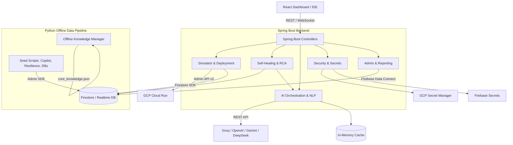
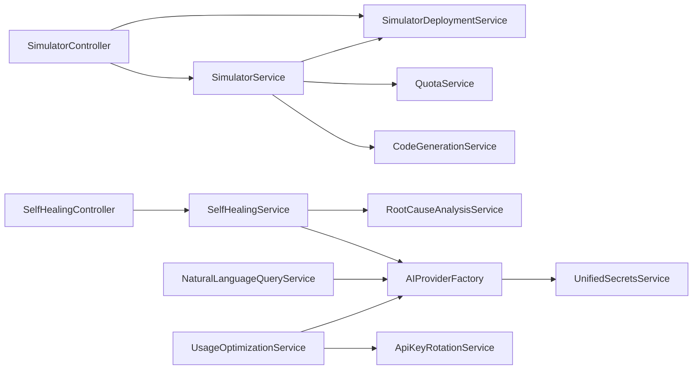
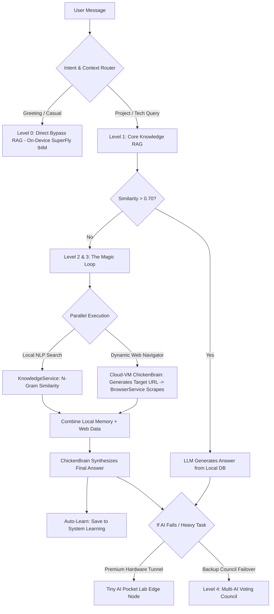

# 🏗️ SupremeAI: Full Architectural Design & Impact Analysis

> **Status:** 🟢 Updated for v5 Architecture

> [!IMPORTANT]
> **📢 UPDATE (v5):** We have successfully integrated GODMODE 3, Tiny Hybrid Routing, and Stateful Playwright for the Autonomous Browser Engine. Please see the latest Bengali documentation for the updated flow: [system_architecture_v5_bn.md](./system_architecture_v5_bn.md)

This document provides a bird's-eye view of the SupremeAI system. It details the core components, backend microservices, offline knowledge pipelines, frontend capabilities, and the cascading impact of modifying any specific feature.

## 1. High-Level System Architecture
This diagram shows how the User (Frontend) interacts with the Spring Boot backend, which then orchestrates AI providers, databases, and GCP deployments.

---

## 2. Core Service Dependency Map
This diagram maps out exactly which service talks to which service. **If you change a service at the bottom of an arrow, the service at the top of the arrow will be impacted.**

---

## 3. Self-Healing Engine: `developUntilPerfection` Flow
The `developUntilPerfection` method is a Fully Reactive, non-blocking asynchronous loop. It iteratively improves code quality until it meets the "Perfect" criteria or gets rejected by the Multi-AI Voting Council.

```mermaid
sequenceDiagram
    autonumber
    actor Trigger as Caller (Controller/Event)
    participant SHS as SelfHealingService
    participant DB as ProviderRepository
    participant Vote as MultiAIVotingService
    participant CodeGen as Heuristics & CodeGen

    Trigger->>SHS: developUntilPerfection(taskCategory, prompt)
    activate SHS
    SHS->>DB: findByStatus("active") (Async Fetch)
    DB-->>SHS: return defaultProviderId
    SHS->>CodeGen: generateInitialCode(prompt)
    CodeGen-->>SHS: initialCode (with TODO stubs)

    rect rgb(30, 40, 50)
    Note right of SHS: Reactive Loop (Mono.expand boundedElastic)<br/>Runs up to MAX_ITERATIONS (5)
    loop For each Iteration
        SHS->>SHS: isCodePerfect(currentCode)?
        alt Code is Perfect (Gates passed)
            SHS-->>Trigger: return currentCode (Break Loop)
        end

        SHS->>Vote: conductApprovalVote(taskCategory, prompt)
        activate Vote
        Note right of Vote: Multi-AI Council votes on changes
        Vote-->>SHS: approved (boolean)
        deactivate Vote

        alt Council Disapproved
            Note left of SHS: Abort early on disapproval
            SHS-->>Trigger: return currentCode (Best Known Version)
        else Council Approved
            SHS->>CodeGen: improveCode(currentCode, prompt, iteration)
            Note right of CodeGen: Applies Heuristics (Fixes TODOs, Braces)
            CodeGen-->>SHS: improvedCode
            
            SHS->>SHS: isCodePerfect(improvedCode)?
            alt Improved Code is Perfect
                SHS-->>Trigger: return improvedCode (Break Loop)
            else Needs More Work
                SHS->>SHS: Pass state to next iteration
            end
        end
    end
    end
    
    SHS-->>Trigger: return lastKnownCode (Max Iterations Reached)
    deactivate SHS
```

---

## 4. Neural Chat Agentic Routing Pipeline
Neural Chat follows a strict 4-level "Local-First, Edge-Cloud Hybrid & Failover" architecture to ensure 100% uptime, zero redundant cloud fees, and the highest accuracy for user queries.

## ৫. কোর মডিউলসমূহ: কীভাবে তারা কাজ করে
*   **সিমুলেটর ইঞ্জিন (Simulator Engine)**: এটি `SimulatorService` এবং `SimulatorDeploymentService` দ্বারা পরিচালিত হয়। ডকার ইমেজ থেকে ডায়নামিক ক্লাউড রান কন্টেইনার তৈরি করতে এটি GCP Admin API v2 ব্যবহার করে।
*   **সেলফ-হিলিং (Self-Healing)**: এটি `SelfHealingService` এর মাধ্যমে কাজ করে। এটি ব্যাকগ্রাউন্ডে সিস্টেম চেক করে এবং অফলাইন এআই এন্ডপয়েন্টগুলোকে রিকভার করার চেষ্টা করে। অজানা এররগুলোকে `GlobalKnowledgeBase`-এ সেভ করে রাখে।
*   **এআই রাউটিং এবং অপটিমাইজেশন (AI Routing & Optimization)**: এটি `UsageOptimizationService` পরিচালনা করে। একই ধরনের রিকোয়েস্টের ক্ষেত্রে এটি ইন-মেমোরি ক্যাশে (Caffeine caches) ব্যবহার করে এবং সবচেয়ে সাশ্রয়ী (Cheapest) এআই মডেলকে কুয়েরি পাঠায়।
*   **সিকিউরিটি এবং সিক্রেটস (Security & Secrets)**: এটি `UnifiedSecretsService` দ্বারা পরিচালিত হয়। এটি একটি প্রায়োরিটি স্কেল অনুযায়ী নিরাপদে API কী (Keys) ফেচ করে: GCP Secret Manager -> Firebase -> Environment Variables।

---

## ৬. অফলাইন নলেজ এবং পাইথন সিডিং পাইপলাইন
SupremeAI এক্সটার্নাল API ফেইল করলে একটি "Zero-AI" অফলাইন মোডে (Thunder Mode) কাজ করতে সক্ষম।
*   **অফলাইন ইঞ্জিন (`knowledge_manager.py`)**: ইন্টারনেট ছাড়াই `core_knowledge.json` এবং `autonomous_seed_knowledge.json` ব্যবহার করে লোকালি কুয়েরি ইন্টারসেপ্ট করে। সলিউশন খুঁজে বের করতে এটি জ্যাকার্ড সিমিলারিটি (Jaccard similarity) এবং স্টেমিং (Stemming) পদ্ধতি ব্যবহার করে।
*   **সিডিং স্ক্রিপ্টস (Seeding Scripts)**: এই পাইথন স্ক্রিপ্টগুলো ফায়ারস্টোরের `system_learning` এবং `patterns` কালেকশনে বিশাল আর্কিটেকচারাল প্যাটার্ন, এরর ফিক্স এবং সফটওয়্যার লজিক পুশ করে:
    *   `seed_copilot_knowledge.py`: কোপাইলট ওয়ার্কফ্লো স্টেপস এবং এরর ডিটেকশন পদ্ধতি ইনজেক্ট করে।
    *   `seed_resilience_knowledge.py`: ক্যাসকেডিং ফেইলিউর রোধ করার মেকানিজম এবং থান্ডার মোড প্রোটোকল ইনজেক্ট করে।
    *   `seed_part2_software_architecture.py` & `seed_part3_databases.py`: সলিড (SOLID), ডিডিডি (DDD), এবং এসকিউএল/নো-এসকিউএল (SQL/NoSQL) এর বেস্ট প্র্যাকটিসগুলো সিড করে।
    *   `import_kimi_k2_system_learning.py`: কিমি কে২ (Kimi K2) নলেজ ডেটাসেটগুলোকে নরমালাইজ ও ইম্পোর্ট করে।

---

## ৭. ফ্রন্টএন্ড অ্যাডমিন ক্যাপাবিলিটিস এবং ফায়ারবেস ডেটা কানেক্ট
রিঅ্যাক্ট ফ্রন্টএন্ড ড্যাশবোর্ড সিস্টেম অ্যাডমিনদেরকে এআই ইকোসিস্টেমের ওপর সম্পূর্ণ নিয়ন্ত্রণ প্রদান করে।
*   **অ্যাডমিন মডিউলস** (E2E টেস্ট `remaining.spec.js` দ্বারা ভেরিফায়েড):
    *   **এজেন্ট অরকেস্ট্রেশন (Agent Orchestration)**: এআই এজেন্টদের নিয়ন্ত্রণ করা, স্ট্যাটাস দেখা এবং লগ অ্যাক্সেস করা যায়।
    *   **লার্নিং সিস্টেম (Learning System)**: নলেজ আপডেট এবং ট্রেনিং হিস্ট্রি মনিটর করা যায়।
    *   **রিপোর্টস এবং ব্যাকআপস (Reports & Backups)**: সিস্টেম রিপোর্ট জেনারেট করা এবং ব্যাকআপ তৈরি বা রিস্টোর করা যায়।
    *   **API কী রোটেশন (API Key Rotation)**: প্রোভাইডার API কী ম্যানেজ করা এবং ডায়নামিক্যালি কানেকশন টেস্ট করা যায়।
*   **ফায়ারবেস ডেটা কানেক্ট (Firebase Data Connect)**: ফ্রন্টএন্ডটি ডেটাবেস রেকর্ডের সাথে নিরাপদে যোগাযোগ করার জন্য (কুয়েরি এবং মিউটেশন) স্বয়ংক্রিয়ভাবে জেনারেট হওয়া স্ট্রংলি-টাইপড রিঅ্যাক্ট হুকস (`@dataconnect/generated/react`) ব্যবহার করে (যেমন: `useListMovies`, `useUpsertUser`)।

---

## ৮. টেস্টিং, ভেরিফিকেশন এবং রিলায়েবিলিটি ইনফ্রাস্ট্রাকচার
*   **রিঅ্যাক্টিভ থ্রেড রিলায়েবিলিটি**: কোনো ডেভেলপার যদি ভুলবশত রিঅ্যাক্টিভ ইভেন্ট লুপের মধ্যে সিঙ্ক্রোনাস ব্লকিং (Blocking) কল করে ফেলে, তবে `BlockHoundCustomConfig.java` এর মাধ্যমে CI/CD বিল্ড ফেইল হয়ে যাবে।
*   **এন্ড-টু-এন্ড (E2E) টেস্টিং**: প্লে-রাইট (Playwright) স্ক্রিপ্টস (`remaining.spec.js`) নিশ্চিত করে যে রিঅ্যাক্ট ড্যাশবোর্ড UI সম্পূর্ণভাবে কার্যকর আছে।
*   **ইন্টিগ্রেশন ভেরিফিকেশন**: `verify-stepfun-integration.sh` এর মতো ব্যাশ স্ক্রিপ্টগুলো প্রোভাইডার ইন্টিগ্রেশন, এনভায়রনমেন্ট ভেরিয়েবল, API হেলথ এবং ফ্রন্টএন্ড আপডেটগুলোকে যাচাই করে।

---

## ৯. ইমপ্যাক্ট অ্যানালিসিস (চেঞ্জ ম্যানেজমেন্ট ম্যাট্রিক্স)

| আপনি যদি পরিবর্তন করেন... | এটি যে অংশে প্রভাব ফেলবে... | আপনার যা করতে হবে |
| :--- | :--- | :--- |
| **GCP Cloud Run-এর রিজিওন বা নাম** | `SimulatorDeploymentService` | আপনাকে অবশ্যই `deployViaAdminApi` মেথডটি আপডেট করতে হবে। পাশাপাশি, নতুন Cloud Run URL-এর সাথে মিল রাখতে `firebase.json`-এর CORS রুলস আপডেট করার প্রয়োজন আছে কি না তা চেক করুন। |
| **নতুন এআই মডেল যুক্ত করা (যেমন, GPT-5)** | `UsageOptimizationService` এবং `ProviderTypeRegistry` | `initModelTiers()`-এ নতুন মডেল টিয়ার এবং কস্ট (Cost) ক্যালকুলেশন যোগ করুন। নিশ্চিত করুন যেন `AIProviderFactory` এটি ম্যাপ করতে পারে। |
| **ফায়ারস্টোর ডেটাবেস স্কিমা** | Repositories এবং Python Seed Scripts | `SystemLearning.java` (বা সংশ্লিষ্ট মডেল) আপডেট করুন। **অত্যন্ত গুরুত্বপূর্ণ:** ভবিষ্যতের নলেজ সিডিং যেন বাধাগ্রস্ত না হয় সেজন্য আপনাকে অবশ্যই `import_kimi_k2_system_learning.py` এবং `seed_part1...py` স্ক্রিপ্টগুলো নতুন স্কিমার সাথে মিলিয়ে আপডেট করতে হবে। |
| **সেলফ-হিলিং কোড কোয়ালিটি রুলস** | `SelfHealingService` (`isCodePerfect`) | `isCodePerfect`-এ পরিবর্তন আনলে তা সম্পূর্ণ `developUntilPerfection` লুপকে প্রভাবিত করবে। নিয়ম খুব কঠিন করলে লুপটি টাইমআউট হয়ে যাবে (`MAX_ITERATIONS` এ পৌঁছাবে)। |
| **ফায়ারবেস ডেটা কানেক্ট (GraphQL)** | রিঅ্যাক্ট ফ্রন্টএন্ড (`@dataconnect/generated/react`) | GraphQL স্কিমায় কোনো পরিবর্তন করলে Firebase DataConnect কম্পাইলার রান করতে হবে। এরপর আপনার রিঅ্যাক্ট কম্পোনেন্টের হুকগুলো (যেমন, `useGetMovieById`) আপডেট করতে হবে। |
| **`UnifiedSecretsService`** | সম্পূর্ণ এআই অরকেস্ট্রেশন লেয়ার | কীভাবে সিক্রেট (Secrets) ফেচ করা বা ক্যাশ করা হয় তাতে পরিবর্তন আনলে পুরো অ্যাপ্লিকেশনের ল্যাটেন্সি (Latency) প্রভাবিত হবে। ভুলবশত ক্যাশিং বন্ধ হয়ে গেলে GCP Secret Manager-এর বিল অতিরিক্ত বেড়ে যাবে। |
| **ফ্রন্টএন্ড অ্যাডমিন ড্যাশবোর্ডের URL বা UI** | প্লে-রাইট (Playwright) E2E টেস্ট (`remaining.spec.js`) | UI-এর ক্লাস/আইডি পরিবর্তন করলে প্লে-রাইট টেস্টগুলো ফেইল করবে। তাই `.orchestrate-btn` বা `.progress-bar` এর মতো সিলেক্টরগুলো আপডেট করুন। |