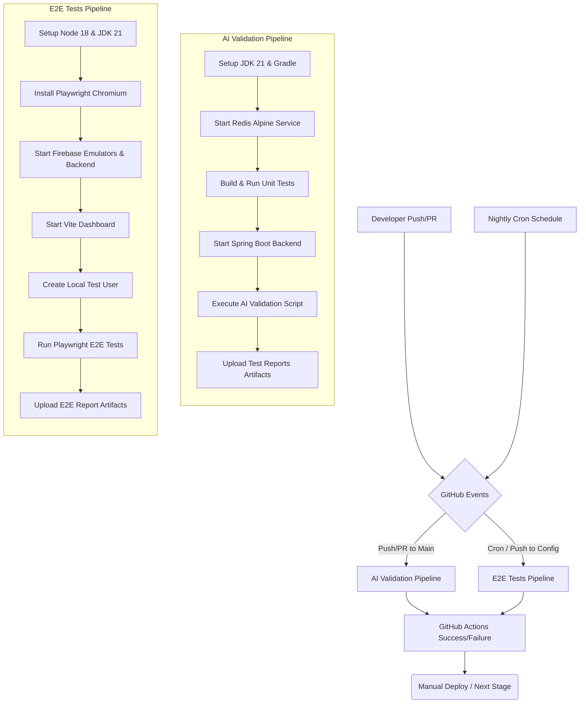

# 🐙 SupremeAI: GitHub CI/CD & Automation Architecture

This document outlines the GitHub Actions workflows, secrets management, and testing pipelines used in SupremeAI.

## 1. System Architecture Overview

The following diagram illustrates the complete GitHub Actions architecture and how the CI/CD pipelines trigger, execute, and validate the system.

## 2. Workflows Step-By-Step

### 2.1 AI Validation Pipeline (`ai-validation.yml`)
Triggers on `push` and `pull_request` to `main`, `develop`, and `master` branches.

**Step-by-Step Execution:**
1. **Repository Checkout:** Clones the repo with depth 1.
2. **Environment Setup:** Configures JDK 21 (Temurin) and restores Gradle cache.
3. **Run Unit Tests:** Executes `./gradlew clean test`.
4. **Service Initialization:** Spins up a Redis container and starts the Spring Boot backend (`test` profile). It polls `localhost:8080/actuator/health` until healthy.
5. **AI Validation:** Runs `bash scripts/validate_ai.sh` using secrets (`POCKETLAB_URL` & GCP Credentials).
6. **Artifact Upload:** Uploads Gradle test reports.

### 2.2 End-to-End Tests (`e2e-tests.yml`)
Runs nightly via cron and on pushes to `dashboard/`, `functions/`, or `config/`.

**Step-by-Step Execution:**
1. **Environment Setup:** Sets up Node.js 18, JDK 21, and caches Playwright browsers.
2. **Dependencies Install:** Installs Dashboard dependencies and Playwright Chromium.
3. **Backend & Emulators:** Starts Spring Boot connected to local Firebase Auth and Firestore emulators.
4. **Frontend Dashboard:** Runs `npm run dev` to serve the Vite app on port 5173.
5. **Test Data Setup:** Creates a test user via Firebase Auth emulator REST API.
6. **E2E Testing:** Runs Playwright UI tests against the running local environment.
7. **Artifact Upload:** Uploads Playwright HTML report and backend logs.

## 3. Secrets & Variables
The pipelines securely inject the following GitHub Secrets:
- `POCKETLAB_URL`: Endpoint for AI pocket lab edge node.
- `GOOGLE_APPLICATION_CREDENTIALS`: GCP service account key for integrations.

## 4. Concurrency & Performance
Both workflows use `concurrency` groups mapping to the workflow name and Git branch (`${{ github.workflow }}-${{ github.ref }}`). If a new commit is pushed while a pipeline is running, `cancel-in-progress: true` stops the old run, saving valuable compute minutes.
