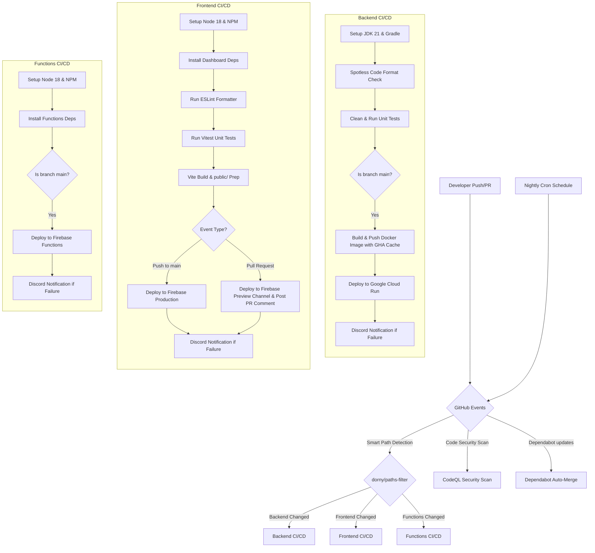

# 🐙 SupremeAI: GitHub CI/CD & Automation Architecture

This document outlines the GitHub Actions workflows, secrets management, and testing pipelines used in SupremeAI.

## 1. System Architecture Overview

The following diagram illustrates the complete GitHub Actions architecture and how the CI/CD pipelines trigger, execute, and validate the system.

## 2. Workflows Step-By-Step

### 2.1 Smart CI/CD Pipeline (`smart-ci-cd.yml`)
Triggers on `push` and `pull_request` to `main`, `develop`, and `master` branches. It uses path filtering to ensure only modified components run, preventing runtime waste.

**Step-by-Step Execution:**
1. **Detect Changes:** Uses `dorny/paths-filter` to detect if files changed in `src/` (backend), `dashboard/` (frontend), or `functions/` (firebase functions).
2. **Backend CI/CD:**
   - Runs `./gradlew spotlessCheck` to enforce style guide.
   - Runs `./gradlew clean test` to execute JUnit tests.
   - On pushes to `main`, sets up QEMU/Docker Buildx and builds/pushes Docker image using `docker/build-push-action@v5` with GHA caching (`type=gha`).
   - Deploys the built image to **Google Cloud Run**.
   - Sends Discord failure alert if webhook is configured.
3. **Frontend CI/CD:**
   - Performs `npm run lint` inside the `dashboard/` workspace.
   - Runs Vitest unit tests (`npm run test -- --run`).
   - Builds Vite production bundle and copies it to `public/`.
   - On pushes to `main`, deploys to **Firebase Hosting Production**.
   - On `pull_request`, deploys to a **Firebase Hosting Preview Channel** and comments the preview URL directly on the PR using GitHub CLI (`gh`).
   - Sends Discord failure alert if webhook is configured.
4. **Functions CI/CD:**
   - On pushes to `main`, deploys functions to **Firebase Functions**.
   - Sends Discord failure alert if webhook is configured.

### 2.2 CodeQL Security Scan (`codeql.yml`)
Runs on pushes and PRs to main branches as well as weekly. It analyzes `java-kotlin` and `javascript-typescript` code bases using static analysis to find code vulnerabilities (SQL Injection, XSS, etc.).

### 2.3 Dependabot & Auto-Merge (`dependabot.yml` & `dependabot-auto-merge.yml`)
- Scans `gradle` and `npm` dependency layers weekly and creates PRs for package updates.
- If a Dependabot PR is a patch or minor release and passes all CI tests, it is automatically approved and merged via `gh pr merge --auto`.

## 3. Secrets & Variables
The pipelines securely inject the following GitHub Secrets:
- `GCP_SA_KEY`: GCP service account key for Cloud Run and Firebase Hosting/Functions authentication.
- `DISCORD_WEBHOOK` (Optional): Webhook to receive instant pipeline failure alerts in Discord.
- `GITHUB_TOKEN`: Built-in GitHub token used for PR comment creation and Dependabot auto-merging.

## 4. Concurrency & Performance
Workflows use `concurrency` groups mapping to the workflow name and Git branch (`${{ github.workflow }}-${{ github.ref }}`). If a new commit is pushed while a pipeline is running, `cancel-in-progress: true` stops the old run, saving valuable compute minutes. Docker build utilizes GHA backend caching to speed up compilation.
