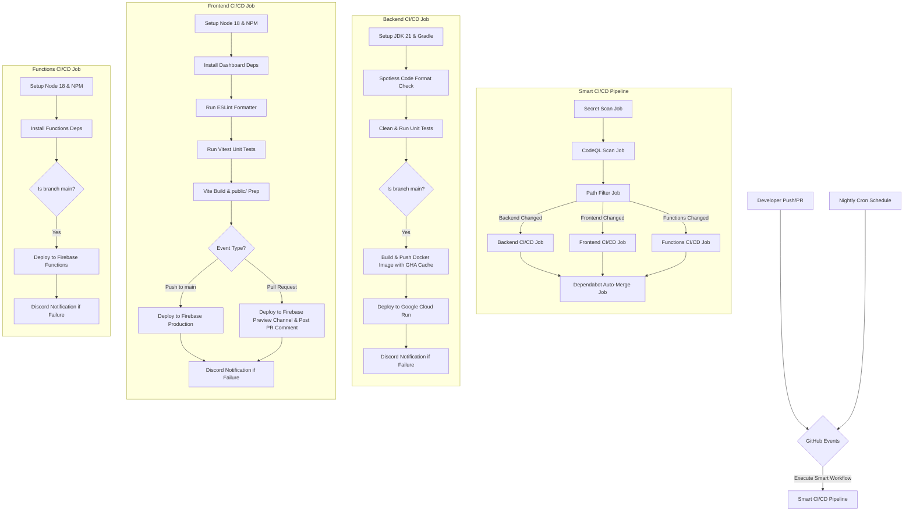

# 🐙 SupremeAI: GitHub CI/CD & Automation Architecture

This document outlines the GitHub Actions workflows, secrets management, and testing pipelines used in SupremeAI.

## 1. System Architecture Overview

The following diagram illustrates the complete GitHub Actions architecture and how the CI/CD pipelines trigger, execute, and validate the system.

## 2. The Unified Workflow (`smart-ci-cd.yml`)

SupremeAI uses a single, interconnected GitHub Actions workflow file that handles security scanning, formatting checks, testing, deployment, and auto-merge steps in one execution pipeline.

### 2.1 Secret Scanning (`secret-scan` job)
Runs on every push to detect credentials and API keys leak using Gitleaks tool.

### 2.2 CodeQL Security Scan (`codeql-scan` job)
Runs static application security testing (SAST) on both `java-kotlin` and `javascript-typescript` code bases to flag security vulnerabilities (e.g. SQL Injection, XSS) before deployment.

### 2.3 Path Filter (`detect-changes` job)
Uses `dorny/paths-filter` to ensure that only the modified sections of the project are built and deployed, saving GitHub Action execution limits.

### 2.4 Backend CI/CD (`backend-ci` job)
- **Formatting:** Enforces strict Spotless formatting rules using `./gradlew spotlessCheck`.
- **Testing:** Runs backend JUnit tests using `./gradlew clean test`.
- **Deployment:** On push to `main`, builds the container using QEMU & Buildx with GHA caching (`type=gha`), pushes it to Google Container Registry (GCR), and deploys it to **Google Cloud Run**.

### 2.5 Frontend CI/CD (`frontend-ci` job)
- **Formatting:** Enforces style guidelines via `npm run lint`.
- **Testing:** Runs Vitest unit tests inside the dashboard project.
- **Deployment:** 
  - On push to `main`, builds production files and deploys them to **Firebase Hosting Production**.
  - On `pull_request`, deploys to a temporary **Firebase Hosting Preview Channel** and comments the preview URL directly on the PR using the GitHub CLI (`gh`).

### 2.6 Functions CI/CD (`functions-ci` job)
On push to `main`, deploys serverless Node.js handlers to **Firebase Functions**.

### 2.7 Dependabot Auto-Merge (`dependabot-merge` job)
- Scans `gradle` and `npm` package managers weekly (defined in `dependabot.yml`).
- When a Dependabot PR is created, this job monitors CI/CD results. If all other tests succeed and the update type is patch or minor, it auto-merges the PR.

## 3. Secrets & Variables
The pipeline securely injects the following GitHub Secrets:
- `GCP_SA_KEY`: GCP service account key for Google Cloud Run and Firebase.
- `DISCORD_WEBHOOK` (Optional): Webhook to receive pipeline failure notifications in Discord.
- `GITHUB_TOKEN`: Access token to post PR comments and perform Dependabot auto-merging.
