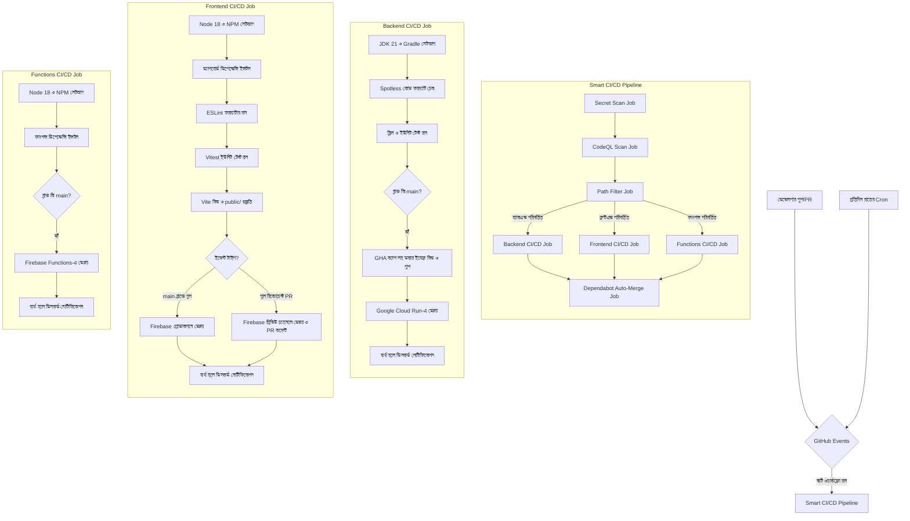

# 🐙 SupremeAI: গিটহাব (GitHub) আর্কিটেকচার

এই ডকটিতে SupremeAI এর গিটহাব অ্যাকশন (GitHub Actions) এবং ইউনিফাইড CI/CD পাইপলাইনের বিস্তারিত দেওয়া হলো।

## ১. আর্কিটেকচার ওভারভিউ (Graphical View)

নিচের ডায়াগ্রামটি গিটহাব অ্যাকশন আর্কিটেকচার এবং এটি কীভাবে কাজ করে তার পূর্ণাঙ্গ চিত্র তুলে ধরেছে:

## ২. ইউনিফাইড ওয়ার্কফ্লো (`smart-ci-cd.yml`)

SupremeAI একটিমাত্র সমন্বিত গিটহাব অ্যাকশন ওয়ার্কফ্লো ফাইল ব্যবহার করে যা একই সাথে সিকিউরিটি স্ক্যানিং, কোড ফরম্যাটিং, টেস্টিং, ডেপ্লয়মেন্ট এবং অটো-মার্জ সম্পন্ন করে।

### ২.১ সিক্রেট স্ক্যানিং (`secret-scan` job)
Gitleaks টুল ব্যবহার করে কোডে ভুলবশত কোনো সংবেদনশীল তথ্য (যেমন: API key, password) লিক হয়েছে কিনা তা স্ক্যান করে।

### ২.২ CodeQL সিকিউরিটি স্ক্যান (`codeql-scan` job)
জাভা এবং জাভাস্ক্রিপ্ট ফাইলগুলোর স্ট্যাটিক নিরাপত্তা বিশ্লেষণ (SAST) সম্পন্ন করে ডেপ্লয়মেন্টের পূর্বেই SQL injection বা XSS-এর মতো ক্ষতিকারক ত্রুটিগুলো শনাক্ত করে।

### ২.৩ পাথ ফিল্টার (`detect-changes` job)
`dorny/paths-filter` ব্যবহার করে প্রজেক্টের যে ফোল্ডারে পরিবর্তন এসেছে শুধুমাত্র সেই অংশটুকুই বিল্ড ও টেস্ট করে কম্পিউট টাইম সাশ্রয় করে।

### ২.৪ ব্যাকএন্ড CI/CD (`backend-ci` job)
- **ফরম্যাটিং:** `./gradlew spotlessCheck` দিয়ে জাভা কোড ফরমেটিং যাচাই করে।
- **টেস্টিং:** `./gradlew clean test` রান করে ব্যাকএন্ড ইউনিট টেস্ট সম্পন্ন করে।
- **ডেপ্লয়মেন্ট:** `main` ব্রাঞ্চে পুশ হলে Buildx ও GHA ক্যাশ (`type=gha`) ব্যবহার করে দ্রুত ডকার ইমেজ বিল্ড ও পুশ করে ইমেজটি **Google Cloud Run**-এ ডেপ্লয় করে।

### ২.৫ ফ্রন্টএন্ড CI/CD (`frontend-ci` job)
- **ফরম্যাটিং:** `npm run lint` দিয়ে কোড ফরমেটিং ও কোয়ালিটি চেক করে।
- **টেস্টিং:** Vitest ব্যবহার করে ফ্রন্টএন্ড টেস্ট রান করে।
- **ডেপ্লয়মেন্ট:** 
  - `main` ব্রাঞ্চে পুশ হলে **Firebase Hosting Production**-এ ডেপ্লয় করে।
  - পুল রিকোয়েস্টে (PR) এটি একটি **Firebase Hosting Preview Channel** তৈরি করে এবং গিটহাব CLI (`gh`) দিয়ে পিআর-এ লিংকটি কমেন্ট করে।

### ২.৬ ফাংশন্স CI/CD (`functions-ci` job)
`main` ব্রাঞ্চে পুশ হলে ফায়ারবেস ক্লাউড ফাংশনস আপডেট বা ডেপ্লয় করে।

### ২.৭ ডিপেন্ডাবট অটো-মার্জ (`dependabot-merge` job)
- প্রতি সপ্তাহে ডিপেন্ডেন্সির আপডেট চেক করে পিআর ওপেন করে (যা `dependabot.yml` দ্বারা কনফিগার করা)।
- পিআর যদি মাইনর আপডেট হয় এবং পূর্বের টেস্টগুলো পাস করে, তবে গিটহাব অটো-মার্জ মেকানিজম ব্যবহার করে স্বয়ংক্রিয়ভাবে পিআরটি মার্জ করে।

## ৩. সিক্রেটস (Secrets)
নিম্নলিখিত গিটহাব সিক্রেটস ব্যবহৃত হয়:
- `GCP_SA_KEY`: Cloud Run এবং Firebase ডেপ্লয়মেন্টের জন্য গুগল ক্লাউড সার্ভিস অ্যাকাউন্ট কি।
- `DISCORD_WEBHOOK` (ঐচ্ছিক): পাইপলাইন ফেইল করলে ডিসকর্ডে তাৎক্ষণিক অ্যালার্ট পাঠানোর জন্য।
- `GITHUB_TOKEN`: পুল রিকোয়েস্টে প্রিভিউ লিংক কমেন্ট করা এবং ডিপেন্ডাবট পিআর অটো-মার্জ করার জন্য।
