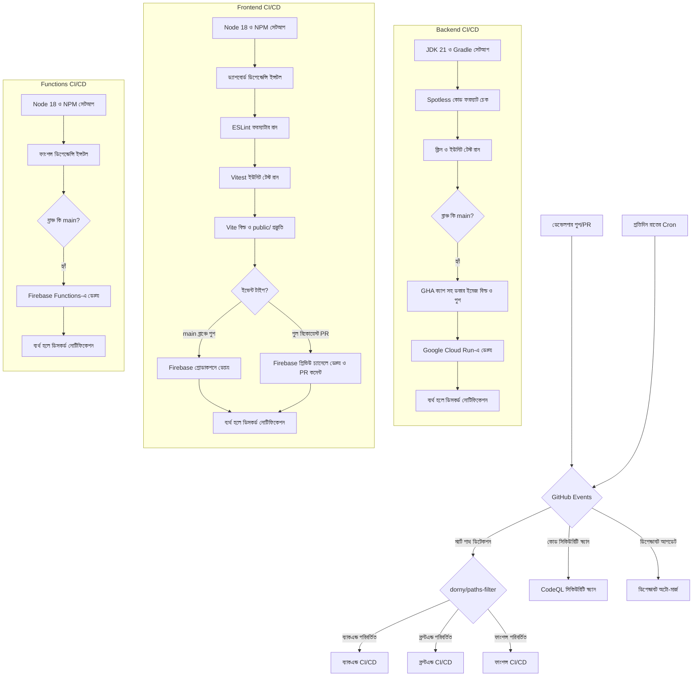

# 🐙 SupremeAI: গিটহাব (GitHub) আর্কিটেকচার

এই ডকটিতে SupremeAI এর গিটহাব অ্যাকশন (GitHub Actions) এবং CI/CD পাইপলাইনের বিস্তারিত দেওয়া হলো।

## ১. আর্কিটেকচার ওভারভিউ (Graphical View)

নিচের ডায়াগ্রামটি গিটহাব অ্যাকশন আর্কিটেকচার এবং এটি কীভাবে কাজ করে তার পূর্ণাঙ্গ চিত্র তুলে ধরেছে:

## ২. ওয়ার্কফ্লোসমূহ (Step-By-Step)

### ২.১ স্মার্ট CI/CD পাইপলাইন (`smart-ci-cd.yml`)
`main`, `develop`, এবং `master` ব্রাঞ্চে পুশ বা পিআর (PR) দিলে এটি রান করে। প্রজেক্টের অপ্রয়োজনীয় বিল্ড এড়াতে এটি পাথ ফিল্টারিং ব্যবহার করে শুধু পরিবর্তিত কম্পোনেন্টগুলো রান করে।

**কীভাবে কাজ করে (স্টেপ-বাই-স্টেপ):**
১. **চেকআউট ও ডিটেকশন:** `dorny/paths-filter` ব্যবহার করে এটি ট্র্যাক করে কোডের কোন অংশে (backend, frontend, functions) পরিবর্তন এসেছে।
২. **ব্যাকএন্ড CI/CD:**
   * `./gradlew spotlessCheck` রান করে জাভা কোড ফরমেটিং যাচাই করে।
   * `./gradlew clean test` রান করে ব্যাকএন্ড ইউনিট টেস্টগুলো সম্পন্ন করে।
   * `main` ব্রাঞ্চে পুশ হলে Buildx ও QEMU সেটআপ করে `docker/build-push-action@v5` এবং GHA ক্যাশ (`type=gha`) ব্যবহার করে দ্রুত ডকার ইমেজ বিল্ড ও পুশ করে।
   * ইমেজটি **Google Cloud Run**-এ ডেপ্লয় করে।
   * প্রসেসটি ব্যর্থ হলে ডিসকর্ডে অ্যালার্ট পাঠায়।
৩. **ফ্রন্টএন্ড CI/CD:**
   * `dashboard/` ডিরেক্টরিতে `npm run lint` কোড কোয়ালিটি নিশ্চিত করে।
   * Vitest ব্যবহার করে ফ্রন্টএন্ড টেস্ট রান করে।
   * ড্যাশবোর্ড প্রজেক্ট বিল্ড করে আউটপুট `public/` ফোল্ডারে কপি করে।
   * `main` ব্রাঞ্চে পুশ হলে **Firebase Hosting Production**-এ ডেপ্লয় করে।
   * পুল রিকোয়েস্টে (PR) এটি একটি **Firebase Hosting Preview Channel** তৈরি করে এবং গিটহাব CLI (`gh`) দিয়ে পিআর-এ লিংকটি কমেন্ট করে দেয়।
   * ব্যর্থ হলে ডিসকর্ডে অ্যালার্ট পাঠায়।
৪. **ফাংশন্স CI/CD:**
   * `main` ব্রাঞ্চে পুশ হলে এটি ফায়ারবেস ক্লাউড ফাংশনস আপডেট বা ডেপ্লয় করে।
   * ব্যর্থ হলে ডিসকর্ডে অ্যালার্ট পাঠায়।

### ২.২ CodeQL সিকিউরিটি স্ক্যান (`codeql.yml`)
এটি প্রজেক্টের জাভা এবং জাভাস্ক্রিপ্ট ফাইলের গভীর নিরাপত্তা স্ক্যান (SAST) সম্পন্ন করে বিভিন্ন নিরাপত্তা ত্রুটি (যেমন SQL injection, XSS) খুঁজে বের করে।

### ২.৩ ডিপেন্ডাবট ও অটো-মার্জ (`dependabot.yml` & `dependabot-auto-merge.yml`)
- প্রতি সপ্তাহে npm ও gradle ডিপেন্ডেন্সির আপডেট চেক করে পিআর ওপেন করে।
- পিআর যদি কোনো সিকিউরিটি প্যাচ বা মাইনর আপডেট হয় এবং টেস্ট পাস করে, তবে গিটহাব অটো-মার্জ মেকানিজম ব্যবহার করে স্বয়ংক্রিয়ভাবে পিআরটি মার্জ করে নেয়।

## ৩. সিক্রেটস (Secrets)
নিম্নলিখিত গিটহাব সিক্রেটস ব্যবহৃত হয়:
- `GCP_SA_KEY`: Cloud Run এবং Firebase ডেপ্লয়মেন্টের জন্য গুগল ক্লাউড সার্ভিস অ্যাকাউন্ট কি।
- `DISCORD_WEBHOOK` (ঐচ্ছিক): পাইপলাইন ফেইল করলে ডিসকর্ডে মেসেজ পাঠানোর জন্য।
- `GITHUB_TOKEN`: পুল রিকোয়েস্টে প্রিভিউ লিংক কমেন্ট করা এবং ডিপেন্ডাবট পিআর অটো-মার্জ করার জন্য।

## ৪. কনকারেন্সি (Concurrency) ও পারফরম্যান্স
উভয় ওয়ার্কফ্লোতে `cancel-in-progress: true` দেওয়া আছে, যা পুরোনো পেন্ডিং রানগুলো বাতিল করে ফ্রি মিনিট বাঁচায়। ডকার বিল্ড অপ্টিমাইজেশনের জন্য গিটহাব ক্যাশ ব্যবহার করা হয়।
