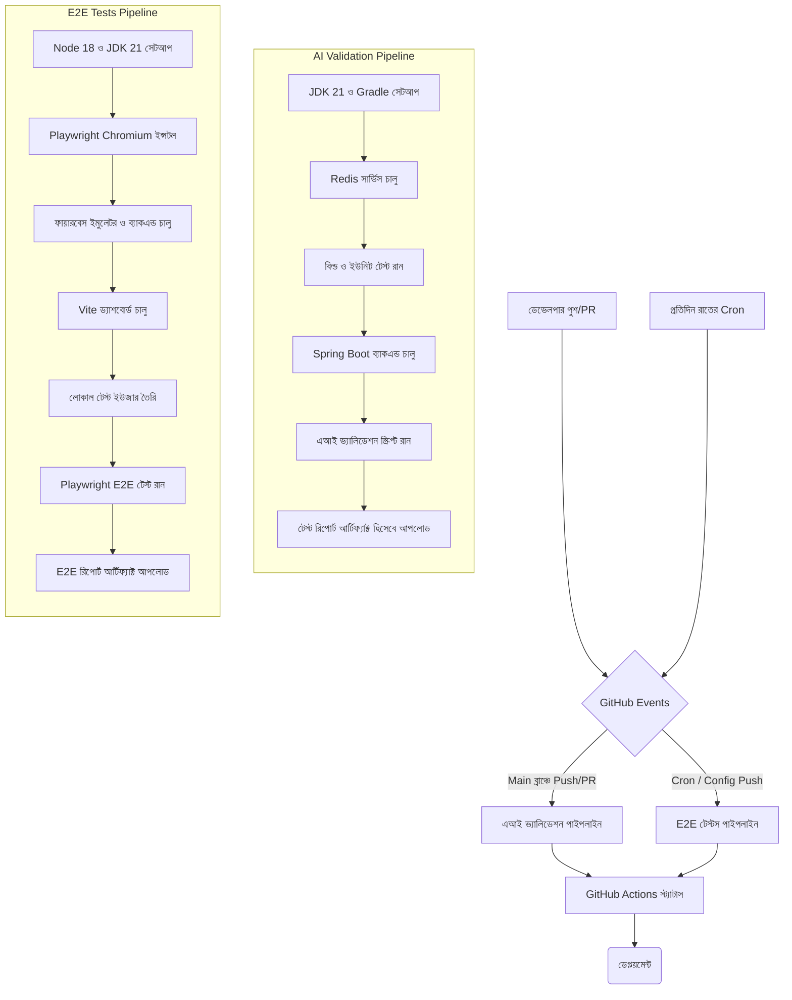

# 🐙 SupremeAI: গিটহাব (GitHub) আর্কিটেকচার

এই ডকটিতে SupremeAI এর গিটহাব অ্যাকশন (GitHub Actions) এবং CI/CD পাইপলাইনের বিস্তারিত দেওয়া হলো।

## ১. আর্কিটেকচার ওভারভিউ (Graphical View)

নিচের ডায়াগ্রামটি গিটহাব অ্যাকশন আর্কিটেকচার এবং এটি কীভাবে কাজ করে তার পূর্ণাঙ্গ চিত্র তুলে ধরেছে:

## ২. ওয়ার্কফ্লোসমূহ (Step-By-Step)

### ২.১ এআই ভ্যালিডেশন পাইপলাইন (`ai-validation.yml`)
`main`, `develop`, এবং `master` ব্রাঞ্চে পুশ বা পিআর (PR) দিলে এটি রান করে।

**কীভাবে কাজ করে (স্টেপ-বাই-স্টেপ):**
১. **চেকআউট:** রিপোজিটরি ক্লোন করে।
২. **সেটআপ:** JDK 21 এবং Gradle ক্যাশ সেটআপ করে।
৩. **ইউনিট টেস্ট:** `./gradlew clean test` রান করে কোড টেস্ট করে।
৪. **ব্যাকএন্ড চালু:** Redis কন্টেইনার এবং Spring Boot ব্যাকএন্ড (`test` প্রোফাইলে) চালু করে এবং হেলদি না হওয়া পর্যন্ত অপেক্ষা করে।
৫. **এআই টেস্ট:** `POCKETLAB_URL` এবং GCP সিক্রেটস ব্যবহার করে এআই ভ্যালিডেশন স্ক্রিপ্ট (`validate_ai.sh`) রান করে।
৬. **আর্টিফ্যাক্ট:** টেস্ট রিপোর্ট গিটহাবে আপলোড করে।

### ২.২ E2E টেস্টস (`e2e-tests.yml`)
এটি প্রতিদিন রাতে (cron) এবং নির্দিষ্ট ফোল্ডারে পুশ করলে রান করে।

**কীভাবে কাজ করে (স্টেপ-বাই-স্টেপ):**
১. **সেটআপ:** Node.js 18, JDK 21 এবং Playwright ব্রাউজার ক্যাশ সেটআপ করে।
২. **ইন্সটলেশন:** UI টেস্টের জন্য Chromium ব্রাউজার ইন্সটল করে।
৩. **ইমুলেটর ও ব্যাকএন্ড:** লোকাল ফায়ারবেস ইমুলেটর (Firestore, Auth) এর সাথে ব্যাকএন্ড কানেক্ট করে চালু করে।
৪. **ফ্রন্টএন্ড:** Vite ড্যাশবোর্ড লোকালহোস্টে রান করে।
৫. **ইউজার তৈরি:** ফায়ারবেস ইমুলেটরে টেস্ট ইউজার অ্যাকাউন্ট তৈরি করে।
৬. **টেস্টিং:** Playwright ব্যবহার করে ড্যাশবোর্ডের এন্ড-টু-এন্ড (UI) টেস্টগুলো রান করে।
৭. **আর্টিফ্যাক্ট:** টেস্টের HTML রিপোর্ট এবং ব্যাকএন্ড লগস আপলোড করে।

## ৩. সিক্রেটস (Secrets)
নিম্নলিখিত গিটহাব সিক্রেটস ব্যবহৃত হয়:
- `POCKETLAB_URL`: এআই পকেট ল্যাব এন্ডপয়েন্ট।
- `GOOGLE_APPLICATION_CREDENTIALS`: গিটহাব থেকে GCP এক্সেসের জন্য।

## ৪. কনকারেন্সি (Concurrency)
উভয় ওয়ার্কফ্লোতে `cancel-in-progress: true` দেওয়া আছে। এর মানে হলো, একটি পাইপলাইন চলাকালীন যদি নতুন কোনো কোড পুশ করা হয়, তবে আগের পাইপলাইনটি বন্ধ হয়ে নতুনটি শুরু হবে। এতে কম্পিউট টাইম এবং সময় বাঁচে।
