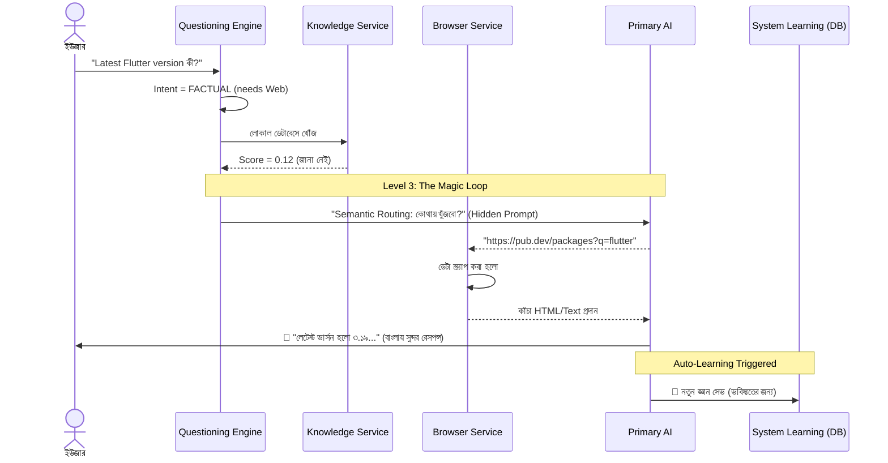

# 🧠 সুপ্রিমএআই নিউরাল চ্যাট: ইন্টেলিজেন্স লাইফসাইকেল (১০০% অ্যাকটিভ)

> **Status:** 🟢 Updated for v5 Architecture


এই ডকুমেন্টটি SupremeAI-এর **"Neural Chat"**-এর সম্পূর্ণ আর্কিটেকচার, এজেন্টিক রাউটিং (Agentic Routing), এবং ম্যাজিক লুপ (Magic Loop) লাইফসাইকেলটি বিস্তারিতভাবে বর্ণনা করে। এটি কোনো সাধারণ চ্যাটবট নয়; এটি একটি স্বয়ংসম্পূর্ণ এআই সিস্টেম যা নিজে থেকে সিদ্ধান্ত নেয় কোথা থেকে এবং কীভাবে ইউজারের প্রশ্নের সেরা উত্তরটি বের করতে হবে।

---

## 🔄 ১. নিউরাল চ্যাট মাস্টার লাইফসাইকেল (The Magic Loop)

নিচের ফ্লোচার্টটি দেখায় কীভাবে একটি ইউজার মেসেজ রিসিভ করা থেকে শুরু করে এআই সেটি প্রসেস, স্ক্র্যাপ এবং পরিশেষে রেসপন্স ও অটো-লার্ন করে।

```mermaid
flowchart TD
    User((ইউজার মেসেজ)) --> AQE{Autonomous Questioning Engine\n(Intent & Context Router)}
    
    %% Level 0 and 1
    AQE -->|GREETING\n(hi, hello)| L0[লেভেল ০: ইনস্ট্যান্ট লোকাল রেসপন্স\nBypass Database & API]
    AQE -->|AMBIGUOUS\n(অস্পষ্ট প্রশ্ন)| L1[লেভেল ১: ইন্টারঅ্যাক্টিভ ক্লারিফিকেশন\nOption Suggestions]
    
    L0 --> Output([ফাইনাল রেসপন্স])
    L1 --> Output
    
    %% Level 2 (RAG)
    AQE -->|FACTUAL / TASK\n(বৈধ প্রশ্ন)| L2_RAG[লেভেল ২: Pure Java NLP RAG\n(Local Knowledge Base)]
    L2_RAG --> CheckSim{Similarity Score\n> ০.৫৫?}
    
    %% Direct to Level 3 (Bypass RAG)
    AQE -->|CREATIVE / TEMPORAL\n(গান, জোকস, আজকের খবর)| L3[লেভেল ৩: ডাইনামিক ওয়েব নেভিগেশন\n(The Magic Loop)]
    
    %% RAG Success
    CheckSim -->|হ্যাঁ (লোকাল ডেটা আছে)| AI_Prompt[প্রাইমারি এআই (Primary AI)\nLocal Context + Prompt]
    
    %% Magic Loop (Level 3)
    CheckSim -->|না (ম্যাজিক লুপ)| L3
    L3 --> URL_Gen[Semantic Router: AI সেরা URL বাছাই করে\n(Gemini, StackOverflow etc.)]
    URL_Gen --> Browser[Hybrid Browser (Jsoup + Playwright)\nJS/CAPTCHA বাইপাস করে ডেটা আনে]
    Browser --> Combine[(লোকাল ভাঙাচোরা ডেটা + তাজা ওয়েব ডেটা)]
    Combine --> AI_Prompt
    
    %% LLM Execution & Failover (Level 4)
    AI_Prompt --> LLM_Process[[AI Synthesis Execution]]
    LLM_Process --> CheckFail{API ফেইল বা টাইমআউট?}
    
    CheckFail -->|না| SuccessOutput([ফাইনাল রেসপন্স])
    CheckFail -->|হ্যাঁ| L4[লেভেল ৪: Multi-AI Failover]
    
    L4 --> Council[AI Council / Voting Orchestrator\nGemini, Claude, Llama]
    Council --> SuccessOutput
    
    %% Auto-Learning Loop
    SuccessOutput -.-> AutoLearn[(ফায়ারবেস Database\nSystem Learning-এ অটো-সেভ)]
```

---

## ⚙️ ২. লেভেল-বাই-লেভেল কাজের ধরন (How it Works)

সিস্টেমটি ৪টি ধাপে (Level 0 থেকে Level 4) বিভক্ত হয়ে কাজ করে। প্রতিটি ধাপে এটি ১০০% স্বাধীন (Local-First) থাকার চেষ্টা করে।

### 🟢 লেভেল-০ ও ১: স্মার্ট ইন্টেন্ট রাউটিং (Smart Intent Routing)
কোনো প্রশ্ন আসার সাথে সাথে `AutonomousQuestioningEngine` তার উদ্দেশ্য (Intent) যাচাই করে:
*   **GREETING (অভিবাদন):** ইউজার "hi" বা "কেমন আছেন" লিখলে সিস্টেম কোনো RAG বা API কল করে সময় নষ্ট করে না। ডাটাবেস থেকে ০.১ সেকেন্ডে সরাসরি উত্তর দেয়।
*   **AMBIGUOUS (অস্পষ্ট প্রশ্ন):** প্রশ্ন অসম্পূর্ণ হলে সরাসরি "বুঝতে পারিনি" না বলে, সিস্টেম ইউজারকে ৩-৪টি সম্ভাব্য অপশন এবং একটি Custom Input প্রদান করে (Interactive Clarification)।

### 🚀 স্মার্ট বাইপাস (Smart Bypass)
নতুন আপডেট অনুযায়ী, যদি প্রশ্নটি **CREATIVE** (যেমন: "একটি গান লেখো") বা **TEMPORAL** (যেমন: "আজকের খবর কী") হয়, তবে সিস্টেম লেভেল-২ (RAG) পুরোপুরি স্কিপ করে সরাসরি লেভেল-৩ (ব্রাউজার)-এ চলে যায়। এতে ইউজারের ২-৩ সেকেন্ড সময় বাঁচে।

### 🟡 লেভেল-২: প্রিসিশন RAG ও Pure Java NLP (Precision RAG)
ফ্যাকচুয়াল বা টেকনিক্যাল প্রশ্নগুলোর জন্য এটি প্রথমে লোকাল ফায়ারবেস মেমরিতে (`system_learning`) উত্তর খোঁজে:
*   এটি সম্পূর্ণ নিজস্ব **Multilingual N-Gram (Tri-gram) Cosine Similarity** অ্যালগরিদম ব্যবহার করে। ফলে বাংলা বা ইংরেজি—যেকোনো ভাষার বানান ভুল থাকলেও এটি রিয়েল-টাইমে সঠিক মিল খুঁজে পায়।
*   স্কোর **০.৫৫ (৫৫%)** এর বেশি হলে এটি লোকাল ডেটা ব্যবহার করেই উত্তর দিয়ে দেয়।

### 🟠 লেভেল-৩: দ্য ম্যাজিক লুপ (Dynamic Web Navigation)
যখন সিস্টেমে উত্তর থাকে না (Score < 0.55), তখন এটি হাল ছেড়ে দেয় না। এটি "ম্যাজিক লুপ" চালু করে:
1.  **Semantic Router (AI Reasoning):** Primary AI ডাটাবেসে থাকা ওয়েবসাইট ও অন্যান্য এআইয়ের লিস্ট থেকে নিজে ঠিক করে এই প্রশ্নের উত্তর খুঁজতে কোথায় যেতে হবে (যেমন: গানের জন্য Gemini, কোডের জন্য StackOverflow, অ্যানালিসিসের জন্য Kimi)।
2.  **Hybrid Smart Scraping:** `BrowserService` প্রথমে ফাস্ট `Jsoup` দিয়ে ট্রাই করে। যদি সাইটে CAPTCHA বা JavaScript থাকে, তবে এটি অটোমেটিক্যালি `Playwright` (Chromium Browser) রান করে ডেটা নিয়ে আসে।
3.  **Synthesis:** লোকাল ডেটার সাথে নতুন এই ওয়েব ডেটা মিলিয়ে AI একটি নিখুঁত উত্তর তৈরি করে।

### 🔴 লেভেল-৪: মাল্টি-এআই ফেইলওভার (Multi-AI Verification Guarantee)
যেকোনো বড় সিস্টেমে API ডাউন হতে পারে। কিন্তু SupremeAI ক্র্যাশ করে না।
*   প্রাইমারি এআই (যেমন OpenAI বা Groq) রেট-লিমিট খেলে বা টাইমআউট হলে, এটি সাথে সাথে `MultiAIVotingService` বা এআই কাউন্সিলকে কল করে।
*   ব্যাকগ্রাউন্ডে থাকা Gemini, Claude বা Llama-র মতো বিকল্প মডেলগুলো মুহূর্তের মধ্যে ইউজারের উত্তর জেনারেট করে দেয় (১০০% আপটাইম গ্যারান্টি)।

---

## 🧠 ৩. ডেটা প্রসেসিং ও লার্নিং ফ্লো (Sequence Diagram)

নিচের ডায়াগ্রামটি দেখায় কীভাবে সিস্টেম নিজে থেকে শেখে এবং প্রতিটি প্রশ্নের সাথে সাথে আরও স্মার্ট হয়ে ওঠে:



---
**উপসংহার:** 
SupremeAI Neural Chat কোনো হার্ডকোডেড রুলসের ওপর চলে না। এর **"ম্যাজিক লুপ"** মেকানিজমটি একে প্রতিদিন নতুন জিনিস শিখতে এবং সম্পূর্ণ স্বাধীনভাবে (Autonomous) ইউজারের যেকোনো প্রশ্নের সবচেয়ে আপ-টু-ডেট উত্তর দিতে সাহায্য করে।