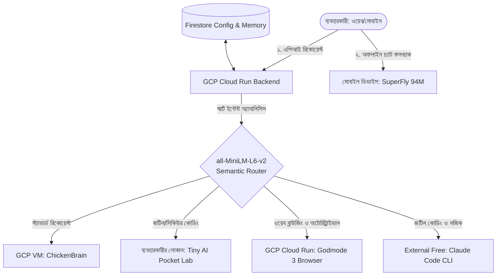

# 🌐 সুপ্রিম AI হাইব্রিড এজ-ক্লাউড আর্কিটেকচারাল প্ল্যান (Hybrid Edge-Cloud AI Architecture)

> **Status:** 🟢 Updated for v5 Architecture

এই ডকুমেন্টে SupremeAI প্রজেক্টের ক্লাউড ও লোকাল ফিজিক্যাল এজ ডিভাইসের সমন্বয়ে একটি হাইব্রিড এআই সমাধান আর্কিটেকচার বিশদভাবে বর্ণনা করা হয়েছে। এর মূল লক্ষ্য হলো প্রজেক্টের রানিং কস্ট কমানো, ল্যাটেন্সি অপ্টিমাইজ করা এবং সম্পূর্ণ অফলাইন রেজিলিয়েন্স (Offline Resilience) নিশ্চিত করা।

> **গুরুত্বপূর্ণ দ্রষ্টব্য (Important Note):** আমাদের লোকাল ডিভাইসে রান করার মতো পর্যাপ্ত হার্ডওয়্যার কনফিগারেশন না থাকায়, ডিফল্টরূপে আমরা একটি ডেডিকেটেড ক্লাউড সার্ভারকে "লোকাল সার্ভার" হিসেবে ব্যবহার করছি এবং "লোকাল মডেল" বলতে এই ক্লাউড সার্ভারে হোস্ট করা মডেলকে বোঝাচ্ছি। তবে, এটি একটি অতিরিক্ত বা ঐচ্ছিক ফিচার (Extra Feature) হিসেবে থাকবে যাতে যেসব ব্যবহারকারীর পর্যাপ্ত শক্তিশালী হার্ডওয়্যার রয়েছে, তারা চাইলে নিজস্ব ডিভাইসে সরাসরি **AI Pocket Lab** বা মোবাইলে **SuperFly** অফলাইনে রান করাতে পারেন।

---

## 🚀 আর্কিটেকচারাল সারসংক্ষেপ (Architectural Overview)

SupremeAI মূলত একটি লোকাল-ফার্স্ট ডিজাইন হলেও প্রোডাকশনে সব ব্যবহারকারীর জন্য এটি ক্লাউডে হোস্ট করা থাকবে। আমরা এআই প্রসেসিং ক্ষমতাকে তিনটি ভিন্ন লেয়ারে ভাগ করব:

---

## 🧠 ৫টি কোর এআই উপাদানের ভূমিকা (Model Components Analysis)

### ১. SuperFly (অন-ডিভাইস এজ মডেল)
* **সাইজ ও টাইপ:** ৯৪ মিলিয়ন প্যারামিটার সম্পন্ন ন্যানো-মডেল (SmolLM2-ভিত্তিক)।
* **হোস্টিং:** ব্যবহারকারীর নিজস্ব মোবাইল ফোন (Flutter) বা লোকাল ব্রাউজারে (WASM/ONNX)।
* **উদ্দেশ্য:** 
  * ইন্টারনেটের অনুপস্থিতিতে সম্পূর্ণ অফলাইন চ্যাট ব্যাকআপ।
  * চ্যাটের শুরুতে অত্যন্ত দ্রুত ইন্টেন্ট বিশ্লেষণ (Greeting vs Complex Task)।
  * জিরো ক্লাউড কস্ট এবং মিলি-সেকেন্ড ল্যাটেন্সি রেসপন্স।

### ২. ChickenBrain (ক্লাউড সেন্ট্রাল এআই)
* **সাইজ ও টাইপ:** কোয়ান্টাম-কম্প্রেসড Llama 3.1 মডেল (Multiverse Computing দ্বারা তৈরি)।
* **হোস্টিং:** ক্লাউডে (GCP Compute Engine বা Cloud Run-এ Ollama/vLLM সার্ভার)।
* **উদ্দেশ্য:**
  * এটি আমাদের প্রজেক্টের প্রধান কাজের মূল চালিকাশক্তি (Primary AI) হিসেবে থাকবে।
  * যেহেতু এটি সাধারণ ৮বি মডেলের চেয়ে ৩,৭০০ গুণ ছোট, এটি সস্তা জিপিউ (GPU) বা শুধুমাত্র সিপইউ (CPU)-তে অত্যন্ত দ্রুত রান করতে পারে।
  * ব্যবহারকারীদের সব ধরনের স্ট্যান্ডার্ড কোড ও ডাটাবেস কুয়েরির উত্তর দেবে।

### ৩. Tiny AI Pocket Lab (ডেডিকেটেড লোকাল নোড)
* **সাইজ ও টাইপ:** ৮০জিবি র‍্যাম ও ১টিবি এসএসডি যুক্ত পকেট-সাইজ এআই সুপারকম্পিউটার (CES 2026)। এটি লোকালভাবে 100B+ প্যারামিটারের যেকোনো ভারী মডেল (যেমন Llama 3 70B) অফলাইনে রান করাতে পারে।
* **হোস্টিং:** প্রজেক্টের প্রিমিয়াম ক্লায়েন্ট বা ডেডিকেটেড লোকাল সার্ভার হিসেবে কাজ করবে।
* **উদ্দেশ্য:**
  * ক্লাউড হোস্টিং কস্ট এবং ব্যান্ডউইথ শূন্যে নামিয়ে আনা।
  * কর্পোরেট কোড এবং স্পর্শকাতর প্রজেক্ট ফাইল ক্লাউডে না পাঠিয়ে সম্পূর্ণ সুরক্ষিত ও অফলাইনে প্রোসেস করা।

### ৪. Godmode 3 (ওয়েব রিট্রাইভাল ও ব্রাউজার ইঞ্জিন)
* **হোস্টিং:** ক্লাউডে পরিচালিত Stateful Playwright সেবা (GCP Cloud Run এ `engine-godmode-3` হিসেবে হোস্ট করা)।
* **উদ্দেশ্য:**
  * রিয়েল-টাইম ওয়েব অ্যাক্সেস এবং ভিজ্যুয়াল অডিট সম্পন্ন করা।
  * ব্রাউজার-ভিত্তিক তথ্য সংগ্রহ এবং অটোরিট্রাইভাল পরিচালনা করা।

### ৫. Claude Code (এক্সটার্নাল জটিল কোডিং ইঞ্জিন)
* **হোস্টিং:** এক্সটার্নাল ফ্রি টিয়ার / Claude CLI ইন্টিগ্রেশন।
* **উদ্দেশ্য:**
  * উচ্চ-স্তরের যৌক্তিক বিশ্লেষণ এবং অত্যন্ত জটিল কোড রিফ্যাক্টরিং করা।
  * পিআর (PR) রিভিউ এবং অ্যাডভান্সড কোডিং লজিক ডেভেলপমেন্টে সহায়তা করা।

---

## 🛠️ সিস্টেম ইন্টিগ্রেশন পাথ (System Integration Paths)

### ক. ব্যাকএন্ড ইন্টিগ্রেশন ও রাউটিং লজিক
আমাদের ব্যাকএন্ডে **Local-First (In-House Stack)** মেকানিজম সমান গুরুত্ব দিয়ে কাজ করবে:
*   **কোর কম্পোনেন্টস (Local-First):** `Browser Engine` (Playwright/Jsoup স্ক্র্যাপার), `Core Knowledge Base` (রুলস ডাটাবেস), আমাদের ক্লাউডে ডিপ্লয়ড নিজস্ব এআই মডেল (`ChickenBrain` বা `hybrid_tiny`), **GODMODE 3** (মাল্টি-মডেল অরকেস্ট্রেশন), এবং **Free Claude Code** (রিজনিং ও কোডিং অ্যাসিস্ট্যান্ট) একে অপরের পরিপূরক হিসেবে কাজ করবে।
*   **অতিরিক্ত ফিচার (Pocket Lab):** ব্যবহারকারীর অ্যাকাউন্টে কাস্টম **Pocket Lab** রেজিস্টার্ড থাকলে, রিকোয়েস্ট লোকাল টানেলে ফরোয়ার্ড করা সম্ভব (যা একটি অতিরিক্ত বা ঐচ্ছিক ফিচার)।
*   **এক্সটার্নাল প্রোভাইডার:** যেকোনো এক্সটার্নাল এপিআই কী ব্যবহারকারীর ৪র্থ অপশন বা এক্সটার্নাল ফলব্যাক হিসেবে বিবেচিত হবে।
*   **ফেইলওভার:** ব্যাকএন্ডের সার্ভিস ফেইল করলে [StubLocalProvider](file:///f:/supremeai/src/main/java/com/supremeai/provider/StubLocalProvider.java) অফলাইন সমাধান নিশ্চিত করবে।

### খ. মোবাইল ডিভাইস ইন্টিগ্রেশন (Edge Node)
ফ্লাটার ক্লায়েন্ট অ্যাপ্লিকেশন ডিরেক্টরি [supremeai](file:///f:/supremeai/supremeai)-তে অন-ডিভাইস মডেল রান করার জন্য `onnxruntime_flutter` প্যাকেজ যুক্ত করা হবে।
* অ্যাপ চালুর সময় **SuperFly** মডেলটি লোকাল ফাইল সিস্টেমে ক্যাশ করা হবে।
* ক্লাউড ব্যাকএন্ডের স্বাস্থ্য ও নেটওয়ার্ক পিং ফেইল করলে, অ্যাপটি সরাসরি লোকাল রানিং মডেলে চ্যাট ট্রাফিক রাউট করবে।

### গ. ড্যাশবোর্ড সেটিংস পেজ আপডেট
আমাদের অ্যাডমিন প্যানেলে [DashboardConfigs.tsx](file:///f:/supremeai/dashboard/src/components/dashboard/DashboardConfigs.tsx)-এর আন্ডারে একটি নতুন সেকশন যোগ করা হবে:
* **"এজ এজেন্ট নোড কানেকশন (Tiny AI Pocket Lab)"**
  * ব্যবহারকারীরা তাদের লোকাল টানেল ইউআরএল (যেমন: `http://localhost:11434` বা Ngrok টানেল) এবং এপিআই কী ইনপুট দিতে পারবেন।
  * ড্যাশবোর্ড এটি ফায়ারস্টোরে সেভ করবে যাতে ক্লাউড রাউটার বুঝতে পারে কখন লোকাল নোড ব্যবহার করতে হবে।

---

## 📋 ধাপভিত্তিক বাস্তবায়ন রোডম্যাপ (Implementation Roadmap)

### ফেজ ১: ChickenBrain ক্লাউড ডিপ্লয়মেন্ট
- [ ] GCP Compute Engine-এ একটি Ollama কন্টেইনার তৈরি করা।
- [ ] ChickenBrain মডেলের GGUF/Ollama ফরম্যাট আপলোড ও টেস্ট করা।
- [ ] [AIFallbackOrchestrator](file:///f:/supremeai/src/main/java/com/supremeai/fallback/AIFallbackOrchestrator.java)-এ ChickenBrain এপিআই কানেকশন যুক্ত করা।

### ফেজ ১.৫: all-MiniLM-L6-v2 সিম্যান্টিক রাউটার ডিপ্লয়মেন্ট
- [x] Cloud Run-এর জন্য Python FastAPI মাইক্রোসার্ভিস তৈরি করা।
- [x] Dockerfile ও GCloud ডিপ্লয়মেন্ট স্ক্রিপ্ট যুক্ত করা।
- [ ] স্প্রিং বুটের AutonomousQuestioningEngine-এর সাথে ক্লাউড রাউটার API কানেক্ট করা।

### ফেজ ২: Pocket Lab লোকাল টানেলিং
- [ ] ড্যাশবোর্ডে কাস্টম লোকাল এপিআই নোড রেজিস্টার করার অপশন তৈরি করা।
- [ ] ক্লাউড থেকে লোকাল টানেলে কুয়েরি ফরোয়ার্ড করার রাউটিং সার্ভিস লেখা।
- [ ] সিকিউরিটি চেক ও কুয়েরি ডেলিভারি মেকানিজম ডেভেলপ করা।

### ফেজ ৩: SuperFly মোবাইল অফলাইন রেজিলিয়েন্স
- [ ] ফ্লাটার অ্যাপ্লিকেশনে `onnxruntime_flutter` লাইব্রেরি কনফিগার করা।
- [ ] SuperFly মডেল ব্যবহার করে মোবাইল অ্যাপের ভেতরে অফলাইন রেসপন্স সিস্টেম টেস্ট করা।
- [ ] নেটওয়ার্ক ডিটেক্টর ও অটো-সুইচিং ড্রাইভার ইমপ্লিমেন্ট করা।
