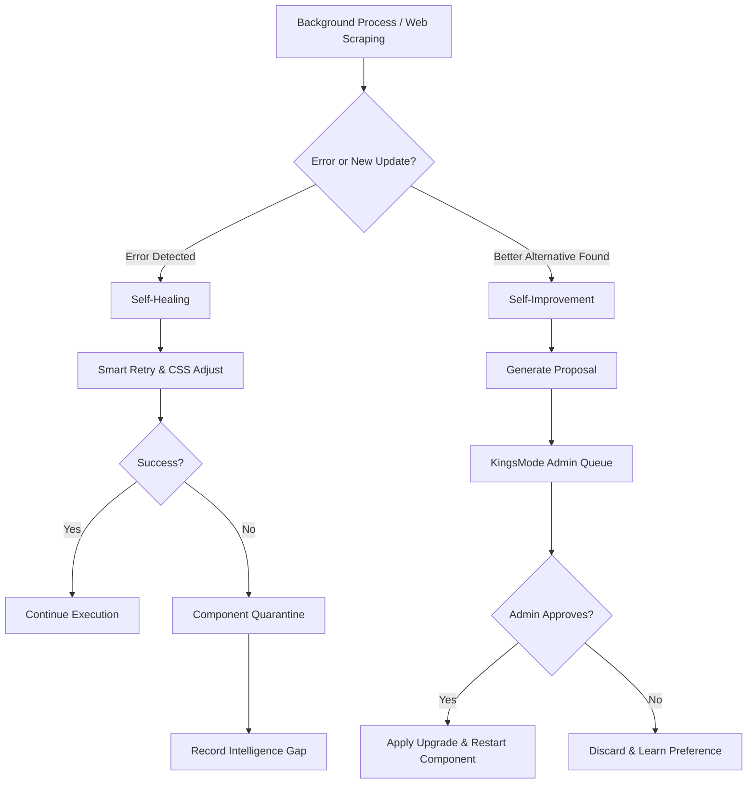

# 🛡️ SupremeAI: Self-Healing & Self-Improvement Architecture (Local-First)

> **Status:** 🟢 Updated for v5 Architecture

## 📌 ওভারভিউ (Overview)

SupremeAI এর পূর্ববর্তী ভার্সনে সেলফ-হিলিং মূলত এক্সটার্নাল এপিআই (OpenAI, Anthropic) এর ডাউনটাইম বা এরর ফিক্স করার ওপর নির্ভরশীল ছিল। বর্তমান **"Local-First"** আর্কিটেকচারে এক্সটার্নাল মডেলের ওপর নির্ভরতা কমিয়ে নিজস্ব লোকাল সিস্টেম (Local LLM, Playwright Browser) এর মাধ্যমে স্বয়ংক্রিয়ভাবে এরর রিকভারি এবং প্রো-অ্যাকটিভ সিস্টেম ডেভেলপমেন্ট করার জন্য এই আর্কিটেকচার ডিজাইন করা হয়েছে।

---

## 🛠️ ১. Self-Healing Architecture (স্বয়ংক্রিয় ত্রুটি সমাধান)

সেলফ-হিলিং সিস্টেমটি প্রধানত ৪টি লেয়ারে কাজ করে:

### ১.১ Component-Level Health Check

সিস্টেম প্রতি ১০ মিনিট পরপর ব্যাকগ্রাউন্ডে লোকাল কম্পোনেন্টগুলোর (যেমন BrowserService, Local Engine) হেলথ চেক করে।

- ব্রাউজার সেশন ঠিকঠাক রেসপন্স করছে কিনা।
- লোকাল মডেল মেমোরি ওভারলোড (OOM) হচ্ছে কিনা।

### ১.২ Smart Circuit-Breaker ও Quarantine

আগে পুরো প্রোভাইডারকে কোয়ারেন্টাইন করা হতো, এখন এটি ডোমেইন এবং কম্পোনেন্ট-ভিত্তিক কাজ করে:

- **Browser Domain Quarantine:** কোনো নির্দিষ্ট ওয়েবসাইটের DOM লোড হতে যদি বারবার ফেইল করে বা ক্যাপচায় আটকে যায় (পরপর ৩ বার), তবে ওই সাইটটিকে ৫ মিনিটের জন্য কোয়ারেন্টাইনে পাঠানো হবে।
- **Fallback Mechanism:** কোয়ারেন্টাইন অবস্থায় ব্রাউজারের বদলে লাইটওয়েট `Jsoup` স্ক্র্যাপার বা ক্যাশড ডাটা দিয়ে কাজ চালিয়ে নেওয়া হবে।

### ১.৩ Smart Retry & Self-Correction

ব্রাউজার অটোমেশন বা কোড এক্সিকিউশনের সময় এরর হলে (যেমন "Element Not Found"), সিস্টেম সরাসরি ফেইল না করে:

- DOM-ট্রি আবার অ্যানালাইসিস করবে।
- ভিন্ন CSS সিলেক্টর বা XPath জেনারেট করে পুনরায় ট্রাই করবে।
- ৩ বার ফেইল হলে তবেই কোয়ারেন্টাইনে ফেলবে।

### ১.৪ Learning Integration (Intelligence Gap)

যখনই কোনো টাস্ক কোয়ারেন্টাইনে যায়, সিস্টেম সেটিকে ফেইলিয়র না ভেবে একটি **"Intelligence Gap"** হিসেবে `core_knowledge.json`-এ সেভ করে, যাতে ভবিষ্যতে মডেলকে এই নির্দিষ্ট কাজের জন্য ট্রেইন বা ইমপ্রুভ করা যায়।

---

## 🌟 ২. Proactive Self-Improvement (স্বয়ংক্রিয় সিস্টেম উন্নয়ন)

সিস্টেম শুধু এরর আসলে তা ফিক্স করবে না, বরং নিজে থেকে কিভাবে আরও বেটার পারফর্ম করা যায় সেই রাস্তা খুঁজবে।

### ২.১ Web Discovery & Dependency Analysis

`BrowserService` ব্যবহার করে ওয়েব স্ক্র্যাপিং বা সার্চ করার সময়, সিস্টেম ব্যাকগ্রাউন্ডে প্রোজেক্টের লাইব্রেরিগুলোর দিকে নজর রাখবে।

- **Latest Versions:** আমরা যে ডিপেন্ডেন্সিগুলো ব্যবহার করছি, তার কোনো নতুন ভার্সন এসেছে কিনা।
- **Better Alternatives:** বর্তমান প্যাকেজের চেয়ে স্পিড বা সিকিউরিটিতে ভালো কোনো ওপেন-সোর্স লাইব্রেরি গিটহাবে ট্রেন্ডিং আছে কিনা।

### ২.২ KingsMode Approval Queue (অ্যাডমিন পারমিশন)

সিস্টেম যদি কোনো বেটার আপডেট খুঁজে পায়, তবে সে কোনোভাবেই ইউজার পারমিশন ছাড়া সেটি ইন্সটল বা অ্যাপ্লাই করবে না (Strict Rule)।

- সিস্টেম একটি **Improvement Proposal** তৈরি করে **KingsMode** (Admin Approval Dashboard)-এ পাঠাবে (`getPendingConfirmations` API এর মাধ্যমে)।

### ২.৩ Proposal Details (ইন-ডেপথ রিপোর্টিং)

KingsMode-এ অ্যাডমিনকে পাঠানোর সময় প্রপোজালে নিচের বিষয়গুলো পরিষ্কার বাংলায় লেখা থাকবে:

1. **বর্তমান অবস্থা (Current State):** সিস্টেমে বর্তমানে কী ব্যবহার করা হচ্ছে এবং তার পারফরম্যান্স কেমন।
2. **সাজেশন (Proposed Change):** নতুন কী আপডেট বা বেটার অল্টারনেটিভ পাওয়া গেছে।
3. **কেন অ্যাপ্রুভ করা উচিত (Reasoning/Logic):** এই আপডেটটি কেন SupremeAI এর জন্য জরুরি।
4. **উন্নতি (Expected Impact):** এটি অ্যাপ্রুভ করলে স্পিড, সিকিউরিটি বা সিস্টেম স্ট্যাবিলিটিতে ঠিক কী কী পরিবর্তন আসবে।

---

## 🔄 কাজের ফ্লো (Workflow Diagram)

---

## 🎯 উপসংহার

এই আর্কিটেকচারের ফলে SupremeAI একটি সাধারণ বট থেকে একজন **Smart System Architect**-এ রূপান্তরিত হবে, যে নিজের সমস্যা নিজে মেটানোর পাশাপাশি সিস্টেমকে সবসময় লেটেস্ট এবং অপ্টিমাইজড রাখার জন্য প্রো-অ্যাকটিভ সাজেশন দেবে।
