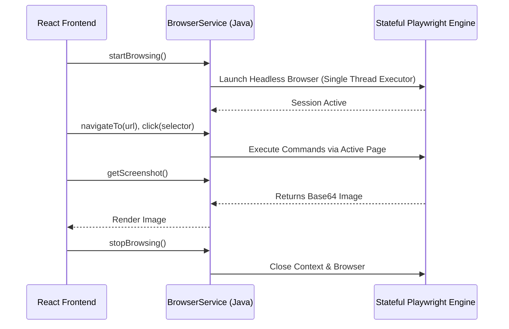

# 🏗️ SupremeAI: সিস্টেম আর্কিটেকচার v5 (Latest)

> **Status:** 🟢 Updated for v5 Architecture


এই ডকুমেন্টটি SupremeAI-এর সবচেয়ে লেটেস্ট (v5) আর্কিটেকচারাল ফ্লো এবং সিস্টেম ইন্টিগ্রেশনের বিস্তারিত বিবরণ প্রদান করে।

## ১. AI Routing (Tiny Hybrid vs GODMODE 3)
SupremeAI-এর ড্যাশবোর্ডে এখন একটি স্মার্ট **Intent Classifier** যুক্ত করা হয়েছে, যা ইউজারের প্রশ্নের ধরন বুঝে স্বয়ংক্রিয়ভাবে মডেল রাউট করে।

```mermaid
flowchart TD
    User[User Input] --> IntentClassifier{Intent Classifier}
    IntentClassifier -->|Normal Question| TinyHybrid[Tiny Hybrid Model]
    IntentClassifier -->|Critical/Coding Task| GODMODE[🔥 GODMODE 3 (Multi-Model)]
    
    TinyHybrid -->|Fast Response| UI[Dashboard UI]
    GODMODE -->|Parallel API Calls via agentId: 'all'| UI
```

- **Tiny Hybrid:** সাধারণ প্রশ্নের জন্য দ্রুত এবং সাশ্রয়ী এআই মডেল।
- **GODMODE 3:** জটিল কাজের জন্য একসাথে একাধিক পাওয়ারফুল মডেলের (যেমন: GPT-4o, Claude 3.5 Sonnet) কাছে কুয়েরি পাঠিয়ে সেরা উত্তর প্রসেস করা হয়।

## ২. Autonomous Browser Engine (Stateful Playwright)
"Project Browser" বা Autonomous Browser এখন আর স্টাবড (Stubbed) নেই। এটি এখন Java-তে থ্রেড-সেফ Playwright সেশন ব্যবহার করে।



## ৩. Dynamic Browser Scraping
ব্রাউজার স্ক্র্যাপিংয়ের জন্য এখন এক্সটার্নাল এআই টুলগুলোকে (OpenAI, Claude) সরাসরি কমান্ড পাঠানো যায়।
- ফাইল পাথ: `f:\supremeai\dashboard\src\constants\browserAgents.ts`
- এখানে ডাইনামিকভাবে `url`, `input selector`, `submit selector` এবং `response selector` সেভ করা আছে, যা যেকোনো সাইডকার স্ক্র্যাপার বা ব্রাউজার এক্সটেনশন ব্যবহার করে ডেটা ফেচ করতে সক্ষম।

## ৪. Self-Healing & Security (আগের মতোই মজবুত)
- **Security:** সকল অ্যাডমিন রাউট `hasRole("ADMIN")` দ্বারা সুরক্ষিত।
- **Resilience:** `SelfHealingService` ৫৬১ লাইনের শক্তিশালী রিকভারি লুপ মেইনটেইন করছে।
