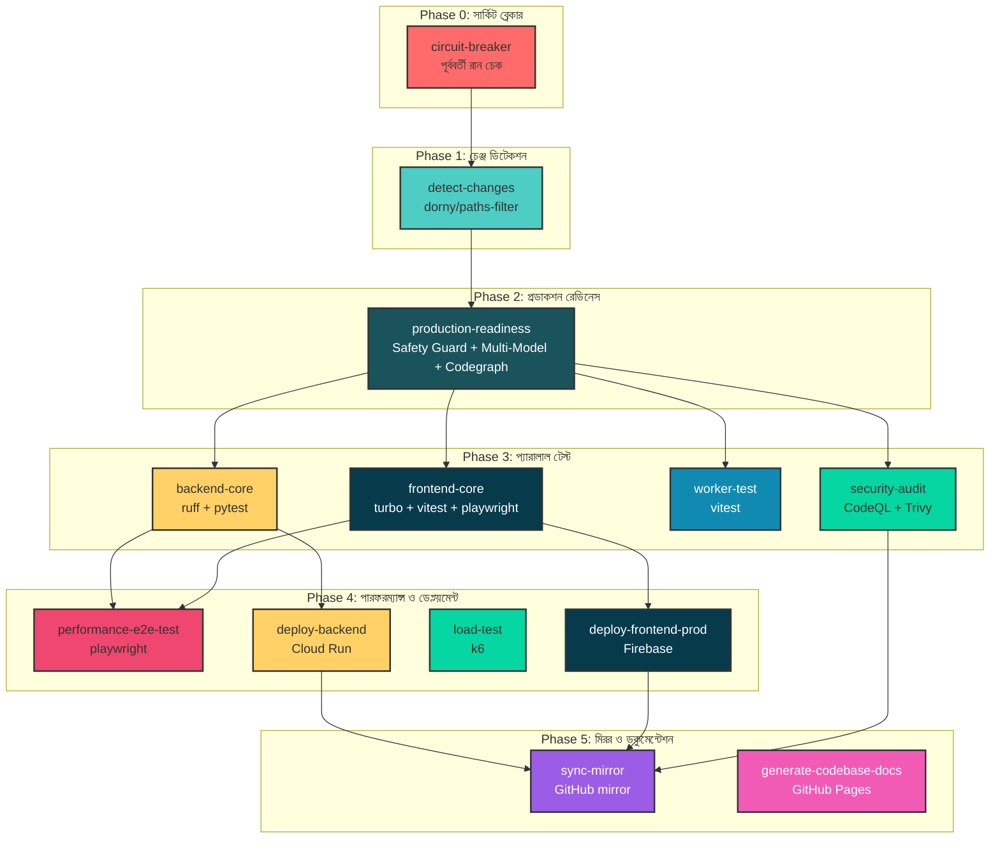

# 🧠 SupremeAI 2.0 - CI/CD পাইপলাইন ডাইগ্রাম ও কার্যকরী পরিকল্পনা

## 📊 সম্পূর্ণ পাইপলাইন ডাইগ্রাম (Mermaid)



---

## 📋 জব ভিত্তিক বিশ্লেষণ

### ১. circuit-breaker (🛑)
| বিষয় | বিবরণ |
|-------|--------|
| **ধরন** | একক জব (সর্বদা প্রথমে) |
| **ইনপুট** | GitHub API, Commit Message |
| **আউটপুট** | `previous_failed: true/false` |
| **সমস্যা** | gh CLI না থাকলে ফেইল হয় |
| **সমাধান** | `actions/github-script` অথবা `gh` CLI ইনস্টল |

### ২. detect-changes (🔍)
| বিষয় | বিবরণ |
|-------|--------|
| **ধরন** | একক জব (circuit-breaker এর পর) |
| **ফিল্টার** | backend, frontend, worker, changes |
| **আউটপুট** | ৪টি বুলিয়ান ফ্ল্যাগ |
| **সমস্যা** | ডাইনামিক ডিটেকশন ডিজেবল |
| **সমাধান** | paths-filter সক্রিয়, রান টাইম কমানো |

### ৩. production-readiness (🚀)
| বিষয় | বিবরণ |
|-------|--------|
| **ধরন** | একক জব (detect-changes এর পর) |
| **শর্ত** | backend=true হলে রান |
| **সাব-স্টেপ** | ৩টি (safety-guard, validator, codegraph) |
| **সমস্যা** | স্ক্রিপ্ট পাথ ভুল |
| **সমাধান** | `../scripts/safety_guard.py` → `scripts/safety_guard.py` |

### ৪. backend-core (🐍)
| বিষয় | বিবরণ |
|-------|--------|
| **ধরন** | একক জব (production-readiness এর পর) |
| **ধাপ** | lint → test → auto-fix (যদি ফেইল) |
| **স্ক্রিপ্ট** | `ci-auto-fix-v3.py` + `multi-model-evaluator.py` |
| **সমস্যা** | দুটো স্ক্রিপ্ট একসঙ্গে রান করলে কনফ্লিক্ট |
| **সমাধান** | auto-fix → consensus check → PR তৈরি |

### ৫. security-audit (🛡️)
| বিষয় | বিবরণ |
|-------|--------|
| **ধরন** | সমান্তরাল জব |
| **সরঞ্জাম** | CodeQL + Trivy |
| **ফলাফল** | SARIF রিপোর্ট |
| **সুবিধা** | স্ক্যান হয় সবসময় |

### ৬. worker-test (⚡)
| বিষয় | বিবরণ |
|-------|--------|
| **ধরন** | শর্তাধীন জব |
| **শর্ত** | worker=true হলে |
| **সরঞ্জাম** | pnpm + vitest |

### ৭. frontend-core (🌐)
| বিষয় | বিবরণ |
|-------|--------|
| **ধরন** | সমান্তরাল জব |
| **প্যাকেজ** | studio-client, web-chat, vscode-extension |
| **সমস্যা** | turbo ফিল্টার নাম ভুল |
| **সমাধান** | `supremeai-vscode` → `supremeai-vscode-extension` |

### ৮. performance-e2e-test (🧪)
| বিষয় | বিবরণ |
|-------|--------|
| **ধরন** | শর্তাধীন জব |
| **শর্ত** | backend-core + frontend-core সফল |
| **সরঞ্জাম** | Playwright |

### ৯. deploy-backend (🚀)
| বিষয় | বিবরণ |
|-------|--------|
| **ধরন** | শর্তাধীন জব |
| **শর্ত** | backend-core সফল + main ব্রাঞ্চ |
| **ধাপ** | Docker build → push → deploy → health check |
| **ফিচার** | Auto-rollback (যদি health check ফেইল) |

### ১০. load-test (⏱️)
| বিষয় | বিবরণ |
|-------|--------|
| **ধরন** | সমান্তরাল জব |
| **সরঞ্জাম** | k6 (grafana/setup-k6-action) |
| **সমস্যা** | `pnpm k6 run` কমান্ড ঠিক নয় |
| **সমাধান** | `k6 run scripts/k6/load_test.js` |

### ১১. sync-mirror (📤)
| বিষয় | বিবরণ |
|-------|--------|
| **ধরন** | শর্তাধীন জব |
| **শর্ত** | সব ডেপ্লয়মেন্ট সফল + main ব্রাঞ্চ |
| **ধাপ** | git remote add → push |

### ১২. generate-codebase-docs (📝)
| বিষয় | বিবরণ |
|-------|--------|
| **ধরন** | শর্তাধীন জব |
| **শর্ত** | main/develop ব্রাঞ্চে push |
| **সরঞ্জাম** | generate_smart_docs.py |

---

## 🔧 অপ্টিমাইজেশন পরিকল্পনা

### Phase 1: জরুরি সমাধান (প্রথম সপ্তাহ)
- [ ] `circuit-breaker` জবে `gh` CLI ইনস্টল যোগ করা
- [ ] `production-readiness` জবে স্ক্রিপ্ট পাথ ঠিক করা
- [ ] `load-test` জবে k6 কমান্ড ঠিক করা
- [ ] `frontend-core` জবে turbo ফিল্টার নাম যাচাই

### Phase 2: ডাইনামিক রাউটিং এবং ফেইলিওর রিকভারি (দ্বিতীয় সপ্তাহ)
- [ ] `detect-changes` জবে paths-filter শতভাগ (100%) নিখুঁতভাবে কাজ করা নিশ্চিত করা
- [ ] পূর্ববর্তী রানে Failed বা Skipped হওয়া জব ডিটেক্ট করে নতুন রানে স্বয়ংক্রিয়ভাবে রিরান করা (Frontend, Backend সহ সকল জবের জন্য প্রযোজ্য)
- [ ] Smart AI Report ইন্টিগ্রেশন: সব জবের বিস্তারিত রিপোর্ট জেনারেট করা
- [ ] `worker-test` এবং `frontend-core` এর শর্ত যথাযথ করা
- [ ] `performance-e2e-test` এর শর্ত আপডেট করা

### Phase 3: Multi-Model Flow (তৃতীয় সপ্তাহ)
- [ ] `backend-core` জবে auto-fix + consensus flow ঠিক করা
- [ ] `ci-auto-fix-v3.py` এবং `multi-model-evaluator.py` একত্রিত করা
- [ ] PR-এ চেঞ্জলগ লিংক যোগ করা

### Phase 4: Security Enhancement (চতুর্থ সপ্তাহ)
- [ ] Trivy স্ক্যানের ফলাফল PR-এ যুক্ত করা
- [ ] CodeQL rules কাস্টমাইজ করা
- [ ] Secret scanning যোগ করা

### Phase 5: Release Workflow (পঞ্চম সপ্তাহ)
- [ ] `supreme-release-builds.yml` আপডেট করা
- [ ] `actions/upload-release-asset@v2` ব্যবহার করা
- [ ] macOS ও Linux আপলোড স্টেপ যোগ করা

---

## 📊 পাইপলাইন মেট্রিক্স টেবিল

| মেট্রিক | বর্তমান | আপডেটেড লক্ষ্য | স্ট্যাটাস |
|--------|--------|----------------|----------|
| মিনিমাম কভারেজ | ২৫% | ৩৮% | ⚠️ আপডেট প্রয়োজন |
| রান টাইম | ~২০ মিনিট | ~১২ মিনিট | ⚠️ ডাইনামিক রাউটিং দরকার |
| সিকিউরিটি স্ক্যান | CodeQL + Trivy | + Secret scanning | ⚠️ যোগ করা দরকার |
| ডেপ্লয়মেন্ট | Cloud Run + Firebase | + Canary Deploy | ✅ আছে |
| Auto-Fix | আছে | Multi-Model Consensus | ⚠️ ফ্লো ঠিক করা দরকার |
| ডকুমেন্টেশন | আছে | PR-এ স্বয়ংক্রিয় | ✅ আছে |

---

## 🎯 প্রধান সুপারিশগুলো

### ১. ডাইনামিক রাউটিং এবং স্বয়ংক্রিয় রিরান (সকল জবের জন্য)
```yaml
# পরিকল্পনা: ফ্রন্টএন্ড, ব্যাকএন্ড সহ সকল জবে নিখুঁত ডিটেকশন ও রিরান লজিক প্রয়োগ করা
backend: ${{ steps.filter.outputs.backend == 'true' || needs.circuit-breaker.outputs.backend_failed_or_skipped == 'true' }}
frontend: ${{ steps.filter.outputs.frontend == 'true' || needs.circuit-breaker.outputs.frontend_failed_or_skipped == 'true' }}
worker: ${{ steps.filter.outputs.worker == 'true' || needs.circuit-breaker.outputs.worker_failed_or_skipped == 'true' }}
```

### ১.১ Smart AI Report
- প্রতিটি জব শেষে (সফল বা ব্যর্থ যাই হোক না কেন) AI স্বয়ংক্রিয়ভাবে বিস্তারিত লগ বিশ্লেষণ করে একটি Smart Report জেনারেট করবে।

### ২. Multi-Model Consensus Flow
```
ফেইল হলে:
┌─────────────────┐
│ auto-fix চালানো │
└────────┬────────┘
         │
         ▼
┌──────────────────────┐
│ multi-model-evaluator │
└────────┬─────────────┘
         │
    ┌────┴────┐
    │ consensus │
    └────┬────┘
         │
    ┌────┴────┐
    │ safe/unsafe │
    └────┬────┘
         │
    ┌────┴────┐
    │ PR/ব্লক │
    └─────────┘
```

### ৩. Error Handling উন্নত করা
- `continue-on-error: true` এর বদলে `if: failure()` ব্যবহার
- ডেপ্লয়মেন্ট ফেইল হলে রিলিজ নোটিফিকেশন

### ৪. Cache Optimization
- Docker build cache: `cache-from: type=gha`
- pnpm store prune: `pnpm store prune`
- GitHub cache cleanup: `gh cache delete`

### ৫. Security Enhancement
- Trivy SARIF আপলোড
- CodeQL custom rules
- GitHub secret scanning

---

_এই ডকুমেন্টটি SupremeAI 2.0-এর CI/CD পাইপলাইনের সম্পূর্ণ বিশ্লেষণ এবং আপডেটেড পরিকল্পনা ধারণ করে।_