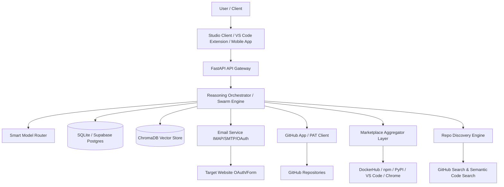

# 🔱 SupremeAI 2.0 System Architecture Overview

This document provides a high-level overview of the SupremeAI 2.0 system architecture, highlighting key components, integration points, and security measures.

## 🏗️ Overall Architecture

The system uses a modular FastAPI backend acting as the API Gateway, coordinating various specialized agent departments, RAG pipelines, model routers, and third-party integrations (including the Email Service and GitHub Integration).

---

## 📧 1. Email System for Web Login/Signup
Enables automated signup/login on target websites by reading OTP codes from verification emails.

- **OAuth 2.0 Flow (Gmail/Outlook API):** Secure authentication without storing raw passwords, supporting 2FA.
- **IMAP/SMTP with App Passwords:** Fallback universal connector for custom enterprise email providers.
- **Automation Pipeline:** Automatically signs up on target platforms, polls and extracts verification OTPs using NLP extraction, and registers/verifies the account automatically.

---

## 🐙 2. GitHub Integration for Code Improvement
Allows SupremeAI Agent to autonomously analyze, refactor, and improve the codebase of both itself and customer repositories.

- **GitHub App:** Installed directly by users, granting fine-grained repository permissions (Contents, Pull Requests, Actions).
- **Personal Access Tokens (PAT):** Quick start fallback for own-repository control.
- **Agent Workflow:** Analyzes code quality, identifies areas of improvement, creates branches, commits optimizations, and opens PRs for human approval.

---

## 🛒 3. Marketplace Discovery Layer
Allows the SupremeAI Agent to search for public/third-party tools and auto-install them.
- **Supported Marketplaces:** Docker Hub, npm, PyPI, VS Code Marketplace, GitHub Marketplace, AWS Marketplace, Chrome Web Store, and custom registries.
- **Auto-Installer:** Automatically pulls, installs, and runs tools in an isolated sandbox environment before production integration.

---

## 🔍 4. Repo Discovery Engine
Enables agent discovery of relevant repositories/libraries for building features or solving tasks.
- **Discovery Channels:** GitHub Search API, GitHub Topics, awesome lists, Sourcegraph semantic code search, and self-hosted vector search.
- **Compatibility Analysis:** Performs automated conflict analysis, license checks, and size estimations before importing.

