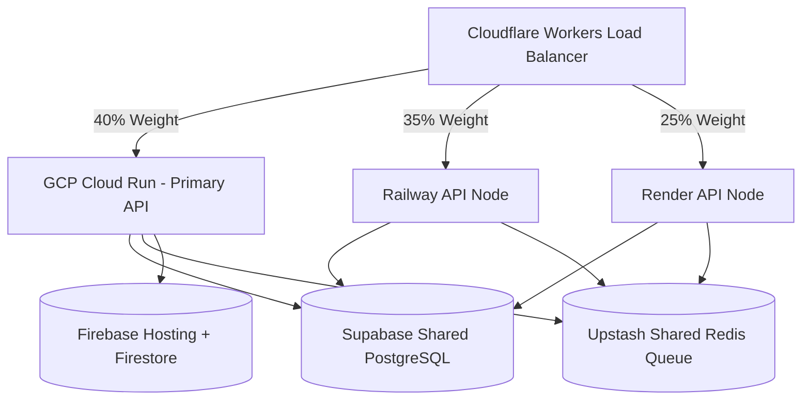

# 🔱 Master Work & Implementation Plan — SupremeAI 2.0 "Best of All AI" Roadmap

**সর্বশেষ বিশ্লেষণ:** সমগ্র প্রজেক্ট কোডবেজ (৩৪+ টেস্ট, ১০০+ মডিউল) পর্যালোচনা করে সর্বশেষ রোডম্যাপ আপডেট করা হয়েছে।
*Full Re-audit: 2026-06-21*

---

## 🏆 Competitive Analysis — আমরা কোথায় দাঁড়িয়ে আছি?

| Feature | ChatGPT | Claude | Gemini | SupremeAI 2.0 (NOW) | SupremeAI Target |
|---|---|---|---|---|---|
| Multi-Provider Routing | ❌ | ❌ | ❌ | ✅ 15+ providers | ✅ 20+ providers |
| Zero-Cost Operation | ❌ | ❌ | ❌ | ✅ ~$5/mo | ✅ $0-5/mo |
| Hallucination Defense | Moderate | Moderate | Moderate | ✅ 6-Layer Guard | ✅ 8-Layer + Self-Heal |
| Multi-Cloud Deployment | ❌ | ❌ | ✅ Partial | ✅ GCP + Firebase | ✅ 5-Cloud + Edge |
| VS Code Integration | Plugin | Plugin | Plugin | ✅ v6.0.0 Extension | ✅ Native IDE Agent |
| Bangla Language | Limited | Limited | Limited | ✅ Native Support | ✅ Best-in-class BN |
| Self-Learning | ❌ | ❌ | ❌ | ✅ Skill Loader | ✅ Autonomous Learning |
| Voice Interface | ✅ | ❌ | ✅ | ✅ Whisper+gTTS | ✅ Full Offline TTS |
| Browser Automation | ❌ | ❌ | ❌ | ✅ Playwright | ✅ Full Browser AI |
| Skill Marketplace | GPT Store | ❌ | ❌ | ✅ marketplace.py | ✅ Full Plugin Store |
| Vision/Multimodal | ✅ | ✅ | ✅ | ✅ vision_agent.py | ✅ Video + Charts |
| Metrics/Observability | Limited | ❌ | Limited | ✅ Prometheus+OTEL | ✅ Full Stack Monitoring |

---

## 🏗️ Architecture & Core Strategy

- **Zero Cost Target:** ~$5/mo খরচে সিস্টেম পরিচালনা (GCP Free Tier, Ollama local, API Key rotation)।
- **Universal Self-Learning:** স্কিল মার্কেটপ্লেস ও `evolution_engine.py` এর সাহায্যে নতুন ফিচার নিজে নিজে যুক্ত করা।
- **FastAPI Backend:** হালকা ও দ্রুতগতির Python FastAPI ভিত্তিক এপিআই গেটওয়ে।
- **Operational Governance:** `.antigravityrules` এবং `admin_rules_and_guidelines.md` প্রতিটি বড় সিদ্ধান্তের আগে যাচাই।
- **Automated Accountability:** প্রতিটি টাস্ক শেষে "What-Done", "Cost-Incurred", "Next-Step" অটো-রিপোর্ট।
- **GitHub Integration & CI/CD:** স্বয়ংক্রিয় পাইপলাইনের জন্য [github_integration_and_deployment.md](file:///c:/Users/n/supremeai/supremeai_2.0/document/plans_and_guides/github_integration_and_deployment.md)।
- **Test Strategy & Coverage:** ১০০% টেস্ট কভারেজ অর্জনের রূপরেখার জন্য [test_coverage_and_strategy.md](file:///c:/Users/n/supremeai/supremeai_2.0/document/status_and_tracking/test_coverage_and_strategy.md)।

---

## 🗺️ ACTIVE ROADMAP — কী বাকি আছে

### 🛡️ Phase: Audit Remediation (Bug Fixes & Security Hardening)

#### 🔴 Critical (নিরাপত্তা / ক্র্যাশ)
- [ ] **Hardcoded JWT Secret Key:** [app.py](file:///c:/Users/n/supremeai/supremeai_2.0/backend/core/app.py#L61) ও [auth_middleware.py](file:///c:/Users/n/supremeai/supremeai_2.0/backend/core/auth_middleware.py#L61) থেকে hardcoded JWT fallback secret সরানো।
- [ ] **Admin Login Token = Plain Password:** [app.py L186](file:///c:/Users/n/supremeai/supremeai_2.0/backend/core/app.py#L186) এ admin verification সফল হলে plain password-এর পরিবর্তে JWT token ইস্যু করা।
- [ ] **Everyone Auto-Granted Admin Role:** [app.py L239-246](file:///c:/Users/n/supremeai/supremeai_2.0/backend/core/app.py#L239) এ `len(email) > 0` কন্ডিশন সরানো এবং Firestore ফেইলওভারে এডমিন রোল গ্রান্ট না করা।
- [ ] **TOTP Secret Logged in Plain Text:** [app.py L148](file:///c:/Users/n/supremeai/supremeai_2.0/backend/core/app.py#L148) থেকে plain text logging সরানো।
- [ ] **Auth Route Prefix Conflict:** [email.py L6](file:///c:/Users/n/supremeai/supremeai_2.0/backend/api/routes/email.py#L6) এর prefix `/auth` থেকে পরিবর্তন করে `/integrations/email` বা `/email` করা।
- [ ] **Weak Token Bypass:** [auth_middleware.py L71-72](file:///c:/Users/n/supremeai/supremeai_2.0/backend/core/auth_middleware.py#L71) থেকে `"test-token"` বাইপাস সরানো।
- [ ] **.env File Exposed via Admin API:** [admin_dashboard.py L152-165](file:///c:/Users/n/supremeai/supremeai_2.0/backend/api/routes/admin_dashboard.py#L152) এ সব endpoints-এ `Depends(require_admin_token)` যোগ করা।
- [ ] **Duplicate Import:** [task.py L5 & L122](file:///c:/Users/n/supremeai/supremeai_2.0/backend/api/routes/task.py#L122) থেকে ডুপ্লিকেট `JSONResponse` ইমপোর্ট রিমুভ করা।

#### 🟠 High (লজিক বাগ / ডেটা লিক)
- [ ] **Two Separate config.py Files:** `backend/config.py` এবং `core/config.py` এর CORS এবং validation লজিক সিঙ্ক করা।
- [ ] **settings.validate() Called Twice:** `core/app.py` এবং `config.py` এর ডাবল ভ্যালিডেশন বন্ধ করা।
- [ ] **Mutable Default Bug in Experience Dataclass:** [experience_db.py L13-22](file:///c:/Users/n/supremeai/supremeai_2.0/backend/adaptive_engine/experience_db.py#L13) এ mutable default values-এর জন্য `field(default_factory=...)` ব্যবহার করা।
- [ ] **stream_chat & get_completion Non-Async:** [task.py L76, L103](file:///c:/Users/n/supremeai/supremeai_2.0/backend/api/routes/task.py#L76) রাউটগুলোকে `async def` করা।
- [ ] **otp.strip() NoneType Crash:** [app.py L183](file:///c:/Users/n/supremeai/supremeai_2.0/backend/core/app.py#L183) এ OTP validation-এর আগে Null চেক করা।
- [ ] **Unsafe intent.task_type.value Call:** [task.py L242](file:///c:/Users/n/supremeai/supremeai_2.0/backend/api/routes/task.py#L242) এ `AttributeError` এড়াতে টাইপ ও অ্যাট্রিবিউট চেক করা।
- [ ] **GitHub /push Endpoint Hardcoded Repo:** [github.py L57](file:///c:/Users/n/supremeai/supremeai_2.0/backend/api/routes/github.py#L57) এ ডামি রিপোজিটরির বদলে রিকোয়েস্ট পেলোড ব্যবহার করা।

#### 🟡 Medium (কোড কোয়ালিটি)
- [ ] **Fake/Hardcoded Users in Auth:** [auth.py L26-30](file:///c:/Users/n/supremeai/supremeai_2.0/backend/api/routes/auth.py#L26) থেকে হার্ডকোডেড ক্রেডেনশিয়াল এবং সিক্রেট সরানো।
- [ ] **App.tsx "any" Type Usage:** [App.tsx L104-105](file:///c:/Users/n/supremeai/supremeai_2.0/apps/studio-client/src/App.tsx#L104) এ `any` টাইপের বদলে সঠিক ইন্টারফেস টাইপ ব্যবহার করা।
- [ ] **Admin Status Bar Hardcoded Online:** [App.tsx L680](file:///c:/Users/n/supremeai/supremeai_2.0/apps/studio-client/src/App.tsx#L680) এ স্ট্যাটাস রিয়েল-টাইম এপিআই এর সাথে যুক্ত করা।
- [ ] **CICDVisualizer Static Data:** [CICDVisualizer.tsx](file:///c:/Users/n/supremeai/supremeai_2.0/apps/studio-client/src/components/admin/CICDVisualizer.tsx) এর পাইপলাইন ও ফিচার ফ্ল্যাগ ব্যাকএন্ডের সাথে যুক্ত করা।
- [ ] **ActionCard Fake Execution:** [ActionCard.tsx L53-60](file:///c:/Users/n/supremeai/supremeai_2.0/apps/studio-client/src/components/admin/ActionCard.tsx#L53) এ ফেক সেTimeout সিমুলেশন সরিয়ে রিয়েল এপিআই ইন্টিগ্রেশন করা।
- [ ] **admin_dashboard.py Health Map Mock:** [admin_dashboard.py L116-120](file:///c:/Users/n/supremeai/supremeai_2.0/backend/api/routes/admin_dashboard.py#L116) এবং metrics এপিআই থেকে মক ডাটা সরানো।
- [ ] **logs_stream File Handle Leak:** [admin_dashboard.py L72-85](file:///c:/Users/n/supremeai/supremeai_2.0/backend/api/routes/admin_dashboard.py#L72) এ ফাইল অবজেক্ট ক্লোজ করতে `try/finally` ব্যবহার করা।
- [ ] **Firebase Config Fake API Key:** [firebase.ts L15](file:///c:/Users/n/supremeai/supremeai_2.0/apps/studio-client/src/firebase.ts#L15) এ ডেভেলপমেন্টের জন্য ফলব্যাক কী প্রপারলি হ্যান্ডেল করা।
- [ ] **App.tsx Indentation:** [App.tsx L37-51](file:///c:/Users/n/supremeai/supremeai_2.0/apps/studio-client/src/App.tsx#L37) এ ইনডেন্টেশন ঠিক করা।

#### 🔵 Low (মাইনর / ডিজাইন)
- [ ] **on_event("shutdown") Deprecated:** [core/app.py L125](file:///c:/Users/n/supremeai/supremeai_2.0/backend/core/app.py#L125) এ lifespan context manager ব্যবহার করা।
- [ ] **datetime.utcnow() Deprecated:** [task.py L261](file:///c:/Users/n/supremeai/supremeai_2.0/backend/api/routes/task.py#L261) এ `datetime.datetime.now(datetime.UTC)` ব্যবহার করা।
- [ ] **sentry_dsn Inconsistent Check:** [config.py L61-63](file:///c:/Users/n/supremeai/supremeai_2.0/backend/config.py#L61) এর sentry_dsn ওয়ার্নিং চেক core config এর সাথে সিঙ্ক করা।
- [ ] **main.py String-Based App Ref:** [main.py L11](file:///c:/Users/n/supremeai/supremeai_2.0/backend/main.py#L11) এ uvicorn.run এ app অবজেক্ট সরাসরি পাস করা।
- [ ] **CICDVisualizer Wrong Badge Variant:** [CICDVisualizer.tsx L44](file:///c:/Users/n/supremeai/supremeai_2.0/apps/studio-client/src/components/admin/CICDVisualizer.tsx#L44) এ failed স্ট্যাটাসে 'purple'-এর বদলে 'error'/'danger' ব্যবহার করা।
- [ ] **admin_dashboard.py Hardcoded Metrics:** [admin_dashboard.py L207-222](file:///c:/Users/n/supremeai/supremeai_2.0/backend/api/routes/admin_dashboard.py#L207) এ ফেক মেট্রিক্স ডাটা রিয়েল মেট্রিক্স দিয়ে রিপ্লেস করা।

### 🔴 PHASE 1 — Critical Gaps (সর্বোচ্চ অগ্রাধিকার)

#### ১.১ API Keys & Secrets Setup
- [/] Discord Bot token (pending) ❌
- [/] Telegram Bot token Integration validation ⚠️

#### ১.২ Email System & GitHub Integration
- [ ] Implement OAuth 2.0 flow for Gmail/Outlook (Note: Email service will be configured manually)
- [ ] Build IMAP fallback for enterprise email
- [ ] Create OTP extraction NLP module
- [ ] Add email credential rotation automation
- [ ] Create GitHub App and configure permissions
- [ ] Add GitHub integration API endpoints (/github/connect, /github/improve, /github/push)
- [ ] Build GitHubAgent workflow (analyze repo, create improvement PR)
- [ ] Implement Security & Governance rules for AI commits (no direct push to main, require approval)

#### ১.৩ Marketplace Integration & Repo Discovery
- [ ] Build marketplace aggregator (Docker Hub, npm, PyPI, VS Code, Chrome Web Store APIs)
- [ ] Implement repo discovery & semantic search (GitHub API, Awesome Lists, Sourcegraph API)
- [ ] Create sandbox testing environment (Docker-based execution before production integration)
- [ ] Implement web fallback agent utilizing headless browsers (Playwright/Puppeteer automation)


---

### 🟠 PHASE 2 — Infrastructure & DevOps

#### ২.১ Terraform IaC
- [ ] **[NEW] `infrastructure/terraform/`:** GCP/Firebase রিসোর্সের জন্য One-command deployment।

#### ২.২ CI/CD Coverage Enforcement
- [ ] `.github/workflows/ci-cd.yml`-এ `--cov-fail-under=90` যুক্ত করা।

#### ২.৩ Repository Restructuring (Proposed Phase 2 & 3)
- [ ] **[MODIFY] Python Backend Consolidation:** root folders `api/`, `brain/`, `core/`, `memory/`, `tools/`, `skills/`, `tests/`, `config/`, `data/`, `admin/`, `evolution/`, `skill_loader.py` backend ডিরেক্টরিতে সরিয়ে নিয়ে Python relative imports এবং `from config import settings` কনফ্লিক্টসমূহ সমাধান করা।
- [ ] **[MODIFY] Monorepo Configuration Updates:** `package.json`, `pnpm-workspace.yaml`, `turbo.json` ফাইলের workspace path আপডেট করা।
- [ ] **[MODIFY] CI/CD Workflow & Docker context updates:** GitHub Actions triggers এবং `cloudbuild.yaml` Docker build context নতুন `backend/` পাথে আপডেট করা।

#### ২.৪ Admin Console Advanced Integration (GCP Admin Control Gaps)
- [ ] **[NEW] Real-time logs viewer:** কন্টেইনার ডকার এবং রানটাইম সিস্টেম লগ সরাসরি ব্রাউজার স্টুডিও ড্যাশবোর্ডে স্ট্রিম করার জন্য WebSocket এন্ডপয়েন্ট ও রিঅ্যাক্ট ক্লায়েন্ট ভিউয়ার।
- [ ] **[NEW] Configuration Editor UI:** লোকাল `.env` সিক্রেট এবং সার্ভিস ভ্যারিয়েবলসমূহ সরাসরি স্টুডিও কনসোল থেকে সুরক্ষিতভাবে আপডেট করার এডিটর ইন্টারফেস।
- [ ] **[NEW] Usage & Cost Analytics:** প্রতি ইউজার/এজেন্ট সেশন অনুযায়ী এপিআই কল সংখ্যা এবং SQLite/Chroma Vector খরচ অ্যানালিটিক্স ড্যাশবোর্ড।

#### ২.৩ Test Coverage Expansion
- [ ] `core/telemetry.py` tests
- [ ] `core/universal_rules.py` tests
- [ ] `core/upstash_redis_queue.py` tests
- [ ] `tools/vision_agent.py` mock tests
- [ ] `tools/video_generator.py` mock tests
- [ ] `tools/vpn_switcher.py` mock tests
- [ ] `tools/bangla_voice.py` mock tests
- [ ] `brain/reasoning_orchestrator.py` tests
- [ ] `brain/agent_department.py` tests
- [ ] `memory/supabase_store.py` mock tests

---

### 🟡 PHASE 3 — Self-Evolution & Advanced Intelligence

#### ৩.১ Self-Evolution Engine
- [ ] **[MODIFY] `core/evolution_engine.py`:** নতুন প্যাটার্ন শিখে নিজেকে আপডেট করার পূর্ণ লজিক।
- [ ] **[NEW] `evolution/auto_skill_creator.py`:** চাহিদা দেখলে স্বয়ংক্রিয়ভাবে নতুন skill তৈরি।

#### ৩.২ Knowledge Base Integration
- [ ] `tools/seed_data/` থেকে searchable ChromaDB knowledge base তৈরি।
- [ ] Real-time learning from code edits & user feedback (`core/feedback_loop.py` integration)।
- [ ] Sliding Window Summary Tree (`memory/sliding_window.py` extension)।

#### ৩.৩ Language & Routing Enhancement
- [ ] GLM-5 / Yi-34B language detection routing (`core/language_router.py` expansion)।

---

### 🔵 PHASE 4 — World-Class Differentiation

#### ৪.১ VS Code Extension Enhancements
- [ ] CodeFlow analysis visualization।
- [ ] User authentication & API key management in extension।

#### ৪.২ Frontier Quality Replication
- [ ] o1/R1 reasoning replication via CoT chains।
- [ ] Perplexity-style real-time web search integration।

#### ৪.৩ Edge Computing
- [ ] Edge deployment via Cloudflare Workers for ultra-low latency।

#### ৪.৪ Advanced Bengali AI
- [ ] Full Coqui TTS offline integration (`tools/bangla_voice.py` enhancement)।
- [ ] Bengali-specific fine-tuned model routing।

---

## 📊 Priority Matrix (Updated 2026-06-20)

| Priority | Task | Impact | Status |
|---|---|---|---|
| 🔴 P0 | Railway + Render deployment | ⭐⭐⭐⭐⭐ | Completed ✅ |
| 🔴 P0 | Cloudflare + Supabase + Upstash | ⭐⭐⭐⭐⭐ | Completed ✅ |
| 🔴 P0 | Telegram/Discord bot tokens | ⭐⭐⭐⭐ | Partial (Telegram ✅, Discord ❌) |
| 🟠 P1 | Terraform IaC | ⭐⭐⭐⭐ | Pending |
| 🟠 P1 | CI/CD coverage enforcement | ⭐⭐⭐ | Pending |
| 🟠 P1 | New module test coverage | ⭐⭐⭐ | Pending |
| 🟠 P1 | Real-time logs & Config Editor UI | ⭐⭐⭐⭐⭐ | Pending |
| 🟡 P2 | Self-Evolution Engine | ⭐⭐⭐⭐⭐ | Partial |
| 🟡 P2 | Knowledge Base Integration | ⭐⭐⭐⭐ | Pending |
| 🟡 P2 | Usage & Cost Analytics | ⭐⭐⭐⭐ | Pending |
| 🔵 P3 | VS Code CodeFlow viz | ⭐⭐⭐ | Pending |
| 🔵 P3 | Frontier Quality Replication | ⭐⭐⭐⭐ | Pending |

---

## 💪 SupremeAI-এর অনন্য সুবিধা (vs. Competition)

1. **বাংলা ভাষায় শ্রেষ্ঠত্ব** — বিশ্বে কোনো প্রতিদ্বন্দ্বী নেই।
2. **~$5/mo Cost** — ChatGPT $20/mo, আমরা প্রায় বিনামূল্যে।
3. **Self-Learning Skill Loader** — GPT এটি পারে না।
4. **Multi-Cloud Active-Active** — Single provider-এর উপর নির্ভরতা নেই।
5. **6-Layer Hallucination Defense** — প্রতিযোগীদের চেয়ে বেশি নির্ভরযোগ্য।
6. **VS Code v6.0.0 Deep Integration** — Copilot-এর মতো, কিন্তু ওপেন ও কাস্টমাইজযোগ্য।
7. **Browser Automation Built-in** — কোনো প্রতিযোগী এটি অফার করে না।
8. **Complete Privacy (PII Stripping)** — ডেটা কখনও এক্সটার্নাল এপিআইতে যায় না।
9. **Skill Marketplace** — GPT Store-এর মতো কিন্তু ওপেন।
10. **Vision + Video + Bengali Voice** — সম্পূর্ণ মাল্টি-মোডাল।

---

## 🔄 Missing Dependencies (Yet to Install)

```
supabase>=2.5.0             # Shared PostgreSQL state
upstash-redis>=1.1.0        # Distributed Redis
sse-starlette>=1.8.0        # SSE streaming (optional)
openai>=1.35.0              # Latest models + streaming
langchain>=0.2.0            # Autonomous agent framework
prometheus-client>=0.20.0  # Metrics (Phase 3) — metrics.py exists
python-jose[cryptography]   # JWT Auth enhancement
opentelemetry-sdk           # Telemetry (telemetry.py exists)
diffusers>=0.28.0           # Local Stable Diffusion (dev only)
transformers>=4.40.0        # Bengali NLP models (dev only)
coqui-tts>=0.22.0           # Offline Bengali TTS (dev only)
```

---

## 🏛️ $0-5 AI Architecture Stack 2026



### আর্কিটেকচার লেয়ারসমূহ:

1. **Frontend Layer:** Firebase Hosting-এ React Studio Client + Flutter Mobile App।
2. **Agent Orchestrator:** `brain/langgraph_agent.py` + `brain/crewai_agents.py` + `brain/reasoning_orchestrator.py`।
3. **RAG Pipeline:** `memory/chromadb_store.py` + `tools/local_search_rag.py`।
4. **LLM Layer:** `brain/model_router.py` — 15+ providers, tier-based routing, Ollama local fallback।
5. **Tool Use via MCP:** `brain/mcp_client.py` + `core/mcp_allowlist.py`।
6. **Code Agent:** `tools/cot_reasoner.py` + `brain/agent_department.py`।
7. **Data Layer:** `memory/sqlite_store.py` (local) + `memory/supabase_store.py` (cloud)।
8. **Deployment & Observability:** Docker + GCP + `core/telemetry.py` + `api/routes/metrics.py` + Sentry।

---

## 📝 AI Prompt Frameworks

প্রজেক্টের এজেন্টদের সিস্টেম প্রম্পট ডিজাইনে ব্যবহারের জন্য:

* **R-A-C-E:** Role + Action + Context + Expectation (সহজ কাজের জন্য)
* **R-I-S-E:** Role + Identify + Steps + Expectation (সমস্যা সমাধান)
* **S-T-A-R:** Situation + Task + Action + Result (লক্ষ্য অর্জন)
* **C-L-E-A-R:** Context + Learn + Evaluate + Action + Review (বিশ্লেষণ)
* **G-R-O-W:** Goal + Reality + Options + Will (গ্রোথ)

> **কুইক ফর্মুলা:** `Role + Context + Clear Goal + Expected Output = আরও ভালো AI ফলাফল`

---

## 🚀 5-Phase AI Agency Implementation Roadmap

### ফেজ ১: ভিত্তি (Foundation) — ✅ 90% Complete
- Database: SQLite (local) + Supabase (cloud setup pending)
- Vector Storage: ChromaDB local ✅, Qdrant/Pinecone (optional upgrade)
- API Gateway: `core/app.py` + `tools/api_gateway.py` ✅

### ফেজ ২: AI Brain — ✅ 95% Complete
- Smart Router: `brain/model_router.py` ✅
- State Management: `brain/langgraph_agent.py` ✅
- MCP Integration: `brain/mcp_client.py` ✅

### ফেজ ৩: Specialized AI Agency — ✅ 85% Complete
- Agent Departments: `brain/agent_department.py` + `brain/crewai_agents.py` ✅
- Prompt Framework Hardcoding: বাকি
- Browser Automation: `tools/browser_agent.py` + `tools/playwright_browser_agent.py` ✅

### ফেজ ৪: Interfaces & Communication — ✅ 80% Complete
- VS Code Extension v6.0.0 ✅
- Flutter Mobile App ✅
- Voice + Web Chat + CLI + Telegram + Discord ✅

### ফেজ ৫: Deployment & Observability — ⚠️ 80% Complete
- GCP Cloud Run ✅, Railway/Render ✅
- CI/CD ✅ (Secrets set ✅, Coverage enforcement ❌)
- Terraform ❌, Observability/Telemetry ✅

---

*Last Synced: 2026-06-21 (Reorganized document/ to docs/ and registered remaining backend consolidation tasks)*

<!-- Synced: 2026-06-21 (Restructuring Phase 1 completed, Phase 2 & 3 registered under DevOps roadmap) -->
