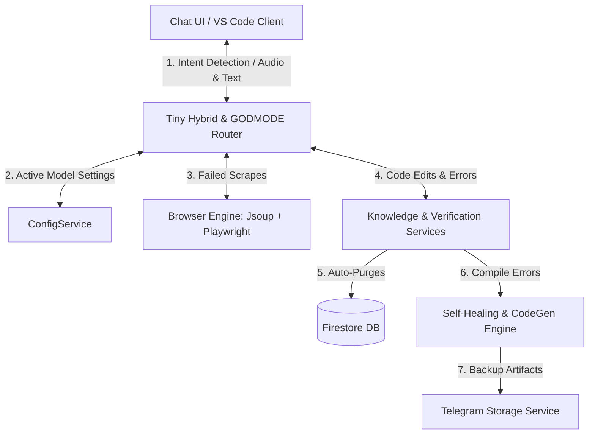

# 🩺 SupremeAI Project Lifeline & Interconnection Chart

This document maps the entire ecosystem of SupremeAI. It details every core feature/option, their documentation level, implementation status, potential merge candidates for optimization, and how they interconnect (communication links) to prevent components from becoming isolated.

---

## 📊 Core Features Registry & Connection Map

| **Feature / Option**          | **Documentation**                              | **Implementation**                              | **Merge/Optimization Suggestions**                                               | **Interconnection & Communication Loops**                                                                                                         |
| :---------------------------- | :--------------------------------------------- | :---------------------------------------------- | :------------------------------------------------------------------------------- | :------------------------------------------------------------------------------------------------------------------------------------------------ |
| **Tiny Hybrid Router**        | 📝 Yes (`system_architecture_v5_bn.md`)        | ✅ Yes                                          | Merge with `ContextualAIRankingService` to dynamically rank local models.        | Receives requests from `ChatWithAI.tsx` -> routes simple/greeting queries directly to the backend -> communicates with local models or edge APIs. |
| **GODMODE 3**                 | 📝 Yes (`system_architecture_v5_bn.md`)        | ⚠️ Partial (UI routing and registry setup only) | Merge with `MultiAIVotingService` to orchestrate parallel voting dynamically.    | Triggered by `IntentClassifier` on critical keywords -> routes with `agentId: 'all'` -> returns consolidated model output.                        |
| **Autonomous Browser Engine** | 📝 Yes (`supremeai_browser_deep_dive.md`)      | ✅ Yes                                          | Combine with `VisionService` to validate UI components visually during scraping. | Activated by `BrowserService` on JS/Bot protection -> launches Playwright -> passes raw HTML context to `ChatProcessingService`.                  |
| **Claude Code CLI**           | 📝 Yes (`SupremeAI_Final_5Model_Structure.md`) | ❌ No (External guidelines only)                | Build a shell execution connector inside `supremeai-vscode-extension`.           | Works as an external assistant locally; doesn't currently communicate with the backend.                                                           |
| **System Learning Purges**    | 📝 Yes                                         | ✅ Yes (`KnowledgeVerificationService`)         | Merge with `EnhancedLearningService` to automate cleanup schedules.              | Periodically checks `system_learning` collection in Firestore -> deletes entries with confidence < threshold.                                     |
| **Self-Healing Engine**       | 📝 Yes                                         | ✅ Yes (`SelfHealingService`)                   | Integrate directly with `CodeValidationService` to auto-repair compile issues.   | Listens for system compile/test failures -> queries AI model -> writes fixed source files.                                                        |
| **Telegram Storage**          | 📝 Yes                                         | ✅ Yes (`TelegramStorageService`)               | Merge with `BackupService` for one-click backups.                                | Interconnects with file upload handlers -> pushes logs/artifacts to Telegram channels.                                                            |
| **Voice Box & TTS**           | 📝 Yes                                         | ✅ Yes (`HybridVoiceService`)                   | Merge with `VoiceboxClientService` to reduce class overhead.                     | Handles requests from `ChatWithAI.tsx` speech button -> returns synthesized bytes or audio URLs.                                                  |

---

## 🧠 Architectural Body (The Interconnections)

---

## 🚀 Key Action Items to Connect Isolated Parts

1. **GODMODE 3 Implementation**: Merge the registry definition in `FeatureRegistryService.java` with the actual parallel execution logic in `MultiAIVotingService` so it does not remain a mock badge.
2. **VS Code Claude Code Bridge**: Create a terminal bridge in the VS Code extension to feed extension diagnostics directly into the Claude Code CLI context.
3. **Scraper Vision loop**: Hook `VisionService` into `BrowserService`'s Playwright output to visually confirm page loads.
