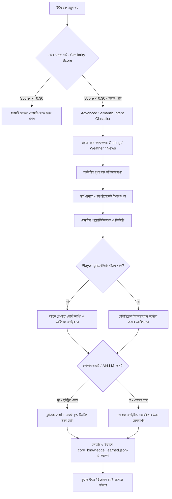

# 🌐 SupremeAI Autonomous Browser Scraping & Deep Learning Engine (বাংলা গাইড)

> **Status:** 🟢 Updated for v5 Architecture

> **[DOCUMENT TYPE: TECHNICAL DEEP DIVE]**  
> **ARCHITECTURE STATUS: 100% OPERATIONAL (SOLO RESILIENT)**  

---

## 📖 ১. ওভারভিউ এবং মূল দর্শন (Overview & Core Philosophy)
প্রথাগত এআই সিস্টেমগুলো যেখানে জেমিনি বা জিপিটি-এর মতো বাহ্যিক এপিআই-এর ওপর সম্পূর্ণ নির্ভরশীল, সেখানে **SupremeAI** সম্পূর্ণ স্বয়ংসম্পূর্ণ এবং স্বাধীনভাবে কাজ করতে পারে। 

যদি কোনো থার্ড-পার্টি সার্ভিস ডাউন থাকে বা সিস্টেমটি সম্পূর্ণ অফলাইন/একক মোডে (Solo Mode) পরিচালিত হয়, তবুও এটি ব্রাউজার অটোমেশনের মাধ্যমে ইন্টারনেটের সাধারণ মানুষের মতো গুগল সার্চ করতে পারে, সঠিক লিংকে প্রবেশ করে তথ্য পড়তে পারে, এবং সংগৃহীত জ্ঞান সরাসরি তার লোকাল কোর নলেজ রেজিস্ট্রি ও ক্যাশ মেমরিতে স্থায়ীভাবে জমা করে নিজেকে প্রতিনিয়ত আরও বুদ্ধিমান (Self-Learning) করে তুলতে পারে।

---

## 🧠 ২. প্রশ্ন বোঝার মেকানিজম (Advanced Semantic Intent Classification)
আমাদের সিস্টেমটি কোনো সাধারণ ব্রাকেট বা সাধারণ কিওয়ার্ড সার্চের মধ্যে সীমাবদ্ধ নয়। এটি ইউজারের প্রশ্নের মূল উদ্দেশ্য, ধরন এবং প্রকৃতি (Semantic Nature) विश्लेषण করতে পারে। 

সিস্টেমটি প্রশ্নের প্যাটার্ন ও ভাষার গড়ন দেখে নিম্নলিখিত ক্যাটাগরিগুলো স্বয়ংক্রিয়ভাবে সনাক্ত করে:
*   **💻 Software & Web Development (Coding):** কোড ব্লক, ডেভেলপমেন্ট ফ্রেমওয়ার্ক বা প্রোগ্রামিং ত্রুটি (যেমন: Java exceptions, stack traces, compiler issues, Node/NPM/Gradle commands)।
*   **🇧🇩 Bangladesh Government & Affairs:** বাংলাদেশ সরকার, মন্ত্রণালয়, ড. মুহাম্মদ ইউনূস বা যেকোনো জাতীয় ও প্রশাসনিক ঘটনা।
*   **🌦️ Weather & Environment:** আবহাওয়া, তাপমাত্রা, জলবায়ু বা বৃষ্টিপাতের লাইভ পূর্বাভাস।
*   **🚀 Tech News & Innovation:** নতুন কোনো গ্যাজেট রিলিজ, চিপসেট লঞ্চ বা জিপিইউ বেঞ্চমার্ক।
*   **📖 General Knowledge & Facts:** ঐতিহাসিক সত্য, মহাজাগতিক বিষয়াবলী বা বৈজ্ঞানিক ব্যখ্যা।

---

## 🛠️ ৩. ব্রাউজার ক্রলিং ও রুট সিলেকশন (Decision Making & Targeted Routing)

ইউজার যখন কোনো সাধারণ বা জটিল প্রশ্ন জিজ্ঞেস করে, ব্যাকএন্ড এক্সপ্রেস রাউটার (`api-router.js`) নিচের ধাপে ধাপে ব্রাউজারকে সক্রিয় করে:

---

## ⚙️ ৪. ব্রাউজার কীভাবে কাজ করে (Step-by-Step Crawling Pipeline)

### ধাপ ১: আনরেস্ট্রিক্টেড গুগল সার্চ (Unrestricted Google Search)
যেহেতু মানুষ প্রতিদিন গুগলে কোটি কোটি অভিনব প্রশ্ন সার্চ করে, তাই আমাদের ব্রাউজার ইঞ্জিন কোনো নির্দিষ্ট সাইটে সীমাবদ্ধ না থেকে সরাসরি গুগল সার্চ রান করে:
`https://www.google.com/search?q={userMessage}`

### ধাপ ২: সেমান্টিক প্রায়োরিটাইজেশন (Semantic Prioritization)
সার্চ রেজাল্টের লিংকগুলোর মধ্যে থেকে ফায়ারবেস ডেটাসেটের বিশ্বস্ত সাইটগুলোকে অগ্রাধিকার দিয়ে তালিকায় প্রথমে রাখে।

### ধাপ ৩: লাইভ স্ক্র্যাপিং ও ডাটা এক্সট্র্যাকশন (Playwright Navigation)
সার্চ রেজাল্টের সেরা ৩টি লিংকে প্রবেশ করে প্লে-রাইট ব্রাউজার সেই সাইটের মূল আর্টিকেল টেক্সট (HTML থেকে অপ্রয়োজনীয় বিজ্ঞাপন, স্ক্রিপ্ট ও হেডার-ফুটার বাদ দিয়ে) নিষ্কাশন করে।

### ধাপ ৪: সোলো এবং হাইব্রিড রিজনিং প্রসেস (Solo vs Hybrid Mode)
*   **হাইব্রিড মোড (Hybrid Synergy):** যদি ব্যাকএন্ডে লোকাল AirLLM বা কোনো এআই সচল থাকে, তবে ব্রাউজারের সংগৃহীত সম্পূর্ণ টেক্সট এআই-কে কনটেক্সট হিসেবে দেওয়া হয়। এআই সেই কনটেক্সট পড়ে একদম নিখুঁত এবং বিশ্বস্ত উত্তর তৈরি করে।
*   **সোলো মোড (Standalone Local Summary):** যদি কোনো এআই সচল না থাকে, তবে আমাদের লোকাল রিডার স্ক্র্যাপ করা সোর্সের সেরা ও গুরুত্বপূর্ণ অনুচ্ছেদগুলো স্বয়ংক্রিয়ভাবে ফিল্টার ও মার্জ করে চমৎকার researched বাংলা উত্তর তৈরি করে।

### ধাপ ৫: স্বয়ংক্রিয় শিখন ও ক্যাashing (Autonomous Self-Learning)
সংগৃহীত ও তৈরি করা নতুন উত্তরটি সরাসরি `/src/main/resources/core_knowledge_learned.json` ফাইলে সংরক্ষণ করা হয়। ফলে ভবিষ্যতে একই প্রশ্ন করা হলে ব্রাউজারকে আর পুনরায় ইন্টারনেটে সার্চ করতে হয় না, সিস্টেম নিজের লোকাল মেমোরি থেকে ১ মিলি-সেকেন্ডে উত্তর দিয়ে দিতে পারে!
