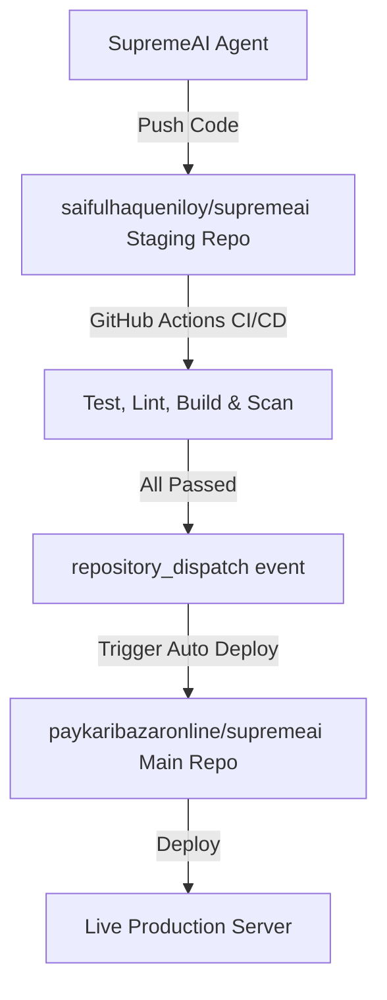

# 🚀 Deployment Overview

This document describes the deployment workflows and infrastructure configurations for SupremeAI 2.0.

---

## 🏭 Staging → Production Pipeline

We utilize a double-repository Staging/Canary Deployment Pattern to isolate automated AI development and prevent untested or buggy code from reaching production.

### 🧪 Staging Repository
- **URL**: https://github.com/saifulhaqueniloy/supremeai
- **Purpose**: All automated AI code commits are pushed here first.
- **Access**: SupremeAI system (write), Admin (read/write)

### 👑 Main / Production Repository
- **URL**: https://github.com/paykaribazaronline/supremeai
- **Purpose**: Production branch containing only verified and validated code.
- **Access**: Admin only (AI agent has no direct push access)

### 🔄 Trigger Sequence
1. AI commits code changes to the Staging Repository.
2. GitHub Actions on Staging runs unit tests, linter checks, build validation, and security audit scans.
3. If all validation runs successfully, a `repository_dispatch` trigger containing the event `staging-passed` is sent to the Main repository.
4. The Main repository pulls verified updates from Staging and automatically deploys them to production.
5. If validation fails, the build halts, the agent is notified to resolve the bugs, and no deployment is made.

---

## ⚡ CI/CD Cache Strategy

আমরা আমাদের ওয়ার্কফ্লোগুলোর রান-টাইম কমাতে এবং ডেপ্লয়মেন্টের গতি বাড়াতে নিচে বর্ণিত মাল্টি-লেয়ার ক্যাশিং স্ট্র্যাটেজি ব্যবহার করি।

### Cache Hierarchy
1. **OS Packages (APT)** → খুব কম পরিবর্তন হয়।
2. **Language Runtimes (Node/Python)** → প্রতি ৩ মাসে বা ত্রৈমাসিক পরিবর্তন হয়।
3. **Dependencies (node_modules/venv)** → প্রতি সপ্তাহে বা নতুন প্যাকেজ অ্যাড করার সময় পরিবর্তন হয়।
4. **Build Artifacts (.next/dist)** → প্রতিদিন পরিবর্তন হয়।
5. **Test Results** → প্রতি কমিটে রান করা টেস্টের ফলাফল ক্যাশ করা হয়।

### Cache Invalidation Rules
- `pnpm-lock.yaml` / `package-lock.json` পরিবর্তন → `node_modules` ক্যাশ বাতিল (invalidate) হবে।
- `poetry.lock` / `requirements.txt` পরিবর্তন → `venv` / `poetry` ক্যাশ বাতিল হবে।
- সোর্স কোড পরিবর্তন → Build ক্যাশ বাতিল হবে।
- টেস্ট ফাইল পরিবর্তন → Test ক্যাশ বাতিল হবে।

### Shared Cache Between Staging & Main
- **Staging repository:** `saifulhaqueniloy/supremeai` (AI এখানে কাজ করে এবং পুশ করে)
- **Main repository:** `paykaribazaronline/supremeai` (প্রোডাকশন ডেপ্লয়মেন্ট এখান থেকে হয়)
- **Cache Sync:** GitHub Actions API ব্যবহার করে প্রতি ৬ ঘণ্টা পর পর স্টেজিংয়ের ক্যাশ মেইন রেপোতে সিঙ্ক করা হয়। এর ফলে মেইন রেপোতে ওয়ার্ম ক্যাশ দিয়ে বিল্ড শুরু হয়।

### 📊 পারফরম্যান্স ও ক্যাশিং বেনিফিট
| ক্যাশ লেয়ার | সময় সাশ্রয় | জটিলতা | বিবরণ |
| :--- | :---: | :---: | :--- |
| `npm ci` / `pnpm install` | ৩০-৫০% | Low | প্রজেক্ট লকফাইল ভিত্তিক স্পিডি ইন্সটলেশন |
| `setup-node` / `setup-python` with cache | ৬০-৭০% | Low | ল্যাঙ্গুয়েজ রানটাইম ও প্যাকেজ ক্যাশ |
| Turborepo Remote Cache | ৮০-৯০% | Medium | মাল্টি-প্যাকেজ বিল্ড অপ্টিমাইজেশন |
| Docker BuildKit Cache | ৭০% | Medium | বিল্ড লেয়ার রিইউজ করা |
| Smart test (Only changed files) | ৫০-৮০% | Medium | শুধু পরিবর্তিত ফাইলের টেস্ট রান |
| Shared cache between repos | ৪০% | High | স্টেজিং থেকে প্রোডাকশনে ক্যাশ শেয়ারিং |
| Parallel jobs (Matrix/Async) | ৫০-৭০% | Low | লিন্ট, টাইপচেক ও টেস্ট একসাথে রান করা |
| Conditional workflow steps | ৩০-৫০% | Low | অপ্রয়োজনীয় স্টেপ এড়ানো |

