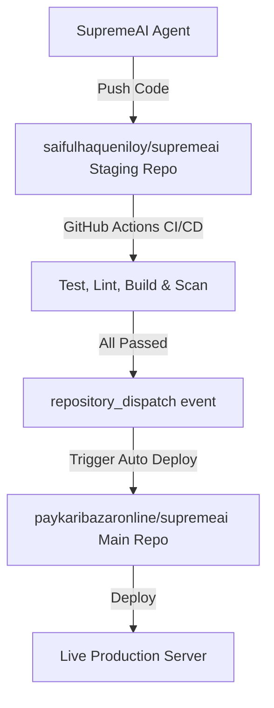

# 🚀 Deployment Overview

This document describes the deployment workflows and infrastructure configurations for SupremeAI 2.0.

---

## 🏭 Staging → Production Pipeline

We utilize a double-repository Staging/Canary Deployment Pattern to isolate automated AI development and prevent untested or buggy code from reaching production.

### 🧪 Staging Repository
- **URL**: https://github.com/saifulhaqueniloy/supremeai
- **Purpose**: All automated AI code commits are pushed here first.
- **Access**: SupremeAI system (write), Admin (read/write)

### 👑 Main / Production Repository
- **URL**: https://github.com/paykaribazaronline/supremeai
- **Purpose**: Production branch containing only verified and validated code.
- **Access**: Admin only (AI agent has no direct push access)

### 🔄 Trigger Sequence
1. AI commits code changes to the Staging Repository.
2. GitHub Actions on Staging runs unit tests, linter checks, build validation, and security audit scans.
3. If all validation runs successfully, a `repository_dispatch` trigger containing the event `staging-passed` is sent to the Main repository.
4. The Main repository pulls verified updates from Staging and automatically deploys them to production.
5. If validation fails, the build halts, the agent is notified to resolve the bugs, and no deployment is made.

---

## ⚡ CI/CD Cache Strategy

We utilize advanced multi-layer caching across workflows to optimize run times and minimize deployment latencies.

### Cache Hierarchy
1. **Language Runtimes:** Caching Node.js (`pnpm`) and Python (`pip`/`poetry`) dependencies.
2. **Turborepo Caching:** Speeding up frontend lint, test, and build cycles using `turbo` pipeline configurations.
3. **Build Artifacts Sync:** 
   - Staging checks cache successful build artifacts (Vite outputs, Python dependencies).
   - Production main pipeline restores these warm staging artifacts to completely skip rebuilding tasks during deployment.

