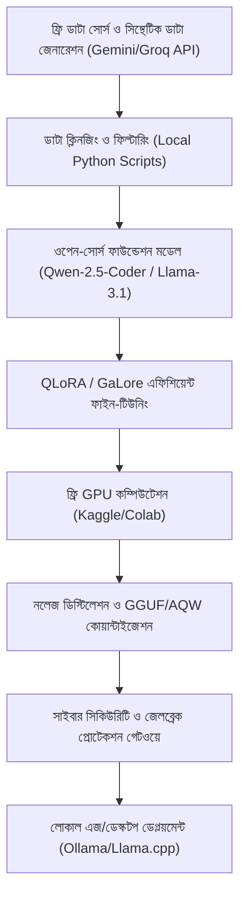

# ওল্ড বাট গোল্ড: সুপ্রিমএআই-এর সর্বোচ্চ মূল্যবান পরিকল্পনা সংকলন

> [!NOTE]
> এই নথিতে `docs/plans/` ও `docs/lastest_plan/` ফোল্ডারে থাকা সমস্ত পরিকল্পনার মধ্যে থেকে সর্বোচ্চ গুরুত্বপূর্ণ ও কার্যকর সব পরিকল্পনাগুলোকে একত্রে বাংলায় সংকলন করা হয়েছে। এগুলোর পাশাপাশি অনুসরণ করলে সুপ্রিমএআই সিস্টেমকে দ্রুত ও দীর্ঘমেয়াদে স্থাপন করা যাবে।

---

## ১. স্বয়ংসম্পূর্ণ ভোটিং ও কনসেনসাস সিস্টেম (Autonomous Voting System)

### মূল লক্ষ্য:
এআই-এর সিদ্ধান্তের নির্ভুলতা বৃদ্ধি প্রায়োগিকভাবে। কোনো অতিরিক্ত খরচ ছাড়াই বিভিন্ন ওপেন সোর্স ও ফ্রি এপিআই মডেলের মধ্যে ভোটিংয়ের মাধ্যমে ভুল উত্তরের হার প্রায় ০% এ নেমে আনা।

### �্রধান বৈশিষ্ট্য:
- **গতিশীল রাউটিং:** সাধারণ কথার জন্য কোনো ভোটিং হবে না। `isComplexConversation(prompt)` মেথড রান করে জটিল কিওয়ার্ড (class, function, db, fix, deploy) চেক করে।
- **ডাবল-পাস রেসিলিয়েন্ট ফ্লো:** একমাত্র এআই মডেল সক্রিয় থাকলে ব্রাউজার প্রথমে ইন্টারনেটের লাইভ সোর্স স্ক্র্যাপ করে, তারপর সেরা সমাধান দিয়ে এআই তাজা উত্তর তৈরি করে।
- **জোড়-বেজোড় টাই-প্রিভেনশন:** জোড় সংখ্যক এআই (যেমন ২, ৪) থাকলে SupremeAI Browser প্যানেলে যুক্ত হয়ে মোট ভোটার সংখ্যা বেজোড় করে দেয়। অজোড় সংখ্যক (যেমন ৩, ৫) হলে ব্রাউজার নিরপেক্ষ থাকে।

### লগিক উদাহরণ:
```java
if (!complex) {
    logger.info("Normal communication detected. Executing Direct Internet Answer Flow without voting.");
    return executeDirectInternetCommunication(prompt, issues, config, startTime, timeoutMs);
}
if (availableCount == 0) {
    return Mono.just(executeSoloFallback(prompt, issues, startTime));
} else if (availableCount == 1) {
    return executeSingleModelResilientFlow(activeModels.get(0), prompt, config, issues, startTime, timeoutMs);
} else {
    return executeMultiModelVotingFlow(prompt, activeModels, config, issues, startTime, timeoutMs);
}
```

---

## ২. বাজেট-বান্ধব বিশ্বমানের এআই মডেল তৈরি (Budget World-Class AI Model)

### মূল লক্ষ্য:
মিলিয়ন ডলার খরচ ছাড়াই ওপেন-সোর্স কমিউনিটি, সিন্থেটিক ডেটা জেনারেশন, প্যারামিটার-এফিকেশন ট্রেইনিং (PEFT) ও ফ্রি ক্লাউড রিসোর্স ব্যবহার করে একটি অত্যন্ত শক্তিশালী ও নিরাপদ AI মডেল তৈরি।

### স্টেপ-বাই-স্টেপ পদ্ধতি:
১. **সিন্থেটিক ডেটা জেনারেশন:** Gemini/Groq API ব্যবহার করে Multi-Agent Pipeline দিযয়ে উচ্চমানের ডেটা তৈরি।
২. **ডিফ-ডুপ্লিকেশন:** MinHash LSH ও Perplexity Filtering দিয়ে ডেটা ক্লিন করা।
৩. **ফাইন-টিউনিং:** QLoRA/GaLore PEFT কনফিগারেশনে ৪-বিট কোয়ান্টাইজেশন করে Kaggle/Colab এ ট্রেইনিং।
৪. **ডেপ্লয়মেন্ট:** Hugging Face Spaces + Llama.cpp দিয়ে জিরো-কস্টে লোকাল ও Edge ডিভাইসে চালানো।

### সম্পূর্ণ আর্কিটেকচার ও পাইপলাইন:


### ভিত্তি মডেল তুলনা ম্যাট্রিক্স:
| মডেল | প্যারামিটার | VRAM প্রয়োজন | সেরা জন্য | প্রধান সুবিধা |
|------|----------|--------------|-----------|--------------|
| Qwen-2.5-7B | 7.2B | ~15GB | বহুভাষিক, কোডিং | বাংলা ভাষায় চমৎকার পারফরম্যান্স |
| Llama-3.1-8B | 8.0B | ~16GB | রিজনিং, এজেন্টিক টাস্ক | ১২৮ক রো যোগ্য কনটেক্সট উইন্ডো |
| DeepSeek-R1 | 8.0B | ~16GB | গাণিতিক সমস্যা, CoT | GPT-4 স্তরের রিজনিং ক্ষমতা |
| Phi-3-Medium | 14B | ~28GB | লজিক্যাল অ্যানালাইসিস | কম আকারে অসাধারণ ক্ষমতা |

### PEFT কনফিগারেশন:
```yaml
model_name_or_path: "Qwen/Qwen2.5-7B-Instruct"
quantization:
  load_in_4bit: true
  bnb_4bit_compute_dtype: "bfloat16"
  bnb_4bit_quant_type: "nf4"
peft:
  r: 16
  lora_alpha: 32
  target_modules: ["q_proj", "k_proj", "v_proj", "o_proj", "gate_proj", "up_proj", "down_proj"]
training_args:
  per_device_train_batch_size: 2
  gradient_accumulation_steps: 8
  optim: "paged_adamw_8bit"
```

### সাইবার সিকিউরিটি হার্ডেনিং:
- **প্রম্পট স্যানিটাইজার:** Jailbreak কীওয়ার্ড ফিল্টার করা
- **ওয়েটস এনক্রিপশন:** AES-256 দিয়ে model.safetensors এনক্রিপ্ট করা
- **DPO অ্যালাইনমেন্ট:** Direct Preference Optimization দিয়ে নিরাপদ আচরণ শিখানো

---

## ৩. ব্রাউজার ওয়েপন মাস্টার প্ল্যান (Browser Weapon Master Plan)

### ৫টি মূল পিলার:

১. **লাইভ রিসার্চ (Live Research):** সাধারণ চ্যাটে কোনো ভোটিং ছাড়াই রিয়েল-টাইম লাইভ তথ্য পরিবেশন। উইকিপিডিয়া, স্ট্যাকওভারফ্লো থেকে স্ক্র্যাপিং।

২. **টাই-ব্রেকার ভোটিং (Tie-Breaker Voting):** জোড় সংখ্যক এআই থাকলে SupremeAI Browser নিজে ভোট দিয়ে নির্ভুল ফল নিশ্চিত করে।

৩. **স্বয়ংসম্পূর্ণ সেলফ-হিলিং (Self-Healing Automation):** ব্রাউজার backend.log মনিটর করে পোর্ট কনফ্লিক্ট ও মেমোরি লিক ডিটেক্ট করলে স্বয়ংক্রিয়ভাবে ফিক্স করে।

৪. **ভিজ্যুয়াল প্রিভিউ (Visual Preview):** ফ্রন্টএন্ড কোড পরিবর্তনের পর স্ক্রিনশট ও অ্যাক্সেসিবিলিটি অ্যানালাইসিস করে এরর ডিটেক্ট করে।

৫. **সিকিউরিটি শিল্ড (Security Shield):** URL পারমিট রুল ও AES-256 এনক্রিপশন দিয়ে ক্ষতিকারক সাইটে নেভিগেশন রোধ।

---

## ৪. স্প্রিন্ট-০: মৌলিক সমস্যার সমাধান (Sprint 0 Critical Fixes)

### গুরুত্বপূর্ণ সমাধানসূচি:

১. **পাসওয়ার্ড লিক ঠিক করা:** `BrowserService.java`-এর `getCredentialContext()` মেথডে decrypted password এর বদলে `[REDACTED]` লগ করতে হবে।

২. **সার্কিট ব্রেকার কুলড়ান:** `application.yml`-এ Resilience4j কনফিগারেশন যোগ করতে হবে:
```yaml
resilience4j.circuitbreaker:
  instances:
    ai-provider:
      failure-rate-threshold: 50
      wait-duration-in-open-state: 300000 # 5 মিনিট
      sliding-window-size: 10
      minimum-number-of-calls: 3
```

৩. **জাজ নির্বাচন ঠিক করা:** `EnhancedMultiAIConsensusService.java`-এর `triggerDebate()`-এর `allProviders.get(0)` এর বদলে `aiRankingService.getTopProvider()` ব্যবহার করতে হবে।

৪. **Docker হেলথচেক:** `docker-compose.yml`-এ healthcheck যোগ:
```yaml
healthcheck:
  test: ["CMD", "curl", "-f", "http://localhost:8080/actuator/health"]
  interval: 30s
  timeout: 10s
```

---

## ৫. ১০০% টেস্ট কভারেজ মাস্টার প্ল্যান (Test Coverage Master Plan)

### টেস্ট কভারেজ লক্ষ্যমাত্রা:

| মডিউল | কভারেজ লক্ষ্য | টুলস |
|------|----------------|------|
| Self Healing & RCA Loop | ১০০% | Mockito, JUnit 5 |
| Consensus Voting Engine | ১০০% | Reactor Test, MockWebServer |
| Security Shield | ১০০% | Mockito, Spring Security Test |
| Dashboard API Controllers | ১০০% | WebTestClient, H2 Database |
| React Dashboard Frontend | ৯৫%+ | Vitest, React Testing Library |

### ১০০% কভারেজের জন্য জ্যাকোকো কনফিগারেশন:
```kotlin
tasks.jacocoTestCoverageVerification {
    violationRules {
        rule {
            limit {
                counter = "LINE"
                value = "COVEREDRATIO"
                minimum = "1.00".toBigDecimal()
            }
        }
    }
}
```

---

## ৬. নিউরাল চ্যাট ১০০% অ্যাক্টিভ প্ল্যান (Neural Chat 100% Active Plan)

### ৪টি ধাপে চ্যাট সিস্টেম উন্নত:

১. **ইন্টেন্ট রাউটার:** `ChatProcessingService.java`-এ `CASUAL_GREETING`, `INTERNAL_QUERY`, `EXTERNAL_QUERY` রুটিং যোগ।

২. **সিমিলার্ডি থ্রেশহুড:** Vector সার্চে ন্যূনতম ০.৭০ সিএকুলার সিমিলার্টি সেট করতে হবে।

৩. **লেভেল-৩ ওয়েব স্ক্র্যাপিং:** `BrowserService` ব্যবহার করে গুগল/ডাকডক্ল থেকে রিয়েল-টাইম স্ক্র্যাপিং ও ক্রস-এআই যাচাই।

৪. **অটো-লার্নিং:** নতুন জ্ঞান স্বয়ংক্রিয়ভাবে `system_learning` কালেকশনে সংরক্ষণ।

---

## ৭. প্রিমিয়াম ড্যাশবোর্ড কোর ফিচার্স (Premium Dashboard Core Features)

### ৬টি প্রিমিয়াম মডিউল:

১. **লাইভ মেট্রিক্স:** ৩D/WebGL কানেক্টিভিটি নেটওয়ার্ক ও ব্ল্যাকআউট ওয়াচডগ।

২. **সাইবার সিকিউরিটি:** Soot Static Analysis, API Token Masking, লাইভ থ্রেট ডিটেকশন।

৩. **কোটা অপ্টিমাইজার:** ডাইনামিক কস্ট-কোটা স্লাইডার ও টোকেন বাজেটিং।

৪. **এজেন্ট রানার:** ড্র্যাগ-এন্ড-ড্রপ ওয়ার্কফ্লো ক্যানভাস ও কনসেনসাস চেকপয়েন্ট।

৫. **সেলফ-হিলিং প্যানেল:** এক-ক্লিক অটো-রিকভারি হাব ও এরর ট্র্যাকার।

৬. **ইভোলিউশন লুপ:** কনফিডেন্স ডিকে স্বয়ংলিঙ্ক সহ নিউরাল কানেক্টিভিটি গ্রাফ।

---

## ১০. কোর মডিউলসমূহ এবং কার্যক্ষমতা (Core Modules & How They Work)

### 🏗️ **সিমুলেটর ইঞ্জিন (Simulator Engine)**
- এটি `SimulatorService` এবং `SimulatorDeploymentService` দ্বারা পরিচালিত হয়।
- ডকার ইমেজ থেকে ডায়নামিক ক্লাউড রান কন্টেইনার তৈরি করতে এটি GCP Admin API v2 ব্যবহার করে।

### 🔧 **সেলফ-হিলিং (Self-Healing)**
- এটি `SelfHealingService` এর মাধ্যমে কাজ করে।
- এটি ব্যাকগ্রাউন্ডে সিস্টেম চেক করে এবং অফলাইন এআই এন্ডপয়েন্টগুলোকে রিকভার করার চেষ্টা করে।
- অজানা এররগুলোকে `GlobalKnowledgeBase`-এ সেভ করে রাখে।

### 🤖 **এআই রাউটিং ও অপটিমাইজেশন (AI Routing & Optimization)**
- এটি `UsageOptimizationService` পরিচালনা করে।
- একই ধরনের রিকোয়েস্টের ক্ষেত্রে এটি ইন-মেমোরি ক্যাশে (Caffeine caches) ব্যবহার করে এবং সবচেয়ে সাশ্রয়ী এআই মডেলকে কুয়েরি পাঠায়।

### 🔐 **সিকিউরিটি ও সিক্রেটস (Security & Secrets)**
- এটি `UnifiedSecretsService` দ্বারা পরিচালিত হয়।
- এটি একটি প্রায়োরিটি স্কেল অনুযায়ী নিরাপদে API কী (Keys) ফেচ করে: GCP Secret Manager -> Firebase -> Environment Variables।

### 🕸️ **অফলাইন নলেজ ও পাইথন সিডিং পাইপলাইন (Offline Knowledge & Seeding Pipeline)**
- SupremeAI এক্সটার্নাল API ফেইল করলে একটি "Zero-AI" অফলাইন মোডে (Thunder Mode) কাজ করতে সক্ষম।
- **অফলাইন ইঞ্জিন (`knowledge_manager.py`**): ইন্টারনেট ছাড়াই `core_knowledge.json` এবং `autonomous_seed_knowledge.json` ব্যবহার করে লোকালি কুয়েরি ইন্টারসেপ্ট করে।
- **সিডিং স্ক্রিপ্টস (Seeding Scripts)**: এই পাইথন স্ক্রিপ্টগুলো ফায়ারস্টোরের `system_learning` এবং `patterns` কালেকশনে পশন ইনজেক্ট করে।

---

## ১১. টেস্টিং, ভেরিফিকেশন ও রিলায়েবিলিটি ইনফ্রাস্ট্রাকচার (Testing Infrastructure)

### 🔄 **রিঅ্যাক্টিভ থ্রেড রিলায়েবিলিটি (Reactive Thread Reliability)**
- কোনো ডেভেলপার যদি ভুলবশত রিঅ্যাক্টিভ ইভেন্ট লুপের মধ্যে সিঙ্ক্রোনাস ব্লকিং (Blocking) কল করে ফেলে, তবে `BlockHoundCustomConfig.java` এর মাধ্যমে CI/CD বিল্ড ফেল হবে।

### 🧪 **এন্ড-টু-এন্ড (E2E) টেস্টিং**
- প্লে-রাইট (Playwright) স্ক্রিপ্টস (`remaining.spec.js`) নিশ্চিত করে যে রিঅ্যাক্ট ড্যাশবোর্ড UI সম্পূর্ণভাবে কার্যকর আছে।

### 🔍 **ইন্টিগ্রেশন ভেরিফিকেশন**
- `verify-stepfun-integration.sh` এর মতো ব্যাশ স্ক্রিপ্টগুলো প্রোভাইডার ইন্টিগ্রেশন, এনভায়রনমেন্ট ভেরিয়েবল, API হেলথ এবং ফ্রন্টএন্ড আপডেটগুলোকে যাচাই করে।

---

## ১২. কোডবেসের প্রভাব বিশ্লেষণ (Impact Analysis)

### কোন কোন ফাইল পরিবর্তন করলে কী প্রভাব পাবে:

| পরিবর্তন করা ফাইল/সিস্টেম | প্রভাবিত অংশ | করতে হবে কিনা |
|----------------------------|----------------|-----------------|
| GCP Cloud Run Region | `SimulatorDeploymentService` | হ্যাঁ (`deployViaAdminApi` আপডেট) |
| নতুন এআই মডেল (যেমন GPT-5) | `UsageOptimizationService`, `ProviderTypeRegistry` | হ্যাঁ (`initModelTiers()` আপডেট) |
| Firestore Schema | Repositories, Python Seed Scripts | হ্যাঁ (`SystemLearning` আপডেট + seed স্ক্রিপ্ট) |
| Self-Healing Quality Rules | `SelfHealingService` (`isCodePerfect`) | সতর্ক হতে হবে (MAX_ITERATIONS টাইমআউট বাড়বে) |
| Firebase DataConnect GraphQL | রিঅ্যাক্ট ফ্রন্টএন্ড | হ্যাঁ (হুকগুলো আপডেট) |
| UnifiedSecretsService | সম্পূর্ণ এআই অরকেস্ট্রেশন | ল্যাটেন্সি প্রভাবিত হবে, GCP বিল বাড়বে |

---

## ১৩. অগ্রাধিকার রোডম্যাপ (Priority Roadmap)

### সর্বোচ্চ গুরুত্বপূর্ণকাম অনুসারে সময় সংক্রান্ত অগ্রাধিকার:

১. **দ্রুত সমাধান (১ সপ্তাহ):** Readiness Assessment + Autonomous Voting System
২. **মাঝারি মেয়াদী (১-২ সপ্তাহ):** Test Coverage + Admin Dashboard Premium UX
৩. **দীর্ঘমেয়াদী (৩-৪ সপ্তাহ):** Budget World-Class AI + Browser Weapon Integration

> [!IMPORTANT]
> **সারসংক্ষেপ:**
> - **Autonomous Voting System** = তাতক্ষণিক নির্ভুলতা ও গুণমান
> - **Budget World-Class AI** = ভবিষ্যৎ স্বাধীনতা ও খরচ কমা
> - **Browser Weapon** = সিস্টেমকে মানুষের মতো কাজ করতে শিখিয়ে দেবে
> - **Test Coverage** = স্থায়িত্ব ও নির্ভরযোগ্যতা নিশ্চিত করবে

---

## ১৪. দীর্ঘমেয়াদী ভিশন বুস্টার (Long-Term Vision Boosters)

### ৯টি বৈপ্লবিক কৌশল (রেডিউন্ড্স টি আইডিয়াস):

১. **ডিসেন্ট্রালাইজড GPU সুপার-ক্লাস্টার:** কোনো ক্লাউড খরচ ছাড়াই ব্যবহারকারীদের অব্যবহৃত GPU শেয়ার করে মডেল ট্রেনিং।

২. **ইনফিনিট কন্টেক্সট গ্রাফ মেমরি:** ভেক্টর ডেটাবেস ও PostgreSQL রিলেশনাল ডেটার সমন্বয়ে সকল জ্ঞান স্মৃতি ধরে রাখা।

৩. **স্বয়ংক্রিয় সেলফ-হিলিং CI/CD:** এরর ডিটেক্ট করে স্বয়ংক্রিয়ভাবে কোড ফিক্স করে গিট পুশ করা।

৪. **এজ-ভিত্তিক মাল্টিমোডাল এআই:** WebGPU + WebAssembly দিয়ে Whisper Tiny ও Segment Anything Tiny লোকাল রান করা।

৫. **স্বয়ংক্রিয় প্রম্পট বিবর্তন (RLAF):** রিয়েল-টাইম ফিডব্যাক লুপ দিয়ে নিজে থেকেই সিস্টেম প্রম্পট অপ্টিমাইজ করা।

৬. **ফেডারেটেড সোয়ার্ম লার্নিং:** একাধিক ডিভাইসে সুপ্রিমএআই এজেন্টগুলো একে অপরের সাথে নিরাপদে জ্ঞান শেয়ার করা।

৭. **ক্রস-মডেল কনসেনসাস ডিস্টিলেশন:** মাল্টি-এআই ভোটিং সিস্টেমের সিদ্ধান্তকে ফাইন-টিউনিংর গোল্ড-স্ট্যান্ডার্ড ডাটাবেসে রূপান্তর করা।

৮. **গ্রিন এআই ও ডাইনামিক স্পার্স অ্যাক্টিভেশন:** Mixture of Experts লজিক দিয়ে ইনপুট জটিলতা অনুযায়ী সক্রিয় প্যারামিটার সংখ্যা নির্ধারণ করা।

৯. **জিরো-ট্রাস্ট ক্রিপ্টোগ্রাফিক প্রুফ-অফ-ডিসিশন:** স্বয়ংক্রিয় সিদ্ধান্ত গ্রহণের প্রতিটি ধাপে ক্রিপ্টোগ্রাফিক সাইনিং বা ZKP যুক্ত করা।

_এই ডকুমেন্টটি সবচেয়ে গুরুত্বপূর্ণ পরিকল্পনাগুলোর মূল্যবান অংশগুলোকে একত্রে সংকলন করেছে। আর্কিভিট র্যাপার্ডি, রফ, মেথডলজি ও অগ্রাধিকার স্মার্টলি ব্যবহার করে বাংলায় উপস্থাপন করা হয়েছে।_