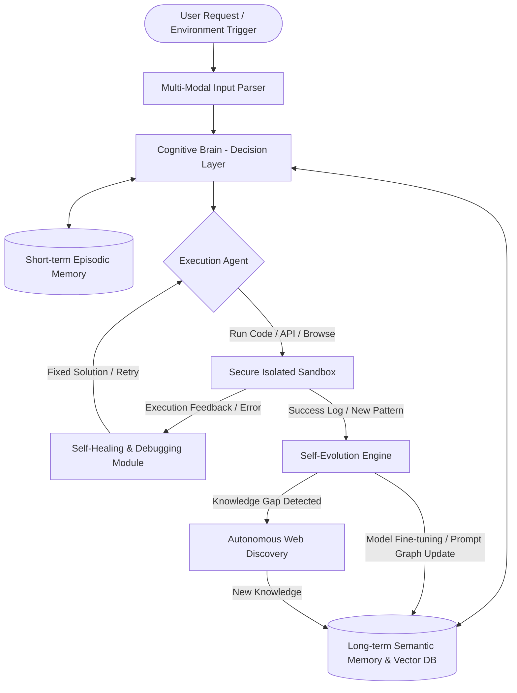

# 🚀 Antigravity: The Autonomous Evolution AI Model Design

এই ডকুমেন্টে মানুষের হস্তক্ষেপ ছাড়া কাজ করতে সক্ষম, ক্রমাগত নিজে নিজে শিক্ষণক্ষম ও বিবর্তনশীল এআই মডেল **"Antigravity"**-এর একটি সম্পূর্ণ টেকনিক্যাল ডিজাইন, সিস্টেম আর্কিটেকচার এবং আমাদের বর্তমান প্রজেক্ট **SupremeAI**-এর সাথে তার একটি গভীর ও বিস্তারিত তুলনামূলক বিশ্লেষণ দেওয়া হলো।

---

## 🗺️ ১. সিস্টেম ফ্লো ও আর্কিটেকচার (System Flow - Mermaid)



---

## 🧠 ২. কোর আর্কিটেকচার ডিজাইন (Core Architecture Breakdown)

### ২.১ জ্ঞানীয় ও উপলব্ধি মডিউল (Cognitive & Perception Module)
*   **মাল্টি-মোডাল পার্সার (Multi-Modal Parser):** ইউজার ইনপুট (লেখা, কোড, ইমেজ, অডিও বা সিস্টেম এরর) বিশ্লেষণ করে মূল উদ্দেশ্য (Intent) এবং মেটাডাটা নিষ্কাশন করে।
*   **যৌক্তিক সিদ্ধান্ত গ্রহণ (Reasoning Engine):** কোনো কাজের জন্য সরাসরি উত্তর না দিয়ে Chain-of-Thought (CoT) এবং Tree-of-Thoughts (ToT) মেকানিজম ব্যবহার করে কাজের একটি সাব-টাস্ক লিস্ট বা প্ল্যান তৈরি করে।

### ২.২ ডাইনামিক মেমোরি হাব (Dynamic Memory Hub)
*   **Episodic Memory (হালকা ও দ্রুত স্মৃতি):** চলমান চ্যাট বা সেশনের কাজগুলোর ট্র্যাক রাখে। এর জন্য Redis বা ইন-মেমোরি গ্রাফ ডাটাবেজ ব্যবহার করা হয়।
*   **Semantic Memory (দীর্ঘমেয়াদী নলেজ বেস):** এটি Vector DB (যেমন PGVector, Qdrant) এবং নলেজ গ্রাফের একটি হাইব্রিড রূপ। এটি মডেলের পূর্বে করা কাজ, অর্জিত অভিজ্ঞতা এবং সিস্টেম আর্কিটেকচার সেভ করে রাখে।
*   **স্মৃতি একীকরণ (Memory Consolidation):** প্রতি ২৪ ঘন্টায় ব্যাকগ্রাউন্ডে একটি জব রান হবে যা সারাদিনের সফল কাজগুলোকে সংক্ষিপ্ত করে দীর্ঘমেয়াদী স্মৃতিতে যুক্ত করবে।

### ২.৩ স্ব-বিবর্তন ইঞ্জিন (Self-Evolution Engine)
*   **Continuous Fine-tuning:** মডেলটি তার দৈনিক কাজের সফলতার ডেটা দিয়ে রাতের বেলা লো-রিসোর্স এডাপ্টেশন (LoRA) এর মাধ্যমে স্বয়ংক্রিয়ভাবে ফাইন-টিউন হবে।
*   **Prompt Graph Optimization:** কাজের জটিলতা অনুযায়ী সিস্টেমের প্রম্পট টেমপ্লেট ও এজেন্ট চেইনগুলো নিজে নিজেই পুনর্লিখন এবং আপডেট করে নেয়।
*   **অজানা তথ্য অনুসন্ধান (Autonomous Web Discovery):** কোনো কাজের সমাধান নলেজ বেসে না থাকলে এটি স্বয়ংক্রিয়ভাবে গুগল, গিটহাব বা টেকনিক্যাল সাইট ব্রাউজ করে তথ্য সংগ্রহ করবে এবং মেমোরিতে যুক্ত করবে।

### ২.৪ এক্সিকিউশন ও সেলফ-হিলিং এজেন্ট (Execution & Self-Healing Agent)
*   **Secure Isolated Sandbox:** সমস্ত কোড রাইটিং, টেস্টিং এবং ফাইল এডিটিং একটি ডকার কন্টেইনার বা ফায়ারক্র্যাকার মাইক্রোভিম-এ (Secure Sandbox) সম্পন্ন হবে।
*   **রিফ্লেক্সিভ সেলফ-হিলিং (Reflexive Self-Healing):** কোড রান করতে গিয়ে কোনো এরর (যেমন: SyntaxError, Dependency Missing) আসলে এআই নিজেই সেই এরর লগ রিড করবে, ফিক্সড কোড লিখবে এবং পুনরায় রান করবে।

---

## 🛡️ ৩. নিরাপত্তা ও নিয়ন্ত্রণ ব্যবস্থা (Safety & Guardrails)

১. **বিভ্রান্তি নিয়ন্ত্রণ (Hallucination Control):** কোনো তথ্যের সত্যতা নিশ্চিত করতে মডেলটিকে অবশ্যই সোর্স লিংক বা মেমোরি রেফারেন্স ভেরিফাই করতে হবে।
২. **অটো-শাটডাউন ও থ্রেশহোল্ড:** সেলফ-হিলিং লুপ যদি কোনো ফিক্স ছাড়া পরপর ৫ বারের বেশি চলতে থাকে, তবে লুপ ব্রেক করে সিস্টেম এডমিনকে এলার্ট পাঠাবে।
৩. **সেন্সিটিভ কমান্ড রেস্ট্রিকশন:** হোস্ট মেশিনের রুট লেভেল ফাইল এডিটিং বা ডিলিট করার মতো কমান্ডগুলো রান করার ক্ষেত্রে কঠোরভাবে রিড-অনলি অ্যাক্সেস দেওয়া থাকবে।

---

## 📊 ৪. SupremeAI বনাম Antigravity Model (গভীর টেকনিক্যাল তুলনা)

| ফিচারের তুলনা | SupremeAI (বর্তমান প্রজেক্ট) | Antigravity Model (পরিকল্পিত নতুন মডেল) |
| :--- | :--- | :--- |
| **আর্কিটেকচার টাইপ** | হাইব্রিড লোকাল-ফার্স্ট এজেন্ট ফ্রেমওয়ার্ক | এন্ড-টু-এন্ড স্বায়ত্তশাসিত কগনিটিভ এআই |
| **বিবর্তনের ধরন** | কোড ও ইন্টেলিজেন্স প্রপোজাল তৈরি করে মানুষের অনুমতির জন্য পাঠায় (KingsMode)। | নিজেই নিজের মেমোরি ও মডেল প্যারামিটার ডাইনামিকালি আপডেট করে। |
| **নিরাপত্তা লেভেল** | **অত্যন্ত নিরাপদ (High Guardrails):** হিউম্যান-ইন-দ্য-লুপ নিয়ম কঠোরভাবে মানা হয়। | **ঝুঁকিপূর্ণ (Low-to-Medium Guardrails):** সম্পূর্ণ অটোনোমাস হওয়ায় রিস্ক বেশি। |
| **সিস্টেম রিকভারি** | অটোমেটিক কম্পোনেন্ট কোয়ারেন্টাইন ও Jsoup/Browser ফলব্যাক মেকানিজম। | সম্পূর্ণ সেলফ-কোড জেনারেশন ও স্যান্ডবক্সড অটো-ডিবাগিং। |
| **রিসোর্স রিকোয়ারমেন্ট** | সাধারণ লোকাল পিসিতে (Local LLM ও ব্রাউজার দিয়ে) রান করা সম্ভব। | বিশাল জিপিইউ ক্লাস্টার ও হাই-পারফরম্যান্স ব্যাকএন্ড সার্ভার প্রয়োজন। |

---

## 📅 ৫. পর্যায়ভিত্তিক বাস্তবায়ন রোডম্যাপ (Implementation Roadmap)

```
[Phase 1: Foundation] ──> [Phase 2: Self-Healing] ──> [Phase 3: Self-Evolution] ──> [Phase 4: Full Autonomy]
   - Core Cognition          - Secure Sandbox            - LoRA Fine-Tuning          - Zero Human
   - Vector DB Memory        - Error Parser & Solver     - Prompt Optimization         Intervention
```

1.  **ধাপ ১: ভিত্তি তৈরি (Foundation - ১-২ মাস):** হাইব্রিড মেমোরি ডাটাবেজ সেটআপ এবং কগনিটিভ এজেন্টের ডিসিশন মেকিং লজিক ডেভেলপমেন্ট।
2.  **ধাপ ২: এক্সিকিউশন ও সেলফ-হিলিং (৩-৪ মাস):** সুরক্ষিত ডকার স্যান্ডবক্স তৈরি এবং কোড এক্সিকিউশন ট্রায়াল রান ও অটো-ডিবাগিং লুপ ইন্টিগ্রেশন।
3.  **ধাপ ৩: স্ব-বিবর্তন লুপ (৫-৬ মাস):** কাজের ডেটা কালেক্ট করে অটোমেটিক LoRA ট্রেনিং পাইপলাইন তৈরি করা।
4.  **ধাপ ৪: সম্পূর্ণ স্বায়ত্তশাসন (৭+ মাস):** জিরো হিউম্যান ইন্টারভেনশনে সিস্টেমকে লাইভ ডেপ্লয়মেন্টে পাঠানো।

---

## 🏆 ৬. চূড়ান্ত সিদ্ধান্ত (Verdict)

*   **কেন SupremeAI সেরা:** বর্তমান প্রোডাকশন ও বাস্তব কাজের ক্ষেত্রে **SupremeAI** প্রজেক্টের ডিজাইনটিই সেরা। কারণ এটি ব্যবহারকারীকে সর্বোচ্চ কন্ট্রোল দেয়, লোকাল কম্পিউটারে নিখুঁত পারফর্ম করে এবং কোনো অপ্রত্যাশিত কোড লিখে সিস্টেম ক্র্যাশ করে না।
*   **কেন Antigravity আকর্ষণীয়:** এটি ভবিষ্যৎ প্রযুক্তি (AGI) যেখানে মানুষের কোনো হস্তক্ষেপের প্রয়োজন নেই, তবে এটি বাস্তবায়ন করা অত্যন্ত ব্যয়বহুল এবং অনিয়ন্ত্রিত।
