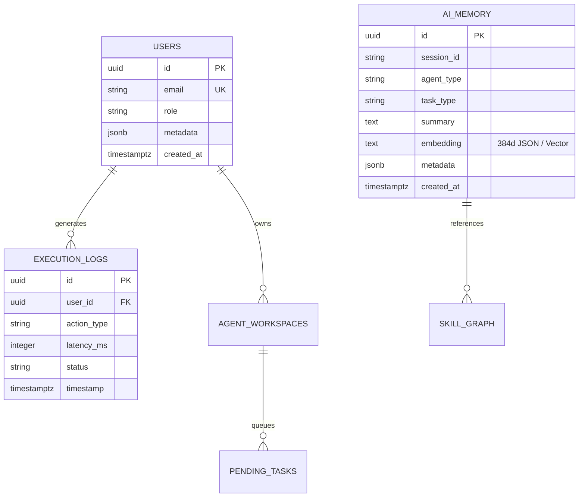

# 💾 SupremeAI API, Database & Storage Specification

**Document Version:** 3.0.0 (Canonical Source of Truth)  
**System Phase:** **Phase 3: Self-Evolving & Multi-Agent Swarm**  
**Classification:** Core API Endpoints, Database Schema & State Contracts

---

## 🎯 1. Core Database Architecture (PostgreSQL + pgvector)

SupremeAI ডাটাবেজ লেয়ারে **PostgreSQL 16+** এবং `pgvector` এক্সটেনশন ব্যবহার করে। একই সাথে হাই-পারফরম্যান্স রিলেশনাল ট্রানজ্যাকশন এবং সিম্যান্টিক ভেক্টর কুয়েরি পরিচালিত হয়।



---

## 🗄️ 2. Core Tables & Indexing Schema

```sql
-- 1. AI Memory Vector Table (pgvector supported)
CREATE TABLE IF NOT EXISTS ai_memory (
    id UUID PRIMARY KEY DEFAULT gen_random_uuid(),
    session_id TEXT,
    agent_type TEXT,
    task_type TEXT,
    summary TEXT,
    embedding TEXT, -- 384-dimensional vector string
    metadata JSONB DEFAULT '{}',
    created_at TIMESTAMPTZ DEFAULT NOW()
);
CREATE INDEX IF NOT EXISTS idx_ai_memory_agent_task ON ai_memory(agent_type, task_type);
CREATE INDEX IF NOT EXISTS idx_ai_memory_metadata_gin ON ai_memory USING GIN(metadata);

-- 2. Pending Tasks Queue Table
CREATE TABLE IF NOT EXISTS pending_tasks (
    id UUID PRIMARY KEY DEFAULT gen_random_uuid(),
    status TEXT NOT NULL DEFAULT 'pending',
    priority INT DEFAULT 0,
    payload JSONB NOT NULL,
    created_at TIMESTAMPTZ DEFAULT NOW()
);
CREATE INDEX IF NOT EXISTS idx_pending_status_time ON pending_tasks(status, created_at);

-- 3. Execution Telemetry Logs (Range Partitioned by Time)
CREATE TABLE IF NOT EXISTS execution_logs (
    id UUID PRIMARY KEY DEFAULT gen_random_uuid(),
    user_id UUID,
    action_type TEXT NOT NULL,
    latency_ms INT,
    status TEXT NOT NULL,
    created_at TIMESTAMPTZ DEFAULT NOW()
);
```

---

## 🌐 3. Core API Endpoint Groups

| Group | Prefix | Key Endpoints | Description |
|---|---|---|---|
| **Auth & Users** | `/api/v1/auth` | `POST /login`, `POST /register`, `GET /me` | JWT auth, session management, RBAC verification. |
| **Agent Swarm** | `/api/v1/agents` | `POST /execute`, `POST /decompose`, `GET /swarm` | Task dispatch to multi-agent swarm, DAG compiler. |
| **Browser Suite** | `/api/browser` | `POST /browse`, `POST /proxy`, `POST /vision-ground` | Live iframe preview, Playwright actions, vision clicks. |
| **Living Engine** | `/api/v1/living` | `POST /reason`, `POST /evolve`, `POST /heal` | 5 reasoning types, genetic skill tuning, auto-healer. |
| **Memory Vector** | `/api/v1/memory` | `POST /query`, `POST /store`, `DELETE /prune` | Semantic vector search across `ai_memory`. |
| **Admin & Health** | `/health`, `/admin-api` | `GET /live`, `GET /ready`, `POST /deploy` | System health score, zero-downtime deploy triggers. |

---

## ⚡ 4. Redis Key Map & TTL Strategy

| Key Pattern | Data Structure | TTL | Purpose |
|---|---|---|---|
| `rate:ip:{ip}` | Integer Counter | 60s | Sliding window rate limiting. |
| `cache:model:{hash}` | JSON String | 3600s | AI prompt response deduplication cache. |
| `stream:events:{channel}` | Stream / PubSub | In-Memory | Real-time SSE / WebSocket event broadcast. |
| `lock:task:{task_id}` | String Flag | 30s | Distributed task execution lock. |

---
*Canonical Master Plan — Supersedes all legacy database and API documentation drafts.*
