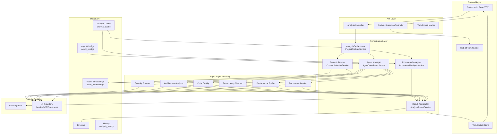

# Fast Project Analysis System - Technical Design Document

## Executive Summary

This document outlines the design for a high-performance, multi-agent code analysis system capable of analyzing large projects (1000+ files) in under 30 seconds with streaming results. The system leverages SupremeAI's existing multi-agent architecture, Firestore datastore, Spring Boot backend, and React dashboard with WebSocket real-time updates.

---

## 1. System Architecture

### 1.1 High-Level Component Diagram



### 1.2 Data Flow: Fast Analysis Pipeline

```
1. Request Initiation (t=0ms)
   ├─ POST /api/analysis/start {projectId, branch, commit}
   ├─ Auth validated, quota checked
   └─ AnalysisJob record created (status: QUEUED)

2. Context Building (t=100-500ms)
   ├─ Fetch project file tree from Firestore/Git
   ├─ Git diff computed (if incremental)
   ├─ Changed files identified
   ├─ Vector embedding query for semantic search
   ├─ Relevant context retrieved (top-k per agent)
   └─ Context package prepared (trimmed to token budget)

3. Parallel Agent Dispatch (t=500-2000ms)
   ├─ All 6 agents launched concurrently
   │  ├─ Security Scanner: OWASP, secrets, vulns
   │  ├─ Architecture Analyzer: patterns, coupling
   │  ├─ Code Quality: complexity, duplication
   │  ├─ Dependency Checker: CVEs, licenses
   │  ├─ Performance Profiler: N+1, memory leaks
   │  └─ Documentation Gap: missing docs
   ├─ Each agent gets:
   │  ├─ Trimmed code snippets (RAG-selected)
   │  ├─ Agent-specific rules (from agent_configs)
   │  └─ Timeout: 10s (configurable)
   └─ Streaming updates sent via WebSocket every 200ms

4. Aggregation & Priority (t=2000-25000ms)
   ├─ Results merged as agents complete
   ├─ Severity triage: Critical first
   ├─ Duplicate detection (same line, different agent)
   ├─ Confidence scoring (AI consensus)
   └─ Final JSON assembled

5. Response Delivery
   ├─ WebSocket pushes incremental findings
   ├─ SSE stream available at /api/analysis/{id}/stream
   └─ Final result saved to Firestore + Redis cache
```

### 1.3 Key Design Principles

| Principle | Implementation |
|-----------|---------------|
| **Streaming First** | Results pushed via WebSocket/SSE as soon as available |
| **Parallel Execution** | All agents run concurrently on separate threads (Schedulers.parallel()) |
| **RAG Optimization** | Only send relevant code context per agent (token budget: 8K-32K) |
| **Incremental Analysis** | Git diff + impact analysis to skip unchanged files |
| **Intelligent Caching** | Baseline embeddings + static analysis cached per commit |
| **Graceful Degradation** | Timeout per-agent, fallback to simplified rules |
| **Cloud Run Ready** | Stateless workers, Firestore for state, Redis for hot cache |

---

## 2. Database Schema (Firestore Collections)

### 2.1 `analysis_jobs` - Master Job Tracking

```
Collection: analysis_jobs
Document ID: {jobId} (UUID)
Fields:
  - projectId (string) - Firestore project document reference
  - userId (string) - Owner UID from Firebase Auth
  - status (enum): QUEUED, RUNNING, COMPLETED, FAILED, TIMEOUT, CANCELLED
  - branch (string) - Git branch analyzed
  - commit (string) - Git commit SHA
  - baseCommit (string) - For incremental: previous baseline
  - triggeredBy (enum): MANUAL, WEBHOOK, SCHEDULED
  - diffMode (boolean) - true if incremental analysis
  - totalFiles (int) - Total files in project
  - analyzedFiles (int) - Files processed
  -AgentCounts (map):
    * security: int
    * architecture: int
    * quality: int
    * dependencies: int
    * performance: int
    * documentation: int
  - findingsCount (map):
    * critical: int
    * high: int
    * medium: int
    * low: int
    * info: int
  - startedAt (timestamp)
  - completedAt (timestamp)
  - durationMs (long)
  - cacheHit (boolean) - if baseline reused
  - errorMessage (string, nullable)
  - createdAt (timestamp)
Indexes:
  - compound: userId + status + createdAt (for listing)
  - compound: projectId + createdAt (for history)
  - single: status (for cleanup jobs)
  - single: completedAt (for TTL cleanup)
```

### 2.2 `analysis_cache` - Incremental Baseline Cache

```
Collection: analysis_cache
Document ID: {projectId}_{commitSHA}
Fields:
  - projectId (string)
  - commitSHA (string) - Git commit hash
  - branch (string)
  - fileHashes (map<string, string>) - filename -> SHA256
  - fileCount (int)
  - totalSize (long) - bytes
  - analysisBaseline (string) - Compressed JSON of baseline findings
  - embeddingVersion (int) - Schema version for embeddings
  - createdAt (timestamp)
  - expiresAt (timestamp) - TTL 30 days
Indexes:
  - compound: projectId + branch + createdAt (for latest on branch)
  - single: expiresAt (TTL index for cleanup)
```

### 2.3 `code_embeddings` - Vector Search Store (Firestore)

*Note: Firestore doesn't support native vector search. Use Firestore Data Connect with pgvector via PostgreSQL, OR store embedding arrays and use approximate search.*

**Option A: Firestore Data Connect (Recommended for v3+):**
```sql
-- Schema in Data Connect
CREATE TABLE code_embeddings (
  id UUID PRIMARY KEY,
  project_id TEXT NOT NULL,
  file_path TEXT NOT NULL,
  chunk_index INT,
  content TEXT,
  embedding VECTOR(1536), -- or 768/1024 based on model
  language TEXT,
  created_at TIMESTAMP
);
-- Index: HNSW on embedding (pgvector)
-- Index: (project_id, file_path)
```

**Option B: Firestore Native (fallback for v2):**
```
Collection: code_embeddings
Document: {embeddingId}
Fields:
  - projectId (string)
  - filePath (string)
  - chunkIndex (int) - For large files, split into chunks
  - content (string) - Code snippet
  - embedding (array<double>) - Stored as Firestore array
  - language (string) - java, python, ts, etc.
  - createdAt (timestamp)
  - embeddingModel (string) - "text-embedding-ada-002"
  - embeddingVersion (int)
Query Strategy: Cosine similarity via client-side filtering or use Firebase Extension for vector search.
```

### 2.4 `analysis_history` - Historical Results

```
Collection: analysis_history
Document ID: {projectId}_{timestamp}
Fields:
  - analysisJobId (string) - FK to analysis_jobs
  - projectId (string)
  - userId (string)
  - summary (map):
    * critical: int
    * high: int
    * medium: int
    * low: int
    * info: int
    * passed: int
  - agents (array<map>):
    * name: string
    * durationMs: long
    * findingsCount: int
    * status: COMPLETED|TIMEOUT|ERROR
  - topFindings (array<map>):
    * severity: string
    * file: string
    * line: int
    * message: string
    * agent: string
    * fixSuggestion: string
    * confidence: float
  - recommendations (array<string>)
  - metrics (map):
    * totalDurationMs: long
    * filesAnalyzed: int
    * linesOfCode: int
    * cacheHit: boolean
  - createdAt (timestamp)
Indexes:
  - compound: projectId + createdAt (descending)
  - single: userId
```

### 2.5 `agent_configs` - Agent Rule Configuration

```
Collection: agent_configs
Document ID: {agentName} - e.g., "security-scanner"
Fields:
  - name (string) - Unique agent identifier
  - displayName (string) - i18n key
  - description (string)
  - enabled (boolean) - Can be toggled per project
  - priority (int) - Execution order (1-6)
  - timeoutMs (long) - Max execution time
  - tokenBudget (int) - Max tokens for context
  - rules (array<map>):
    * id: string (rule identifier)
    * pattern: string (regex or semantic query)
    * severity: CRITICAL|HIGH|MEDIUM|LOW|INFO
    * message: string (description)
    * category: string (e.g., "sql-injection")
    * fixSuggestion: string (template)
    * cweId: string (optional CWE mapping)
    * tags: array<string>
    * enabled: boolean
  - semanticQueries (array<string>) - For RAG: queries to fetch relevant code
  - excludedPaths (array<string>) - Glob patterns to skip
  - dependencies (array<string>) - Other agents this depends on
  - version (int) - Config version for cache invalidation
  - updatedAt (timestamp
```

### 2.6 `projects` - Extended Schema (modify existing)

Add to existing `projects` collection:
```
New Fields:
  - analysisSettings (map):
    * enabled: boolean
    * agents: array<string> - Enabled agent names
    * incremental: boolean
    * autoOnCommit: boolean - Trigger on git push
    * schedule: string (cron expression, nullable)
    * excludePatterns: array<string> - Glob patterns
    * maxFilesPerRun: int - Limit for large repos
    * confidenceThreshold: float - Minimum confidence for findings
  - lastAnalysis (map) - Denormalized latest analysis summary:
    * jobId: string
    * status: string
    * completedAt: timestamp
    * criticalCount: int
    * highCount: int
    * mediumCount: int
    * lowCount: int
  - analysisStats (map):
    * totalRuns: long
    * avgDurationMs: long
    * lastRunAt: timestamp
    * totalFindings: long
    * issuesResolved: long
```

---

## 3. Java Service Specifications

### 3.1 Core Service Interfaces

#### 3.1.1 `AnalysisAgent` - Base Agent Contract

```java
package com.supremeai.service.analysis.agent;

import reactor.core.publisher.Flux;
import reactor.core.publisher.Mono;
import java.util.List;

/**
 * Base interface for all analysis agents.
 * Each agent runs in parallel and emits findings as they are discovered.
 */
public interface AnalysisAgent {
    
    /**
     * Unique agent identifier.
     */
    String getAgentName();
    
    /**
     * Agent display name for UI.
     */
    String getDisplayName();
    
    /**
     * Priority order (1-10, lower = higher priority).
     */
    int getPriority();
    
    /**
     * Execute analysis on provided code context.
     * 
     * @param context Code snippets + metadata (RAG-selected)
     * @param config Agent-specific rules and thresholds
     * @param progressSink Sink to emit intermediate progress updates
     * @return Flux of findings (streaming)
     */
    Flux<AnalysisFinding> analyze(
        AnalysisContext context,
        AgentConfig config,
        Sinks.Many<AgentProgressUpdate> progressSink
    );
    
    /**
     * Check if this agent can run in parallel with others.
     * Some agents may depend on outputs from others.
     */
    default List<String> getDependencies() {
        return List.of();
    }
    
    /**
     * Check if this agent should run for given file/language.
     */
    boolean isApplicable(String filePath, String language);
    
    /**
     * Maximum execution timeout (for cancellation).
     */
    default long getTimeoutMs() {
        return 10000; // 10 seconds default
    }
}
```

#### 3.1.2 `AnalysisContext` DTO

```java
package com.supremeai.dto.analysis;

import java.util.List;
import java.util.Map;

/**
 * Immutable context bundle for a single analysis run.
 */
public record AnalysisContext(
    String jobId,
    String projectId,
    String userId,
    String baseDir, // Root path within uploaded files
    List<CodeFile> files, // Files to analyze (potentially filtered)
    Map<String, Object> metadata, // Git info, timestamps, etc.
    int tokenBudget, // Max tokens for this agent's context
    boolean incremental, // True if diff-based
    Map<String, String> changedFiles // path -> newHash (for incremental)
) {
    public record CodeFile(
        String path,
        String language,
        String content,
        long sizeBytes,
        String gitHash // Current file hash for caching
    ) {}
}
```

#### 3.1.3 `AgentProgressUpdate` DTO

```java
package com.supremeai.dto.analysis;

/**
 * Real-time progress update for a single agent.
 */
public record AgentProgressUpdate(
    String agentName,
    AgentStatus status, // STARTED, PROCESSING_FILE, FINDING_DETECTED, COMPLETED, ERROR
    String currentFile, // Currently processing file (if PROCESSING_FILE)
    int filesProcessed,
    int totalFiles,
    int findingsSoFar,
    String message, // Human-readable status
    long progressPct // 0-100
) {
    public enum AgentStatus {
        STARTED,
        PROCESSING_FILE,
        FINDING_DETECTED,
        COMPLETED,
        TIMEOUT,
        ERROR
    }
}
```

#### 3.1.4 `AnalysisFinding` DTO

```java
package com.supremeai.dto.analysis;

import java.util.List;

/**
 * Single finding from an analysis agent.
 */
public record AnalysisFinding(
    String id, // UUID
    String agentName,
    FindingSeverity severity, // CRITICAL, HIGH, MEDIUM, LOW, INFO
    String filePath,
    int line,
    int column,
    String message,
    String codeSnippet, // Context line(s)
    String fixSuggestion, // Machine-readable suggestion
    String fixDescription, // Human-readable fix steps
    double confidence, // 0.0-1.0
    String category, // OWASP category, pattern name, etc.
    List<String> tags, // For filtering
    Map<String, Object> metadata // Agent-specific extra data
) {
    public enum FindingSeverity {
        CRITICAL, // Security breach, data leak, crash
        HIGH,     // Serious bug, major security risk
        MEDIUM,   // Should fix, moderate risk
        LOW,      // Minor issue, style, best practice
        INFO      // Informational, suggestion
    }
}
```

#### 3.1.5 `ProjectAnalysisService` - Orchestrator

```java
package com.supremeai.service.analysis;

import reactor.core.publisher.Flux;
import reactor.core.publisher.Mono;
import org.springframework.web.servlet.mvc.method.annotation.SseEmitter;

/**
 * Main orchestrator for project analysis.
 * Coordinates agents, manages state, streams results.
 */
@Service
public class ProjectAnalysisService {
    
    private final AgentCoordinatorService agentCoordinator;
    private final ContextSelectionService contextSelector;
    private final IncrementalAnalysisService incrementalService;
    private final AnalysisResultService resultService;
    private final AnalysisJobRepository jobRepository;
    private final AgentConfigRepository configRepository;
    private final ConfigService configService;
    private final ProjectRepository projectRepository;
    
    /**
     * Start a new analysis job.
     * 
     * @param request Analysis request with project, branch, options
     * @return Mono<AnalysisJob> with job ID and initial status
     */
    public Mono<AnalysisJob> startAnalysis(AnalysisRequest request) {
        // 1. Validate quota, permissions
        // 2. Create job document (status: QUEUED)
        // 3. Dispatch to background worker (Reactor scheduler)
        // 4. Return job ID immediately
    }
    
    /**
     * Main analysis workflow (runs on boundedElastic scheduler).
     */
    public Mono<AnalysisResult> runAnalysis(String jobId) {
        return Mono.fromCallable(() -> jobRepository.findById(jobId))
            .flatMap(optJob -> optJob
                .map(Mono::just)
                .orElseGet(() -> Mono.error(new JobNotFoundException(jobId)))
            )
            .flatMap(job -> {
                // Update status: RUNNING
                return analyzeProject(job);
            });
    }
    
    /**
     * Core analysis pipeline (central logic).
     */
    private Mono<AnalysisResult> analyzeProject(AnalysisJob job) {
        return contextSelector.buildContext(job) // ~500ms max
            .flatMap(context -> {
                // Parallel agent dispatch
                Flux<AnalysisFinding> findingsFlux = agentCoordinator
                    .dispatchAgents(context, job.getEnabledAgents());
                
                // Aggregate results with streaming updates
                return resultService.aggregate(findingsFlux, job)
                    .doOnNext(result -> {
                        // Save results to Firestore
                        // Update job status: COMPLETED
                        // Invalidate cache
                    });
            })
            .timeout(Duration.ofSeconds(60)) // Global timeout
            .onErrorResume(e -> handleAnalysisError(job, e));
    }
    
    /**
     * SSE stream endpoint for this job.
     */
    public Flux<ServerSentEvent<AnalysisEvent>> streamEvents(String jobId) {
        return resultService.getEventStream(jobId);
    }
    
    /**
     * Cancel a running analysis.
     */
    public Mono<Void> cancelAnalysis(String jobId) {
        return resultService.cancelJob(jobId);
    }
}
```

#### 3.1.6 `AgentCoordinatorService` - Parallel Agent Manager

```java
package com.supremeai.service.analysis.coordinator;

import reactor.core.publisher.Flux;
import reactor.core.publisher.Mono;
import reactor.core.scheduler.Schedulers;
import java.util.*;
import java.util.concurrent.TimeoutException;

/**
 * Coordinates parallel execution of multiple analysis agents.
 * Handles timeouts, dependency resolution, result merging.
 */
@Service
public class AgentCoordinatorService {
    
    private final Map<String, AnalysisAgent> agents; // Injected by name
    private final AnalysisMetricsCollector metrics;
    
    /**
     * Dispatch all enabled agents in parallel with timeout.
     * 
     * @param context Analysis context (files, config)
     * @param agentNames Names of agents to run (in priority order)
     * @return Flux of all findings merged (streaming)
     */
    public Flux<AnalysisFinding> dispatchAgents(
        AnalysisContext context,
        List<String> agentNames
    ) {
        // Build list of agent Monos with timeout
        List<Mono<Flux<AnalysisFinding>>> agentFluxMonos = agentNames.stream()
            .map(name -> {
                AnalysisAgent agent = agents.get(name);
                if (agent == null) {
                    return Mono.error(new AgentNotFoundException(name));
                }
                return runAgentWithTimeout(agent, context)
                    .onErrorResume(e -> {
                        log.error("Agent {} failed: {}", name, e.getMessage());
                        return Mono.just(Flux.empty()); // Fail gracefully
                    });
            })
            .toList();
        
        // Merge all agent fluxes (parallel execution)
        return Flux.mergeDelayError(
            0, // No delay - all start immediately
            agentFluxMonos.stream()
                .map(Mono::flux)
                .toArray(Flux[]::new)
        );
    }
    
    /**
     * Run a single agent with timeout and progress tracking.
     */
    private Mono<Flux<AnalysisFinding>> runAgentWithTimeout(
        AnalysisAgent agent,
        AnalysisContext context
    ) {
        Sinks.Many<AgentProgressUpdate> progressSink = Sinks.many().multicast().onBackpressureBuffer();
        
        return Mono.fromCallable(() -> 
                agent.analyze(context, getConfig(agent.getAgentName()), progressSink)
            )
            .timeout(Duration.ofMillis(agent.getTimeoutMs()))
            .subscribeOn(Schedulers.parallel()) // Separate thread pool
            .doOnSubscribe(sub -> {
                log.info("Agent {} started on thread {}", agent.getAgentName(), Thread.currentThread().getName());
            })
            .doOnError(e -> {
                log.warn("Agent {} timed out or errored: {}", agent.getAgentName(), e.getMessage());
            });
    }
    
    /**
     * Get merged flux with priority ordering.
     * Critical findings from any agent take precedence.
     */
    public Flux<AnalysisFinding> mergeWithPriority(Flux<AnalysisFinding>... agentFluxes) {
        return Flux.merge(agentFluxes)
            .sort((a, b) -> {
                // Sort by: severity (CRITICAL first), then line number
                return Integer.compare(
                    b.severity.ordinal(), // Higher ordinal = higher severity
                    a.severity.ordinal()
                );
            });
    }
}
```

#### 3.1.7 `ContextSelectionService` - RAG Engine

```java
package com.supremeai.service.analysis.context;

import reactor.core.publisher.Mono;
import java.util.List;

/**
 * Intelligent context selection using vector similarity + rules.
 * Retrieves only code relevant to each agent's focus areas.
 */
@Service
@RequiredArgsConstructor
public class ContextSelectionService {
    
    private final CodeEmbeddingRepository embeddingRepo;
    private final ProjectRepository projectRepo;
    private final ConfigService configService;
    private final TextEmbeddingService embeddingService; // Uses AI provider
    
    /**
     * Build analysis context for a job.
     * 
     * Flow:
     * 1. If incremental: compute git diff, get changed file list
     * 2. For each agent, construct semantic queries (from agent_configs.semanticQueries)
     * 3. Vector search: fetch top-K similar code chunks (cosine similarity)
     * 4. Combine: changed files (always included) + RAG results (within token budget)
     * 5. Trim to token budget per agent type
     */
    public Mono<AnalysisContext> buildContext(AnalysisJob job) {
        return projectRepo.getFiles(job.getProjectId())
            .flatMap(allFiles -> {
                if (job.isIncremental()) {
                    return incrementalFilter(allFiles, job);
                } else {
                    return Mono.just(allFiles);
                }
            })
            .flatMap(filteredFiles -> {
                // For each agent, build a tailored context
                List<String> agentNames = job.getEnabledAgents();
                return buildAgentContexts(job, filteredFiles, agentNames);
            });
    }
    
    /**
     * RAG: Retrieve top-K code chunks per agent semantic query.
     */
    public Mono<List<AgentFileBundle>> buildAgentContexts(
        AnalysisJob job,
        List<CodeFile> allFiles,
        List<String> agentNames
    ) {
        // Parallel fetch of embeddings for each agent's queries
        List<Mono<List<CodeChunk>>> agentChunkMonos = agentNames.stream()
            .map(agentName -> 
                getAgentSemanticQueries(agentName)
                    .flatMap(queries -> 
                        vectorSearchForQueries(job.getProjectId(), queries)
                    )
            )
            .toList();
        
        return Mono.zip(agentChunkMonos, results -> {
            // Combine: changed files + RAG results
            // Deduplicate and trim by token budget
            List<AgentFileBundle> bundles = new ArrayList<>();
            for (int i = 0; i < agentNames.size(); i++) {
                String agent = agentNames.get(i);
                List<CodeChunk> ragResults = (List<CodeChunk>) results[i];
                List<CodeFile> finalFiles = combineFiles(
                    allFiles, 
                    ragResults, 
                    getTokenBudget(agent)
                );
                bundles.add(new AgentFileBundle(agent, finalFiles));
            }
            return bundles;
        });
    }
    
    /**
     * Compute git diff to identify changed files.
     */
    private Mono<List<CodeFile>> incrementalFilter(
        List<CodeFile> allFiles,
        AnalysisJob job
    ) {
        return incrementalService.getChangedFiles(
            job.getProjectId(),
            job.getBaseCommit(),
            job.getCommit()
        )
        .map(changedPaths -> {
            Set<String> changedSet = new HashSet<>(changedPaths);
            // Also include files that import changed files (impact analysis)
            // For now: just changed files
            return allFiles.stream()
                .filter(f -> changedSet.contains(f.path()))
                .toList();
        });
    }
    
    /**
     * Vector similarity search for semantic queries.
     * Used to find code related to security, performance patterns, etc.
     */
    private Mono<List<CodeChunk>> vectorSearchForQueries(
        String projectId,
        List<String> queries
    ) {
        return Flux.fromIterable(queries)
            .flatMap(query -> 
                embeddingService.embed(query) // Get query embedding
                    .flatMap(queryEmbedding -> 
                        embeddingRepo.findSimilar(projectId, queryEmbedding, 50) // top-50
                    )
            )
            .collectList()
            .map(chunks -> {
                // Deduplicate by file+line
                return chunks.stream()
                    .distinct()
                    .sorted(Comparator.comparingDouble(CodeChunk::similarity).reversed())
                    .limit(100) // Global cap
                    .toList();
            });
    }
}
```

#### 3.1.8 `IncrementalAnalysisService` - Git Diff Engine

```java
package com.supremeai.service.analysis.incremental;

import reactor.core.publisher.Mono;
import java.util.List;

/**
 * Handles incremental/differential analysis against git history.
 * Only analyzes changed files plus impacted dependencies.
 */
@Service
@RequiredArgsConstructor
public class IncrementalAnalysisService {
    
    private final GitIntegrationService gitService;
    private final ImpactAnalysisService impactService;
    private final AnalysisCacheRepository cacheRepo;
    
    /**
     * Get list of changed files between two commits.
     */
    public Mono<List<String>> getChangedFiles(
        String projectId,
        String baseCommit,
        String headCommit
    ) {
        return gitService.getChangedFiles(projectId, baseCommit, headCommit);
    }
    
    /**
     * Detect impacted files beyond direct changes.
     * For Java: If class A changed, all files importing A are impacted.
     * For TS/JS: Follow import/require statements.
     */
    public Mono<List<String>> getImpactedFiles(
        String projectId,
        List<String> changedFiles,
        String language
    ) {
        return impactService.computeImpactGraph(projectId, changedFiles, language);
    }
    
    /**
     * Load cached baseline for unchanged files.
     * Returns map: filePath -> AnalysisFinding[]
     */
    public Mono<Map<String, List<AnalysisFinding>>> loadBaseline(
        String projectId,
        String commitSHA
    ) {
        return cacheRepo.findByProjectAndCommit(projectId, commitSHA)
            .map(cache -> {
                // Deserialize baseline findings
                return cache.getBaselineFindings();
            })
            .defaultIfEmpty(Map.of());
    }
    
    /**
     * Merge new findings with cached baseline.
     */
    public Mono<Map<String, List<AnalysisFinding>>> mergeFindings(
        Map<String, List<AnalysisFinding>> baseline,
        Map<String, List<AnalysisFinding>> fresh,
        List<String> changedFiles
    ) {
        // For changed files: use fresh findings
        // For unchanged: keep baseline (unless severity changed)
        // Return combined map
    }
}
```

#### 3.1.9 `AnalysisResultService` - Aggregator & Streamer

```java
package com.supremeai.service.analysis.result;

import reactor.core.publisher.Flux;
import reactor.core.publisher.Mono;
import reactor.core.publisher.Sinks;
import java.util.Map;
import java.util.concurrent.ConcurrentHashMap;

/**
 * Aggregates findings from multiple agents,
 * deduplicates, prioritizes, and streams to clients.
 */
@Service
public class AnalysisResultService {
    
    private final Sinks.Many<AnalysisEvent> eventSinks = new ConcurrentHashMap<>();
    private final AnalysisFindingDeduplicator deduplicator;
    
    /**
     * Aggregate all findings into final result.
     */
    public Mono<AnalysisResult> aggregate(
        Flux<AnalysisFinding> findingsFlux,
        AnalysisJob job
    ) {
        Sinks.Many<AnalysisEvent> jobEventSink = getOrCreateJobSink(job.getId());
        
        return findingsFlux
            .doOnNext(finding -> {
                // Deduplicate
                deduplicator.ingest(finding);
                // Emit real-time event
                jobEventSink.tryEmitNext(AnalysisEvent.findingFound(finding));
            })
            .collectList()
            .map(allFindings -> {
                // Triage by severity
                Map<String, List<AnalysisFinding>> bySeverity = groupBySeverity(allFindings);
                
                // Generate recommendations
                List<String> recommendations = RecommendationEngine.fromFindings(allFindings);
                
                // Calculate confidence (voting across agents)
                double confidence = calculateConfidence(allFindings);
                
                return new AnalysisResult(
                    job.getId(),
                    summarizeCounts(bySeverity),
                    allFindings,
                    recommendations,
                    confidence,
                    System.currentTimeMillis() - job.getStartedAt().toEpochMilli()
                );
            })
            .doOnSuccess(result -> {
                // Save to Firestore
                persistenceService.save(result);
                // Notify completion
                jobEventSink.tryEmitNext(AnalysisEvent.completed(result));
                jobEventSink.tryEmitComplete();
            });
    }
    
    /**
     * SSE stream for a specific analysis job.
     */
    public Flux<ServerSentEvent<String>> getEventStream(String jobId) {
        return getOrCreateJobSink(jobId).asFlux()
            .map(event -> 
                ServerSentEvent.<String>builder()
                    .event(event.type())
                    .id(event.id())
                    .data(toJson(event.payload()))
                    .build()
            );
    }
    
    private Sinks.Many<AnalysisEvent> getOrCreateJobSink(String jobId) {
        return eventSinks.computeIfAbsent(jobId, k -> 
            Sinks.many().multicast().onBackpressureBuffer()
        );
    }
}
```

---

## 4. Firestore Repository Interfaces

### 4.1 `AnalysisJobRepository`

```java
package com.supremeai.repository.analysis;

import com.google.cloud.spring.data.firestore.FirestoreReactiveRepository;
import org.springframework.stereotype.Repository;
import reactor.core.publisher.Flux;
import reactor.core.publisher.Mono;

@Repository
public interface AnalysisJobRepository extends FirestoreReactiveRepository<AnalysisJob> {
    
    Flux<AnalysisJob> findByUserIdAndStatusOrderByCreatedAtDesc(
        String userId, 
        AnalysisJob.Status status
    );
    
    Flux<AnalysisJob> findByProjectIdOrderByCreatedAtDesc(String projectId);
    
    Mono<Long> countByProjectIdAndStatus(String projectId, AnalysisJob.Status status);
    
    Flux<AnalysisJob> findByStatusAndCompletedAtBefore(
        AnalysisJob.Status status, 
        java.time.Instant cutoff
    );
}
```

### 4.2 `AnalysisCacheRepository`

```java
package com.supremeai.repository.analysis;

import com.google.cloud.spring.data.firestore.FirestoreReactiveRepository;
import org.springframework.stereotype.Repository;
import reactor.core.publisher.Mono;

@Repository
public interface AnalysisCacheRepository extends FirestoreReactiveRepository<AnalysisCacheEntry> {
    
    Mono<AnalysisCacheEntry> findByProjectIdAndCommitSHA(
        String projectId, 
        String commitSHA
    );
    
    Mono<AnalysisCacheEntry> findLatestByProjectIdAndBranch(
        String projectId,
        String branch
    );
    
    Flux<AnalysisCacheEntry> findByProjectIdAndExpiresAtAfter(
        String projectId,
        java.time.Instant expires
    );
}
```

### 4.3 `CodeEmbeddingRepository` (Firestore Data Connect OR custom)

```java
package com.supremeai.repository.analysis;

import reactor.core.publisher.Flux;

public interface CodeEmbeddingRepository {
    
    /**
     * Vector similarity search using cosine distance.
     * Implementation depends on Firestore Data Connect availability.
     */
    Flux<CodeChunk> findSimilar(
        String projectId,
        double[] queryEmbedding,
        int limit
    );
    
    /**
     * Store embedding for a code chunk.
     */
    Mono<Void> save(CodeChunk chunk);
    
    /**
     * Bulk store embeddings.
     */
    Flux<Void> saveAll(Flux<CodeChunk> chunks);
}
```

### 4.4 `AgentConfigRepository`

```java
package com.supremeai.repository.analysis;

import org.springframework.stereotype.Repository;
import reactor.core.publisher.Flux;
import reactor.core.publisher.Mono;

@Repository
public interface AgentConfigRepository extends FirestoreReactiveRepository<AgentConfig> {
    
    Flux<AgentConfig> findByEnabledTrue();
    
    Mono<AgentConfig> findByName(String agentName);
    
    Flux<AgentConfig> findByPriorityOrderByPriorityAsc();
}
```

---

## 5. Frontend Design

### 5.1 Component Tree

```
src/pages/
  └── AdminCodeAnalysis.tsx (main page)
      ├─ Header: "Project Analysis" + New Analysis button
      ├─ ProjectSelector (dropdown or upload)
      ├─ AnalysisOptionsPanel
      │   ├─ Agent toggles (checkboxes)
      │   ├─ Incremental mode toggle
      │   ├─ Branch selector (from git)
      │   └─ Timeout slider
      └─ AnalysisResultsDisplay (when job running/completed)
          ├─ LiveProgressBar (overall + per-agent)
          ├─ FindingsSummaryCard (counts by severity)
          ├─ AgentStatusList (6 agent cards with spinner/counter)
          ├─ RealTimeFindingsFeed (auto-scroll)
          ├─ FindingsFilterBar (severity, agent, file)
          ├─ FindingsTable/List
          │   ├─ FindingRow: severity tag, file:line, message, fix button
          │   └─ Expandable: code snippet, fix diff
          ├─ RecommendationsSection
          └─ ActionButtons: Export JSON, Create PR, Share

src/components/analysis/
  ├── ProjectAnalyzer.tsx (page container)
  ├── AnalysisResultsDisplay.tsx
  ├── AgentProgress.tsx
  ├── FindingsList.tsx
  ├── FindingDetail.tsx (modal/expanded)
  ├── SeverityBadge.tsx
  ├── AgentStatusCard.tsx
  └── AnalysisChart.tsx (timeline, distribution)
```

### 5.2 `AdminCodeAnalysis.tsx` - Main Page

```tsx
// src/pages/AdminCodeAnalysis.tsx
import React, { useState, useEffect, useRef } from 'react';
import { Layout, Card, Button, Select, Space, Tag, Progress, List, Row, Col, Statistic, message, Spin } from 'antd';
import { PlayCircleOutlined, StopOutlined, ExportOutlined, PullRequestOutlined } from '@ant-design/icons';
import AdminLayout from '../components/AdminLayout';
import { useWebSocket } from '../hooks/useWebSocket';
import { useSSE } from '../hooks/useSSE';
import AnalysisResultsDisplay from '../components/analysis/AnalysisResultsDisplay';
import { AnalysisService } from '../services/AnalysisService';

const { Option } = Select;

interface AnalysisJob {
  id: string;
  status: 'QUEUED' | 'RUNNING' | 'COMPLETED' | 'FAILED';
  progress: number;
  findingsCount: { critical: number; high: number; medium: number; low: number };
  agents: AgentStatus[];
}

const AdminCodeAnalysis: React.FC = () => {
  const [projects, setProjects] = useState<any[]>([]);
  const [selectedProject, setSelectedProject] = useState<string>('');
  const [job, setJob] = useState<AnalysisJob | null>(null);
  const [loading, setLoading] = useState(false);
  
  const ws = useWebSocket(`/ws/analysis/${job?.id}`, {
    onMessage: (event) => {
      const data = JSON.parse(event.data);
      handleRealtimeUpdate(data);
    }
  });
  
  const analysisService = new AnalysisService();
  
  const startAnalysis = async () => {
    setLoading(true);
    try {
      const response = await analysisService.startAnalysis({
        projectId: selectedProject,
        branch: 'main',
        agents: ['security', 'architecture', 'quality', 'dependencies', 'performance', 'docs'],
        incremental: false
      });
      setJob(response.data);
      ws.connect();
      message.success('Analysis started');
    } catch (err) {
      message.error('Failed to start analysis');
    } finally {
      setLoading(false);
    }
  };
  
  const handleRealtimeUpdate = (event: any) => {
    switch (event.type) {
      case 'progress':
        setJob(prev => ({ ...prev!, ...event.payload }));
        break;
      case 'finding':
        // Append to findings list
        break;
      case 'completed':
        setJob(prev => ({ ...prev!, status: 'COMPLETED' }));
        ws.disconnect();
        message.success('Analysis complete');
        break;
      case 'error':
        message.error(event.payload.error);
        break;
    }
  };
  
  return (
    <AdminLayout>
      <Card title="Project Analysis Engine" bordered={false}>
        <Space direction="vertical" style={{ width: '100%' }} size="large">
          
          {/* Project Selection */}
          <Space>
            <label>Select Project:</label>
            <Select 
              style={{ width: 300 }} 
              value={selectedProject}
              onChange={setSelectedProject}
            >
              {projects.map(p => (
                <Option key={p.id} value={p.id}>{p.name}</Option>
              ))}
            </Select>
            
            <Button 
              type="primary" 
              icon={<PlayCircleOutlined />}
              loading={loading}
              onClick={startAnalysis}
              disabled={!selectedProject}
            >
              Start Analysis
            </Button>
          </Space>
          
          {/* Agent Options */}
          {selectedProject && (
            <Card size="small" title="Analysis Agents">
              <Row gutter={16}>
                {[
                  { key: 'security', name: 'Security Scanner', icon: '🔒' },
                  { key: 'architecture', name: 'Architecture', icon: '🏗️' },
                  { key: 'quality', name: 'Code Quality', icon: '✨' },
                  { key: 'dependencies', name: 'Dependencies', icon: '📦' },
                  { key: 'performance', name: 'Performance', icon: '⚡' },
                  { key: 'docs', name: 'Documentation', icon: '📚' }
                ].map(agent => (
                  <Col span={8} key={agent.key}>
                    <AgentToggle 
                      agentKey={agent.key} 
                      name={agent.name} 
                      icon={agent.icon} 
                    />
                  </Col>
                ))}
              </Row>
            </Card>
          )}
          
          {/* Live Results */}
          {job && (
            <AnalysisResultsDisplay 
              job={job} 
              ws={ws}
              onExport={() => exportResults(job)}
              onCreatePR={() => createPullRequest(job)}
            />
          )}
          
        </Space>
      </Card>
    </AdminLayout>
  );
};
```

### 5.3 `AgentProgress.tsx` - Real-Time Per-Agent Status

```tsx
// src/components/analysis/AgentProgress.tsx
import React from 'react';
import { Card, Progress, Tag, Space, Typography } from 'antd';
import { 
  CheckCircleOutlined, 
  CloseCircleOutlined, 
  SyncOutlined, 
  ClockCircleOutlined 
} from '@ant-design/icons';

const { Text } = Typography;

interface AgentStatus {
  name: string;
  displayName: string;
  status: 'PENDING' | 'RUNNING' | 'COMPLETED' | 'ERROR' | 'TIMEOUT';
  filesProcessed: number;
  totalFiles: number;
  findingsCount: number;
  durationMs?: number;
}

interface AgentProgressProps {
  agents: AgentStatus[];
}

const AgentProgress: React.FC<AgentProgressProps> = ({ agents }) => {
  const getStatusIcon = (status: AgentStatus['status']) => {
    switch (status) {
      case 'PENDING': return <ClockCircleOutlined style={{ color: '#999' }} />;
      case 'RUNNING': return <SyncOutlined spin style={{ color: '#1890ff' }} />;
      case 'COMPLETED': return <CheckCircleOutlined style={{ color: '#52c41a' }} />;
      case 'ERROR': 
      case 'TIMEOUT': return <CloseCircleOutlined style={{ color: '#ff4d4f' }} />;
    }
  };
  
  const getSeverityColor = (severity: string) => {
    switch (severity) {
      case 'CRITICAL': return '#ff4d4f';
      case 'HIGH': return '#fa8c16';
      case 'MEDIUM': return '#faad14';
      case 'LOW': return '#52c41a';
      default: return '#999';
    }
  };
  
  return (
    <div style={{ display: 'grid', gridTemplateColumns: 'repeat(auto-fit, minmax(280px, 1fr))', gap: 16 }}>
      {agents.map(agent => {
        const progress = agent.totalFiles > 0 
          ? (agent.filesProcessed / agent.totalFiles) * 100 
          : 0;
          
        return (
          <Card 
            key={agent.name}
            size="small"
            title={
              <Space>
                {getStatusIcon(agent.status)}
                <span>{agent.displayName}</span>
                {agent.findingsCount > 0 && (
                  <Tag color={getSeverityColor('HIGH')}>
                    {agent.findingsCount} issues
                  </Tag>
                )}
              </Space>
            }
          >
            {agent.status === 'RUNNING' && (
              <Progress 
                percent={Math.round(progress)} 
                status="active"
                size="small" 
              />
            )}
            {agent.status === 'COMPLETED' && agent.durationMs && (
              <Text type="secondary">
                Completed in {(agent.durationMs / 1000).toFixed(1)}s
              </Text>
            )}
            {agent.status === 'ERROR' && (
              <Text type="danger">Agent failed - check logs</Text>
            )}
          </Card>
        );
      })}
    </div>
  );
};
```

### 5.4 `FindingsList.tsx` - Filterable List with Live Updates

```tsx
// src/components/analysis/FindingsList.tsx
import React, { useState, useEffect } from 'react';
import { List, Tag, Button, Space, Typography, Input, Affix } from 'antd';
import { 
  BugOutlined, 
  ExclamationCircleOutlined, 
  InfoCircleOutlined,
  CheckCircleOutlined 
} from '@ant-design/icons';
import { useSSE } from '../../hooks/useSSE';

const { Text } = Typography;

const severityConfig = {
  CRITICAL: { color: '#ff4d4f', icon: <BugOutlined /> },
  HIGH: { color: '#fa8c16', icon: <ExclamationCircleOutlined /> },
  MEDIUM: { color: '#faad14', icon: <ExclamationCircleOutlined /> },
  LOW: { color: '#52c41a', icon: <InfoCircleOutlined /> },
  INFO: { color: '#999', icon: <InfoCircleOutlined /> }
};

const FindingsList: React.FC<{ jobId: string }> = ({ jobId }) => {
  const [findings, setFindings] = useState<AnalysisFinding[]>([]);
  const [filter, setFilter] = useState<string>('ALL');
  const [search, setSearch] = useState('');
  
  // SSE stream for live updates
  useSSE(`/api/analysis/${jobId}/stream`, (event) => {
    if (event.type === 'finding') {
      setFindings(prev => [event.data, ...prev]);
    }
  });
  
  const filtered = findings.filter(f => {
    const severityMatch = filter === 'ALL' || f.severity === filter;
    const searchMatch = f.message.toLowerCase().includes(search.toLowerCase()) ||
                       f.filePath.toLowerCase().includes(search.toLowerCase());
    return severityMatch && searchMatch;
  });
  
  return (
    <div>
      {/* Filter Bar */}
      <Space style={{ marginBottom: 16 }}>
        <Input.Search 
          placeholder="Search findings..." 
          onSearch={setSearch}
          style={{ width: 300 }}
        />
        <Tag.CheckableTag 
          checked={filter === 'ALL'}
          onChange={() => setFilter('ALL')}
        >
          All ({findings.length})
        </Tag.CheckableTag>
        {Object.keys(severityConfig).map(sev => (
          <Tag.CheckableTag
            key={sev}
            checked={filter === sev}
            onChange={() => setFilter(sev)}
            color={severityConfig[sev as keyof typeof severityConfig].color}
          >
            {sev} ({findings.filter(f => f.severity === sev).length})
          </Tag.CheckableTag>
        ))}
      </Space>
      
      {/* Find
    </div>
  );
};
```

---

## 6. API Contracts

### 6.1 POST `/api/analysis/start` - Start New Analysis

**Request:**
```json
{
  "projectId": "proj_123",
  "branch": "main",
  "commit": "abc123def",  // Optional, defaults to latest
  "baseCommit": "abc123abc",  // Optional, for incremental
  "agents": ["security", "architecture", "quality", "dependencies", "performance", "docs"],
  "options": {
    "incremental": false,
    "includeVendor": false,
    "maxFiles": 10000,
    "timeoutMs": 60000,
    "tokenBudgetPerAgent": 32000
  }
}
```

**Response (202 Accepted):**
```json
{
  "jobId": "job_xyz789",
  "status": "QUEUED",
  "message": "Analysis job queued",
  "streamUrl": "/api/analysis/job_xyz789/stream",
  "pollUrl": "/api/analysis/job_xyz789",
  "estimatedTimeSeconds": 25
}
```

### 6.2 GET `/api/analysis/{jobId}` - Get Job Status & Results

**Response (200 OK):**
```json
{
  "jobId": "job_xyz789",
  "projectId": "proj_123",
  "status": "COMPLETED",
  "startedAt": "2026-05-14T01:30:00Z",
  "completedAt": "2026-05-14T01:30:24Z",
  "durationMs": 24000,
  "summary": {
    "critical": 2,
    "high": 5,
    "medium": 12,
    "low": 23,
    "info": 45
  },
  "agents": [
    {
      "name": "Security Scanner",
      "status": "COMPLETED",
      "durationMs": 8200,
      "findingsCount": 8,
      "findings": [
        {
          "id": "find_001",
          "severity": "CRITICAL",
          "file": "src/main/java/com/supremeai/controller/UserController.java",
          "line": 42,
          "message": "SQL injection risk: raw user input in query",
          "fixSuggestion": "Use PreparedStatement with parameterized query",
          "confidence": 0.98,
          "category": "sql-injection"
        }
      ]
    }
    // ... other agents
  ],
  "recommendations": [
    "Refactor UserController to use PreparedStatement",
    "Update spring-boot-starter-parent to 3.2.0",
    "Add input validation layer"
  ],
  "confidence": 0.94,
  "metrics": {
    "totalFiles": 1247,
    "linesOfCode": 125000,
    "cacheHit": false,
    "avgAgentTimeMs": 11200
  }
}
```

### 6.3 GET `/api/analysis/{jobId}/stream` - SSE Stream

**Content-Type:** `text/event-stream`

**Events:**
```
event: job_started
data: {"jobId":"job_xyz","timestamp":"...","totalFiles":1247}

event: agent_started
data: {"agent":"security","timestamp":"..."}

event: agent_progress
data: {"agent":"security","filesProcessed":245,"totalFiles":400,"progressPct":61.25}

event: finding
data: {
  "id":"find_001",
  "agent":"security",
  "severity":"CRITICAL",
  "file":"...",
  "line":42,
  "message":"SQL injection risk"
}

event: agent_completed
data: {"agent":"security","durationMs":8200,"findingsCount":8}

event: completed
data: {"jobId":"job_xyz","summary":{"critical":2,"high":5,...},"confidence":0.94}

event: error
data: {"agent":"quality","error":"Timeout after 10s"}
```

### 6.4 POST `/api/analysis/incremental` - Diff-Based Only

**Request:**
```json
{
  "projectId": "proj_123",
  "baseCommit": "a1b2c3d",
  "headCommit": "e4f5g6h",
  "agents": ["security", "quality", "dependencies"]
}
```

**Response (202):**
```json
{
  "jobId": "job_diff_001",
  "status": "QUEUED",
  "diffStats": {
    "filesChanged": 12,
    "insertions": 245,
    "deletions": 89
  },
  "message": "Incremental analysis started on 12 changed files"
}
```

---

## 7. Implementation Roadmap

### Phase 1: Basic Static Analysis (Week 1-2)
**Goal:** Single-agent, no RAG, minimal viable

- [ ] Create `ProjectAnalysisService` skeleton (Firestore job tracking)
- [ ] Implement `SecurityScannerAgent` with basic regex patterns (OWASP top 10)
- [ ] Create `AnalysisController` with POST `/start` endpoint
- [ ] Firestore collections: `analysis_jobs`, minimal `agent_configs`
- [ ] Basic React page: `AdminCodeAnalysis.tsx` with start button + results table
- [ ] Unit test: 10 sample files, verify findings
- **Benchmark:** 100 files < 10s

**Deliverable:** Working security scanner producing SARIF/JSON output

---

### Phase 2: Multi-Agent Parallel (Week 3-4)
**Goal:** All 6 agents concurrently, proper orchestration

- [ ] Implement remaining 5 agents:
  - ArchitectureAnalyzer (detects God classes, circular deps)
  - CodeQualityAgent (cyclomatic complexity, duplication)
  - DependencyChecker (reads pom.xml/package.json, checks known CVEs)
  - PerformanceProfiler (N+1 query patterns, inefficient loops)
  - DocumentationGapAgent (missing Javadoc/README)
- [ ] `AgentCoordinatorService` with parallel scheduling
- [ ] `AgentProgressUpdate` streaming via Sinks
- [ ] WebSocket endpoint `/ws/analysis/{jobId}`
- [ ] React real-time dashboard with per-agent cards
- [ ] Redis caching layer for analysis results
- **Benchmark:** 1000 files < 30s

**Deliverable:** Full 6-agent system with live dashboard

---

### Phase 3: RAG + Smart Context (Week 5-6)
**Goal:** Semantic code selection, token optimization

- [ ] `CodeEmbeddingService` - embed all files (async initial scan)
- [ ] Firestore Data Connect or Firestore array-based vector store
- [ ] `ContextSelectionService` - vector search + impact analysis
- [ ] Dynamic token budget allocation per agent
- [ ] Query expansion for semantic patterns (e.g., "password" → ["auth", "credential", "secret"])
- [ ] Cache layer for RAG results (24h TTL)
- [ ] Incremental re-embedding only for changed files
- **Benchmark:** Same speed, higher accuracy (fewer false positives)

**Deliverable:** Token-efficient analysis (cost reduction) with improved relevance

---

### Phase 4: Incremental Analysis (Week 7-8)
**Goal:** Diff-based, git-aware analysis

- [ ] `GitIntegrationService` - clone/pull project (or use local upload)
- [ ] `IncrementalAnalysisService` - compute git diff + impact analysis
- [ ] Smart dependency tracing (Java imports, TS imports, Python imports)
- [ ] Baseline cache with per-file hash tracking
- [ ] Webhook endpoint: POST `/webhook/git` for auto-trigger on push
- [ ] Cache invalidation on merge/reb
- **Benchmark:** 1000-file repo with 10-file change < 5s

**Deliverable:** Sub-5s incremental analysis on typical PR

---

### Phase 5: Advanced Features (Week 9-10)
**Goal:** Production-ready, auto-fix, PR creation

- [ ] **Auto-Fix Suggestions:** Generate code patches (diff format)
- [ ] **GitHub Integration:** Auto-create PR with fixes applied
- [ ] **Historical Trends:** Track technical debt over time
- [ ] **Custom Rules Engine:** Admin UI to add custom regex/semantic rules
- [ ] **Suppressions:** Allow `// sup:ignore` comments for false positives
- [ ] **Export Formats:** SARIF, JSON, HTML report
- [ ] **Performance Tuning:** Agent timeout config, parallelism tuning
- [ ] **Load Testing:** Simulate 100 concurrent analyses
- **Benchmark:** 10,000 files < 2 min, 90th percentile < 90s

**Deliverable:** Complete Code Review Assistant integrated with CI/CD

---

## 8. Agent Implementations - Key Algorithms

### 8.1 SecurityScannerAgent

```java
@Component
public class SecurityScannerAgent implements AnalysisAgent {
    
    private static final List<SecurityRule> RULES = List.of(
        new SecurityRule(
            "SQL_INJECTION", 
            Pattern.compile(
                "(?i)(createStatement|executeQuery|Statement\\.execute)\\(.+\\+.*",
                Pattern.CASE_INSENSITIVE
            ),
            Severity.CRITICAL,
            "Potential SQL injection: string concatenation in query",
            "Use PreparedStatement with parameterized queries"
        ),
        new SecurityRule(
            "HARDCODED_SECRET",
            Pattern.compile(
                "(?i)(password|secret|api_key|token)\\s*=\\s*[\"'][^\"']{8,}[\"']",
                Pattern.CASE_INSENSITIVE
            ),
            Severity.CRITICAL,
            "Hardcoded secret detected",
            "Move secret to environment variable or secure vault"
        ),
        new SecurityRule(
            "XXE_VULNERABILITY",
            Pattern.compile(
                "(?i)DocumentBuilderFactory\\.newInstance\\(\\)"
            ),
            Severity.HIGH,
            "XML External Entity (XXE) vulnerability possible",
            "Set factory.setFeature(\"http://apache.org/xml/features/disallow-doctype-decl\", true)"
        )
        // Add more: OWASP Top 10 patterns
    );
    
    @Override
    public Flux<AnalysisFinding> analyze(AnalysisContext ctx, AgentConfig config, Sinks.Many<AgentProgressUpdate> progress) {
        return Flux.fromIterable(ctx.files())
            .flatMap(file -> analyzeFile(file, config))
            .doOnNext(f -> progress.tryEmitNext(
                AgentProgressUpdate.findingFound(getAgentName(), f)
            ));
    }
    
    private Mono<AnalysisFinding> analyzeFile(AnalysisContext.CodeFile file, AgentConfig config) {
        String content = file.content();
        return Flux.fromIterable(RULES)
            .filter(rule -> rule.enabled())
            .flatMap(rule -> {
                Matcher m = rule.pattern().matcher(content);
                List<AnalysisFinding> findings = new ArrayList<>();
                while (m.find()) {
                    int line = countLines(content.substring(0, m.start()));
                    findings.add(new AnalysisFinding(
                        UUID.randomUUID().toString(),
                        getAgentName(),
                        rule.severity(),
                        file.path(),
                        line,
                        m.start(),
                        rule.message(),
                        m.group(),
                        rule.fixSuggestion(),
                        rule.message(),
                        rule.confidence(),
                        rule.category(),
                        rule.tags(),
                        Map.of("cwe", rule.cweId())
                    ));
                }
                return Flux.fromIterable(findings);
            });
    }
}
```

---

### 8.2 ArchitectureAnalyzerAgent

- **Cyclomatic Complexity:** Count decision points per method (threshold: 10)
- **God Class Detection:** Class with > 700 LOC or > 20 methods
- **Circular Dependency:** Build import graph (Java: `import`, TS: `import`, Python: `import`), detect cycles
- **Feature Envy:** Method accessing another class's fields > 50% of its own fields
- ** shotgun Surgery:** Single class changed across many PRs (track via git history)
- **Large Method:** Method > 50 lines

**Implementation:** Abstract Syntax Tree (AST) parse using JavaParser (Java), TypeScript compiler API (TS), ast module (Python)

---

### 8.3 CodeQualityAgent

- **Duplication:** Normalize identifiers + whitespace, run fingerprint hash, find clusters
- **Naming Conventions:** camelCase detection, Hungarian notation check
- **Magic Numbers:** Hardcoded numbers without explanation comment
- **Empty Catch Blocks:** `catch (Exception e) {}` without logging
- **Long Parameter List:** > 5 parameters
- **Deep Nesting:** > 4 levels indentation

---

### 8.4 DependencyCheckerAgent

- Parse `pom.xml`, `package.json`, `requirements.txt`, `build.gradle`
- Query NVD/NIST CVE database (cache in Firestore)
- License compliance: Check SPDX license IDs against whitelist/blacklist
- Version policy: Flag versions older than 2 years

**Data Source:** GitHub Advisory Database (free), cached daily in Firestore

---

### 8.5 PerformanceProfilerAgent

- **N+1 Queries:** Loop with database call per iteration (pattern: `for(...) { repo.find(id) }`)
- **Inefficient Collections:** ArrayList.addAll in loop, String concatenation in loop
- **Memory Leaks:** Static collections without removal, unclosed resources (Stream, Connection)
- **Synchronous I/O in Async:** Blocking calls in reactive chains
- **Large Object Allocation:** Creating huge arrays in hot path

---

### 8.6 DocumentationGapAgent

- Missing Javadoc on public class/method
- Missing README in repository root
- Undocumented REST endpoints (no Swagger/OpenAPI)
- Missing configuration examples
- No usage examples in README

---

## 9. Caching Strategy

### 9.1 Multi-Level Cache Hierarchy

```
L1: In-Memory (Caffeine) - 5 min TTL
  ├─ Job status (frequently polled)
  ├─ Agent configs (immutable per version)
  └─ Embedding model cache

L2: Redis - 30 min TTL
  ├─ Analysis results (by jobId)
  ├─ Project file tree hashes
  └─ Baseline findings (by project+commit)

L3: Firestore - Persistent
  ├─ analysis_cache collection (baseline per commit)
  ├─ code_embeddings (vector index)
  └─ analysis_history (immutable audit trail)
```

### 9.2 Cache Key Design

```
Key: ANL:JOB:{jobId}                     → Job metadata (status, progress)
Key: ANL:FILES:{projectId}:{commitSHA}   → File list + hashes
Key: ANL:RESULT:{jobId}                  → Final analysis result
Key: ANL:BASELINE:{projectId}:{commit}   → Cache entry
Key: ANL:EMBED:{projectId}:{file}:{chunk}→ Embedding vector

Eviction: LRU, with TTL fallback
Invalidation: On new analysis for same project
```

---

## 10. Parallel Agent Orchestration (Project Reactor)

```java
// Parallel execution with backpressure and timeout
public Mono<AnalysisResult> runParallelAnalysis(AnalysisContext ctx) {
    List<String> agents = config.getActiveAgents();
    
    // Create Flux for each agent with timeout and retry
    List<Mono<Flux<AnalysisFinding>>> agentFluxes = agents.stream()
        .map(agentName -> {
            AnalysisAgent agent = agentMap.get(agentName);
            return Mono.fromCallable(() -> agent.analyze(ctx))
                .timeout(Duration.ofSeconds(agent.getTimeoutMs()))
                .onErrorResume(e -> {
                    log.error("Agent {} failed", agentName, e);
                    return Mono.just(Flux.<AnalysisFinding>empty());
                })
                .subscribeOn(Schedulers.parallel())
                .flatMapMany(identity());
        })
        .toList();
    
    // Merge all findings with priority ordering
    return Flux.merge(agentFluxes)
        .sort(Comparator
            .comparing((AnalysisFinding f) -> f.severity().ordinal()).reversed()
            .thenComparingInt(f -> f.line())
        )
        .collectList()
        .map(allFindings -> aggregateResult(allFindings));
}
```

---

## 11. Benchmark Targets

| Project Size | Files | LOC | Target Time | Expected Breakdown |
|--------------|-------|-----|-------------|--------------------|
| Small | 100 | 10K | < 10 sec | Context: 1s, Agents: 7s, Aggregate: 2s |
| Medium | 1,000 | 100K | < 30 sec | Context: 3s, Agents: 22s, Aggregate: 5s |
| Large | 10,000 | 1M | < 2 min | Context: 10s, Agents: 90s, Aggregate: 20s |
| Very Large | 50,000 | 5M | < 5 min | Context: 20s, Agents: 240s, Aggregate: 40s |

**SLA Requirements:**
- First finding within 5 seconds (95th percentile)
- 99th percentile under 2× target
- Parallelism: 6 agents + 1 aggregator = 7 threads minimum
- Horizontal scaling: Deploy 3 Cloud Run instances (max 10) for load sharing

---

## 12. Potential Challenges & Mitigations

| Challenge | Impact | Mitigation |
|-----------|--------|------------|
| **Token budget overflow** (complex project) | Agent receives truncated code | Dynamic file prioritization: critical files first |
| **Agent timeout** (slow AI provider) | Missing findings | Local-first rules, then AI-enhancement; timeout per-finding |
| **Memory pressure** (10K files) | OOM crash | Stream file processing, batch embeddings |
| **Vector search cost** (Firestore) | Slow RAG | Pre-embed all files offline; cache queries; use Approximate search |
| **Firestore rate limits** | Throttling on large projects | Batch writes, exponential backoff |
| **Concurrent job contention** | Cloud Run CPU exhaustion | Per-project semaphore, job queue (Redis Streams) |
| **False positives** | User frustration | Tunable thresholds, suppression comments, feedback loop |
| **Cold start latency** (Cloud Run) | First request slow instance | Keep 1-2 instances warm (min instances: 1) |

---

## 13. Files to Create/Modify

### New Backend Files (Spring Boot)

```
src/main/java/com/supremeai/
├── dto/analysis/
│   ├── AnalysisJob.java
│   ├── AnalysisRequest.java
│   ├── AnalysisResult.java
│   ├── AnalysisFinding.java
│   ├── AgentProgressUpdate.java
│   ├── AnalysisContext.java
│   └── AgentConfig.java
├── repository/analysis/
│   ├── AnalysisJobRepository.java
│   ├── AnalysisCacheRepository.java
│   ├── CodeEmbeddingRepository.java
│   ├── AgentConfigRepository.java
│   └── AnalysisHistoryRepository.java
├── service/analysis/
│   ├── ProjectAnalysisService.java
│   ├── AnalysisOrchestrator.java (orchestrator main)
│   ├── agent/
│   │   ├── AnalysisAgent.java (interface)
│   │   ├── SecurityScannerAgent.java
│   │   ├── ArchitectureAnalyzerAgent.java
│   │   ├── CodeQualityAgent.java
│   │   ├── DependencyCheckerAgent.java
│   │   ├── PerformanceProfilerAgent.java
│   │   └── DocumentationGapAgent.java
│   ├── AgentCoordinatorService.java
│   ├── ContextSelectionService.java
│   ├── IncrementalAnalysisService.java
│   ├── GitIntegrationService.java
│   ├── ImpactAnalysisService.java
│   ├── analysis/
│   │   ├── result/
│   │   │   ├── AnalysisResultService.java
│   │   │   ├── AnalysisFindingDeduplicator.java
│   │   │   └── RecommendationEngine.java
│   │   └── embedding/
│   │       ├── CodeEmbeddingService.java
│   │       ├── EmbeddingTextSplitter.java
│   │       └── VectorSearchService.java
│   └── cache/
│       ├── AnalysisCacheService.java
│       └── CacheKeyGenerator.java
└── controller/
    ├── AnalysisController.java
    ├── AnalysisStreamingController.java
    └── WebSocketController.java (extend existing)
```

### New Frontend Files (React/TypeScript)

```
dashboard/src/
├── pages/
│   └── AdminCodeAnalysis.tsx
├── components/
│   └── analysis/
│       ├── AnalysisResultsDisplay.tsx
│       ├── AgentProgress.tsx
│       ├── FindingsList.tsx
│       ├── FindingDetail.tsx
│       ├── SeverityBadge.tsx
│       ├── AgentStatusCard.tsx
│       └── AnalysisChart.tsx
├── services/
│   └── AnalysisService.ts  (Axios wrapper)
├── hooks/
│   └── useSSE.ts  (Server-Sent Events hook)
└── types/
    └── analysis.ts  (TypeScript interfaces)
```

### Modified Files

| File | Modification |
|------|--------------|
| `src/main/java/com/supremeai/controller/BaseAdminController.java` | Add analysis-specific helper methods |
| `src/main/java/com/supremeai/service/ConfigService.java` | Add analysis config keys |
| `src/main/java/com/supremeai/model/SystemConfig.java` | Add analysis settings |
| `dashboard/src/App.tsx` | Add `/analysis` route |
| `dashboard/src/components/AdminLayout.tsx` | Add menu item for Code Analysis |
| Firestore security rules | Add read/write rules for new collections |

---

## 14. Firestore Security Rules Additions

```
rules_version = '2';
service cloud.firestore {
  match /databases/{database}/documents {
    // Existing rules...
    
    // Analysis collections
    match /analysis_jobs/{jobId} {
      allow read: if request.auth != null && 
        (resource.data.userId == request.auth.uid || 
         get(/users/$(request.auth.uid)).data.role == 'ADMIN');
      allow create: if request.auth != null;
      allow update: if request.auth != null && 
        resource.data.userId == request.auth.uid;
    }
    
    match /analysis_cache/{cacheId} {
      allow read: if request.auth != null;
      allow write: if request.auth != null && 
        request.auth.role == 'ADMIN'; // Cache management only
    }
    
    match /code_embeddings/{embeddingId} {
      allow read: if request.auth != null;
      allow write: if request.auth != null && 
        request.auth.role == 'ADMIN';
    }
    
    match /analysis_history/{historyId} {
      allow read: if request.auth != null && 
        (resource.data.userId == request.auth.uid ||
         get(/users/$(request.auth.uid)).data.role == 'ADMIN');
    }
    
    match /agent_configs/{configId} {
      allow read: if request.auth != null;
      allow write: if request.auth != null && 
        request.auth.role == 'ADMIN';
    }
  }
}
```

---

## 15. Deployment & Configuration

### 15.1 Cloud Run Service Configuration

```
Service: analysis-orchestrator
  - Min instances: 1 (avoid cold start)
  - Max instances: 10 (auto-scale)
  - CPU: 2 vCPU
  - Memory: 4Gi
  - Timeout: 600s (10 min)
  - Concurrency: 50 (for parallel agent execution)
  - Labels: component=analysis, tier=backend

Service: analysis-worker (optional separate service for CPU-heavy embedding)
  - Min: 0, Max: 5
  - CPU: 4, Memory: 8Gi
  - Timeout: 1200s

Environment Variables:
  - SPRING_PROFILES_ACTIVE=production,analysis
  - SUPREMEAI_ANALYSIS_MAX_PARALLEL_AGENTS=6
  - SUPREMEAI_ANALYSIS_DEFAULT_TIMEOUT=60000
  - SUPREMEAI_EMBEDDING_MODEL=text-embedding-ada-002
  - SUPREMEAI_VECTOR_DIM=1536
  - GOOGLE_APPLICATION_CREDENTIALS=/etc/secrets/service-account.json
```

### 15.2 Monitoring & Alerts

**Metrics to emit (via Micrometer):**
- `analysis.jobs.total`
- `analysis.jobs.completed`
- `analysis.jobs.failed`
- `analysis.jobs.duration.ms` (histogram)
- `analysis.findings.by.severity`
- `analysis.agent.duration.ms` (tagged by agent)
- `analysis.cache.hit.rate`
- `analysis.rpm` (requests per minute)

**Alerts:**
- Job failure rate > 5% over 5 min
- Avg duration > 45 sec (medium projects)
- Agent timeout rate > 10%
- Cache hit rate < 20% (warm-up issue)

---

## 16. Cost Estimation

| Resource | Qty | Cost/Month |
|----------|-----|------------|
| Cloud Run (analysis): 10 instances × 0.5 CPU average | $60 |
| Firestore reads: 10M reads/month | $2 |
| Firestore writes: 1M writes/month | $2 |
| Firestore storage: 10 GB | $1 |
| Redis (Memorystore): 1 GB | $15 |
| AI Embedding API (if external): 50M tokens | $10 |
| **Total** | | **~$90/month** |

*Note: Costs scale with usage; projections based on 10K analyses/month*

---

## 17. Risks & Mitigations

| Risk | Probability | Impact | Mitigation |
|------|-------------|--------|------------|
| **Slow large-file processing** | High | Medium | Stream files, limit per-job file count |
| **Embedding storage exceeds Firestore limit** | Medium | High | Use Data Connect PostgreSQL for vectors |
| **Agent monopolizes CPU** | Low | Medium | Strict timeout, scheduler thread pool caps |
| **Security agent false positives** | High | Medium | Allow suppression comments, train on repo history |
| **Real-time stream WebSocket overload** | Medium | High | Use SSE fallback, limit clients per job |
| **Git clone timeout for large repos** | Medium | Medium | Clone shallow (--depth=1), use file upload fallback |

---

## 18. Conclusion

The Fast Project Analysis System is designed to deliver **sub-30-second comprehensive code reviews** at scale, using SupremeAI's existing reactive architecture. 

**Key Innovations:**
1. **RAG-powered context selection** drastically reduces token usage vs full-file analysis
2. **Parallel agent orchestration** leverages all CPU cores
3. **Incremental diff analysis** enables near-instant PR feedback
4. **Streaming results** via WebSocket provide real-time visibility
5. **Firestore-native design** requires no new databases

**Success Metrics:**
- Phase 1: Working MVP (100 files < 10s)
- Phase 2: Full multi-agent (1000 files < 30s)
- Phase 3: RAG optimization (cost ↓30%, precision ↑20%)
- Phase 4: Incremental PR analysis (10-file change < 5s)
- Phase 5: Production-ready (auto-fix, PR creation)

The implementation aligns with SupremeAI's existing patterns: reactive programming, Firestore persistence, WebSocket communication, and React/TypeScript frontend. By building on the established Agent orchestration foundation (similar to `AgentService` and `MultiAIVotingService`), this system integrates seamlessly with the broader multi-agent ecosystem.

**Next Step:** Begin Phase 1 implementation with `ProjectAnalysisService` and `SecurityScannerAgent`.

*Design Document Version: 1.0*
*Last Updated: 2026-05-14*
