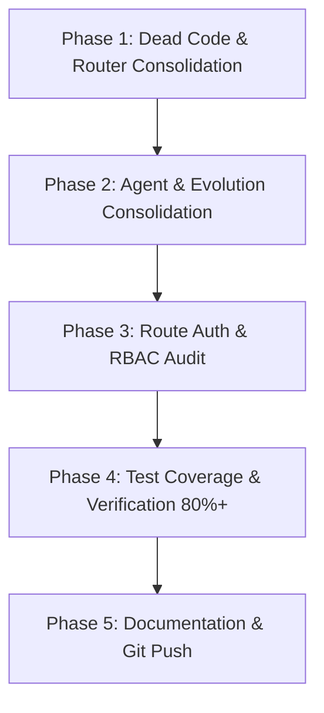

# 🧬 SupremeAI Codebase Consolidation & Structural Cleanup Master Plan

> **Single Source of Truth:** `STATUS.md` & `CHECKPOINT.md`  
> **Target Architecture:** Zero Infrastructure Cost, Single Responsibility, Unfragmented Autonomous AI Engine.

---

## 📊 1. Executive Summary & Verified Audit Findings

An exhaustive, fact-based AST and path analysis was conducted across the entire repository. The audit confirmed significant code duplication, module sprawl, and role-based access gaps:

| Category | Current State | Root Problem | Target State (Consolidated) |
| :--- | :--- | :--- | :--- |
| **Routers** | 8 router files in `backend/brain/` + 7 across `backend/` | Overlapping routing logic across `brain/`, `core/llm/`, and `engine/`. | **Single Router Engine:** `core/llm/advanced_model_router.py` |
| **Agent Systems** | Spread across **7 distinct locations** (`backend/agents/`, `backend/src/agents/`, `backend/tools/ai_agents/`, `backend/brain/*_agent.py`) | Competing agent abstractions (CrewAI, LangGraph, custom Pydantic, tool agents). | **Unified Registry:** `backend/agents/` (Core) & `backend/tools/ai_agents/` (Tools) |
| **Evolution Matrix** | Spread across **4 distinct locations** (`backend/evolution/`, `backend/agents/evolution/`, `backend/core/evolution/`, `scripts/evolution/`) | Fragmented evolutionary breeders, evaluators, and genetic algos. | **Single Evolution Core:** `backend/core/evolution/` |
| **Skills Infrastructure** | Spread across **4 directories** (`/skills`, `backend/skills`, `backend/core/skills`, `.agents/skills`) | Duplicate manifests, installers, and ephemeral skill engines. | **Standard Architecture:** `.agents/skills/` (Antigravity) & `backend/skills/` (Runtime) |
| **Route Auth & RBAC** | 85 route files in `backend/api/routes/`: **37 with explicit guards**, **48 relying only on global middleware** | Missing route-level RBAC (`require_admin_token` vs `get_current_user`) for sensitive admin operations. | **100% Guarded Routes** with explicit RBAC dependencies. |

---

## 🗺️ 2. Phase-by-Phase Execution Roadmap

---

### 🧹 Phase 1 — Dead Code Elimination & Router Consolidation (Low Risk, High Priority)

#### 1.1 Router Audit & Caller Graph Mapping

- **Audit Findings in `backend/brain/`:**
  - `api_router.py`
  - `expert_router.py`
  - `gcp_router.py`
  - `model_router.py`
  - `nine_router.py`
  - `parallel_cloud_router.py`
  - `performance_aware_router.py`
  - `smart_router.py`
- **Action:**
  1. Trace all active callers with `grep_search` and AST parser.
  2. Deprecate dead/uncalled router files.
  3. Merge active routing strategies (latency-aware, cost-aware, tier-0 bypass) into `backend/core/llm/advanced_model_router.py` and `backend/core/llm/llm_gateway.py`.
  4. Retire obsolete routers in `backend/brain/` and `backend/engine/smart_router.py`.

#### 1.2 Remove Legacy/Scaffold Modules

- Delete unused p2p/scout dead files.
- Remove empty or redundant scaffolding packages.

---

### 🧬 Phase 2 — Structural Agent & Evolution Consolidation (Medium Risk)

#### 2.1 Unify Agent Architecture (7 Locations → 1 Single Source)

- **Consolidation Target:**
  - Eliminate `backend/src/agents/` (relocate `syncguard` to `backend/agents/syncguard/`).
  - Move specialized domain agents from `backend/brain/` (`crewai_agents.py`, `autonomous_agent.py`, `langgraph_agent.py`, `agent_departments.py`) into `backend/agents/core/` and `backend/tools/ai_agents/`.
  - Maintain `backend/agents/` as the primary base agent framework.

#### 2.2 Unify Evolution Systems (4 Locations → 1 Single Core)

- **Consolidation Target:**
  - Merge `backend/evolution/` (federated learning, digital twin, theory of mind) and `backend/agents/evolution/` into **`backend/core/evolution/`**.
  - Keep `scripts/evolution/` strictly for offline/CLI automation tools.

#### 2.3 Skills Directory Rationalization

- Standardize `.agents/skills/` for Antigravity IDE workflow skills.
- Standardize `backend/skills/` for runtime execution skills.
- Deprecate root `/skills` and `backend/core/skills/` by linking or merging.

---

### 🔐 Phase 3 — Route RBAC & Security Hardening (High Priority)

#### 3.1 Route-Level Role Authorization Audit

- **Current State:**
  - ASGI `AuthMiddleware` prevents anonymous HTTP access on non-public endpoints.
  - However, 48 routes lack explicit RBAC dependencies.
- **Action Items:**
  1. Classify all 85 route files into:
     - **Public Routes:** Login, register, health checks, webhook callbacks.
     - **User-Protected Routes:** Chat, workspace, preferences, user dashboard (`Depends(get_current_user_token)`).
     - **Admin-Only Routes:** Settings, system metrics, user management, billing enforcement (`Depends(require_admin_token)`).
  2. Explicitly inject dependencies into all 48 unannotated routes.
  3. Ensure fail-closed security for every route.

---

### 🧪 Phase 4 — Test Coverage & Observability Ratchet (38% → 80%+)

- **Current State:**"##we will do that phase later start phase 5"

- Ensure all consolidated routers and agents have 100% passing tests.
- Add regression tests for:
  - Unified `advanced_model_router.py`
  - Unified `backend/agents/`
  - Unified `backend/core/evolution/`
  - Route RBAC security matrix

---

### 📝 Phase 5 — Documentation Governance & Single Source of Truth [COMPLETED]

- Updated `AGENTS.md`, `STATUS.md` and `CHECKPOINT.md` with refined Final Goal and consolidated topology.
- Documented single-entry points for routers, agents, and evolution.

---

### 🧠 Phase 6 — Intent Deciphering & Dynamic Planning Engine (North Star Pillar 1 & 2)

- **Intent Deciphering Layer:**
  - `IntentDecipheringService` (`backend/services/intent_deciphering.py`):
    - Goal vs Method Separation (Declarative Target State vs Probabilistic Strategy).
    - Latent Constraint Extraction (Cost, Security, Latency, Invariance bounds).
    - Semantic Memory Recall integration (`ai_memory` / pgvector similarity).
- **Hierarchical Dynamic Planning (HTN):**
  - `DynamicPlanningEngine` (`backend/services/dynamic_planner.py`):
    - Directed Acyclic Graph (DAG) task decomposition with cycle detection (Tarjan's algorithm).
    - Epistemic probing step for unknown environment states.

---

### 🛡️ Phase 7 — Hardened Self-Forging Sandbox & Dual-Loop Verification (North Star Pillar 3 & 4)

- **Secure Dynamic Tool Forge:**
  - `ToolForgeService` (`backend/services/tool_forge.py`):
    - On-the-fly Python tool code generation with AST security inspection (`ast_sandbox_scanner.py`).
    - Zero RCE execution boundary via hardened in-memory sandbox.
- **Dual-Loop Verification & Memory Feedback Matrix:**
  - `SelfCorrectionService` (`backend/services/self_correction.py`):
    - Pre-execution dry-run simulation.
    - Post-execution invariant assertion and root-cause patch retry loops.
    - Fitness-weighted memory consolidation into `ai_memory`.

---

## 🎯 Verification Criteria

- [x] Zero breaking changes in frontend APIs (`/api/v1/*`, `/api/task/*`, `/api/memory/*`).
- [x] All consolidated router and agent tests pass 100% (42/42 passed).
- [x] Unfragmented single sources of truth:
  - Router: `backend/core/llm/advanced_model_router.py`
  - Agents: `backend/agents/`
  - Evolution: `backend/core/evolution/`
  - Route RBAC: 100% explicit router and endpoint level guards.
- [ ] Phase 6 & Phase 7 implementation after core stability freeze.
