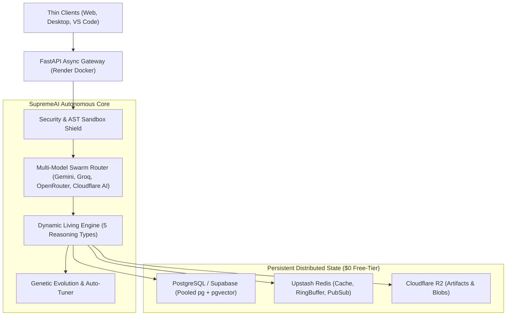

# 🏛️ SupremeAI System Architecture & High-Availability Blueprint

**Document Version:** 3.0.0 (Canonical Source of Truth)  
**System Phase:** **Phase 3: Self-Evolving & Multi-Agent Swarm**  
**Classification:** Core Topology Architecture ($0 Infrastructure Cost)

---

## 🎯 1. Executive Summary & Core Philosophy

SupremeAI হলো একটি **Self-Evolving, Autonomous AI Engineering & Operations Platform**। সিস্টেমটি প্রচলিত জটিল ও ব্যয়বহুল ক্লাউড ইনফ্রাস্ট্রাকচারের ওপর নির্ভর না করে **$0-Cost High-Availability (HA) Cloud Mesh** আর্কিটেকচারে পরিচালিত হয়।

---

## 🏗️ 2. Core Technology Stack Matrix

| Layer | Technology | Deployment / Target | Key Responsibilities |
|---|---|---|---|
| **API & Backend** | FastAPI (Python 3.12, Async SQLAlchemy 2.0) | Render Docker Web Service | High-throughput asynchronous routing, Lifespan background daemons, WebSockets. |
| **Relational & Vector DB** | PostgreSQL 16+ (Supabase / Neon) | PgBouncer Pool (`max=4` sync, `max=15` async) | Core transactional state, user RBAC, persistent `ai_memory` (pgvector 384d). |
| **Distributed Cache & Bus** | Redis (Upstash Serverless) | In-Memory Key-Value & Pub/Sub | Rate limiting, lock management, SSE streaming, real-time metrics ring buffer. |
| **Object & Blob Storage** | Cloudflare R2 / MinIO | S3-Compatible Storage | Artifacts, screenshots, test logs, generated build bundles. |
| **AI Model Fleet** | Multi-Provider Gateway | Zero-Cost Fallback Chain | Gemini 2.0 Flash, Groq Llama 3.3 70B, OpenRouter Swarm, Cloudflare Workers AI. |
| **Frontend UI** | React 19 + Vite 7 + Tailwind 4 | Static Site / CDN | MultiWorkspace canvas, Command Palette, Unified Admin/User Shared Shell. |
| **Thin Clients** | Tauri Desktop & VS Code Extension | Native Client Runtime | 100% thin client — zero API key or third-party brand exposure. |

---

## 🛡️ 3. $0-Cost High Availability (HA) Strategy

1. **Defensive Connection Pooling (PgBouncer):**
   - Synchronous telemetry/memory writes are bounded to a tightly controlled pool (`_MAX_CONN = 4`) to prevent exhausting free-tier database connections.
   - Async request serving utilizes connection recycling with exponential backoff and jitter.
2. **AutoHealer Lifespan Daemon:**
   - ব্যাকগ্রাউন্ডে স্বয়ংক্রিয় স্বাস্থ্য নিরীক্ষণ (`auto_healer_service.py`) লুপ চালু থাকে, যা কানেকশন ড্রপ বা মেমোরি স্পাইক হলে তাৎক্ষণিক সেলফ-হিলিং ট্রিগার করে।
3. **Provider-Agnostic AI Fallback Chain:**
   - কোনো একটি AI প্রোভাইডারে রেট-লিমিট বা কোটা শেষ হলে স্বয়ংক্রিয়ভাবে পরবর্তী ফ্রি মডেল চেইনে ট্রাফিক ডাইভার্ট হয় (Groq -> Gemini -> OpenRouter -> Cloudflare AI)।

---

## 📊 4. Data Flow & Execution Lifecycle

1. **User Request Intake:** ইনকামিং রিকোয়েস্ট JWT/RBAC গার্ড হয়ে এপিআই গেটওয়েতে পৌঁছায়।
2. **Context Retrieval:** `CascadeMemoryService` পূর্ববর্তী কাজের প্রাসঙ্গিক স্মৃতি (`ai_memory`) কুয়েরি করে।
3. **Task Decomposition:** Master Cognitive Orchestrator টাস্কটিকে একটি Directed Acyclic Graph (DAG) পাইপলাইনে বিভক্ত করে।
4. **Swarm Execution:** একাধিক বিশেষায়িত এজেন্ট (Dev, Business, UX, Red Team) সমান্তরালে এক্সিকিউট করে।
5. **Memory Consolidation:** সফল কাজের শিক্ষা ও ভেক্টর সরাসরি ডাটাবেজে সংরক্ষণ করা হয়।

---
*Canonical Master Plan — Supersedes all legacy architecture overview drafts.*
