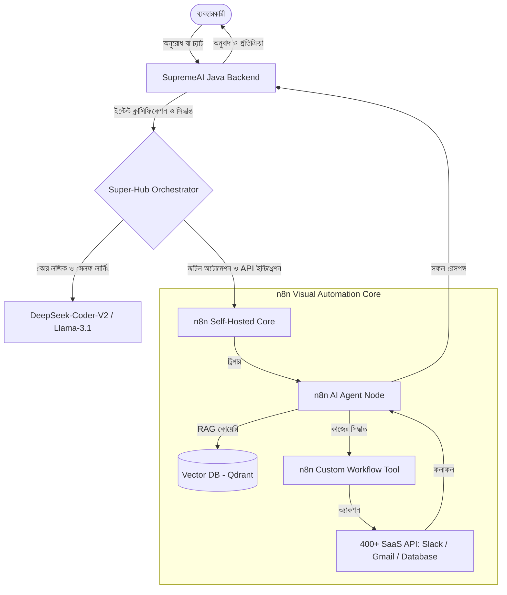

# SupremeAI + n8n Integration Analysis: The Visual AI Automation Core

> [!NOTE]
> এই ডকুমেন্টটি SupremeAI-এর **Super-Hub Ecosystem**-এর অংশ হিসেবে **n8n (Self-Hosted Workflow Automation)** প্রযুক্তির গভীর বিশ্লেষণ, এর প্রয়োজনীয়তা এবং অন্যান্য বিকল্পের (Flowise, Langflow, Activepieces, Node-RED) সাথে তুলনামূলক মূল্যায়ন প্রদান করে।

---

## ১. ভূমিকা (Introduction)

SupremeAI বর্তমানে একটি সাধারণ AI প্ল্যাটফর্ম থেকে ৬০০+ ভিন্ন ভিন্ন কাজের ক্ষমতা সম্পন্ন একটি শক্তিশালী **Super-Hub Ecosystem**-এ রূপান্তরিত হচ্ছে। এই বিশাল ইকোসিস্টেমের সবচেয়ে বড় চ্যালেঞ্জ হলো বিভিন্ন থার্ড-পার্টি সার্ভিস (যেমন: Slack, Gmail, Salesforce, Jira, database, ইত্যাদি) এবং কাস্টম স্ক্রিপ্টগুলোর সাথে নির্বিঘ্ন এবং দ্রুত সংযোগ স্থাপন করা। 

প্রতিটি সার্ভিসের জন্য কাস্টম জাভা বা পাইথন কোড লেখা অত্যন্ত সময়সাপেক্ষ এবং রক্ষণাবেক্ষণ করা কঠিন। এখানেই প্রয়োজন একটি **Visual Workflow & AI Automation Core**। **n8n** এই সমস্যার সবচেয়ে আধুনিক এবং শক্তিশালী সমাধান। 

---

## ২. n8n কী এবং কেন এটি অনন্য? (What is n8n & Why is it Unique?)

**n8n** হলো একটি ফেয়ার-কোড (Fair-Code) লাইসেন্সযুক্ত, সেলফ-হোস্টেড ভিজ্যুয়াল ওয়ার্কফ্লো অটোমেশন টুল। এর অনন্য বৈশিষ্ট্য হলো এটি সাধারণ API অটোমেশন প্ল্যাটফর্মের (যেমন: Zapier, Make) মতোই সহজ, কিন্তু এটি ডেভেলপারের জন্য সীমাহীন কাস্টমাইজেশন সুবিধা দেয়।

সবচেয়ে গুরুত্বপূর্ণ বিষয় হলো, n8n-এ রয়েছে **Advanced AI Nodes (LangChain integration)**। এর মাধ্যমে কোনো কোড না লিখেই ভিজ্যুয়াল ইন্টারফেসে অত্যন্ত শক্তিশালী AI Agents, Chains, Vector Databases, Memory এবং Document Loaders যুক্ত করা যায়।

---

## ৩. বিকল্পসমূহের সাথে তুলনামূলক বিশ্লেষণ (Comparative Analysis with Alternatives)

আমরা SupremeAI ইকোসিস্টেমের জন্য সেরা প্রযুক্তি নির্বাচন করতে ৫টি শীর্ষস্থানীয় প্ল্যাটফর্ম বিশ্লেষণ করেছি:

| বৈশিষ্ট্য / প্ল্যাটফর্ম | **n8n** | **Flowise** | **Langflow** | **Activepieces** | **Node-RED** |
| :--- | :--- | :--- | :--- | :--- | :--- |
| **মূল ফোকাস** | এন্টারপ্রাইজ অটোমেশন ও এআই ওয়ার্কফ্লো | দ্রুত চ্যাটবট ও RAG ডেপ্লয়মেন্ট | এআই মডেল টিউনিং ও পাইথন লজিক | সাধারণ SaaS অটোমেশন (Zapier অল্টারনেটিভ) | IoT ও ইভেন্ট-ড্রিভেন ফ্লো |
| **এআই সক্ষমতা** | **অত্যন্ত উন্নত:** নেটিভ LangChain নোডস (Agents, Memory, Tools) | **উন্নত:** ভিজ্যুয়াল LangChain চেইন ও এজেন্ট | **অত্যন্ত উন্নত:** পাইথন-ভিত্তিক জটিল এআই লজিক ও RAG | **বেসিক:** সাধারণ API কানেক্টর (যেমন: OpenAI) | **সীমিত:** কাস্টম কোড বা থার্ড-পার্টি প্লাগইন প্রয়োজন |
| **SaaS ইন্টিগ্রেশন** | **বিশাল (৪০০+):** Slack, Jira, Gmail নেটিভ নোড | **সীমিত:** শুধুমাত্র ডেটা সোর্স ও এআই টুলস | **সীমিত:** লজিক ও এআই ওরিয়েন্টেড | **মাঝারি:** কিছু বেসিক SaaS কানেক্টর | **মাঝারি:** নোড প্যাকেজ লাইব্রেরি দ্বারা কাস্টমাইজড |
| **কাস্টম কোডিং** | JavaScript/TypeScript (নেটিভ) | অত্যন্ত সীমিত (কাস্টম টুলস) | Python (নেটিভ ও অত্যন্ত নমনীয়) | TypeScript (সীমিত) | JavaScript (নেটিভ) |
| **স্কেলিং ও প্রোডাকশন** | **অত্যন্ত শক্তিশালী:** Queue mode, Docker, Redis সাপোর্ট | মাঝারি | মাঝারি | মাঝারি | অত্যন্ত শক্তিশালী (IoT এবং লাইটওয়েট রানটাইম) |
| **লাইসেন্স ও হোস্টিং** | সেলফ-হোস্টেড (ফ্রি/ফেয়ার-কোড) | ওপেন সোর্স (MIT) | ওপেন সোর্স (MIT) | ওপেন সোর্স (MIT) | ওপেন সোর্স (OpenJS Foundation) |

---

### ৩.১ Flowise বনাম n8n
* **Flowise-এর সুবিধা:** চ্যাট উইজেট এবং বেসিক RAG (Retrieval-Augmented Generation) খুব দ্রুত তৈরি করা যায়।
* **কেন n8n সেরা:** Flowise-এ এআই লজিক ডিজাইন করা সহজ হলেও ব্যাকএন্ড প্রসেস বা সিস্টেম অটোমেশন (যেমন: ডাটাবেস সিংক্রোনাইজেশন, কাস্টম এপিআই ট্রিগার) অত্যন্ত সীমিত। n8n-এ আমরা এআই এবং প্রথাগত বিজনেস লজিক দুটোই একসাথে ভিজ্যুয়ালি হ্যান্ডেল করতে পারি।

### ৩.২ Langflow বনাম n8n
* **Langflow-এর সুবিধা:** পাইথন-ভিত্তিক হওয়ায় ডাটা সায়েন্টিস্ট ও এআই গবেষকদের জন্য এটি অত্যন্ত চমৎকার। প্রম্পট টিউনিং ও এজেন্ট মেমরি সূক্ষ্মভাবে নিয়ন্ত্রণ করা যায়।
* **কেন n8n সেরা:** Langflow মূলত এআই মডেল এক্সপেরিমেন্টেশনের জন্য ভালো, কিন্তু প্রোডাকশন-গ্রেড সিডিউলিং, ওয়েবহুক ট্রিগার, ডাটা ট্রান্সফরমেশন এবং থার্ড-পার্টি কানেক্টিভিটিতে n8n বহুগুণ এগিয়ে।

### ৩.৩ Activepieces বনাম n8n
* **Activepieces-এর সুবিধা:** খুবই সিম্পল ইন্টারফেস, লাইটওয়েট।
* **কেন n8n সেরা:** Activepieces-এ কোনো "Advanced AI" বা "LangChain" নোড নেই। এটি শুধুমাত্র এক এপিআই থেকে অন্য এপিআইতে ডাটা ট্রান্সফার করতে পারে। কিন্তু SupremeAI-এর জন্য প্রয়োজন বুদ্ধিমত্তাসম্পন্ন এজেন্টিক ওয়ার্কফ্লো, যা n8n ছাড়া সম্ভব নয়।

### ৩.৪ Node-RED বনাম n8n
* **Node-RED-এর সুবিধা:** IoT প্রজেক্ট এবং হার্ডওয়্যার ইন্টিগ্রেশনের জন্য অতুলনীয়।
* **কেন n8n সেরা:** Node-RED-এ এআই নোড নেই বললেই চলে। যেকোনো এআই প্রজেক্টের জন্য জাভাস্ক্রিপ্ট কোড লিখে জটিল চেইন তৈরি করতে হয়, যা কোডের বোঝা বাড়ায়। n8n-এর রেডিমেড এআই নোড ডেভেলপমেন্টের গতি ১০০ গুণ বাড়িয়ে দেয়।

---

## ৪. SupremeAI ইকোসিস্টেমে n8n যেভাবে সাহায্য করবে (How n8n Fits into SupremeAI)

n8n কে আমাদের **ভিজ্যুয়াল ওয়ার্কফ্লো ও এআই অটোমেশন হাব (Visual Automation Core)** হিসেবে ব্যবহার করলে নিম্নলিখিত সুবিধাগুলো পাওয়া যাবে:

### ৪.১ ৬০০+ কাজের দ্রুত ইন্টিগ্রেশন (Rapid SaaS Integration)
SupremeAI-এর উদ্দেশ্য হলো যেকোনো কাজ স্বয়ংক্রিয়ভাবে করা। n8n ব্যবহার করে আমরা কাস্টম জাভা ব্যাকএন্ড কোড ছাড়াই Slack, Google Calendar, Discord, CRM এবং ডাটাবেসগুলোর সাথে মাত্র কয়েক মিনিটে ড্র্যাগ-অ্যান্ড-ড্রপ করে কানেক্ট করতে পারব।

### ৪.২ নেটিভ LangChain এআই এজেন্ট ও RAG (Native AI Agents & RAG)
n8n-এর উন্নত এআই নোডগুলো ব্যবহার করে আমরা সরাসরি ভিজ্যুয়ালি চ্যাট এজেন্ট তৈরি করতে পারি। 
* **Vector Store Integration:** Qdrant বা Milvus নোড সরাসরি ড্র্যাগ করে প্রজেক্টের নলেজ বেস সার্চ করা যায়।
* **Tools as Workflows:** আমরা একেকটি n8n ওয়ার্কফ্লোকে এআই এজেন্টের জন্য একটি "Tool" হিসেবে সংজ্ঞায়িত করতে পারি। যেমন: কোনো এআই এজেন্ট যদি দেখে ব্যবহারকারী ইমেইল পাঠাতে চাচ্ছে, সে n8n ইমেইল ওয়ার্কফ্লো ট্রিগার করবে।

### ৪.৩ কাস্টম কোডের পরিমাণ হ্রাস (Zero-Redundancy & Code Reduction)
স্প্রিং বুট ব্যাকএন্ড শুধুমাত্র কোর লজিক, রাউটিং, সিকিউরিটি এবং লার্নিং লুপ পরিচালনা করবে। ইন্টিগ্রেশন এবং ডাটা পাইপলাইনের ভার n8n-এর ওপর থাকবে, যা আমাদের ব্যাকএন্ডকে লাইটওয়েট এবং ক্লিন রাখবে।

### ৪.৪ ভিজ্যুয়াল ডিবাগিং ও অবজারভেবিলিটি (Visual Debugging & Observability)
ওয়ার্কফ্লোর কোথায় ত্রুটি (Error) হচ্ছে তা n8n-এর ভিজ্যুয়াল রিয়েল-টাইম এক্সিকিউশন লগ থেকে সহজেই সনাক্ত করা যায়। এটি ডেভেলপারদের জন্য ডিবাগিং অত্যন্ত সহজ করে তোলে।

---

## ৫. আর্কিটেকচারাল ফ্লো (Architectural Flow Chart)

SupremeAI এবং n8n কিভাবে একসাথে কাজ করবে তার একটি লজিক্যাল চিত্র নিচে দেওয়া হলো:

---

## ৬. বাস্তবায়ন রোডম্যাপ (Implementation Roadmap)

SupremeAI ইকোসিস্টেমে n8n যুক্ত করার জন্য ৩টি ধাপে কাজ করা হবে:

### ধাপ ১: ক্লাউড রান ডেপ্লয়মেন্ট (Google Cloud Run Deployment) ✅ COMPLETE
আমরা সফলভাবে **n8n** কে Google Cloud Run-এ ডেপ্লয় করেছি। এর মূল কনফিগারেশন এবং অ্যাক্সেস ডিটেইলস নিচে দেওয়া হলো:
* **ডেপ্লয়মেন্ট প্ল্যাটফর্ম:** Google Cloud Run (Fully Managed Serverless Container Engine)
* **সার্ভিস ইউআরএল (Live Service URL):** [https://n8n-565236080752.us-central1.run.app](https://n8n-565236080752.us-central1.run.app)
* **রিজিয়ন:** `us-central1`
* **রিসোর্স বরাদ্দ:** 1 CPU এবং 2Gi Memory
* **কন্টেইনার পোর্ট:** `5678` (Google Cloud Run সরাসরি ৫৬৭৮ পোর্টে ট্রাফিক রাউট করে)
* **কন্টেইনার ইমেজ:** `docker.io/n8nio/n8n:latest`
* **পরিবেশ ভেরিয়েবল (Environment Variables):**
  - `N8N_SECURE_COOKIE=false`
  - `N8N_ENFORCE_SETTINGS_FILE_PERMISSIONS=false`

> [!WARNING]
> **ডেটা পারসিস্টেন্স সতর্কতা (Data Persistence Note):**
> বর্তমানে n8n তার লোকাল SQLite ডেটাবেস `/home/node/.n8n` ডিরেক্টরিতে ব্যবহার করছে, যা ক্লাউড রানের মেমোরি ফাইলে সংরক্ষিত থাকে (Ephemeral)। ক্লাউড রান ইনস্ট্যান্স রিস্টার্ট হলে বা স্কেল-টু-জিরো হলে ডেটা রিসেট হতে পারে। 
> **উৎপাদনশীল পরিবেশে (Production Environment) ব্যবহারের জন্য সমাধান:**
> ১. **Cloud SQL Postgres কানেকশন:** n8n কে সরাসরি আমাদের বিদ্যমান Cloud SQL Postgres ডাটাবেস `supremeai-fdc` (`fdcdb`) এর সাথে যুক্ত করতে পারি। এর জন্য এনভায়রনমেন্ট ভেরিয়েবল সেট করতে হবে: `DB_TYPE=postgresdb`, `DB_POSTGRESDB_DATABASE=fdcdb`, `DB_POSTGRESDB_HOST`, ইত্যাদি।
> ২. **Google Cloud Storage (GCS) ভলিউম মাউন্ট:** আমরা একটি GCS বালতি (Bucket) তৈরি করে তা ক্লাউড রানের `/home/node/.n8n` ডিরেক্টরিতে মাউন্ট করতে পারি, যা SQLite ফাইলটিকে ক্লাউডে স্থায়ীভাবে সংরক্ষণ করবে।

### ধাপ ২: এপিআই ও সিকিউরিটি কানেকশন (API Connection)
* n8n-এর ফ্লো ট্রিগার করার জন্য স্প্রিং বুট ব্যাকএন্ডে `N8nIntegrationService` তৈরি করা হবে যা ওয়েবহুকের মাধ্যমে n8n-এর সাথে যোগাযোগ করবে।
* অথেনটিকেশনের জন্য API Key এবং JWT ব্যবহার করা হবে।

### ধাপ ৩: ৬০০+ কাজের ওয়ার্কফ্লো লাইব্রেরি (Workflow Library Templates)
* সাধারণ অটোমেশন টাস্কগুলোর জন্য n8n ওয়ার্কফ্লো রেডিমেড টেমপ্লেট হিসেবে সেভ করা থাকবে, যা SupremeAI কমান্ড লাইনের মাধ্যমে রান করা যাবে।

---

## ৭. সিদ্ধান্ত (Conclusion & Recommendation)

> [!IMPORTANT]
> **সিদ্ধান্ত:** **n8n আমাদের ইকোসিস্টেমের জন্য শতভাগ উপযুক্ত এবং এটিই বাজারে থাকা অন্যতম সেরা সমাধান।** 
> 
> Flowise বা Langflow শুধুমাত্র এআই-ভিত্তিক চ্যাট ও প্রম্পটের জন্য তৈরি, যা এন্টারপ্রাইজ অটোমেশনে পিছিয়ে। অন্যদিকে Activepieces বা Node-RED-এ উন্নত এআই ইন্টিগ্রেশন বা প্রম্পট চেইনিং নোডের অভাব রয়েছে। 
> 
> একমাত্র **n8n** সফলভাবে এন্টারপ্রাইজ ওয়ার্কফ্লো অটোমেশনের সাথে উন্নত এআই এজেন্ট আর্কিটেকচারকে (LangChain) সংযুক্ত করেছে। তাই আমাদের **Ecosystem Plan**-এ n8n-কে **ভিজ্যুয়াল ওয়ার্কফ্লো ও এআই অটোমেশন হাব (Visual Automation Core)** হিসেবে চূড়ান্তভাবে অন্তর্ভুক্ত করা অত্যন্ত যৌক্তিক এবং লাভজনক।

---
*Created by Antigravity | Version 1.0 (The Automation Architect)*
