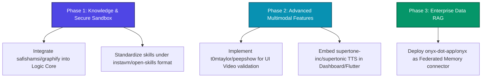

# SupremeAI Super-Hub Ecosystem: External Repository Integration Blueprint

This document details the evaluation, categorization, and integration roadmap for five high-potential open-source GitHub repositories to enhance the **SupremeAI Super-Hub Ecosystem**. These repositories have been selected based on their architectural compatibility, ease of local deployment, and their direct alignment with the specialized SupremeAI Hubs.

---

## 1. Executive Summary & Evaluation Matrix

All five evaluated repositories offer highly valuable capabilities that directly align with the core philosophy of SupremeAI: **Local execution, high performance, cost-efficiency, and agent-driven workflows.**

| Repository | Focus Area | Target SupremeAI Hub | Usefulness | Primary Integration Benefit |
| :--- | :--- | :--- | :---: | :--- |
| [**safishamsi/graphify**](https://github.com/safishamsi/graphify) | Codebase Knowledge Graphing | **Logic Core & Global Memory Hub** | **High** | Translates repository files into a queryable knowledge graph, reducing LLM token usage and improving context understanding. |
| [**t0mtaylor/peepshow**](https://github.com/t0mtaylor/peepshow) | Video/GIF Frame Extraction | **Multimodal Core** | **High** | Enables LLMs to "watch" and analyze videos or UI animations by converting them into scene-change detected frames. |
| [**instavm/open-skills**](https://github.com/instavm/open-skills) | Local Skill Sandbox | **Logic Core (Agent Orchestration)** | **High** | Runs Claude-style agent skills in a secure, local sandbox environment, keeping prompt-action execution private. |
| [**supertone-inc/supertonic**](https://github.com/supertone-inc/supertonic) | On-Device Text-to-Speech (TTS) | **Multimodal Core (Voice Hub)** | **High** | Fast, local text-to-speech inference with ONNX Runtime, offering voice responses without cloud costs or latency. |
| [**onyx-dot-app/onyx**](https://github.com/onyx-dot-app/onyx) | RAG & Knowledge Connectors | **Global Memory Hub** | **High** | Formerly Danswer; acts as a secure application layer connecting LLMs to external data sources (Slack, Drive, GitHub). |

---

## 2. Detailed Repository Analysis & Integration Blueprint

### 2.1 safishamsi/graphify
* **Core Technology:** Python-based codebase-to-knowledge-graph generator.
* **SupremeAI Alignment:** *Logic Core & Global Memory Hub*

> [!NOTE]
> Graphify parses project structures, schemas, and media files into structured JSON/Markdown graphs. The package is published on PyPI as `graphifyy`.

#### Why It's Useful
SupremeAI is designed to scale up to 600-700+ distinct tasks. As our codebase grows, feeding full raw files to the Logic Core models consumes excessive tokens and reduces context window efficiency. Graphify solves this by building a semantic representation of files and dependencies, allowing AI agents to query the graph rather than processing the entire code tree.

#### Integration Plan
1. **Local Tooling:** Register `graphifyy` as an autonomous command inside the SupremeAI CLI (`command-hub`).
2. **Context Compression:** Integrate it into the `SuperHubOrchestrator` to generate compressed codebase indices when solving developer tasks.
3. **Obsidian Sync:** Automatically output Graphify's Obsidian vaults to `docs/summaries/` for visual system mapping.

---

### 2.2 t0mtaylor/peepshow
* **Core Technology:** Node.js timeline-based video/GIF frame extractor.
* **SupremeAI Alignment:** *Multimodal Core*

> [!TIP]
> Peepshow uses local `ffmpeg` scene-change detection to extract only visually distinct frames, preventing redundant image generation for static video segments.

#### Why It's Useful
For advanced app generation, SupremeAI needs to evaluate generated UI animations, mobile screen recordings, or user demo videos. Standard multimodal models cannot process raw video streams efficiently. Peepshow acts as a pre-processor that transforms these videos into a sequential story of image frames that our multimodal models (like *Gemini 1.5 Flash* or *Phi-3-Vision*) can easily analyze.

#### Integration Plan
1. **Dynamic Media Pre-processor:** Whenever a video or GIF path is submitted to a SupremeAI agent, route the file to a `PeepshowVideoAnalyzer` script.
2. **Transcription Hub:** Combine with `whisper.cpp` to align audio transcriptions with visual timelines.
3. **UI Verification:** Use it in our auto-validation pipeline to run the Flutter mobile app in an emulator, record the screen, and use Peepshow to inspect transitions for rendering bugs.

---

### 2.3 instavm/open-skills
* **Core Technology:** Local Claude Skills runtime environment.
* **SupremeAI Alignment:** *Logic Core (Agent Orchestration)*

> [!IMPORTANT]
> OpenSkills provides a sandboxed, isolated environment for executing code and running system commands, securing the host OS from dangerous or unwanted side-effects.

#### Why It's Useful
AI agents generated by SupremeAI need to run terminal commands, write to disk, and download dependencies. To prevent malicious commands or accidental file deletions, these execution tasks must run in a sandboxed, secure container. OpenSkills provides the ideal, standard format for registering and executing local skills safely.

#### Integration Plan
1. **Unified Skill Standard:** Standardize all SupremeAI agent skills (`.agents/skills/`) to be fully compatible with the OpenSkills structure.
2. **Secure Sandbox:** Configure the Spring Boot backend (`src/main/java/com/supremeai/`) to spin up secure micro-environments when executing dynamic agent logic.

---

### 2.4 supertone-inc/supertonic
* **Core Technology:** High-performance, local ONNX Runtime Text-to-Speech (TTS).
* **SupremeAI Alignment:** *Multimodal Core (Voice Hub)*

> [!NOTE]
> Supertonic supports up to 31 languages on-device, running with extremely low latency on CPU/WebGPU/WASM.

#### Why It's Useful
SupremeAI's mobile admin app and 3D web dashboards need voice capabilities to support dynamic accessibility and hands-free control. Relying on cloud services like Google Cloud TTS or ElevenLabs introduces latency, high usage costs, and internet dependency. Supertonic allows SupremeAI to generate voice feedback instantly, offline, and completely free of charge.

#### Integration Plan
1. **Local Voice Daemon:** Deploy the Supertonic ONNX model locally or package the WASM player within the React/TypeScript dashboard.
2. **Flutter Integration:** Use the Flutter SDK wrapper from the repository in our mobile admin app (`supremeai/`) to enable offline voice feedback.
3. **Dynamic Prompt Synthesis:** Synthesize response outputs into audio on-the-fly, particularly for real-time notifications.

---

### 2.5 onyx-dot-app/onyx (Formerly Danswer)
* **Core Technology:** Open-source, self-hosted enterprise RAG platform.
* **SupremeAI Alignment:** *Global Memory Hub*

> [!WARNING]
> Onyx contains complete enterprise user authentication, connectors, and semantic search pipelines. It is a large system that requires Docker/Kubernetes deployment.

#### Why It's Useful
To make SupremeAI the "Brain" of an enterprise, it must connect securely to Google Drive, Slack, Confluence, Jira, and GitHub. Building individual connectors is incredibly tedious. Onyx provides a plug-and-play, secure connector system with fully integrated semantic search and Role-Based Access Control (RBAC).

#### Integration Plan
1. **Enterprise Memory Connector:** Connect SupremeAI's `GlobalMemory` to an Onyx instance running alongside our Spring Boot backend.
2. **Federated Search:** When SupremeAI receives a query about documentation or external resources, query the Onyx search APIs (`/api/query`) to fetch the most relevant context blocks.
3. **Unified SSO:** Link SupremeAI's Firebase Authentication with Onyx SSO to maintain consistent authorization levels.

---

## 3. Recommended Roadmap & Next Steps

To maximize the benefits of these repositories, the following phases are recommended:

1. **Short-Term (Immediate):**
   * Incorporate `graphify` and `open-skills` into our agent guidelines and runtime scripts.
   * Add dependencies to the global memory indexing pipeline.
2. **Medium-Term:**
   * Package `supertonic` and `peepshow` into our local microservices module.
   * Create an automated testing script that uses `peepshow` to record and verify dashboard visual updates.
3. **Long-Term:**
   * Integrate `onyx` as the enterprise-level backing for our global multi-source data sync.

---
*Prepared by Antigravity AI Engine for SupremeAI | Version 1.0 (Ecosystem Expansion Edition)*
