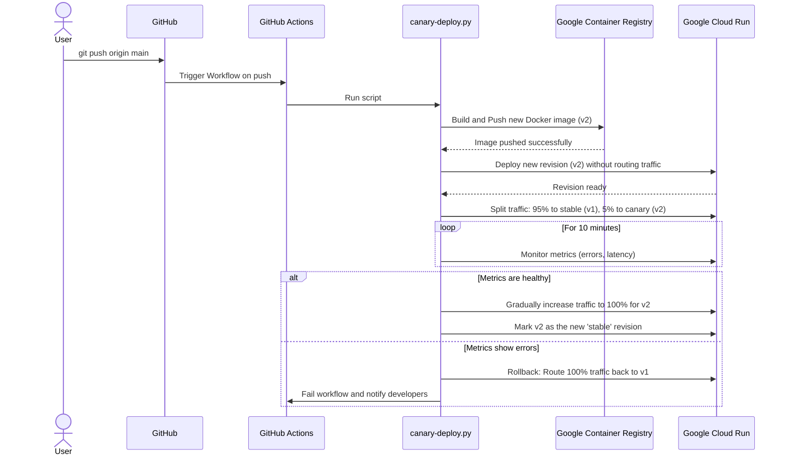

# 📄 ফাইল: SEQ-001-canary-deployment.md

**প্রকার:** .md  
**সাইজ:** 2,958 বাইট  
**আপডেট:** 2026-07-11T19:51:42.126089

---

## কোড

```md
# SEQ-001: Canary Deployment Process

**Date:** 2026-07-08

**Status:** Draft

This sequence diagram illustrates the process of a canary deployment, which is a common strategy for rolling out new versions of an application with minimal risk. This is a hypothetical implementation based on best practices.

## Diagram



## Process Description

1.  **Trigger:** A developer pushes new code to the `main` branch on GitHub.
2.  **CI/CD Pipeline Starts:** GitHub Actions triggers the CI/CD workflow.
3.  **Build & Push:** The `canary-deploy.py` script (or a similar tool) builds a new Docker image for the application and pushes it to Google Container Registry (GCR).
4.  **Deploy Canary Revision:** The script deploys the new image to Google Cloud Run as a new revision but does not yet send any user traffic to it.
5.  **Traffic Splitting:** Once the new revision is ready, the script instructs Cloud Run to split incoming traffic. A small percentage (e.g., 5%) is directed to the new "canary" revision, while the majority (95%) continues to go to the existing "stable" revision.
6.  **Monitoring:** The script enters a monitoring phase, observing key metrics like error rates and response times for the canary revision over a set period (e.g., 10 minutes).
7.  **Decision:**
    - **Success (Promote):** If the metrics for the canary revision are healthy and within acceptable thresholds, the script gradually shifts more traffic to it until it receives 100%. The new revision is then promoted to "stable".
    - **Failure (Rollback):** If the canary revision shows a high error rate or other problems, the script immediately rolls back by routing 100% of the traffic back to the old stable revision. The workflow is marked as failed, and developers are notified.
```