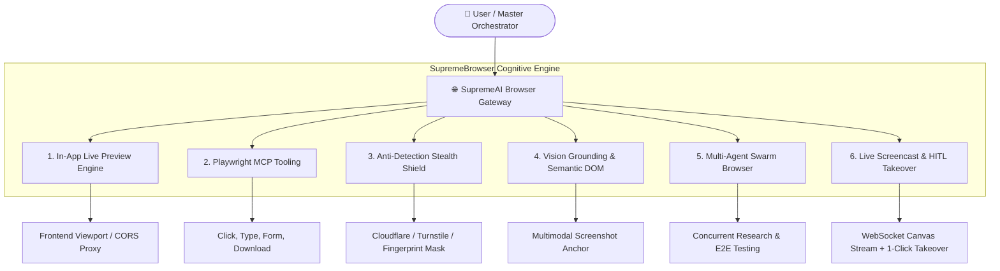

# 🌐 SupremeAI Autonomous Browser Suite — Unified Master Plan

**Document Version:** 3.0.0 (Canonical Source of Truth)  
**System Phase:** **Phase 3: Self-Evolving & Autonomous Swarm**  
**Classification:** Core Capability Architecture (Zero-Cost Infrastructure)

---

## 🎯 Executive Vision

SupremeAI Browser Suite শুধুমাত্র একটি সাধারণ ওয়েব প্রিভিউ বা স্ক্র্যাপার নয়; এটি একটি **Cognitive Autonomous Web Operator**। 
ইউজারের ১-লাইনের নির্দেশ থেকে শুরু করে কোড প্রিভিউ, জটিল ফর্মে অটোমেশন, অ্যান্টি-বট বাইপাস, স্ক্রিনশট-ভিত্তিক বাটন সনাক্তকরণ (Vision Grounding), এবং প্যারালাল সোয়ার্ম ব্রাউজিং — সব কিছুই একটি ইউনিফাইড ইঞ্জিনে পরিচালিত হবে।

---

## 🏛️ ৬টি কোর ব্রাউজার মডিউল (The 6 Pillars)

### 💻 Pillar 1: In-App Live Browser Preview Engine (কোড ভিজ্যুয়ালাইজেশন)
AI যখন কোনো ফ্রন্টএন্ড কোড (React, HTML5, Tailwind, Three.js) তৈরি করবে, ইউজার ড্যাশবোর্ডের ভেতরেই সরাসরি তার রিয়েল-টাইম আউটপুট দেখতে পাবে।

- **Iframe Sandboxed Environment:** সুরক্ষিত স্যান্ডবক্স যেখানে ক্লায়েন্ট-সাইড কোড তাত্ক্ষণিকভাবে এক্সিকিউট হবে।
- **Server-Side CORS Bypass Proxy (`/api/browser/proxy`):** যেসব ওয়েবসাইট `X-Frame-Options: DENY` বা CSP দিয়ে ফ্রেম ব্লক করে, সেগুলোকে সার্ভার-সাইড প্রক্সির মাধ্যমে ইন-অ্যাপ ব্রাউজারে রেন্ডার করা।
- **Device Viewport Switcher:** Desktop (1920x1080), Tablet (iPad 768px), এবং Mobile (iPhone 390px) রেজোলিউশনে লাইভ রেসপনসিভনেস টেস্ট।
- **Console Error Trap:** প্রিভিউ আইফ্রেমের সমস্ত কনসোল এরর ও ওয়ার্নিং স্বয়ংক্রিয়ভাবে ইন্টারসেপ্ট করে AI-কে সেলফ-হিলিংয়ের জন্য ফিড করা।

---

### ⚡ Pillar 2: Playwright MCP Automation Tooling (অ্যাকশন এক্সিকিউশন)
AI এজেন্টের জন্য নেটিভ Model Context Protocol (MCP) ইন্টারফেস, যার মাধ্যমে এজেন্ট ব্রাউজারে মানুষের মতো ইন্টারঅ্যাক্ট করে।

- **কোর টুলস:**
  - `browser_navigate(url)`: পেজে যাওয়া ও নেটওয়ার্ক আইডল পর্যন্ত অপেক্ষা করা।
  - `browser_click(selector | text | coordinate)`: বাটন, লিংক বা ট্যাবে ক্লিক।
  - `browser_type(selector, text)`: ইনপুট ফিল্ড ও টেক্সটএরিয়া পূরণ।
  - `browser_screenshot(full_page=True)`: ফুল-পেজ হাই-রেজোলিউশন স্ক্রিনশট ক্যাপচার।
  - `browser_file_upload(path)`: ফর্ম বা পোর্টালে ফাইল আপলোড।
- **Zero Flakiness:** ম্যানুয়াল স্লিপের পরিবর্তে Playwright-এর বিল্ট-ইন auto-wait মেকানিজম।

---

### 🛡️ Pillar 3: Anti-Detection Stealth Shield (বট ব্লকার বাইপাস)
যেকোনো সাইট থেকে সিকিউর ডেটা ও রিসোর্স কালেক্ট করার সময় বট ডিটেকশন এড়ানোর সর্বোচ্চ সুরক্ষা ব্যবস্থা।

- **Fingerprint Masking (`browser_stealth.py`):** WebGL ভেন্ডর, অডিও কনটেক্সট, ক্যানভাস নয়েজ, ব্যাটারি API এবং নেভিগেটর প্রোপার্টিজ হিউম্যানাইজ করা।
- **Cloudflare & Turnstile Bypass:** মাউস মুভমেন্টে Bezier Curve জেনারেট করা এবং ন্যাচারাল কি-স্ট্রোক টাইপিং ডিলে।
- **Zero-Cost Residential/Rotating Proxy Mesh:** রিকোয়েস্ট ব্লক এড়াতে ডাইনামিক প্রক্সি রোটেশন ও হেডার র্যান্ডমাইজেশন।

---

### 👁️ Pillar 4: Multimodal Vision Grounding & Semantic DOM (ভিশন-ভিত্তিক ব্রাউজিং)
কোড না পড়ে মানুষের চোখের মতো স্ক্রিন দেখে ব্রাউজিং করার ক্ষমতা।

- **Vision Grounding (`backend/browser/vision_grounding.py`):** 
  - AI পেজের স্ক্রিনশট নিয়ে বাটন/ইনপুটের কোঅর্ডিনেট `(x, y)` শনাক্ত করবে।
  - ডায়নামিক বা অবফাসকেটেড ক্লাসনেম থাকলেও视觉ভাবে সঠিক এলিমেন্টে ক্লিক হবে।
- **Semantic DOM Pruning (`backend/browser/semantic_dom.py`):**
  - ২০,০০০ লাইনের ভারী HTML-কে মাত্র ৫০০ টোকেনের মিনিফাইড ইন্টারঅ্যাক্টিভ ট্রিতে রূপান্তর।
  - টোকেন খরচ ৯৫% পর্যন্ত কমিয়ে আনা।

---

### 🐝 Pillar 5: Multi-Agent Parallel Swarm Browser (সমান্তরাল সোয়ার্ম ব্রাউজিং)
একটি ব্রাউজার সেশনের বদলে একাধিক হেডলেস সেশনে একযোগে কাজ করা।

- **High-Concurrency Task Partitioning:** ১০টি আলাদা ই-কমার্স বা ডকুমেন্টেশন পেজ থেকে ১ সেকেন্ডে ডেটা সংগ্রহ।
- **Autonomous E2E Testing Swarm:** পুরো ওয়েব প্ল্যাটফর্মে ইউজার ফ্লো (Login -> Checkout -> Payment -> Settings) সমান্তরালভাবে পরীক্ষা করে ক্র্যাশ টেস্ট করা।

---

### 🎮 Pillar 6: Live Screencast & HITL Takeover (হিউম্যান-ইন-দ্য-লুপ)
- **Live Canvas Screencast:** AI ব্রাউজারে কী করছে তা ইউজার ফ্রন্টএন্ডে রিয়েল-টাইম লাইভ ক্যানভাস স্ট্রিমে দেখতে পাবে।
- **1-Click Human Takeover Protocol:** টু-ফ্যাক্টর ওটিপি (2FA OTP) বা ক্যাপচা আসার সময় ইউজার এক ক্লিকে মাউস ও কিবোর্ডের কন্ট্রোল নিয়ে কাজ শেষ করে পুনরায় AI-কে হ্যান্ডওভার দিতে পারবে।

---

## 📡 API Contract & Architecture Routes

| Route | Method | Description | Guard / Auth |
|---|---|---|---|
| `/api/browser/browse` | `POST` | Execute atomic browser action (navigate, click, type) | JWT Protected |
| `/api/browser/status` | `GET` | Get current browser status, viewport, and active URL | Public / Auth |
| `/api/browser/proxy` | `GET/POST` | Server-side iframe CORS bypass proxy | Session Guard |
| `/api/browser/semantic-dom` | `POST` | Extract pruned semantic accessibility tree | AI Internal |
| `/api/browser/vision-ground` | `POST` | Detect clickable elements via vision coordinates | AI Internal |
| `/api/browser/takeover` | `POST` | Request human session takeover token | Admin / User |
| `/ws/browser/screencast` | `WebSocket` | Real-time low-latency JPEG/WebP canvas stream | Token Auth |

---

## 🚀 Execution Roadmap & Milestones

1. **Milestone 1 (Foundation):** Headless Playwright Pool + Server-Side CORS Proxy (`/api/browser/proxy`) integration.
2. **Milestone 2 (Frontend Viewport):** Embed Live Browser Preview Shell with Device Viewport selector in User Dashboard.
3. **Milestone 3 (Cognitive Vision):** Connect Vision Grounding and Semantic DOM into the Master Orchestrator loop.
4. **Milestone 4 (Swarm & Screencast):** Multi-agent parallel tabs + WebSocket screencast stream with 1-click takeover.

---

*This document supersedes and consolidates all prior legacy browser roadmap drafts into a single canonical standard.*
