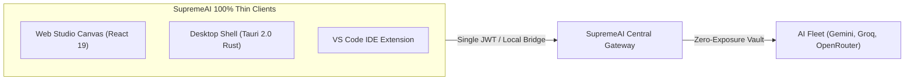

# 💻 SupremeAI Clients & Thin-Runtime Master Plan

**Document Version:** 3.0.0 (Canonical Source of Truth)  
**System Phase:** **Phase 3: Self-Evolving & Multi-Agent Swarm**  
**Classification:** Desktop (Tauri), VS Code Extension & Thin-Client Runtime

---

## 🎯 1. Thin-Client Philosophy: Brand & Key Immunity

> "All client surfaces (Desktop, VS Code, Web, Mobile) are 100% Thin Clients. No third-party API keys, vendor endpoints, or backend credentials are ever stored or exposed on client machines."

সমস্ত ক্লায়েন্ট শুধুমাত্র একটি নিরাপদ রিলে/গেটওয়ে হিসেবে কাজ করে এবং ব্যাকএন্ড API-র মাধ্যমে কমান্ড পাঠায় ও রিয়েল-টাইম ক্যানভাস স্ট্রিম রিসিভ করে।

---

## 🖥️ 2. Desktop Application (Tauri 2.0 Architecture)

- **Rust Lightweight Core:** ইলেকট্রনের তুলনায় ১০ গুণ কম মেমোরি খরচে (RAM < ৬০ MB) নেটিভ ওয়েবভিউ রেন্ডার করে।
- **Local Workspace Bridge:** ইউজারের লোকাল ফাইলসিস্টেম ও টার্মিনাল নিরাপদে ব্যাকএন্ড AI এজেন্টের সাথে সিঙ্ক করতে লোকাল ব্রিজ ব্যবহার করা হয়।
- **Native OS Integration:** সিস্টেম ট্রে মিনিমাইজেশন, ডার্ক মোড সিনক্রোনাইজেশন, এবং অফলাইন নোটিফিকেশন সিস্টেম।

---

## 🧩 3. VS Code Extension Architecture

- **Context-Aware Coding Companion:** ওপেন থাকা ফাইল, কার্সর পজিশন এবং গিট হিস্ট্রি স্বয়ংক্রিয়ভাবে ব্যাকএন্ড `DevAdapter`-এ পাঠায়।
- **Inline Ghost Autocomplete:** অতি দ্রুত গতিতে (Latency < ১৫০ms) কোড সাজেশন ও ইনলাইন ডিফ রেন্ডার করে।
- **Command Palette Integration:** `Ctrl+Shift+P` থেকে সরাসরি সুপ্রীম কমান্ড প্যালেট অ্যাক্সেস।

---

## 📱 4. Multi-Platform Design System Alignment

- সমস্ত ক্লায়েন্ট `@supremeai/design-tokens` থেকে অটো-জেনারেটেড CSS Variables, JSON এবং Flutter Dart টোকেন ব্যবহার করে, ফলে সব ডিভাইসে অভিন্ন **Dark-Neon (#09090b, #00f3ff, #a855f7)** ইউজার এক্সপেরিয়েন্স বজায় থাকে।

---
*Canonical Master Plan — Supersedes all legacy desktop, client and extension planning drafts.*
