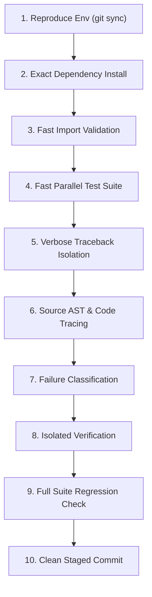

# 🛠️ CI Failure Root Cause & Resolution Command Roadmap

> **SupremeAI Engineering Standard | Zero-Guesswork CI Triage & Self-Healing Protocol**

This document establishes the canonical 10-step command workflow for diagnosing, isolating, fixing, and verifying CI/CD pipeline failures from scratch.

---

## 🧭 The 10-Step Execution Roadmap



---

### ধাপ ১ — Environment Reproduce করা
সর্বদা লেটেস্ট ক্লিন স্টেটে কাজ নিশ্চিত করা:
```bash
git fetch origin main && git reset --hard origin/main
```

---

### ধাপ ২ — CI-এর Exact Dependency Install Reproduce করা
CI workflow ফাইল অনুযায়ী একদম এক কমান্ডে ডিপেন্ডেন্সি ইনস্টল করা:
```bash
pip install poetry
poetry install --only main --no-root      # CI-এর মূল রানটাইম ডিপেন্ডেন্সি
poetry install --with dev --no-root       # টেস্ট/লিন্ট এক্সট্রাস (গ্রুপ নাম pyproject.toml অনুযায়ী)
```

---

### ধাপ ৩ — Import/Collection-Level Bug দ্রুত ধরা
রানটাইম টেস্টের আগেই ইমপোর্ট ও সিনট্যাক্স এরর সস্তায় এবং তাৎক্ষণিকভাবে ধরা:
```bash
poetry run python scripts/ci/validate_router_imports.py --strict
poetry run pytest --collect-only -q
```

---

### ধাপ ৪ — পুরো Suite রান করে Real Failure List বের করা
কভারেজ ওভারহেড ছাড়া দ্রুত ইটারেশনের মাধ্যমে ফেইলিউর লিস্ট বের করা:
```bash
poetry run pytest -n auto --dist=loadfile --timeout=120 -k "not chaos" -q --no-cov
```
*(দ্রষ্টব্য: `--no-cov` ফাস্ট ইটারেশনের জন্য ব্যবহার করুন; কভারেজ আলাদা ধাপে চেক হবে।)*

---

### ধাপ ৫ — প্রতিটা Failure-এর জন্য Isolated, Verbose Traceback বের করা
লগ নয়েজ বাদ দিয়ে সরাসরি লং ট্রেসব্যাক ফোকাস করা:
```bash
poetry run pytest tests/path/to_test.py::TestClass::test_name -q --no-cov --tb=long -p no:logging
```
*(প্রয়োজনে `-p no:cacheprovider` ব্যবহার করুন।)*

---

### ধাপ ৬ — Traceback থেকে Root File-এ যাওয়া
```bash
grep -n "<failing_function_or_attr>" -r . --include="*.py" | grep -v tests/
```
এর মাধ্যমে স্পষ্ট বোঝা যায় বাগটি প্রোডাকশন কোডে (Real Bug) নাকি কেবল টেস্টের এক্সপেক্টেশন পুরনো (Stale Assertion)।

---

### ধাপ ৭ — Failure Classify করা
1. **Production Code Bug:** মিসিং ইমপোর্ট বা লজিক বাগ → প্রোডাকশন কোড ফিক্স করুন।
2. **Stale Test Contract:** কোড ইচ্ছাকৃতভাবে বিবর্তিত হয়েছে (কমেন্ট/ডকস্ট্রিং যাচাই করুন) → টেস্ট কন্ট্রাক্ট আপডেট করুন।
3. **Flaky / Env-Dependent:** Redis/Network আনঅভেইলেবল → গ্রেসফুল ফলব্যাক বা স্কিপ মার্ক নিশ্চিত করুন।

---

### ধাপ ৮ — Fix করার পর ঠিক সেই Test(s) আবার Isolated রান করে Verify
```bash
poetry run pytest tests/path/to_test.py -q --no-cov
```

---

### ধাপ ৯ — পুরো Suite আবার রান করে Regression চেক
একটি ফিক্স অন্য কিছু ভেঙেছে কিনা তা সম্পূর্ণ স্যুট চালিয়ে নিশ্চিত করা:
```bash
poetry run pytest -n auto --dist=loadfile --timeout=120 -k "not chaos" -q --no-cov
```

---

### ধাপ ১০ — Clean Staged Commit ও Verification
```bash
git status --short
# অবাঞ্ছিত ফাইল (.coverage, pickle, logs) বাদ দিয়ে শুধুমাত্র নির্দিষ্ট ফাইলে git add করুন
```
