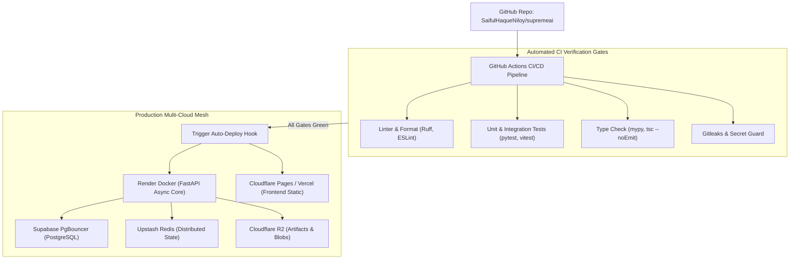

# 🚀 SupremeAI DevOps, CI/CD & Deployment Master Plan

**Document Version:** 3.0.0 (Canonical Source of Truth)  
**System Phase:** **Phase 3: Self-Evolving & Multi-Agent Swarm**  
**Classification:** DevOps Pipeline, Cloud Mesh & Zero-Downtime Deployment

---

## 🎯 1. Cloud Mesh & Zero-Cost Free-Tier Topology

SupremeAI এমনভাবে ডিপ্লয় করা হয় যাতে প্রতিটি কম্পোনেন্ট ফ্রি-টিয়ার রিল্যায়াবিলিটির মধ্যে সর্বোচ্চ আপটাইম নিশ্চিত করে:



---

## ⚙️ 2. Automated CI/CD Gates (Non-Negotiable)

প্রতিটি পুল রিকোয়েস্ট বা পুশে নিচের ৪টি গেট **১০০% গ্রিন** হতে হবে:

1. **Python Quality Gate:**
   ```bash
   ruff check backend/
   pytest backend/tests/ --cov=backend --cov-fail-under=80
   ```
2. **Frontend Quality Gate:**
   ```bash
   cd frontend
   npx tsc -p tsconfig.app.json --noEmit
   npm test
   pnpm build
   ```
3. **Secret & Security Gate:**
   - Gitleaks রান করে কোডবেস স্ক্যান করা হয় — কোনো আনএনক্রিপ্টেড কী কমিট হতে দেওয়া হয় না।
4. **Action SHA Pinning:**
   - সমস্ত GitHub Action ওয়ার্কফ্লো ফুল ৪০-ক্যারেক্টার কমিট হ্যাশ দিয়ে পিন করা।

---

## 🔄 3. Zero-Downtime & Rollback Policy

- **Pre-Deploy Health Probe:** ডিপ্লয়মেন্ট সম্পূর্ণ হওয়ার আগে `/health/live` এবং `/health/ready` এন্ডপয়েন্ট পিং করে সার্ভিস রেডি কিনা নিশ্চিত করা হয়।
- **Automatic Rollback Switch:** ডিপ্লয়মেন্টের পর কোনো কনটেইনার ক্র্যাশ বা ডেটাবেজ কানেকশন ফেইলিওর ঘটলে ৩ ট্রাইয়ের মধ্যে স্বয়ংক্রিয়ভাবে পূর্ববর্তী স্টেবল `CHECKPOINT.md` ট্যাগ ভার্সনে রোলব্যাক হয়।
- **One-Click Hot-Patching:** প্রোডাকশন রিস্টার্ট ছাড়া মেমোরি বা স্কিল লেভেলে লাইভ প্যাচ পুশ করার জন্য `OneClickPatch` সার্ভিস ব্যাকগ্রাউন্ডে রেডি থাকে।

---
*Canonical Master Plan — Supersedes all legacy devops and operations deployment drafts.*
