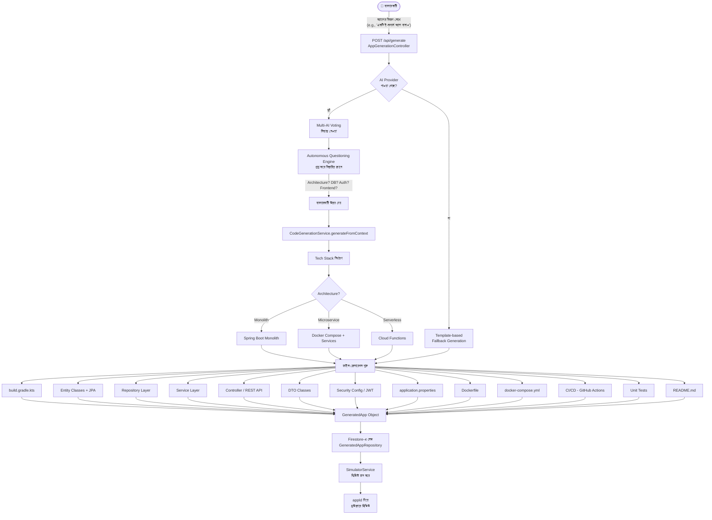

# Feature 01: AI কোড জেনারেশন (App Builder)
> **অবস্থা:** ✅ বিদ্যমান (আংশিক সম্পূর্ণ)
> **Priority:** CRITICAL
> **ফাইলসমূহ:** `CodeGenerationService.java`, `CodeGenerationServiceEnhanced.java`, `AppGenerationController.java`, `FullStackCodeGenerator.java`, `MultiPlatformGenerator.java`

---

## 🎯 ফিচারটি কী করে?

ব্যবহারকারী একটি অ্যাপের বিবরণ দিলে SupremeAI স্বয়ংক্রিয়ভাবে সম্পূর্ণ প্রজেক্ট কোড তৈরি করে — Backend (Spring Boot), Frontend (React), Database স্কিমা, Dockerfile, CI/CD pipeline সহ।

---

## 🔄 সম্পূর্ণ ফ্লো (Beginning to End)



---

## 📋 বর্তমান Implementation বিবরণ

### ✅ যা আছে:

| কম্পোনেন্ট | ফাইল | অবস্থা |
|------------|------|--------|
| Basic Code Generation | `CodeGenerationService.java` (1149 lines) | ✅ সম্পূর্ণ |
| Enhanced Generation | `CodeGenerationServiceEnhanced.java` (31K) | ✅ আছে |
| Multi-Platform Generator | `MultiPlatformGenerator.java` | ✅ আছে |
| Full Stack Generator | `FullStackCodeGenerator.java` | ✅ আছে |
| App Generation Controller | `AppGenerationController.java` (12K) | ✅ আছে |
| Simulator Preview | `SimulatorService.java` | ✅ আছে |
| Firestore Storage | `GeneratedAppRepository.java` | ✅ আছে |

### ✅ জেনারেট হওয়া ফাইলসমূহ:
- `build.gradle.kts` — Gradle dependency management
- Entity, Repository, Service, Controller, DTO — প্রতিটি entity-র জন্য
- `application.properties` — DB, JWT config সহ
- `Dockerfile` + `docker-compose.yml`
- `.github/workflows/ci-cd.yml`
- `README.md`
- Unit Tests (Controller + Service)

### Tech Stack Support:
- **Architecture:** Monolith, Microservice, Serverless
- **Database:** PostgreSQL, MySQL, MongoDB
- **Auth:** JWT, OAuth2
- **Frontend:** React, Vue, Angular (skeleton)
- **Deployment:** GCP, AWS, Docker

---

## ❌ কী মিসিং?

| মিসিং অংশ | প্রভাব | জরুরিতা |
|-----------|--------|---------|
| **Frontend কোড আসল নয়** — শুধু skeleton | ব্যবহারকারী কাজের UI পায় না | 🔴 Critical |
| **Flutter / Mobile App Generation** | মোবাইল অ্যাপ তৈরি করতে পারে না | 🔴 Critical |
| **GraphQL API Generation** | আধুনিক API style মিস | 🟡 High |
| **AI-powered entity relationship** | Complex DB schema বুঝতে পারে না | 🟡 High |
| **Live Code Preview** — শুধু ফাইল, রান নয় | কোড দেখা যায় কিন্তু চালানো যায় না | 🟡 High |
| **Streaming generation** — realtime টাইপিং | UX খারাপ, সব শেষে আসে | 🟡 High |
| **Multi-language support** — Python, Go, Node | শুধু Java/Spring Boot | 🟠 Medium |
| **Plugin/Template marketplace** | কাস্টম টেমপ্লেট নেই | 🟠 Medium |
| **Incremental code update** | পুরো পুনর্লিখন দরকার, patch নেই | 🟠 Medium |
| **Git auto-push** — তৈরি হলে GitHub-এ push | ম্যানুয়াল কাজ লাগে | 🟠 Medium |

---

## 🔍 কোন Part-এ কী মিসিং (বিস্তারিত)

### 1. Frontend Generation (মিসিং)
```
বর্তমান: শুধু React skeleton (index.html + App.jsx)
দরকার:   - Component-level generation
          - TailwindCSS / Material UI integration
          - State management (Redux/Zustand)
          - API connection code (axios/fetch)
          - Form generation with validation
          - Dashboard layouts
```

### 2. Mobile App Generation (মিসিং)
```
বর্তমান: MultiPlatformGenerator আছে কিন্তু Flutter কোড নেই
দরকার:   - Flutter screen generation
          - Provider/Riverpod state management
          - API service integration
          - Navigation setup
```

### 3. Streaming Response (মিসিং)
```
বর্তমান: সব কোড একসাথে return হয়
দরকার:   - SSE (Server-Sent Events) বা WebSocket
          - Token-by-token streaming
          - Frontend-এ real-time দেখানো
```

### 4. Live Execution (মিসিং)
```
বর্তমান: Simulator শুধু static HTML দেখায়
দরকার:   - Docker-in-Docker execution
          - Sandbox environment
          - Port mapping + preview URL
```

---

## 🆚 প্রতিযোগী তুলনা

| ফিচার | SupremeAI | GitHub Copilot | Cursor | Replit AI | Bolt.new |
|-------|-----------|---------------|--------|-----------|---------|
| Full project generation | ✅ | ❌ | ⚠️ | ✅ | ✅ |
| Multi-AI voting on code | ✅ | ❌ | ❌ | ❌ | ❌ |
| Mobile app generation | ❌ | ❌ | ❌ | ❌ | ⚠️ |
| Live preview/run | ⚠️ (limited) | ❌ | ✅ | ✅ | ✅ |
| Streaming generation | ❌ | ✅ | ✅ | ✅ | ✅ |
| Frontend (React) full | ❌ (skeleton) | ✅ | ✅ | ✅ | ✅ |
| CI/CD pipeline | ✅ | ❌ | ❌ | ❌ | ❌ |
| Self-healing code | ✅ | ❌ | ❌ | ❌ | ❌ |

---

## 🛠️ সংশোধনী পরিকল্পনা (Fix Plan)

### Priority 1 (এখনই করুন):
1. **Streaming generation** — `ReactiveStreamService` ব্যবহার করুন, SSE endpoint যোগ করুন
2. **Frontend full generation** — AI দিয়ে React component তৈরি করুন

### Priority 2 (এক মাসের মধ্যে):
3. **Flutter generation** — `MultiPlatformGenerator`-এ Flutter template যোগ করুন
4. **Node.js/Python generation** — নতুন backend template

### Priority 3 (পরে):
5. **Live sandbox execution** — Docker-in-Docker অথবা WebContainer
6. **Git auto-push** — `GitHubWebhookController` extend করুন

---

## 📊 বর্তমান API Endpoints

| Endpoint | Method | কাজ | অবস্থা |
|----------|--------|-----|--------|
| `/api/generate` | POST | কোড জেনারেট করো | ✅ |
| `/api/generate/ai` | POST | AI-powered generation | ✅ |
| `/api/generate/full-stack` | POST | Full stack generation | ✅ |
| `/api/projects` | GET | প্রজেক্ট লিস্ট | ✅ |
| `/api/projects/{id}` | GET | নির্দিষ্ট প্রজেক্ট | ✅ |
| `/api/generate/stream` | GET | Streaming generation | ❌ মিসিং |
| `/api/generate/flutter` | POST | Flutter app | ❌ মিসিং |
| `/api/generate/python` | POST | Python app | ❌ মিসিং |

---

*বিশ্লেষণ তারিখ: ২০২৬-০৫-১৪*
