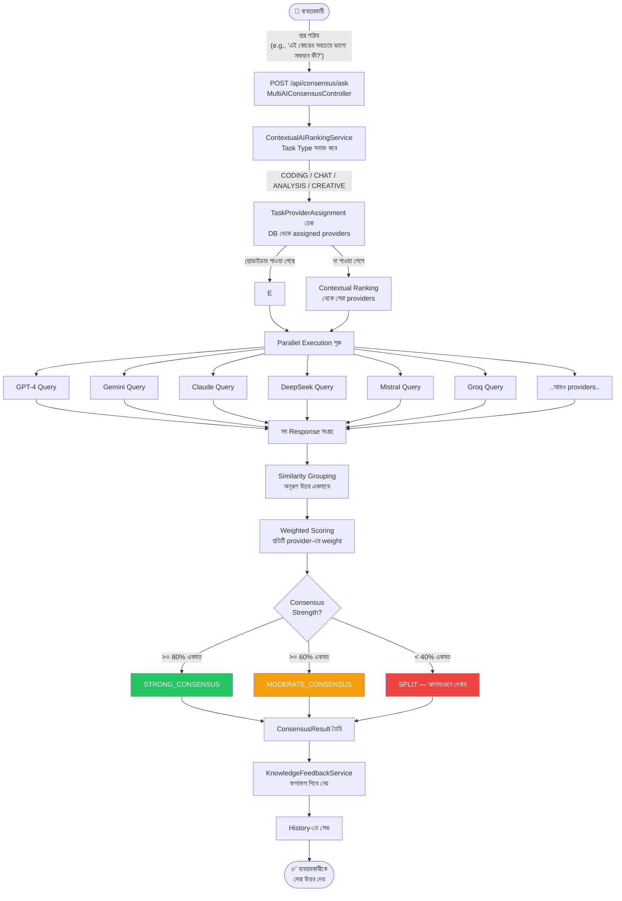
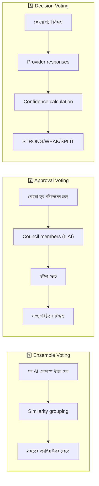

# Feature 02: Multi-AI Voting & Consensus System
> **অবস্থা:** ✅ বিদ্যমান (উন্নত)
> **Priority:** CRITICAL — SupremeAI-এর সবচেয়ে অনন্য ফিচার
> **ফাইলসমূহ:** `MultiAIVotingService.java` (853 lines), `TenAIVotingSystem.java`, `EnhancedMultiAIConsensusService.java`, `MultiAIConsensusService.java`, `ContextualAIRankingService.java`, `VotingController.java`, `MultiAIConsensusController.java`

---

## 🎯 ফিচারটি কী করে?

একটি প্রশ্ন বা কাজের জন্য **একাধিক AI প্রোভাইডার** (GPT-4, Gemini, Claude, DeepSeek, Mistral ইত্যাদি) একসাথে উত্তর দেয়। তারপর একটি **ভোটিং অ্যালগরিদম** সেরা উত্তর নির্বাচন করে। এটি ChatGPT বা Claude-এ নেই — SupremeAI-এর এক্সক্লুসিভ।

---

## 🔄 সম্পূর্ণ ফ্লো (Beginning to End)



---

## 🗳️ তিন ধরনের ভোটিং



---

## 📋 বর্তমান Implementation বিবরণ

### ✅ যা আছে (সম্পূর্ণ):

| কম্পোনেন্ট | বিবরণ | অবস্থা |
|------------|-------|--------|
| `MultiAIVotingService` | 3 ধরনের voting unified | ✅ |
| `ContextualAIRankingService` | Task type অনুযায়ী provider rank | ✅ |
| `TenAIVotingSystem` | ১০টি AI পর্যন্ত voting | ✅ |
| `EnhancedMultiAIConsensusService` | উন্নত consensus algorithm | ✅ |
| Task-specific provider assignment | DB থেকে dynamic routing | ✅ |
| Weighted scoring | Provider reputation বিবেচনা | ✅ |
| Similarity grouping | অনুরূপ উত্তর ক্লাস্টার | ✅ |
| Timeout handling | যদি AI সাড়া না দেয় | ✅ |
| History tracking | অতীত ভোট সংরক্ষণ | ✅ (in-memory) |
| KnowledgeFeedback | শেখার feedback loop | ✅ |
| React Dashboard | `DecisionVoting.tsx` | ✅ |

### AI Providers সাপোর্ট:
- GPT-4 / OpenAI ✅
- Gemini ✅
- Claude / Anthropic ✅
- DeepSeek ✅
- Groq ✅
- Mistral ✅
- HuggingFace ✅
- Kimi ✅
- StepFun ✅
- Ollama (local) ✅
- CodeGeeX4 ✅

---

## ❌ কী মিসিং?

| মিসিং অংশ | প্রভাব | জরুরিতা |
|-----------|--------|---------|
| **History Persistence** — শুধু in-memory, restart-এ হারায় | ডেটা লস | 🔴 Critical |
| **Streaming consensus** — সব শেষে আসে | UX খারাপ | 🔴 Critical |
| **Visual vote comparison UI** — কোন AI কী বলল দেখানো | স্বচ্ছতা নেই | 🟡 High |
| **Custom voting weight** — admin panel থেকে weight set | ফিক্সড weight | 🟡 High |
| **Voting analytics dashboard** — কোন provider কতটুকু ভালো | analytics নেই | 🟡 High |
| **Voting on images/multimodal** — শুধু text | limited | 🟠 Medium |
| **Cross-session voting** — একাধিক session-এর consensus | isolated | 🟠 Medium |
| **User feedback on consensus** — ব্যবহারকারী বলতে পারে কোনটা ভালো | কোনো loop নেই | 🟠 Medium |
| **Async voting notification** — দেরিতে আসলে notification | timeout | 🟠 Medium |

---

## 🔍 বিস্তারিত মিসিং Part

### 1. History Persistence (মিসিং)
```java
// বর্তমান: In-memory list
private final List<ConsensusVote> consensusHistory = new CopyOnWriteArrayList<>();

// দরকার: Firestore/Redis persistence
// VotingHistoryRepository extends ReactiveFirestoreRepository
// যাতে restart-এ ডেটা হারায় না
```

### 2. Streaming Consensus (মিসিং)
```
বর্তমান: সব AI response collect → তারপর return
দরকার:   - প্রতিটি AI response আসামাত্র stream করো
          - "GPT-4 বলছে: ..." → "Gemini বলছে: ..."
          - Live consensus score update
```

### 3. Visual Vote Breakdown UI (মিসিং)
```
বর্তমান: শুধু final consensus দেখায়
দরকার:   Dashboard-এ দেখাও:
          - প্রতিটি AI-এর উত্তর আলাদাভাবে
          - কনফিডেন্স স্কোর বার চার্ট
          - Similarity heatmap
          - Agreement percentage
```

---

## 🆚 প্রতিযোগী তুলনা

| ফিচার | SupremeAI | ChatGPT | Claude | Gemini | Poe |
|-------|-----------|---------|--------|--------|-----|
| Multi-AI parallel query | ✅ | ❌ | ❌ | ❌ | ✅ (manual) |
| Auto consensus/voting | ✅ | ❌ | ❌ | ❌ | ❌ |
| Weighted scoring | ✅ | ❌ | ❌ | ❌ | ❌ |
| Task-aware routing | ✅ | ❌ | ❌ | ❌ | ❌ |
| Vote history | ⚠️ (memory) | ❌ | ❌ | ❌ | ❌ |
| Visual comparison | ❌ | ❌ | ❌ | ❌ | ⚠️ |

**মন্তব্য:** এটি SupremeAI-এর সবচেয়ে শক্তিশালী ইউনিক ফিচার। কোনো প্রতিযোগী এটি এভাবে করে না।

---

## 📊 API Endpoints

| Endpoint | Method | কাজ | অবস্থা |
|----------|--------|-----|--------|
| `/api/consensus/ask` | POST | Consensus request | ✅ |
| `/api/consensus/stats` | GET | Voting statistics | ✅ |
| `/api/voting/ensemble` | POST | Ensemble vote | ✅ |
| `/api/voting/decision` | POST | Decision vote | ✅ |
| `/api/voting/approval` | POST | Approval vote | ✅ |
| `/api/consensus/history` | GET | Vote history | ⚠️ (memory only) |
| `/api/consensus/stream` | GET | Streaming vote | ❌ মিসিং |
| `/api/voting/compare` | GET | Side-by-side compare | ❌ মিসিং |

---

## 🛠️ সংশোধনী পরিকল্পনা

### এখনই করুন:
1. **Firestore persistence** — `consensusHistory` → Firestore collection
2. **SSE Streaming endpoint** — `/api/consensus/stream`

### এক মাসের মধ্যে:
3. **Visual comparison component** — React dashboard-এ vote breakdown
4. **Custom weight UI** — Admin panel থেকে provider weight set

---

*বিশ্লেষণ তারিখ: ২০২৬-০৫-১৪*
