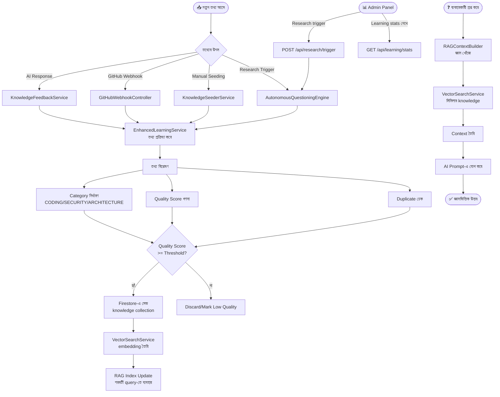

# Feature 04: System Learning & Knowledge Base
> **অবস্থা:** ✅ বিদ্যমান (উন্নত)
> **Priority:** CRITICAL
> **ফাইলসমূহ:** `EnhancedLearningService.java` (25K), `KnowledgeSeederService.java` (34K), `KnowledgeService.java` (11K), `SystemLearningService.java`, `KnowledgeFeedbackService.java`, `AdminLearning.tsx`

---

## 🎯 ফিচারটি কী করে?

SupremeAI প্রতিটি সফল এবং ব্যর্থ কাজ থেকে শেখে। নতুন প্রযুক্তি, সমাধান, এবং প্যাটার্ন স্বয়ংক্রিয়ভাবে Firestore-এ সেভ হয়। পরবর্তীতে একই ধরনের সমস্যায় এই জ্ঞান ব্যবহার করে।

---

## 🔄 সম্পূর্ণ ফ্লো



---

## 📋 বর্তমান Implementation

### ✅ যা আছে:

| কম্পোনেন্ট | বিবরণ | অবস্থা |
|------------|-------|--------|
| Knowledge Seeder | ৩৪K+ lines, ব্যাপক জ্ঞান | ✅ |
| Enhanced Learning | 25K lines, ML-like learning | ✅ |
| Knowledge Feedback | Result → learning loop | ✅ |
| Autonomous Questioning | নিজেই প্রশ্ন করে শেখে | ✅ |
| RAG Context Builder | Retrieval-Augmented Generation | ✅ |
| Vector Search | Semantic similarity search | ✅ |
| Vertex AI Embedding | Google embeddings | ✅ |
| Admin Learning UI | `AdminLearning.tsx` | ✅ |
| Research Settings | Enable/disable/trigger | ✅ |
| Quality Scoring | `QualityScoringService.java` | ✅ |

---

## ❌ কী মিসিং?

| মিসিং অংশ | প্রভাব | জরুরিতা |
|-----------|--------|---------|
| **Document upload learning** — PDF/DOC আপলোড | user নিজের docs শেখাতে পারে না | 🔴 Critical |
| **URL scraping** — website থেকে শেখা | web knowledge limited | 🔴 Critical |
| **Learning progress visualization** — কতটুকু শিখেছে | transparent নয় | 🟡 High |
| **Forget/unlearn** — ভুল তথ্য মুছে দেওয়া | bad data থাকে | 🟡 High |
| **Domain-specific fine-tuning** — নির্দিষ্ট বিষয়ে | general only | 🟡 High |
| **Real embedding persistence** — Vertex AI costly | memory-based fallback | 🟡 High |
| **Learning rate control** — কতটুকু শিখবে | uncontrolled | 🟠 Medium |
| **Cross-session context** — user-specific memory | global only | 🟠 Medium |
| **Federated learning** — privacy-preserving | no privacy | 🟠 Medium |

---

## 🔍 বিস্তারিত মিসিং Part

### 1. Document Upload Learning (মিসিং)
```
দরকার: POST /api/learning/upload
        - PDF, DOCX, TXT, MD support
        - Text extraction
        - Chunking strategy
        - Embedding generation
        - Firestore index
        - RAG retrieval
```

### 2. URL/Web Scraping (মিসিং)
```
দরকার: POST /api/learning/url
        - Playwright/JSoup web scraping
        - Content extraction
        - Clean & normalize
        - Store in knowledge base
```

---

## 📊 API Endpoints

| Endpoint | Method | কাজ | অবস্থা |
|----------|--------|-----|--------|
| `/api/learning/stats` | GET | Learning statistics | ✅ |
| `/api/learning/critical` | GET | Critical knowledge | ✅ |
| `/api/research/trigger` | POST | Research trigger | ✅ |
| `/api/research/enable` | POST | Enable research | ✅ |
| `/api/research/disable` | POST | Disable research | ✅ |
| `/api/learning/upload` | POST | Document upload | ❌ মিসিং |
| `/api/learning/url` | POST | URL learning | ❌ মিসিং |
| `/api/learning/forget` | DELETE | Unlearn data | ❌ মিসিং |

---

*বিশ্লেষণ তারিখ: ২০২৬-০৫-১৪*
