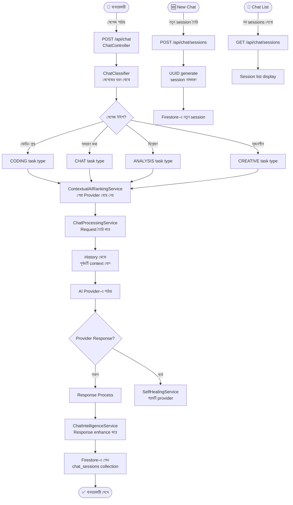

# Feature 05: Neural Chat System (Multi-Session)
> **অবস্থা:** ✅ বিদ্যমান (আংশিক)
> **Priority:** HIGH
> **ফাইলসমূহ:** `ChatProcessingService.java` (22K), `ChatController.java` (10K), `AdminChatController.java`, `UserChatController.java`, `ChatClassifier.java`, `ChatIntelligenceService.java`

---

## 🎯 ফিচারটি কী করে?

ব্যবহারকারী AI-এর সাথে বহু-সেশন চ্যাট করতে পারেন। প্রতিটি চ্যাট সেশন আলাদা, নাম দেওয়া যায়, মুছে দেওয়া যায়। AI চ্যাটের ধরন বিশ্লেষণ করে সঠিক provider-এ route করে।

---

## 🔄 সম্পূর্ণ ফ্লো

---

## 📋 বর্তমান Implementation

### ✅ যা আছে:

| কম্পোনেন্ট | বিবরণ | অবস্থা |
|------------|-------|--------|
| Chat Processing | 22K lines, comprehensive | ✅ |
| Chat Classifier | Task type detection | ✅ |
| Chat Intelligence | Response enhancement | ✅ |
| Admin Chat Controller | Admin-side chat | ✅ |
| User Chat Controller | User-side chat | ✅ |
| Multi-session (recent) | নতুন যোগ হয়েছে | ✅ |
| Smart naming | AI দিয়ে session name | ✅ |
| Chat history | Firestore persistence | ✅ |

---

## ❌ কী মিসিং?

| মিসিং অংশ | প্রভাব | জরুরিতা |
|-----------|--------|---------|
| **Streaming response** — token-by-token | টাইপিং effect নেই | 🔴 Critical |
| **Image in chat** — ছবি পাঠানো যায় না | multimodal নেই | 🔴 Critical |
| **File attachment** — PDF/code attach | limited context | 🔴 Critical |
| **Code highlighting** — syntax highlight | raw code দেখায় | 🟡 High |
| **Chat export** — PDF/MD export | share করা যায় না | 🟡 High |
| **Voice input** — microphone | typing only | 🟡 High |
| **Markdown rendering** — বর্তমানে plain text | ugly output | 🟡 High |
| **Mention/tag AI** — @GPT4 @Claude | manual selection | 🟠 Medium |
| **Shared chat** — link share করা | private only | 🟠 Medium |
| **Chat search** — পুরনো chat খোঁজা | scroll only | 🟠 Medium |
| **Reaction/feedback** — 👍👎 | no feedback loop | 🟠 Medium |

---

## 🆚 প্রতিযোগী তুলনা

| ফিচার | SupremeAI | ChatGPT | Claude | Gemini |
|-------|-----------|---------|--------|--------|
| Multi-session | ✅ | ✅ | ✅ | ✅ |
| Streaming | ❌ | ✅ | ✅ | ✅ |
| Image input | ❌ | ✅ | ✅ | ✅ |
| File upload | ❌ | ✅ | ✅ | ✅ |
| Code highlighting | ❌ | ✅ | ✅ | ✅ |
| Voice input | ❌ | ✅ | ❌ | ✅ |
| Multi-AI routing | ✅ | ❌ | ❌ | ❌ |
| Auto classification | ✅ | ❌ | ❌ | ❌ |

---

## 📊 API Endpoints

| Endpoint | Method | কাজ | অবস্থা |
|----------|--------|-----|--------|
| `/api/chat` | POST | মেসেজ পাঠাও | ✅ |
| `/api/chat/sessions` | GET | সব sessions | ✅ |
| `/api/chat/sessions` | POST | নতুন session | ✅ |
| `/api/chat/sessions/{id}` | DELETE | Session মুছো | ✅ |
| `/api/chat/sessions/{id}/rename` | PUT | নাম বদলাও | ✅ |
| `/api/chat/stream` | GET | Streaming response | ❌ মিসিং |
| `/api/chat/upload` | POST | File attach | ❌ মিসিং |
| `/api/chat/search` | GET | Chat search | ❌ মিসিং |

---

*বিশ্লেষণ তারিখ: ২০২৬-০৫-১৪*
