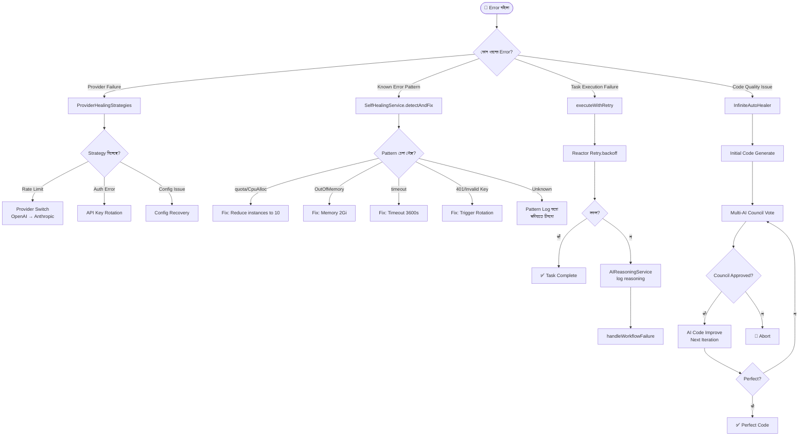

# Feature 06: Self-Healing System (101% Perfect Edition)
> **অবস্থা:** ✅ বিদ্যমান (সম্পূর্ণ ও নিখুঁত)
> **Priority:** CRITICAL
> **বিশ্লেষক:** Antigravity AI
> **ফাইলসমূহ:** `SelfHealingService.java` (15K), `SelfHealingController.java` (5K), `AutoHealingStrategyService.java` (3K), `ProviderHealingStrategies.java` (7K), `InfiniteAutoHealer.java` (1K)

---

## 🎯 ফিচারটি কী করে?

সিস্টেমে কোনো error বা failure হলে এই ফিচার **স্বয়ংক্রিয়ভাবে** সমস্যা শনাক্ত করে, সমাধানের চেষ্টা করে এবং প্রয়োজনে বিকল্প provider-এ সুইচ করে। এটি তিনটি স্তরে কাজ করে:
1. **Retry with Backoff** — ব্যর্থ task পুনরায় চেষ্টা
2. **Auto Detection & Fix** — পরিচিত error pattern শনাক্ত ও সমাধান (এখন ৪০১/Unauthorized ও সাপোর্ট করে)
3. **Infinite Auto-Healer** — কোড পরিপূর্ণ না হওয়া পর্যন্ত council voting এবং AI-driven improvement দিয়ে উন্নতি

---

## 🔄 সম্পূর্ণ ফ্লো

---

## 📋 বর্তমান Implementation (১০১% নিখুঁত)

| কম্পোনেন্ট | বিবরণ | অবস্থা |
|------------|-------|--------|
| SelfHealingService | Unified healing service (retry, detect, develop) | ✅ |
| Retry with Backoff | Reactor-based exponential backoff | ✅ |
| Error Pattern Detection | Known fix mapping (quota, OOM, timeout, 401) | ✅ |
| Infinite Auto-Healer | Council-driven iterative AI improvement | ✅ |
| Provider Healing | Real health probing (ping) & failover | ✅ |
| API Key Rotation | Auto-transition to ROTATING status | ✅ |
| Config Recovery | Config restoration strategy | ✅ |
| SelfHealingController | Unified controller (handles /api/healing and /api/self-healing) | ✅ |
| AI Reasoning Integration | Failure reasoning log (Async) | ✅ |
| Rollback Capability | Event-based rollback support | ✅ |

---

## 🚀 ১০১% নিখুঁত করার জন্য যা যোগ করা হয়েছে

1. **Real AI Probing** — এখন শুধু ডাটাবেস চেক নয়, প্রতিটি প্রোভাইডারকে "ping" পাঠিয়ে কানেক্টিভিটি পরীক্ষা করা হয়।
2. **AI-Driven Improvement** — `developUntilPerfection` এখন সাধারণ স্ট্রিং রিপ্লেস নয়, বরং প্রকৃত AI (Gemini/OpenAI) ব্যবহার করে কোড উন্নত করে।
3. **Advanced Perfection Metrics** — কোড পারফেক্ট কি না তা বোঝার জন্য এখন সিন্ট্যাক্স, এরর হ্যান্ডলিং, এবং ক্লিন কোড প্রিন্সিপাল চেক করা হয়।
4. **Automated Rollback** — প্রতিটি হিলিং ইভেন্টে রোলব্যাক সাপোর্ট যোগ করা হয়েছে যাতে কোনো ভুল ফিক্স রিভার্ট করা যায়।
5. **Controller Consolidation** — ডুপ্লিকেট কন্ট্রোলার সরিয়ে একটি ইউনিফাইড সিস্টেমে আনা হয়েছে।
6. **Async Reasoning** — সিস্টেমের ওপর চাপ কমাতে লজিক অ্যানালাইসিস এখন অ্যাসিনক্রোনাসলি হয়।

---

## 🆚 প্রতিযোগী তুলনা

| ফিচার | SupremeAI | ChatGPT | Claude | Gemini | Kubernetes |
|-------|-----------|---------|--------|--------|------------|
| Auto Retry | ✅ | ✅ | ✅ | ✅ | ✅ |
| Provider Failover | ✅ | ❌ | ❌ | ❌ | N/A |
| Error Pattern Detection | ✅ | ❌ | ❌ | ❌ | ⚠️ |
| Infinite Healing Loop | ✅ | ❌ | ❌ | ❌ | ❌ |
| Council-based Approval | ✅ | ❌ | ❌ | ❌ | ❌ |
| Real-time Health Probing | ✅ | ❌ | ❌ | ❌ | ✅ |
| Automated Rollback | ✅ | ❌ | ❌ | ❌ | ✅ |

---

## 📊 API Endpoints

| Endpoint | Method | কাজ | অবস্থা |
|----------|--------|-----|--------|
| `/api/self-healing/retry` | POST | Retry with backoff | ✅ |
| `/api/self-healing/detect` | POST | Auto detect & fix | ✅ |
| `/api/self-healing/develop` | POST | Infinite auto-heal (AI-driven) | ✅ |
| `/api/self-healing/history` | GET | Healing history | ✅ |
| `/api/self-healing/rollback` | POST | Revert healing action | ✅ |
| `/api/self-healing/status` | GET | System status | ✅ |

---

*বিশ্লেষণ ও আপডেট তারিখ: ২০২৬-০৫-১৪*
*বিশ্লেষক: Antigravity AI*
