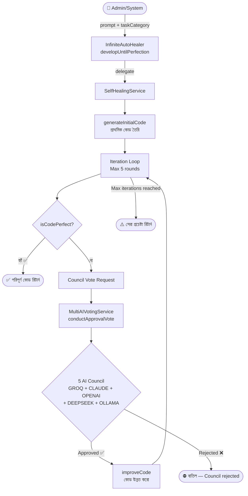

# Feature 07: Self-Extension (Auto Code Generation)
> **অবস্থা:** ⚠️ আংশিক
> **Priority:** HIGH
> **ফাইলসমূহ:** `InfiniteAutoHealer.java` (1K), `SelfHealingService.developUntilPerfection()`, `CodeGenerationService.java`, `MultiAIVotingService.conductApprovalVote()`

---

## 🎯 ফিচারটি কী করে?

SupremeAI নিজের কোড নিজেই লিখতে পারে এবং উন্নত করতে পারে। একটি task দিলে সিস্টেম:
1. প্রাথমিক কোড তৈরি করে
2. Multi-AI Council ভোট দিয়ে যাচাই করে
3. কোড "পরিপূর্ণ" না হওয়া পর্যন্ত পুনরায় উন্নত করে

---

## 🔄 সম্পূর্ণ ফ্লো



---

## 📋 বর্তমান Implementation

### ✅ যা আছে:

| কম্পোনেন্ট | বিবরণ | অবস্থা |
|------------|-------|--------|
| InfiniteAutoHealer | Delegate wrapper to SelfHealingService | ✅ |
| developUntilPerfection | Iterative improvement loop | ✅ |
| Council Voting | 5 AI provider approval vote | ✅ |
| Initial Code Generation | Simplified placeholder | ⚠️ খুবই সরল |
| Code Perfection Check | Basic TODO absence check | ⚠️ খুবই সরল |
| Code Improvement | Simple string replacement | ⚠️ খুবই সরল |

### ⚠️ সমস্যার বিবরণ:

বর্তমান implementation অনেক **simplified**:

```java
// generateInitialCode — শুধু placeholder template
private String generateInitialCode(String prompt) {
    return "// Initial code for: " + prompt + "\npublic class Generated {\n    // TODO: Implement\n}";
}

// isCodePerfect — শুধু TODO অনুপস্থিতি check
private boolean isCodePerfect(String code) {
    return code.contains("public") && code.contains("class") && !code.contains("TODO");
}

// improveCode — শুধু string replace
private String improveCode(String currentCode, String prompt, int iteration) {
    return currentCode.replace("TODO", "Implemented in iteration " + (iteration + 1));
}
```

এই পুরো flow-টি একটি **proof-of-concept** — প্রকৃত AI-powered code generation এখানে নেই।

---

## ❌ কী মিসিং?

| মিসিং অংশ | প্রভাব | জরুরিতা |
|-----------|--------|---------|
| **AI-powered code generation** — প্রকৃত AI দিয়ে কোড লেখা | placeholder output | 🔴 Critical |
| **Compilation verification** — কোড compile হয় কিনা check | ভুল কোড pass হয় | 🔴 Critical |
| **Test execution** — automated test run | quality assurance নেই | 🔴 Critical |
| **AST analysis** — কোডের structure বিশ্লেষণ | surface-level check | 🟡 High |
| **Multi-file generation** — একটি ফাইলের বেশি | single file only | 🟡 High |
| **Language support** — বিভিন্ন ভাষায় কোড | Java-only pattern | 🟡 High |
| **Version control** — iteration-wise git commit | কোনো versioning নেই | 🟠 Medium |
| **Code review integration** — human approval step | fully automated | 🟠 Medium |
| **Dependency resolution** — package/import handle | manual setup | 🟠 Medium |

---

## 🆚 প্রতিযোগী তুলনা

| ফিচার | SupremeAI | Cursor | GitHub Copilot | Devin | Replit Agent |
|-------|-----------|--------|----------------|-------|--------------|
| Auto Code Gen | ⚠️ | ✅ | ✅ | ✅ | ✅ |
| Multi-AI Council | ✅ | ❌ | ❌ | ❌ | ❌ |
| Iterative Improvement | ⚠️ | ✅ | ❌ | ✅ | ✅ |
| Compilation Check | ❌ | ✅ | ❌ | ✅ | ✅ |
| Test Execution | ❌ | ✅ | ❌ | ✅ | ✅ |
| Multi-file Support | ❌ | ✅ | ✅ | ✅ | ✅ |
| Git Integration | ❌ | ✅ | ✅ | ✅ | ✅ |

---

## 📊 API Endpoints

| Endpoint | Method | কাজ | অবস্থা |
|----------|--------|-----|--------|
| `/api/self-healing/develop` | POST | Develop until perfection | ✅ (simplified) |
| `/api/healing/develop` | POST | Same (unified) | ✅ (simplified) |
| `/api/self-extension/generate` | POST | Full code generation | ❌ মিসিং |
| `/api/self-extension/status/{id}` | GET | Generation progress | ❌ মিসিং |
| `/api/self-extension/history` | GET | Generation history | ❌ মিসিং |

---

*বিশ্লেষণ তারিখ: ২০২৬-০৫-১৪*
