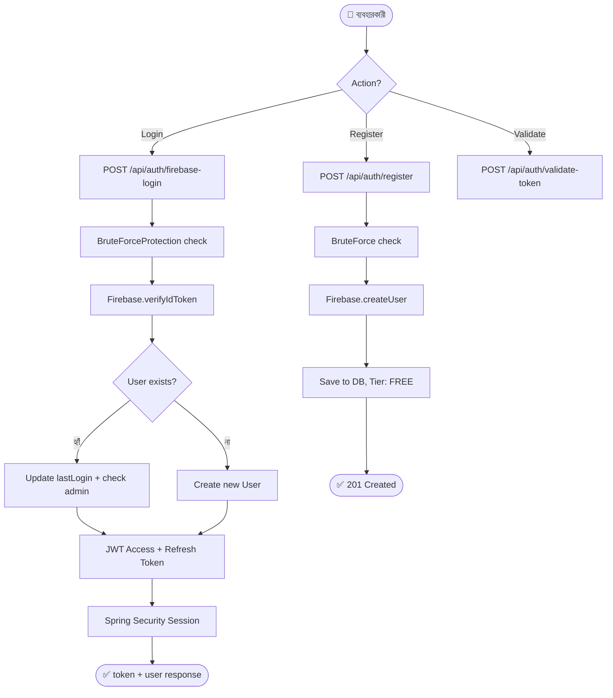

# Feature 08: Authentication & User Management
> **অবস্থা:** ✅ বিদ্যমান (সম্পূর্ণ)
> **Priority:** CRITICAL
> **ফাইলসমূহ:** `AuthenticationService.java` (8K), `AuthenticationController.java` (8K), `JwtAuthFilter.java`, `BruteForceProtectionService.java`, `User.java`, `UserTier.java`

---

## 🎯 ফিচারটি কী করে?

ব্যবহারকারীর নিবন্ধন, লগইন, সেশন ব্যবস্থাপনা এবং অ্যাক্সেস কন্ট্রোল পরিচালনা করে। Firebase Authentication + JWT token ভিত্তিক।

---

## 🔄 সম্পূর্ণ ফ্লো

---

## 📋 বর্তমান Implementation

| কম্পোনেন্ট | বিবরণ | অবস্থা |
|------------|-------|--------|
| Firebase Login | `verifyIdToken` দিয়ে login | ✅ |
| User Registration | Firebase createUser + DB | ✅ |
| JWT Token | Access + Refresh token | ✅ |
| Brute Force Protection | IP-based rate limiting | ✅ |
| Session Management | Spring Security + HttpSession | ✅ |
| Admin Detection | Email + Firebase claims | ✅ |
| Tier System | FREE, PRO, ENTERPRISE, ADMIN | ✅ |
| Activity Logging | Login/Register events | ✅ |
| Current User (`/me`) | Session-based user info | ✅ |
| Logout | Session invalidation | ✅ |

---

## ❌ কী মিসিং?

| মিসিং অংশ | প্রভাব | জরুরিতা |
|-----------|--------|---------|
| **Email verification** | unverified accounts | 🔴 Critical |
| **Password reset** | recovery নেই | 🔴 Critical |
| **OAuth2 social login** (Google/GitHub) | শুধু email/pass | 🟡 High |
| **MFA/2FA** | single factor only | 🟡 High |
| **Granular RBAC** | শুধু USER/ADMIN | 🟡 High |
| **SSO integration** | enterprise missing | 🟡 High |
| **User profile management** | basic profile | 🟠 Medium |
| **Token auto-refresh** | manual refresh | 🟠 Medium |

---

## 🆚 প্রতিযোগী তুলনা

| ফিচার | SupremeAI | ChatGPT | Claude | Gemini |
|-------|-----------|---------|--------|--------|
| Email/Password | ✅ | ✅ | ✅ | ✅ |
| Firebase Auth | ✅ | ❌ | ❌ | ✅ |
| Social Login | ❌ | ✅ | ✅ | ✅ |
| MFA/2FA | ❌ | ✅ | ✅ | ✅ |
| JWT Tokens | ✅ | ✅ | ✅ | ✅ |
| Brute Force | ✅ | ✅ | ✅ | ✅ |

---

## 📊 API Endpoints

| Endpoint | Method | কাজ | অবস্থা |
|----------|--------|-----|--------|
| `/api/auth/firebase-login` | POST | Firebase login | ✅ |
| `/api/auth/register` | POST | Registration | ✅ |
| `/api/auth/validate-token` | POST | Token validation | ✅ |
| `/api/auth/me` | GET | Current user | ✅ |
| `/api/auth/logout` | POST | Logout | ✅ |
| `/api/auth/reset-password` | POST | Password reset | ❌ মিসিং |
| `/api/auth/verify-email` | POST | Email verify | ❌ মিসিং |
| `/api/auth/refresh-token` | POST | Token refresh | ❌ মিসিং |

---

*বিশ্লেষণ তারিখ: ২০২৬-০৫-১৪*
