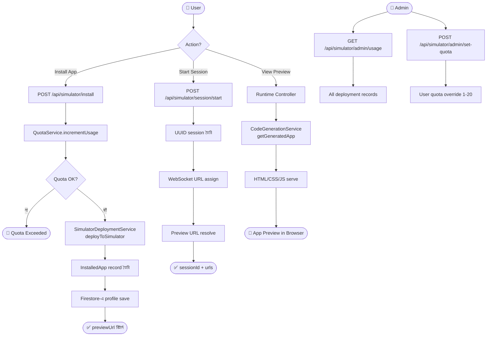

# Feature 10: App Simulator / Preview System
> **অবস্থা:** ✅ বিদ্যমান (সম্পূর্ণ)
> **Priority:** HIGH
> **ফাইলসমূহ:** `SimulatorService.java` (12K), `SimulatorController.java` (14K), `SimulatorRuntimeController.java`, `SimulatorDeploymentService.java`, `SimulatorWebSocketHandler.java`, `UserSimulatorProfile.java`

---

## 🎯 ফিচারটি কী করে?

AI দিয়ে তৈরি করা অ্যাপ্লিকেশনগুলো **সরাসরি ব্রাউজারে preview** করা যায়। Virtual device simulator (Pixel 6, Samsung Galaxy, iPhone ইত্যাদি) ব্যবহার করে অ্যাপ ইনস্টল, চালানো এবং পরীক্ষা করার সুবিধা দেয়।

---

## 🔄 সম্পূর্ণ ফ্লো

---

## 📋 বর্তমান Implementation

| কম্পোনেন্ট | বিবরণ | অবস্থা |
|------------|-------|--------|
| App Install | Quota-controlled installation | ✅ |
| App Uninstall | Clean removal + undeploy | ✅ |
| Session Management | Start/Stop/Status | ✅ |
| WebSocket Support | Real-time session communication | ✅ |
| Device Profiles | Pixel 6, Galaxy, iPhone etc. | ✅ |
| Deployment Service | HTML preview deployment | ✅ |
| Quota Integration | Tier-based install limits | ✅ |
| Admin Usage View | All deployments listing | ✅ |
| Admin Quota Override | Per-user quota (1-20) | ✅ |
| Audit Integration | @Audited annotation | ✅ |
| Profile Management | User simulator profiles | ✅ |
| Generated App Fetch | Code gen service bridge | ✅ |

---

## ❌ কী মিসিং?

| মিসিং অংশ | প্রভাব | জরুরিতা |
|-----------|--------|---------|
| **Hot reload** — কোড পরিবর্তনে live update | manual restart | 🔴 Critical |
| **Multi-device preview** — একসাথে ৩ device | একটি only | 🟡 High |
| **Touch/gesture simulation** — swipe, pinch | click only | 🟡 High |
| **Network throttling** — slow 3G simulation | no throttle | 🟠 Medium |
| **Screenshot capture** — preview screenshot | manual | 🟠 Medium |
| **Console/debug output** — JS console দেখা | hidden | 🟡 High |
| **Responsive testing** — viewport switching | fixed device | 🟠 Medium |
| **Performance metrics** — FPS, load time | no metrics | 🟠 Medium |

---

## 🆚 প্রতিযোগী তুলনা

| ফিচার | SupremeAI | Replit | CodeSandbox | Vercel Preview |
|-------|-----------|--------|-------------|----------------|
| In-browser Preview | ✅ | ✅ | ✅ | ✅ |
| Device Simulation | ✅ | ❌ | ❌ | ❌ |
| WebSocket Session | ✅ | ✅ | ✅ | ❌ |
| Hot Reload | ❌ | ✅ | ✅ | ✅ |
| Multi-device | ❌ | ❌ | ❌ | ❌ |
| Quota System | ✅ | ✅ | ✅ | ❌ |
| Console Output | ❌ | ✅ | ✅ | ❌ |

---

## 📊 API Endpoints

| Endpoint | Method | কাজ | অবস্থা |
|----------|--------|-----|--------|
| `/api/simulator/profile` | GET | User profile | ✅ |
| `/api/simulator/profile` | POST | Update profile | ✅ |
| `/api/simulator/install` | POST | Install app | ✅ |
| `/api/simulator/install/{id}` | DELETE | Uninstall | ✅ |
| `/api/simulator/installed` | GET | Installed list | ✅ |
| `/api/simulator/session/start` | POST | Start session | ✅ |
| `/api/simulator/session/stop` | POST | Stop session | ✅ |
| `/api/simulator/session/status` | GET | Session status | ✅ |
| `/api/simulator/devices` | GET | Device list | ✅ |
| `/api/simulator/admin/usage` | GET | Admin usage | ✅ |
| `/api/simulator/admin/set-quota/{id}` | POST | Set quota | ✅ |

---

*বিশ্লেষণ তারিখ: ২০২৬-০৫-১৪*
