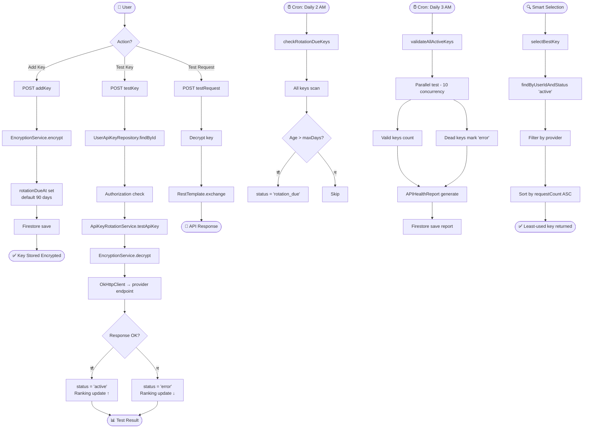

# Feature 15: API Key Management & Rotation
> **অবস্থা:** ✅ বিদ্যমান (সম্পূর্ণ)
> **Priority:** CRITICAL
> **ফাইলসমূহ:** `UserApiKeyService.java` (270 lines), `ApiKeyRotationService.java` (301 lines), `EncryptionService.java`, `UserApiKey.java`, `UserApiKeyRepository.java`, `APIHealthReport.java`, `APIHealthReportRepository.java` + ১৫+ DTO ফাইল

---

## 🎯 ফিচারটি কী করে?

ব্যবহারকারীদের নিজস্ব AI API keys পরিচালনা করে — **AES encryption** দিয়ে সংরক্ষণ, **automatic rotation** শিডিউলিং, **live testing** (11+ provider সমর্থিত), **health report** তৈরি এবং **smart key selection** (lowest usage key pick)।

---

## 🔄 সম্পূর্ণ ফ্লো

---

## 📋 বর্তমান Implementation

| কম্পোনেন্ট | বিবরণ | অবস্থা |
|------------|-------|--------|
| CRUD Operations | Add, Update, Delete, List | ✅ |
| AES Encryption | Store/retrieve encrypted | ✅ |
| Key Masking | masked display in list | ✅ |
| Bulk Delete | Multi-key delete | ✅ |
| Key Testing | Live provider validation | ✅ |
| API Request Testing | Proxy test requests | ✅ |
| Test All Keys | Global validation run | ✅ |
| Health Reports | Dead/valid/rotation stats | ✅ |
| Smart Selection | Lowest-usage key pick | ✅ |
| Rotation Check | Daily cron at 2 AM | ✅ |
| Validation Cron | Daily cron at 3 AM | ✅ |
| Provider Configs | 11 providers configured | ✅ |
| Authorization | userId ownership check | ✅ |
| Activity Logging | Delete/Bulk actions logged | ✅ |
| Ranking Integration | Test outcomes → rankings | ✅ |
| Usage Stats | Per-provider breakdown | ✅ |

### সমর্থিত Provider এন্ডপয়েন্ট:

| Provider | Auth Method | Rotation Days | Max Keys |
|----------|------------|---------------|----------|
| OpenAI | Bearer | 90 | 5 |
| Google AI | QueryParam | 90 | 10 |
| Anthropic | x-api-key | 90 | 5 |
| Groq | Bearer | 60 | 3 |
| Mistral | Bearer | 90 | 5 |
| DeepSeek | Bearer | 90 | 5 |
| xAI | Bearer | 90 | 3 |
| OpenRouter | Bearer | 90 | 10 |
| Together AI | Bearer | 90 | 5 |
| Fireworks AI | Bearer | 90 | 5 |
| Cohere | Bearer | 90 | 5 |

---

## ❌ কী মিসিং?

| মিসিং অংশ | প্রভাব | জরুরিতা |
|-----------|--------|---------|
| **Auto-rotation** — expired key auto-regenerate | manual rotation | 🟡 High |
| **Key Sharing** — team-level key sharing | user-only | 🟠 Medium |
| **Cost Tracking** — per-key spending analysis | estimated only | 🟡 High |
| **Key Scoping** — model-specific permissions | full access | 🟠 Medium |
| **Webhook Alerts** — rotation/expiry notifications | no alerts | 🟠 Medium |
| **Import/Export** — key backup/restore | no backup | 🟠 Medium |

---

## 🆚 প্রতিযোগী তুলনা

| ফিচার | SupremeAI | OpenAI Platform | AWS Secrets Manager | HashiCorp Vault |
|-------|-----------|-----------------|---------------------|----------------|
| Encrypted Storage | ✅ | ✅ | ✅ | ✅ |
| Auto Rotation Check | ✅ | ❌ | ✅ | ✅ |
| Live Validation | ✅ | ❌ | ❌ | ❌ |
| Smart Selection | ✅ | ❌ | ❌ | ❌ |
| Health Reports | ✅ | ❌ | ❌ | ✅ |
| Multi-Provider | ✅ (11) | ❌ (1) | ✅ | ✅ |
| Auto-Regeneration | ❌ | ❌ | ✅ | ✅ |
| Cost Tracking | ❌ | ✅ | ❌ | ❌ |

---

*বিশ্লেষণ তারিখ: ২০২৬-০৫-১৪*
