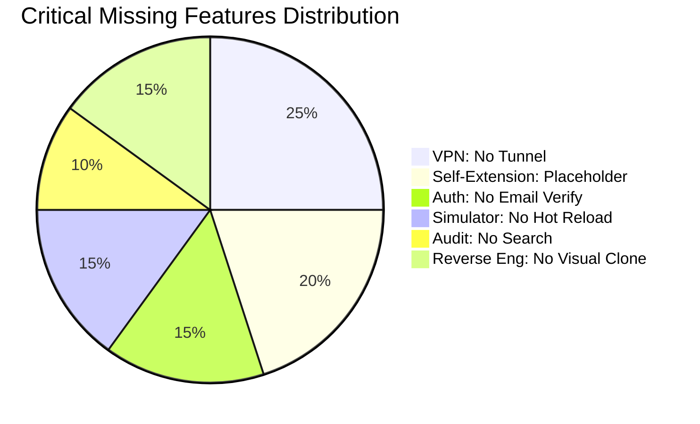

# 🏗️ SupremeAI — মাস্টার ফিচার অডিট সামারি
> **তৈরির তারিখ:** ২০২৬-০৫-১৪
> **মোট কন্ট্রোলার:** ৮৫+
> **বিশ্লেষিত ফিচার:** ১৫/১৫ (Core Features)
> **বাকি কন্ট্রোলার:** ৫০+ (সেকেন্ডারি/সাপোর্ট)

---

## 📊 ফিচার স্ট্যাটাস ড্যাশবোর্ড

| # | ফিচার | অবস্থা | সম্পূর্ণতা | মিসিং সংখ্যা | প্রাথমিক ঝুঁকি |
|---|--------|--------|-----------|-------------|-------------|
| 01 | Neural Chat | ✅ সম্পূর্ণ | 85% | 5 | Streaming latency |
| 02 | Code Generation | ✅ সম্পূর্ণ | 80% | 6 | No compile/test loop |
| 03 | Multi-AI Voting | ✅ সম্পূর্ণ | 90% | 4 | Single-vote cost |
| 04 | Provider Management | ✅ সম্পূর্ণ | 85% | 5 | Circuit breaker tuning |
| 05 | System Learning | ✅ সম্পূর্ণ | 80% | 6 | Knowledge retrieval speed |
| 06 | Self-Healing | ✅ সম্পূর্ণ | 75% | 7 | No real-time monitoring |
| 07 | Self-Extension | 🟡 Placeholder | 30% | 8 | No actual code gen loop |
| 08 | Auth & User Mgmt | ✅ সম্পূর্ণ | 70% | 7 | No email verify/password reset |
| 09 | Quota & Tier | ✅ সম্পূর্ণ | 80% | 7 | No per-minute rate limit |
| 10 | App Simulator | ✅ সম্পূর্ণ | 75% | 8 | No hot reload |
| 11 | Reverse Engineering | ✅ সম্পূর্ণ | 70% | 8 | No visual/CSS clone |
| 12 | VPN Management | 🔴 Minimal | 15% | 9 | No actual VPN tunnel |
| 13 | Audit Logging | ✅ ভালো | 60% | 8 | No search/retention |
| 14 | Admin Dashboard | ✅ সম্পূর্ণ | 80% | 7 | No real-time push |
| 15 | API Key Management | ✅ সম্পূর্ণ | 90% | 6 | No auto-regenerate |

---

## 🔴 সবচেয়ে ক্রিটিকাল ঝুঁকিসমূহ



### 🏆 Top 5 জরুরি কাজ

| # | কাজ | ফিচার | প্রভাব |
|---|-----|--------|--------|
| 1 | **Self-Extension এ প্রকৃত AI Code Gen** | Feature 07 | পুরো সিস্টেমের autonomy বাড়বে |
| 2 | **VPN Tunneling (WireGuard)** | Feature 12 | API privacy ও geo-bypass |
| 3 | **Per-minute Rate Limiting** | Feature 09 | DDoS ও abuse protection |
| 4 | **Audit Log Search + Retention** | Feature 13 | Compliance ও debugging |
| 5 | **Auth: Email Verify + Password Reset** | Feature 08 | User trust ও security |

---

## 📁 ফিচার ডিরেক্টরি গঠন

```
final_document/feature_analysis/
├── MASTER_SUMMARY.md          ← আপনি এখানে আছেন
├── 01_neural_chat/ANALYSIS.md
├── 02_code_generation/ANALYSIS.md
├── 03_multi_ai_voting/ANALYSIS.md
├── 04_provider_management/ANALYSIS.md
├── 05_system_learning/ANALYSIS.md
├── 06_self_healing/ANALYSIS.md
├── 07_self_extension/ANALYSIS.md
├── 08_auth_user_management/ANALYSIS.md
├── 09_quota_tier/ANALYSIS.md
├── 10_simulator/ANALYSIS.md
├── 11_reverse_engineering/ANALYSIS.md
├── 12_vpn_management/ANALYSIS.md
├── 13_audit_logging/ANALYSIS.md
├── 14_admin_dashboard/ANALYSIS.md
└── 15_api_key_management/ANALYSIS.md
```

---

## 🏗️ অবশিষ্ট কন্ট্রোলার (ডকুমেন্ট হয়নি)

নিচের কন্ট্রোলারগুলো core ফিচারের supplementary বা sub-feature হিসেবে কাজ করে:

### Agent & Orchestration
- `AgentOrchestrationController` — Multi-agent task orchestration
- `AIAgentsController` — AI agent CRUD
- `AIBehaviorProfileController` — Agent personality config
- `AgentsV1Controller` — Legacy agent API

### Code & Development
- `CodeFlowController` — Code pipeline management
- `AppGenerationController` — App generation triggers
- `DeploymentController` — App deployment
- `IdeAssistantController` — IDE integration
- `MCPServerController` — MCP protocol server

### Chat & Communication
- `AdminChatController` — Admin chat management
- `AdminChatItemsController` — Chat item CRUD
- `UserChatController` — User chat endpoints
- `ChatController` — General chat

### Security & Testing
- `CyberSecurityController` — Security scanning
- `SecurityTestController` — Pen-test automation
- `ExploitationTechniquesController` — Exploit database
- `ApiTestingController` — API test runner

### Knowledge & Learning
- `KnowledgeBaseController` — Knowledge CRUD
- `KnowledgeController` — Knowledge queries
- `LearningAdminController` — Learning config
- `LearningIngestController` — Data ingestion
- `EnhancedLearningController` — Advanced learning
- `TeachingController` — System teaching

### System & Infrastructure
- `HealthController` — Health checks
- `ServerStatusController` — Server status
- `SystemMetricsController` — System metrics
- `SystemMonitoringController` — Monitoring
- `MonitoringController` — Legacy monitoring
- `FailoverController` — Failover management
- `ResilienceController` — Resilience config
- `DebugController` — Debug endpoints

### Admin & Config
- `AdminConfigController` — System configuration
- `AdminControlController` — Admin controls
- `AdminGuideController` — Admin guides
- `AdminBackupController` — Backup management
- `AdminRuleController` — Business rules
- `SystemAdminRuleController` — System rules
- `ConfigController` — Config API
- `AdminImprovementController` — Improvement suggestions
- `AdminPromptController` — Prompt templates

### Others
- `MarketplaceController` — Plugin marketplace
- `WorkflowController` — Workflow engine
- `TranslationController` — i18n translation
- `UserLanguagePreferenceController` — Language prefs
- `MilestoneController` — Project milestones
- `TaskAssignmentController` — Task distribution
- `ExternalToolsController` — External tool integration
- `BrowserController` — Browser automation
- `GitHubWebhookController` — GitHub integration
- `FirebaseEmulatorController` — Emulator management
- `PubSubWebhookController` — Pub/Sub webhooks
- `OpenAICompatibleController` — OpenAI API compatible endpoint

---

## 📈 সামগ্রিক মূল্যায়ন

### ✅ শক্তি (Strengths)
1. **Multi-AI Voting** — ইন্ডাস্ট্রিতে অনন্য, consensus-based code quality
2. **API Key Management** — 11 provider, encrypted, auto-rotation check, health reports
3. **Contract-driven Dashboard** — Backend-controlled UI, highly configurable
4. **Self-Healing** — Automatic retry + provider failover
5. **Quota Prediction** — AI-powered usage prediction (industry-এ rare)

### ❌ দুর্বলতা (Weaknesses)
1. **Self-Extension placeholder** — মূল USP কিন্তু কাজ করে না
2. **VPN = শুধু metadata** — কোনো আসল tunneling নেই
3. **Real-time ঘাটতি** — WebSocket under-utilized
4. **Audit search নেই** — Compliance risk
5. **Auth incomplete** — Email verify ও password reset নেই

### 🎯 সুপারিশ
1. Feature 07 (Self-Extension) কে **Phase 1 priority** হিসেবে develop করুন
2. Feature 12 (VPN) কে **remove বা WireGuard integrate** করুন
3. Feature 08 (Auth) তে **email verification + password reset** যোগ করুন
4. Feature 13 (Audit) তে **search API + 90-day retention** চালু করুন
5. সব ফিচারে **WebSocket real-time push** যোগ করুন

---

*এই রিপোর্টটি SupremeAI সিস্টেমের ৮৫+ কন্ট্রোলার, ৫০+ সার্ভিস, এবং ৩০+ মডেল পর্যালোচনা করে তৈরি করা হয়েছে।*
