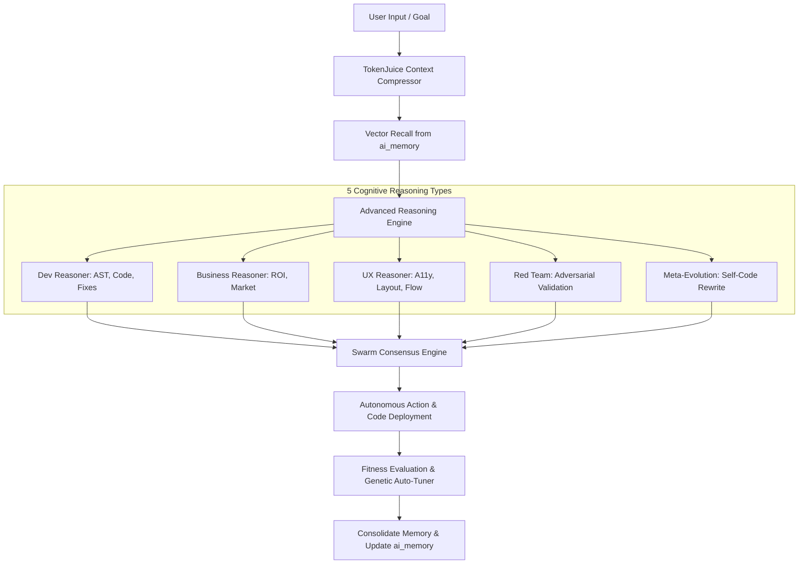

# 🧠 SupremeAI Intelligence & Self-Evolution Master Blueprint

**Document Version:** 3.0.0 (Canonical Source of Truth)  
**System Phase:** **Phase 3: Self-Evolving & Multi-Agent Swarm**  
**Classification:** Cognitive Intelligence & Dynamic Evolution Engine

---

## 🎯 1. Core Principles: The Eternal Brain

> "Third-party AI providers are transient processing muscle ($0-Cost Muscle). The true intelligence and memory of SupremeAI resides in its Continuous Learning Matrix and Persistent Vector Brain (`ai_memory`)."

SupremeAI আগে থেকে কিছু হার্ডকোড করে না; রানটাইমে ইউজারের নির্দেশ রীজন করে, মেমোরি থেকে টুল রিকল করে এবং কাজ সম্পন্নের পর নিজের স্কিল অপটিমাইজ করে।

---

## 🧬 2. Dynamic Living Engine Architecture

### A. 5 Reasoning Types & Adapters
1. **DevAdapter:** টাইপ-সেফ কোড জেনারেশন, টেস্ট কভারেজ জেনারেশন, এবং ডিফেন্সিভ এক্সেপশন হ্যান্ডলিং।
2. **BusinessAdapter:** খরচ নিয়ন্ত্রণ ($0-কস্ট পলিসি), এন্টারপ্রাইজ ভ্যালু অ্যানালাইসিস এবং ROI অপটিমাইজেশন।
3. **UXAdapter:** Geist/Shadcn প্যাটার্ন, রেসপনসিভনেস, কালার কনট্রাস্ট এবং মাইক্রো-অ্যানিমেশন।
4. **PatternRecognizer:** কোডবেসের পূর্ববর্তী ভুল এবং সফল ফিক্স থেকে লার্নিং প্যাটার্ন এক্সট্রাক্ট করা।
5. **EvolutionModule (Genetic Algorithm):** স্কিলের এক্সেকিউশন স্পিড, একিউরেসি এবং টোকেন খরচের ওপর ভিত্তি করে স্কিল মিউটেশন ও রিরাইট।

### B. TokenJuice Compression & Hierarchical Memory Tree
- **TokenJuice (`backend/engine/compression/token_juice.py`):** বিশাল কোডবেস এবং চ্যাট হিস্ট্রিকে সিম্যান্টিকালি কম্প্রেস করে ৭০-৮৫% টোকেন খরচ কমায়।
- **Hierarchical Memory Tree (`backend/memory/hierarchical_tree.py`):** L1 Working Memory -> L2 Summary Nodes -> L3 Persistent Raw Vector ট্রির মাধ্যমে দ্রুততম সময়ে প্রাসঙ্গিক তথ্য পুনরুদ্ধার।

---

## 🚀 3. Multi-Model AI Fleet & Free-Tier Router

| Provider | Primary Models | Routing Domain | Fallback Priority |
|---|---|---|---|
| **Gemini** | Gemini 2.0 Flash / Pro | Multimodal, Vision Grounding, Long-Context | Priority 1 |
| **Groq** | Llama 3.3 70B Versatile | Ultra-Low Latency Code Synthesis & Speed | Priority 1 (Parallel) |
| **Cloudflare AI** | `@cf/meta/llama-3.1-8b-instruct` | Edge Computation, Serverless Background Tasks | Priority 2 |
| **OpenRouter** | DeepSeek V3, Qwen 2.5, Mistral | Swarm Consensus & Adversarial Cross-Check | Priority 2 |
| **Ollama** | Local / Offline Fallback | Air-Gapped Privacy Mode | Priority 3 |

---

## 📈 4. Continuous Self-Evolution Lifecycle

1. **Observe:** `MaintenanceWatchdog` এবং `GapFinder` কোডবেসের টেকনিক্যাল ডেট পর্যবেক্ষণ করে।
2. **Diagnose:** `PerformanceOracle` এজেন্টদের দুর্বলতা ও ফেইলিওর পয়েন্ট নির্ণয় করে।
3. **Breed:** `AgentBreeder` ও `AutoSkillCreator` উন্নত ভ্যারিয়েন্ট তৈরি করে।
4. **Tune & Persist:** `FitnessEngine` যাচাই শেষে সফল ভ্যারিয়েন্ট স্থায়ীভাবে `ai_memory` ডাটাবেজে ইনজেক্ট করে।

---
*Canonical Master Plan — Supersedes all legacy intelligence and AI evolution drafts.*
