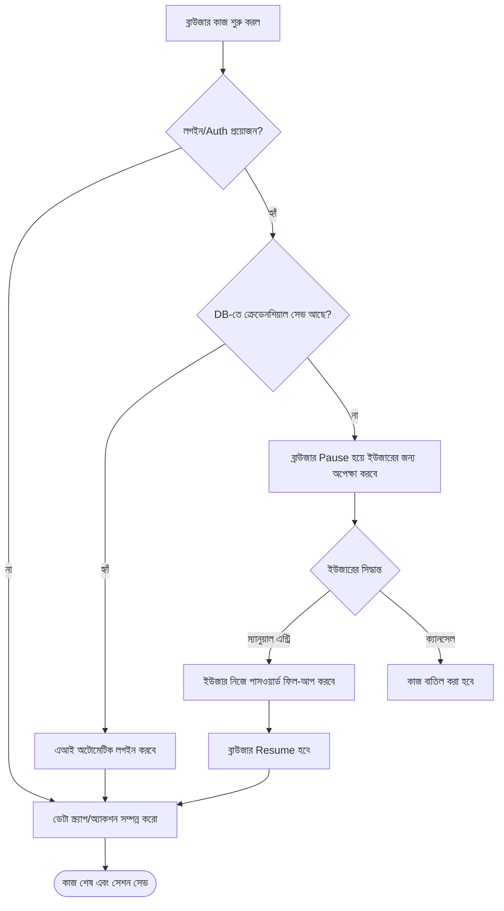

# 🌐 সুপ্রিমএআই ব্রাউজার অটোমেশন: ভিজ্যুয়াল এবং হিউম্যান-ইন-দ্য-লুপ (Human-in-the-Loop)

আমাদের Neural Chat-এর ইন্টেলিজেন্ট রাউটিং এবং "ম্যাজিক লুপ" এর পাশাপাশি **ব্রাউজার অটোমেশনের (Browser Automation)** কাজও প্রায় ৬০% সম্পন্ন হয়েছে। 

এই ডকুমেন্টটিতে নিউরাল চ্যাটের ব্যাকগ্রাউন্ড ব্রাউজিং এবং ড্যাশবোর্ডের **Browser Tab**-এর লাইভ ব্রাউজিংয়ের মধ্যে থাকা মূল পার্থক্য এবং এর অসাধারণ ফিচারগুলো বিস্তারিতভাবে তুলে ধরা হলো।

---

## 🔍 ১. নিউরাল চ্যাট বনাম ব্রাউজার ট্যাব (মূল পার্থক্য)

ব্রাউজার অটোমেশনের মূল মেকানিজম (Jsoup + Playwright) একই হলেও, ব্যবহারের ক্ষেত্রে এদের মধ্যে দুটি বড় পার্থক্য রয়েছে: **দৃশ্যমানতা (Visibility)** এবং **মানুষের হস্তক্ষেপ (Human Intervention)**।

| ফিচার | নিউরাল চ্যাট ব্রাউজার (Background) | ড্যাশবোর্ড ব্রাউজার ট্যাব (Foreground) |
| :--- | :--- | :--- |
| **দৃশ্যমানতা** | এআই ব্যাকগ্রাউন্ডে গোপনে স্ক্র্যাপ করে আনে। ইউজার শুধু ফাইনাল উত্তরটি দেখতে পায়। | ইউজার স্ক্রিনে লাইভ দেখতে পাবে ব্রাউজার কোন ওয়েবসাইটে যাচ্ছে এবং কী করছে। |
| **হস্তক্ষেপ** | সম্পূর্ণ স্বয়ংক্রিয় (Autonomous)। ইউজারের কোনো কন্ট্রোল থাকে না। | ইউজার যেকোনো সময় হস্তক্ষেপ (Intervention) করতে পারবে। |
| **লগইন এক্সেস** | লগইন ওয়াল বা ক্যাপচা (CAPTCHA) আসলে অনেক সময় ফেইল করতে পারে। | ইউজার নিজে লগইন করে দিতে পারে বা ক্রেডেনশিয়াল সেভ করতে পারে। |

---

## 🕹️ ২. হিউম্যান ইন্টারভেনশন এবং কন্ট্রোল (Human Control Features)

ব্রাউজার ট্যাবে এআই-এর কাজের ওপর ইউজারের সম্পূর্ণ নিয়ন্ত্রণ থাকবে। এটি সিস্টেমকে অনেক বেশি ফ্লেক্সিবল করে তুলবে:

### ⏸️ Pause এবং Resume
এআই যখন কোনো ওয়েবসাইট থেকে ডেটা স্ক্র্যাপ করছে বা কোনো কাজ করছে, তখন ইউজার চাইলে যেকোনো মুহূর্তে `Pause` বাটনে ক্লিক করে ব্রাউজারটিকে থামিয়ে দিতে পারে। প্রয়োজন অনুযায়ী যাচাই করে আবার `Resume` বাটনে ক্লিক করলে এআই সেখান থেকেই কাজ শুরু করবে।

### 🔐 লগইন এবং ক্রেডেনশিয়াল হ্যান্ডলিং (Login Access)
এটি ব্রাউজার ট্যাবের সবচেয়ে শক্তিশালী ফিচার! 
*   **অটোমেটিক লগইন:** ব্রাউজার যদি এমন কোনো সাইটে যায় যেখানে লগইন প্রয়োজন (যেমন HuggingFace, StackOverflow), তবে এটি ডাটাবেসে সেভ থাকা **Stored Credentials** ব্যবহার করে নিজে নিজেই লগইন করে নিতে পারবে।
*   **ম্যানুয়াল ফিল-আপ (Manual Fill-up):** ডাটাবেসে পাসওয়ার্ড না থাকলে ব্রাউজার লগইন পেজে গিয়ে পজ (Pause) হয়ে ইউজারের অনুমতির অপেক্ষা করবে। তখন ইউজার ড্যাশবোর্ড থেকে পাসওয়ার্ড ফিল-আপ করে দিয়ে এআই-কে আবার কাজ শুরু করার নির্দেশ দিতে পারবে।
*   **সেশন কুকিজ (Session Cookies):** একবার লগইন হয়ে গেলে ব্রাউজার সেই Session Cookie সেভ করে রাখবে, যাতে পরবর্তীতে আর লগইন করতে না হয়।

---

## 🏗️ ৩. আর্কিটেকচারাল ফ্লো (Flowchart)

নিচের ডায়াগ্রামটি দেখায় ব্রাউজার ট্যাবে হিউম্যান ইন্টারভেনশন কীভাবে কাজ করে:

