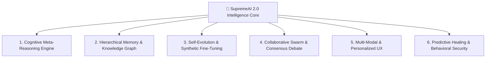
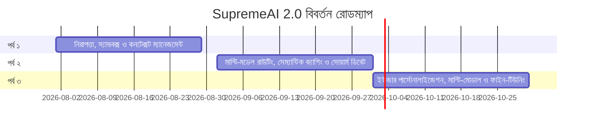

# 🧠 SupremeAI 2.0 — সিস্টেম বুদ্ধিমত্তা সম্প্রসারণের মাস্টারশিপ পরিকল্পনা (AI Intelligence Evolution Plan)

**তারিখ:** ২৭ জুলাই, ২০২৬  
**লক্ষ্য:** SupremeAI 2.0-কে একটি সম্পূর্ণ স্ব-শিখনশীল (Self-Learning), প্রজ্ঞাবান (Cognitive), মাল্টি-মোডাল এবং স্বায়ত্তশাসিত (Autonomous AGI-Grade) এআই ইকোসিস্টেমে উন্নীত করা।

---

## 🏗️ বুদ্ধিমান বিবর্তনের ৬টি মূল স্তম্ভ (The 6 Pillars of Intelligence)

---

### 1️⃣ কগনিটিভ মেটা-রিজনিং এবং ট্রি-অফ-থট ইঞ্জিন (Cognitive Meta-Reasoning)
> **উদ্দেশ্য:** সরাসরি উত্তর না দিয়ে মানুষের মতো চিন্তা করে ধাপে ধাপে জটিল গাণিতিক, কোডিং ও আর্কিটেকচারাল সিদ্ধান্ত নেওয়া।

- **Tree-of-Thought (ToT) & Graph-of-Thought (GoT):** 
  জটিল প্রম্পট এলেই সিস্টেম ৩টি আলাদা যুক্তির পাথ (Reasoning Paths) তৈরি করবে এবং সেরা লজিকটি নির্বাচন করবে।
- **স্মার্ট মডেল রাউটিং:** কমান্ড বিশ্লেষণ করে স্বয়ংক্রিয়ভাবে `Supreme-Coder`, `Supreme-Reasoner`, বা `Supreme-Bhasha` মডেলে রাউট করা।
- **স্ব-প্রতিফলন লুপ (Self-Reflection Loop):**
  যেকোনো কাজ সম্পাদন শেষে এজেন্ট নিজে নিজেকে ৩টি প্রশ্ন করবে:
  1. *কাজটি কি শতভাগ সঠিক হয়েছে?*
  2. *যদি ব্যর্থ হয়ে থাকে, তবে কেন হয়েছে?*
  3. *ভবিষ্যতে কীভাবে এই ভুল এড়ানো সম্ভব?*

---

### 2️⃣ বহু-স্তরিক মেমরি ও কনটেক্সট ম্যানেজমেন্ট (Hierarchical Memory & Context Management)
> **উদ্দেশ্য:** অতীত অভিজ্ঞতা ও ইউজারের পছন্দ কখনো ভুলে না যাওয়া এবং তথ্যের মধ্যে গভীর আন্তঃসম্পর্ক (Causal Relationships) বুঝতে পারা।

- **Episodic & Procedural Memory System:**
  - **Working Memory:** বর্তমান কাজের দ্রুত প্রেক্ষাপট (Fast Context Window)।
  - **Episodic Memory:** অতীতের সফল বা ব্যর্থ টাস্কগুলোর বিস্তারিত ইতিহাস।
  - **Long-Term Memory & User Preferences:** ভেক্টর ডেটাবেসে সেশন বেসড কনটেক্সট ও পার্সোনালাইজড প্রেফারেন্স সংরক্ষণ।
  - **Semantic Knowledge Graph:** ভেক্টর টেক্সট চঙ্কের বাইরেও ধারণাগুলোর (Concepts) মধ্যে `NetworkX / Neo4j` সম্পর্ক তৈরি করা।

---

### 3️⃣ স্ব-শিখন ও সিন্থেটিক ডেটাসেট অটো-ফাইন-টিউনিং (Self-Evolution Engine)
> **উদ্দেশ্য:** কোনো মানুষের হস্তক্ষেপ ছাড়াই প্রতিদিন নতুন জ্ঞান অর্জন এবং মডেলে যুক্ত করা।

- **Synthetic High-Quality Data Pipeline:**
  প্রতিদিনের ইউজার চ্যাট এবং এজেন্টের সমাধান করা সফল কোড থেকে উচ্চমানের `Prompt-Response` জোড়া তৈরি করা।
- **Hugging Face Auto Fine-Tuning (Colab Free GPU):**
  সাপ্তাহিক ভিত্তিতে জেনারেটেড সিন্থেটিক ডাটা দিয়ে আপনার Hugging Face-এর ৫টি মডেলে LORA/QLORA ফাইন-টিউনিং করা।
- **Elastic Weight Consolidation (EWC):**
  নতুন তথ্য শেখার সময় পুরোনো জানা বিষয় যাতে ভুলে না যায় (Prevent Catastrophic Forgetting)।

---

### 4️⃣ স্বায়ত্তশাসিত সোয়ার্ম ও এজেন্টের মুক্ত বিতর্ক (Multi-Agent Swarm Debate)
> **উদ্দেশ্য:** ৩টি আলাদা স্পেশালিস্ট এজেন্টকে একসাথে বসিয়ে সেরা সিদ্ধান্তে আসা।

- **Role-Specialized Agent Consensus:**
  যেকোনো বড় চেঞ্জে ৩টি এজেন্ট অংশ নেবে:
  1. **Supreme-Coder:** কোড বাস্তবায়নের প্রস্তাব দেবে।
  2. **Security Auditor:** সম্ভাব্য সিকিউরিটি লিক ও দুর্বলতা খুঁজে বের করবে।
  3. **Systems Architect:** স্কেলেবিলিটি ও মেমরি দক্ষতা নিশ্চিত করবে।
- **Dynamic Tool Generation (On-the-Fly Skill Creation):**
  যদি লাইব্রেরিতে কোনো উপযুক্ত টুল না থাকে, তবে এজেন্ট পাইথনে নতুন হেলপার কোড লিখে তা ইনস্ট্যান্টলি রান করতে পারবে।

---

### 5️⃣ মাল্টি-মোডাল ইন্টারেকশন ও পার্সোনালাইজড ইউজার এক্সপেরিয়েন্স (Multi-Modal & Adaptive UX)
> **উদ্দেশ্য:** টেক্সট, ভয়েস এবং ভিজুয়াল ইনপুট সাপোর্ট এবং ইউজারের পছন্দ অনুযায়ী অভিযোজিত হওয়া।

- **Voice & STT/TTS Integration:**
  বাংলা ভয়েস চ্যাট ও ভয়েস রেসপন্স সিস্টেম (Voice Didi / Supreme-Bhasha-1.5B)।
- **Visual Intelligence:**
  ইমেজ ও ভিডিও প্রসেসিং ক্ষমতা যুক্ত করা।
- **Adaptive UI Customization:**
  ইউজারের পছন্দ ও কাজের ধরন বুঝে ইন্টারফেস কাস্টমাইজ করা।

---

### 6️⃣ আচরণগত অ্যানালাইসিস ও পূর্বাভাষমূলক স্ব-নিরাময় (Behavioral Security & Predictive Healing)
> **উদ্দেশ্য:** এরর ঘটার আগেই পূর্বাভাস পাওয়া এবং এজেন্টের অস্বাভাবিক কাজ সনাক্ত করা।

- **Behavioral Anomaly Detection:**
  এআই এজেন্টের ইনপুট/আউটপুট আচরণ নিরীক্ষণ করে অস্বাভাবিক প্রম্পট বা কমান্ড ব্লকিং করা।
- **Proactive Anomaly Detection:**
  এপিআই ল্যাটেন্সি বা কোটা বাড়ার সাথে সাথেই সিস্টেম স্বয়ংক্রিয়ভাবে ব্যাকআপ মডেলে (যেমন: DeepSeek থেকে Gemini) ট্রাফিক ডাইভার্ট করবে।
- **Causal Root-Cause Analysis:**
  স্ট্যাকট্রেস দেখলে শুধু উপসর্গ না দেখে, কোন কমিট বা ডাটা পরিবর্তনের কারণে এররটি তৈরি হয়েছে তা ট্রেস ব্যাক করে অটো-প্যাচ তৈরি করা।

---

## 📅 বাস্তবায়ন রোডম্যাপ (Implementation Roadmap)

| পর্ব (Phase) | টাইমলাইন | মূল ফোকাস ও ডেলিভারেবল |
| :--- | :--- | :--- |
| **পর্ব ১: নিরাপত্তা ও কাঠামো** | ২ - ৪ সপ্তাহ | অ্যাডভান্সড AST স্ক্যানিং, স্যান্ডবক্স ভ্যালিডেশন এবং লং-টার্ম কনটেক্সট ম্যানেজমেন্ট। |
| **পর্ব ২: বুদ্ধিমত্তা উন্নয়ন** | ৪ - ৮ সপ্তাহ | মাল্টি-মডেল স্মার্ট রাউটিং, সেম্যান্টিক ক্যাশিং, ৩-এজেন্ট সোয়ার্ম ডিবেট। |
| **পর্ব ৩: স্বাভাবিকীকরণ ও স্কেলিং** | ৮ - ১২ সপ্তাহ | মাল্টি-মোডাল (Voice/Vision) ইন্টারেকশন, ইউজার পার্সোনালাইজেশন ও অটো-ফাইন-টিউনিং। |

---

## 📊 সফলতা মানদণ্ড (Target Success Metrics)

- 🌟 **ব্যবহারকারী সন্তুষ্টি রেটিং:** **৯০%+**
- ⚡ **গড় রেসপন্স টাইম (Latency):** **<৫০০ms**
- 🤖 **স্বাধীন কাজের হার (Autonomous Completion Rate):** **৮০%+**
- 🛡️ **নিরাপত্তা ভেঙে পড়ার হার (Security Incident Rate):** **<০.০১%**

---

### 🎯 প্রথম পদক্ষেপ (Next Immediate Step):
আমরা **পর্ব ১: অ্যাডভান্সড AST স্ক্যানিং, স্যান্ডবক্স ভ্যালিডেশন এবং লং-টার্ম কনটেক্সট ম্যানেজমেন্ট** ইমপ্লিমেন্ট করার জন্য প্রস্তুত!
