# 📄 সুপ্রিমএআই ২.০ — মাস্টার ডকুমেন্টেশন প্ল্যান ও সুফলের বিস্তারিত রূপরেখা

> **স্ট্যাটাস:** সক্রিয় ও অনুমোদিত  
> **প্রজেক্ট:** SupremeAI 2.0  
> **উদ্দেশ্য:** মানব প্রকৌশলী এবং অটোনোমাস এআই এজেন্টদের জন্য ১০ বছর স্থায়িত্বশীল "Single Source of Truth" নলেজ বেস প্রতিষ্ঠা করা।

---

## 🎯 ১. মাস্টার ডকুমেন্টেশন প্ল্যানের লক্ষ্য ও ভিশন (Vision & Goals)

সুপ্রিমএআই ২.০ একটি বিস্তৃত মাল্টি-ক্লাউড ও অটোনোমাস এআই অর্কেস্ট্রেশন প্ল্যাটফর্ম। সাধারণ প্রজেক্টে কেবল একটি `README.md` বা সাধারণ এপিআই ডক থাকে, কিন্তু এই মাস্টার প্ল্যানে পুরো প্রজেক্টের **আর্কিটেকচার, মেমরি, রুলস, সিকিউরিটি, ডাটাফ্লো এবং ব্লাস্ট রেডিয়াস (Blast Radius)** কে **AI-Native Engineering Knowledge Base (`docs/kb/`)**-এ রূপান্তর করা হচ্ছে।

---

## 🏛️ ২. ডকুমেন্টেশন কাঠামোর ১২টি প্রধান স্তম্ভ (12 Core Pillars)

```mermaid
graph TD
    KB["🧠 SupremeAI 2.0 Knowledge Base (docs/kb/)"]
    
    KB --> P1["01-overview (Project Constitution & Philosophy)"]
    KB --> P2["02-architecture (System Genome & AutonoGuard Mesh)"]
    KB --> P3["03-modules (FastAPI & React/Vite Deep Dives)"]
    KB --> P4["04-dependencies-and-configs (Environment & Secret Sync)"]
    KB --> P5["05-database-and-storage (Firestore & Redis Spec)"]
    KB --> P6["06-api-and-protocols (REST, SSE & WS Contracts)"]
    KB --> P7["07-auth-and-security (JIT OTP & Auth Guards)"]
    KB --> P8["08-ai-and-tools (LLM Router & PSI Intelligence)"]
    KB --> P9["09-dataflow-and-request-lifecycle (Sequence & Flow)"]
    KB --> P10["10-devops-and-infrastructure (2-Repo Sync & CI/CD)"]
    KB --> P11["11-playbooks-and-troubleshooting (Disaster Recovery & RCA)"]
    KB --> P12["12-genome-and-impact-graphs (Living Impact Graph)"]
```

---

## 🌟 ৩. মাস্টার ডকুমেন্টেশন প্ল্যানের প্রধান সুবিধাসমূহ (Key Benefits)

### ১. 🤖 AI-Native interoperability (এআই ও মানব যৌথ উপযোগী)
- যেকোনো এআই এজেন্ট (যেমন: Antigravity, Kilo, Cursor) সরাসরি `docs/kb/INDEX.md` এবং `PROJECT_CONSTITUTION.md` পড়ে মুহূর্তে প্রজেক্টের কনটেক্সট বুঝে কোনো ব্রেকিং চেঞ্জ ছাড়াই কাজ সম্পন্ন করতে পারবে।

### 2. 🛡️ ব্লাস্ট রেডিয়াস ও ইমপ্যাক্ট বিশ্লেষণ (Blast Radius Protection)
- `LIVING_IMPACT_ANALYSIS_GRAPH.md`-এর মাধ্যমে যেকোনো ফাইল স্পর্শ করার আগেই জানা যাবে এটি পরিবর্তন করলে কোন সার্ভিস, সিক্রেট বা ডিপ্লয়মেন্টে প্রভাব পড়তে পারে।

### 3. 💰 জিরো-কস্ট ও পারফর্মেন্স গ্যারান্টি (Zero-Cost Guardrail)
- LLM Router-এর প্রোভাইডার সিলেক্টর রুলস (PSI-001 ~ PSI-005) লিখিত থাকায় কোনো পেইড এপিআই ভুল করে কল হওয়ার ঝুঁকি শূন্যে নেমে আসবে।

### 4. 🔄 মাল্টি-রেপো সিঙ্ক ও সিকিউরিটি নিশ্চিতকরণ
- GitHub Actions-এর মাধ্যমে Main ও Staging রেপোর মধ্যে ২-টোকেন সিঙ্ক্রোনাইজেশন এবং JIT OTP নিরাপত্তা ব্যবস্থা ডকুমেন্টেড থাকায় টিমের সিকিউরিটি নিশ্চিত থাকবে।

---

## 📋 ৪. বাস্তবায়নের পর্যায়সমূহ (Implementation Roadmap)

| পর্যায় | বিবরণ | আউটপুট ফাইল | স্ট্যাটাস |
|---|---|---|---|
| **Phase 1** | রুট ডকুমেন্টেশন পুনঃসংগঠন ও ফোল্ডার তৈরি | `docs/bangla/`, `docs/english/` | ✅ সম্পন্ন |
| **Phase 2** | মাস্টার নলেজ বেস ইনডেক্স ও কনস্টিটিউশন | `docs/kb/INDEX.md`, `PROJECT_CONSTITUTION.md` | ✅ সম্পন্ন |
| **Phase 3** | আর্কিটেকচারাল জিনোম ও Mermaid ডায়াগ্রাম | `docs/kb/02-architecture/SYSTEM_GENOME_AND_BLUEPRINT.md` | ✅ সম্পন্ন |
| **Phase 4** | প্রোভাইডার ইন্টেলিজেন্স ও রাউটিং ম্যাট্রিক্স | `docs/kb/08-ai-and-tools/LLM_ROUTER_AND_PROVIDER_INTELLIGENCE.md` | ✅ সম্পন্ন |
| **Phase 5** | ব্লাস্ট রেডিয়াস ও ইমপ্যাক্ট গ্রাফ | `docs/kb/12-genome-and-impact-graphs/LIVING_IMPACT_ANALYSIS_GRAPH.md` | ✅ সম্পন্ন |
